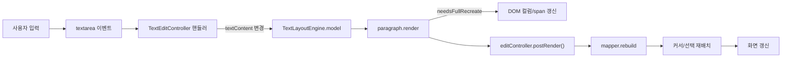
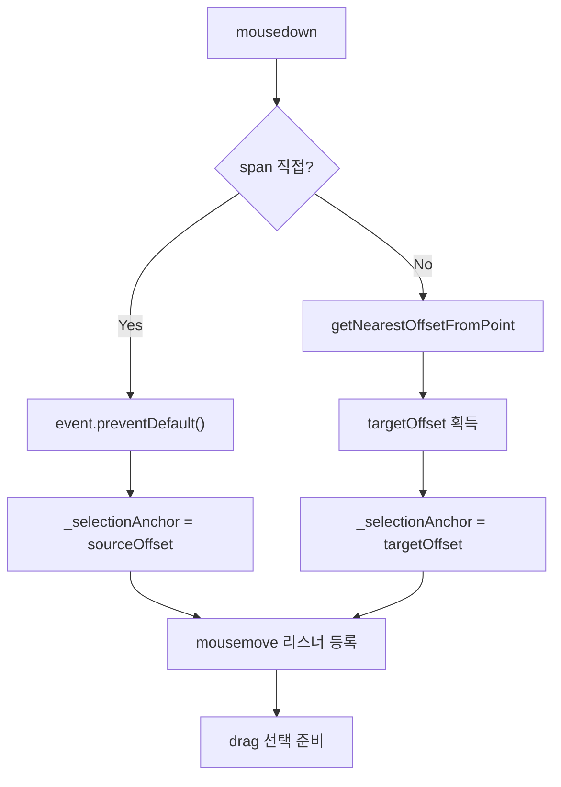
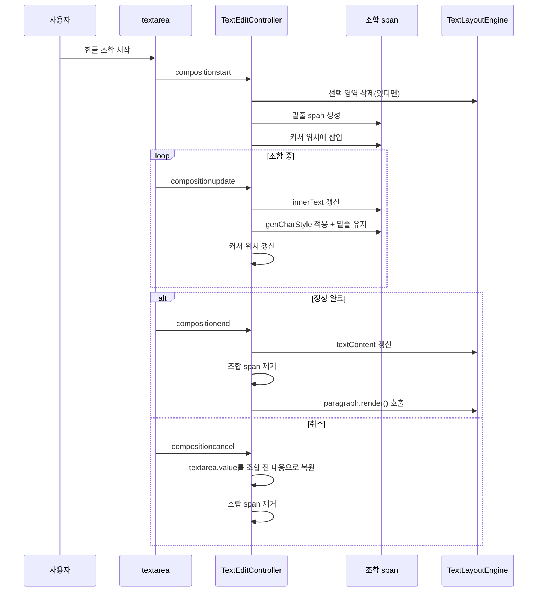
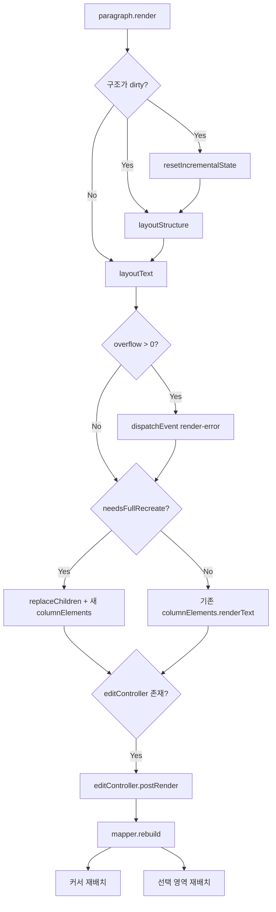
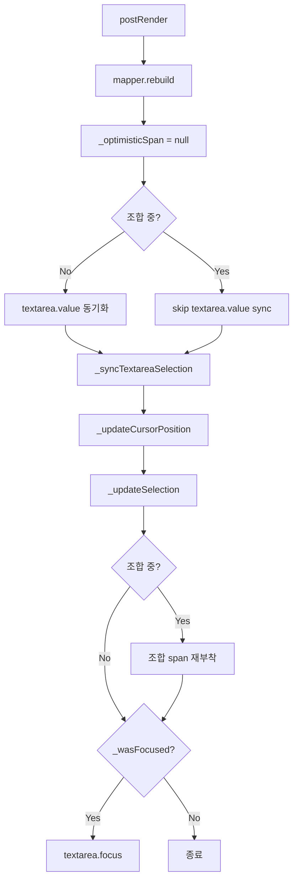
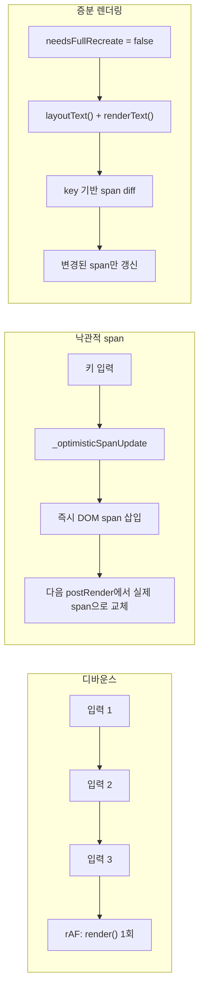
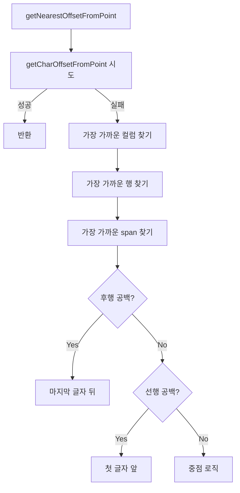
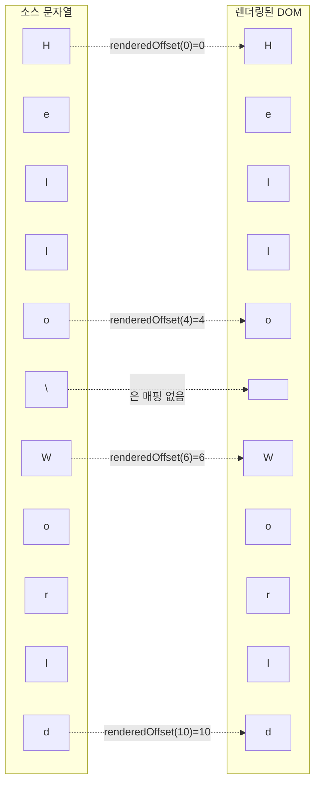
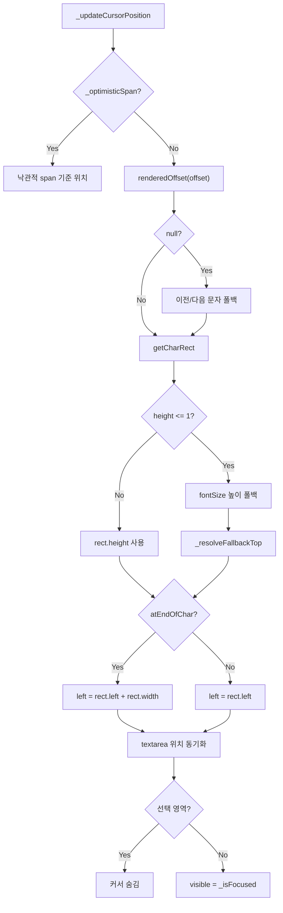

# layout-element 텍스트 편집 모드 상세 명세

> 작성 기준: `src/edit/text-edit-controller.ts`, `src/edit/text-edit-coordinate-mapper.ts`, `src/edit/edit-manager.ts`, `src/types/edit/`, `src/components/edit/cursor.element.ts`, `src/components/edit/selection.element.ts`, `src/components/layout/paragraph.element.ts`
>
> 본 문서는 `layout-element` 라이브러리의 텍스트 편집 모드 기능, 공개 API, 키보드/마우스 입력 처리, IME 조합, 렌더링 생명 주기, 글로벌 편집 관리(`EditManager`), 그리고 호스트 프로그램 연동 방법을 상세히 기술한다.

---

## 1. 개요 (Overview)

`layout-element`는 신문 레이웃을 브라우저에서 렌더링하는 엔진이다. 텍스트 편집 모드는 이 렌더링 엔진 위에서 평문 텍스트를 입력하고 수정할 수 있는 기능이다. 커서, 선택 영역, IME 조합, 키보드 입력, 마우스 상호작용, 클립보드 연동을 제공한다.

### 1.1 텍스트 편집 모드 아키텍처

`TextEditController`는 `LayoutParagraphElement.editableText = true`로 활성화된다. 단락 수준의 직접 활성화 외에, `EditManager`의 `textEditMode`와 3단계 필터(`editableTextRoles`, `editableTextBoxIds`, `editableParagraphIds`)를 통해 문서 전체에서 어떤 단락을 편집 가능하게 할지 중앙에서 관리할 수 있다. 실제 입력 처리(IME, 커서, 선택, 키보드)는 단락에 1:1로 소속된 `TextEditController`가 담당한다.

컨트롤러는 단락 요소의 `shadow root` 안에 다음 세 요소를 배치한다.

1. 숨겨진 `<textarea>`: 1x1 픽셀, 투명, `tabindex="-1"`, `opacity: 0`. 모든 키보드 이벤트, `input` 이벤트, IME 조합 이벤트, 붙여넣기 이벤트를 이 요소가 수신한다. 사용자에게 보이지 않지만 브라우저의 표준 입력기 동작을 그대로 활용한다.
2. `<x-layout-cursor>`: 1px 너비의 수직 커서. 실제 DOM 위치는 `TextEditCoordinateMapper`가 반환하는 문자 rect 기준으로 계산한다.
3. `<x-layout-selection>`: 선택된 텍스트 위에 반투명 사각형 오버레이를 렌더링한다.

모든 `TextEditController` 인스턴스는 생성 시 `EditManager` 싱글톤에 등록된다. `EditManager`는 문서 전체의 편집 상태를 글로벌하게 관리하며, 한 번에 하나의 단락만 포커스를 가지도록 보장한다. 포커스가 다른 단락으로 이동하면 이전 단락의 선택 영역이 자동으로 해제된다.

```mermaid
flowchart TD
    subgraph Paragraph["<x-layout-paragraph> shadow root"]
        TA["<textarea> (숨겨진 입력기)"]
        CUR["<x-layout-cursor>"]
        SEL["<x-layout-selection>"]
        COL["<x-layout-column> ..."]
    end

    subgraph UserInput["사용자 입력"]
        KEY[키보드]
        MOUSE[마우스]
        IME[IME 조합]
        CLIP[클립보드]
    end

    UserInput -->|이벤트| TA
    TA -->|input/composition| EC["TextEditController"]
    EC -->|model.textContent 갱신| TLE["TextLayoutEngine"]
    TLE -->|columnContents| RENDER["paragraph.render()"]
    RENDER --> COL
    RENDER -->|postRender()| EC
    EC -->|rebuild()| ECM["TextEditCoordinateMapper"]
    ECM -->|오프셋/좌표| EC
    EC -->|위치/보이기 갱신| CUR
    EC -->|ranges 갱신| SEL
```

### 1.2 `TextEditCoordinateMapper`의 역할

`TextEditCoordinateMapper`는 소스 오프셋과 렌더링 오프셋 사이의 양방향 매핑을 유지한다.

- 소스 오프셋: `model.textContent` 문자열 내 0-based 인덱스. `\n`과 제거되지 않은 공백을 모두 포함한다.
- 렌더링 오프셋: 실제 DOM span의 `data-offset` 값. `\n`과 줄 앞뒤로 제거된 공백은 매핑에서 제외된다.

매퍼는 `rebuild()` 호출 시 `TextLayoutEngine.columnContents`를 순회하며 두 Map(`_renderedToSource`, `_sourceToRendered`)을 재구축한다. 이 매핑은 커서/선택 위치 계산, 마우스 클릭 처리, 클립보드 복사 등 거의 모든 편집 동작의 기반이 된다.

### 1.3 렌더링 엔진과 텍스트 편집 컨트롤러의 관계

편집 동작은 다음 흐름으로 전체 화면에 반영된다.



요약하면, 텍스트 편집 컨트롤러는 입력을 받아 모델을 바꾸고, 단락의 `render()`가 실제 DOM을 다시 그린 뒤, `postRender()`를 통해 매퍼와 커서/선택을 동기화한다. `postRender()`는 항상 `render()` 내부에서 자동 호출되므로 호스트 프로그램은 별도로 호출할 필요가 없다.

### 1.4 활성화된 단락의 텍스트 편집 데이터 흐름

```mermaid
sequenceDiagram
    participant User as 사용자
    participant TA as textarea
    participant EC as TextEditController
    participant ECM as TextEditCoordinateMapper
    participant TLE as TextLayoutEngine
    paragraph P as LayoutParagraphElement
    participant DOM as x-layout-column/spans

    User->>TA: 키/마우스/IME 입력
    TA->>EC: input / compositionupdate
    EC->>TLE: model.textContent = newContent
    EC->>EC: _debouncedRender()
    EC->>P: requestAnimationFrame -> render()
    P->>TLE: layoutText()
    P->>DOM: replaceChildren() 또는 renderText()
    P->>EC: postRender(needsFullRecreate)
    EC->>ECM: rebuild()
    ECM->>ECM: _rebuildMappings()
    EC->>EC: textarea.value 동기화
    EC->>EC: _updateCursorPosition()
    EC->>EC: _updateSelection()
    EC->>DOM: cursor/selection 위치 갱신
```

### 1.5 현재 지원 범위

- 커서 이동 및 표시
- 텍스트 선택 (마우스 드래그, 키보드 확장, 더블/트리플 클릭)
- 한국어, 일본어, 중국어 IME 조합 입력
- 키보드 입력 (문자 삽입/삭제, 줄바꿈, 탐색 단축키)
- 단어 단위 커서 이동 (Ctrl+ArrowLeft/ArrowRight)
- 마우스 클릭 및 드래그
- 클립보드 복사/붙여넣기/잘라내기

### 1.6 제약 사항

- **평문 텍스트만 지원**한다. 굵게, 기울임, 색상 변경 등 서식 있는 텍스트 편집은 지원하지 않는다.
- **단일 단락 편집**만 가능하다. 단락을 넘어가는 선택이나 여러 단락 동시 편집은 지원하지 않는다.

---

## 2. 텍스트 편집 모드 활성화

### 2.1 `LayoutParagraphElement.editableText`

`x-layout-paragraph` 요소의 `editableText` 속성으로 텍스트 편집 모드를 켜고 끈다.

```ts
const paragraph = document.querySelector('x-layout-paragraph') as LayoutParagraphElement;

// 활성화
paragraph.editableText = true;

// 비활성화
paragraph.editableText = false;
```

동작:

- `editableText = true`를 처음 설정하면 `TextEditController` 인스턴스가 생성된다.
- `editableText = false`를 설정하면 `TextEditController.destroy()`가 호출되며, 이벤트 리스너와 DOM 요소가 모두 제거된다.
- 같은 단락에서 다시 `editableText = true`를 설정하면 새 `TextEditController`가 생성된다.
- **인쇄 모드**에서는 `editableText` 설정이 무시된다. 인쇄 모드에서는 편집 기능을 활성화할 수 없다.
- **lock 제한**: 조상 box 중 하나라도 `lock`이 `true`이면, `EditManager.isParagraphEditable()`은 이 단락에 대해 `false`를 반환하므로 `EditManager`를 통해 `editableText = true`로 강제할 수 없다. 단, 호스트 프로그램이 paragraph 요소에 직접 `editableText = true`를 설정하면 `TextEditController`는 생성되지만, `EditManager`의 전역 필터와 독립적으로 동작하며 이벤트/상태가 달라질 수 있으므로 권장하지 않는다.

### 2.2 `editController` 게터

활성화된 `TextEditController`에 접근할 때 사용한다.

```ts
const controller = paragraph.editController;
if (controller) {
  controller.focus();
}
```

### 2.3 `TextEditController` 생성 시 추가되는 DOM 요소

`TextEditController` 생성자는 단락의 `shadow root`에 다음 세 가지 요소를 추가한다. 텍스트 편집을 위한 숨겨진 입력기, 커서, 선택 영역이다.

| 요소 | 태그 | 설명 |
|------|------|------|
| 숨겨진 입력기 | `<textarea>` | 실제 키보드 이벤트와 IME 이벤트를 수신한다. 투명하고 1x1 픽셀 크기이며, `tabindex="-1"`로 설정되어 있다. |
| 커서 | `<x-layout-cursor>` | 1px 너비의 수직 커서를 렌더링한다. |
| 선택 영역 | `<x-layout-selection>` | 선택된 텍스트 위에 반투명 사각형 오버레이를 렌더링한다. |

### 2.4 생성자 초기화 과정 상세

`new TextEditController(paragraph)`는 다음 순서로 실행된다.

1. `TextEditCoordinateMapper` 생성. `paragraph.model`이 있으면 `rebuild()`가 즉시 실행되어 초기 매핑을 구축한다.
2. `_createTextarea()`로 숨겨진 `<textarea>` 생성:
   - `position: absolute`
   - `opacity: 0`
   - `width: 1px`, `height: 1px`
   - `pointerEvents: auto`
   - `border: none`, `padding: 0`, `margin: 0`
   - `resize: none`, `overflow: hidden`
   - `zIndex: 9999`
   - `tabindex="-1"`, `role="textbox"`, `aria-label="텍스트 편집 영역"`
3. `<x-layout-cursor>` 요소 생성.
4. `<x-layout-selection>` 요소 생성.
5. 세 요소를 `paragraph.shadowRoot`에 `appendChild`로 추가.
6. 이벤트 리스너 등록:
   - paragraph: `click`, `mousedown`, `dblclick`
   - document: `mouseup`
   - textarea: `focus`, `blur`, `input`, `compositionstart`, `compositionupdate`, `compositionend`, `compositioncancel`, `keydown`, `paste`
   - document: `visibilitychange`
7. `textarea.value`를 `model.textContent`로 초기화한다. 이렇게 해야 이후 `_onInput`에서 올바른 텍스트 diff를 계산할 수 있다.
8. `_updateCursorPosition()`을 초기 호출하여 커서를 첫 번째 문자 위치 또는 빈 단락의 첫 컬럼 위치로 배치한다.

```mermaid
flowchart LR
    A[editableText = true] --> B[TextEditController 생성]
    B --> C["TextEditCoordinateMapper 생성"]
    C --> D["textarea + cursor + selection 생성"]
    D --> E[shadow root에 추가]
    E --> F[이벤트 리스너 등록]
    F --> G["textarea.value 초기화"]
    G --> H["_updateCursorPosition()"]
    H --> I[편집 가능 상태]

    J[editableText = false] --> K[TextEditController.destroy() 호출]
    K --> L[이벤트 리스너 제거]
    L --> M[타이머 취소]
    M --> N[조합 상태 리셋]
    N --> O[DOM 요소 제거]
    O --> P[TextEditController = null]
```

### 2.5 `destroy()`의 정리 과정 상세

`TextEditController.destroy()`는 다음 작업을 순서대로 수행한다.

1. 단락에서 `click`, `mousedown`, `dblclick` 리스너 제거.
2. document에서 `mouseup`, `mousemove` 리스너 제거.
3. `_clickTimer`가 있으면 `clearTimeout`으로 취소하고 null로 초기화.
4. textarea에서 `focus`, `blur`, `keydown`, `input`, `compositionstart`, `compositionupdate`, `compositionend`, `compositioncancel`, `paste` 리스너 제거.
5. `_debounceTimer`가 있으면 `cancelAnimationFrame`으로 취소.
6. `_mousemoveRafId`가 있으면 `cancelAnimationFrame`으로 취소.
7. document에서 `visibilitychange` 리스너 제거.
8. `_isFocused = false`로 설정.
9. `_resetCompositionState()` 호출: `_isComposing = false` 및 조합 span 제거.
10. `_optimisticSpan`이 있으면 DOM에서 제거하고 참조를 null로 초기화.
11. `textarea`, `<x-layout-cursor>`, `<x-layout-selection>`을 각각 `parentNode.removeChild`로 제거.

---

## 3. 공개 API 참조

### 3.1 `LayoutParagraphElement`

| API | 타입 | 설명 |
|-----|------|------|
| `editableText` | `boolean` get/set | 텍스트 편집 모드를 활성화하거나 비활성화한다. `true` 설정 시 `TextEditController`가 생성되고, `false` 설정 시 제거된다. |
| `editController` | `TextEditController \| null` get | 현재 연결된 `TextEditController` 인스턴스를 반환한다. 텍스트 편집 모드가 꺼져 있으면 `null`이다. |
| `model` | `TextLayoutEngine \| null` get | 단락에 연결된 `TextLayoutEngine` 모델을 반환한다. |
| `render()` | `void` | 단락을 다시 렌더링한다. 편집 중이면 `editController.postRender()`를 자동으로 호출한다. |

### 3.2 `TextEditController`

| API | 타입 | 설명 |
|-----|------|------|
| `cursorOffset` | `number` get | 현재 커서 위치를 소스 텍스트 오프셋(0-based, `\n` 포함)으로 반환한다. |
| `selection` | `SelectionRange \| null` get | 현재 선택 영역을 반환한다. 선택이 없으면 `null`이다. |
| `currentStyle` | `CurrentStyle` get | 현재 커서 위치에서 유효한 `TextStyle`과 `ParagraphStyle`을 반환한다. 단락 수준 스타일 + 상속 스타일을 병합하고, 커서가 위치한 텍스트 블록의 `TextBlockStyle`로 오버라이드한 결과이다. |
| `focus()` | `void` | 숨겨진 `textarea`에 포커스를 주어 커서를 표시한다. |
| `blur()` | `void` | 숨겨진 `textarea`에서 포커스를 해제하여 커서를 숨긴다. |
| `setCursor(position: CursorPosition)` | `void` | 프로그래밍 방식으로 커서 위치를 설정한다. |
| `setSelection(range: SelectionRange)` | `void` | 프로그래밍 방식으로 선택 영역을 설정한다. |
| `postRender(fullRebuild?: boolean)` | `void` | 렌더링 이후 호출한다. 좌표 매퍼를 재구축하고 커서/선택 영역을 다시 배치한다. **호스트 프로그램은 편집 중인 단락에 영향을 주는 모든 렌더링 후에 이 메서드를 호출해야 한다.** `paragraph.render()`가 자동으로 호출한다. |
| `destroy()` | `void` | 모든 이벤트 리스너와 DOM 요소를 정리하고 컨트롤러를 제거한다. |

### 3.3 API 동작 상세

#### `postRender()`

`paragraph.render()` 내부에서 DOM 갱신 직후 호출된다. 다음 순서로 동작한다.

1. `this._mapper.rebuild()` — 오프셋 매핑을 새 DOM 기준으로 재구축.
2. `this._optimisticSpan = null` — 낙관적 span 참조 제거. 실제 렌더링된 span으로 대체된다.
3. 조합 중이 아닌 경우 `textarea.value`를 `model.textContent`로 동기화.
4. `_syncTextareaSelection()` — textarea의 선택 영역을 `_cursorModel` 상태에 맞춘다.
5. `_updateCursorPosition()` — 커서를 새 DOM 위치에 재배치.
6. `_updateSelection()` — 선택 영역을 새 DOM 위치에 재배치.
7. 조합 중이면 `_compositionSpan`을 새 DOM에 재부착. `renderedOffset(_compositionStartOffset)`으로 위치를 찾고, 실패하면 이전/다음 문자 또는 첫 컬럼 첫 요소에 폴백한다.
8. `_wasFocused`가 true면 `textarea.focus()`로 포커스 복원.

#### `setCursor()`

`_cursorModel.offset`을 주어진 `textOffset`로 설정하고 `_updateCursorPosition()`을 호출한다. 그러나 커서를 시각적으로 표시하려면 별도로 `focus()`를 호출해야 한다.

```ts
controller.setCursor({ textOffset: 5 });
controller.focus(); // 커서가 보임
```

#### `setSelection()`

`_cursorModel.selection`을 주어진 `SelectionRange`로 설정하고 `_updateSelection()`을 호출한다. 선택 영역을 시각적으로 표시하려면 `focus()`를 별도로 호출해야 한다.

```ts
controller.setSelection(SelectionRange.fromOffsets(0, 10));
controller.focus();
```

#### `currentStyle`

커서 위치에서 유효한 `TextStyle`과 `ParagraphStyle`을 반환한다. 내부 동작:

1. `model.inheritStyle`과 `model.textStyle`/`model.paragraphStyle`을 필드별로 `??` 병합하여 기본 스타일을 구성한다.
2. `_findTextBlockStyleAtOffset(cursorOffset)`으로 커서가 속한 텍스트 블록의 `TextBlockStyle`을 찾는다. `model.contents` 배열에서 각 블록의 시작/끝 오프셋을 누적 계산한다.
3. `TextBlockStyle`의 정의된 필드만 기본 스타일 위에 오버라이드한다.

```ts
const { textStyle, paragraphStyle } = controller.currentStyle;
// textStyle.fontSize, textStyle.fontWeight, textStyle.color, ...
// paragraphStyle.textAlign, paragraphStyle.lineGap, ...
```

모델이 없거나 텍스트 편집 모드가 비활성화된 경우 빈 객체(`{ textStyle: {}, paragraphStyle: {} }`)를 반환한다.

#### `focus()` / `blur()`

- `focus()`: `this._textarea.focus()`를 호출한다. 포커스를 받으면 `_onFocus()` 콜백이 실행되고, 선택 영역이 없을 때만 커서를 보이게 한다.
- `blur()`: `this._textarea.blur()`를 호출한다. 포커스를 잃으면 `_onBlur()` 콜백이 실행되고, 진행 중인 IME 조합이 있으면 완료 처리한 뒤 커서를 숨긴다.

### 3.4 `TextEditCoordinateMapper`

`TextEditController` 내부에서 사용하는 좌표 매핑 객체이지만, 내부 상태를 직접 참조해야 하는 호스트 프로그램을 위해 다음 메서드를 문서화한다.

| API | 타입 | 설명 |
|-----|------|------|
| `rebuild()` | `void` | 렌더링된 DOM을 기준으로 오프셋 매핑을 다시 구축한다. `postRender()`가 호출한다. |
| `sourceOffset(renderedOffset: number)` | `number \| null` | 렌더링 오프셋을 소스 텍스트 오프셋으로 변환한다. |
| `renderedOffset(sourceOffset: number)` | `number \| null` | 소스 텍스트 오프셋을 렌더링 오프셋으로 변환한다. |
| `getCharOffsetFromPoint(x, y)` | `CursorPosition \| null` | 뷰포트 좌표(x, y) 위치의 문자에 해당하는 소스 오프셋을 반환한다. 컬럼 범위 기준 binary search를 사용한다. |
| `getNearestOffsetFromPoint(x, y)` | `CursorPosition \| null` | 뷰포트 좌표(x, y)에서 가장 가까운 텍스트 위치를 반환한다. 행간, 선행/후행 공백 클릭을 처리한다. |
| `getCharRect(offset: number)` | `DOMRect \| null` | 렌더링 오프셋에 해당하는 문자 span의 위치를 단락 로컬 좌표로 반환한다. |
| `getFirstColumnRect()` | `{ top, left, fontSize } \| null` | 첫 번째 컬럼의 단락 로컬 좌표와 폰트 크기를 반환한다. 빈 단락에서 커서를 배치할 때 사용한다. |
| `getTextRange(start, end)` | `Rect[]` | `start`부터 `end`까지(끝 제외)의 선택 사각형 배열을 단락 로컬 좌표로 반환한다. 같은 행의 연속된 span은 병합한다. |
| `getTextContent(start, end)` | `string` | `start`부터 `end`까지(끝 제외)의 소스 텍스트를 반환한다. span의 `innerText`를 읽고 블록 사이의 `\n`을 복원한다. |
| `findVisualLineBounds(offset)` | `{ start, end } \| null` | 소스 오프셋이 속한 시각적 라인의 시작/끝 오프셋을 반환한다. `Home`/`End` 키 처리에 사용한다. |
| `getSpanByOffset(offset)` | `HTMLSpanElement \| null` | 렌더링 오프셋에 해당하는 문자 `span` 요소를 반환한다. 임시 span은 제외한다. |

### 3.5 타입

```ts
type CursorPosition = {
  textOffset: number;  // 0-based offset in source text (including \n)
};

class SelectionRange {
  readonly anchor: CursorPosition;  // where selection started
  readonly focus: CursorPosition;   // where selection ended

  static fromOffsets(anchor: number, focus: number): SelectionRange;

  normalized(): { start: CursorPosition; end: CursorPosition };  // always start ≤ end
}

type CurrentStyle = {
  textStyle: TextStyle;        // 커서 위치의 유효한 글자 스타일
  paragraphStyle: ParagraphStyle;  // 커서 위치의 유효한 문단 스타일
};
```

- `anchor`는 선택이 시작된 위치, `focus`는 선택이 끝난 위치이다.
- 역방향 드래그(아래에서 위로)라면 `anchor.textOffset > focus.textOffset`이 될 수 있다.
- 문서 순서대로 정렬된 범위가 필요하면 `normalized()`를 사용한다.

#### `CurrentStyle` 상세

`currentStyle` 게터는 커서 위치에서 유효한 스타일을 계산한다. 계산 순서:

1. **단락 수준 스타일 + 상속 스타일 병합**: `model.textStyle`의 각 필드와 `model.inheritStyle`의 같은 필드를 `??` 연산자로 병합한다. 단락 자체 스타일이 우선하고, 없으면 상속값을 사용한다.
2. **텍스트 블록 스타일 찾기**: `_findTextBlockStyleAtOffset(cursorOffset)`로 커서가 속한 텍스트 블록의 `TextBlockStyle`을 찾는다. `model.contents` 배열에서 각 블록의 시작/끝 오프셋을 누적 계산하여 커서 오프셋이 어느 블록에 속하는지 결정한다.
3. **블록 스타일로 오버라이드**: `TextBlockStyle`의 정의된 필드(`fontFamily`, `fontSize`, `fontWeight`, `color`, `textAlign`)만 기본 스타일 위에 오버라이드한다. `undefined`인 필드는 무시한다.

```ts
// 사용 예시
const controller = paragraph.editController!;
const { textStyle, paragraphStyle } = controller.currentStyle;

console.log(textStyle.fontSize);     // 커서 위치의 글자 크기 (mm)
console.log(textStyle.fontWeight);   // 커서 위치의 폰트 굵기
console.log(textStyle.color);        // 커서 위치의 글자 색상
console.log(paragraphStyle.textAlign); // 커서 위치의 정렬 방식
```

스타일 우선순위 (높은 것부터):

```
TextBlockStyle (블록 단위 오버라이드)
  ↓ undefined 필드는 무시
TextStyle / ParagraphStyle (단락 수준)
  ↓ undefined 필드는 무시
InheritStyle (부모에서 상속)
  ↓
기본값 (DEFAULT_FONT_SIZE 등)
```

---

## 3.6 `EditManager` — 글로벌 편집 관리자

`EditManager`는 문서 전체의 편집 상태를 중앙에서 관리하는 싱글톤이다. `ColorRegistry`, `FontLoader`와 동일한 싱글톤 패턴을 따른다.

### 3.6.1 역할

- **텍스트 편집 모드 활성화 관리**: `textEditMode`와 3단계 필터(`editableTextRoles`, `editableTextBoxIds`, `editableParagraphIds`), 그리고 `editableRootId`를 통해 문서 전체에서 어떤 단락을 편집 가능하게 할지 중앙에서 제어한다.
- **편집 잠금 상속**: 조상 box 중 하나라도 `lock`이면 해당 box 내부의 모든 paragraph는 텍스트 편집 불가이다.
- **포커스 관리**: 한 번에 하나의 단락만 포커스를 가진다. 포커스가 B 단락으로 이동하면 A 단락의 선택 영역이 자동으로 해제된다.
- **이벤트 시스템**: `focusChange`, `textChange`, `styleChange`, `cursorMove`, `selectionStart`, `selectionEnd` 이벤트를 외부 편집 UI에 전달한다.
- **상태 조회**: 현재 포커스된 단락, 커서 위치, 선택 영역, 스타일을 조회할 수 있다.
- **Selection 객체 조회**: DOM `Selection` API처럼 현재 `SelectionRange` 객체를 직접 조회할 수 있다.

### 3.6.2 API 참조

| API | 타입 | 설명 |
|-----|------|------|
| `getInstance()` | `EditManager` static | 싱글톤 인스턴스를 반환한다. |
| `focusedParagraph` | `LayoutParagraphElement \| null` get | 현재 포커스된 단락 요소. 없으면 `null`. |
| `focusedController` | `TextEditController \| null` get | 현재 포커스된 편집 컨트롤러. 없으면 `null`. |
| `cursorOffset` | `number \| null` get | 현재 커서 위치. 포커스된 단락이 없으면 `null`. |
| `selection` | `SelectionRange \| null` get | 현재 선택 영역. 선택이 없거나 포커스된 단락이 없으면 `null`. DOM `Selection` API와 유사하게 현재 selection 객체를 직접 조회. |
| `currentStyle` | `CurrentStyle \| null` get | 현재 커서 위치의 유효 스타일. 포커스된 단락이 없으면 `null`. |
| `controllers` | `Set<TextEditController>` get | 등록된 모든 편집 컨트롤러. |
| `focusParagraph(target, options?)` | `boolean` | 단락 요소 또는 ID로 포커스를 설정한다. 텍스트 편집 모드가 아니면 자동 활성화. `options.cursorOffset`으로 커서 위치, `options.selection`으로 선택 영역을 지정할 수 있다. 성공 시 `true`, 실패 시 `false`. |
| `blurParagraph(target?)` | `boolean` | 단락 요소, ID, 또는 생략으로 포커스를 해제한다. 생략하면 현재 포커스된 단락을 blur. 성공 시 `true`, 실패 시 `false`. |
| `addEventListener(type, listener)` | `void` | 이벤트 리스너를 등록한다. |
| `removeEventListener(type, listener)` | `void` | 이벤트 리스너를 제거한다. |
| `textEditMode` | `boolean` get/set | 전역 텍스트 편집 모드 토글. `false`이면 모든 단락의 편집을 비활성화하고 포커스를 해제한다. |
| `editableTextRoles` | `ReadonlySet<BoxRole> \| null` get | 부모 상자의 `role` 필터. `null`이면 역할 필터가 없다. |
| `setEditableTextRoles(roles)` | `void` | `BoxRole[] \| null`을 받아 `editableTextRoles` 필터를 설정한다. `null`이면 역할 필터를 해제한다. |
| `editableTextBoxIds` | `ReadonlySet<string> \| null` get | 부모 상자의 `id` 필터. `null`이면 상자 ID 필터가 없다. |
| `setEditableTextBoxIds(ids)` | `void` | `string[] \| null`을 받아 `editableTextBoxIds` 필터를 설정한다. `null`이면 상자 ID 필터를 해제한다. |
| `editableParagraphIds` | `ReadonlySet<string> \| null` get | 단락 자체의 `id` 필터. `null`이면 단락 ID 필터가 없다. |
| `setEditableParagraphIds(ids)` | `void` | `string[] \| null`을 받아 `editableParagraphIds` 필터를 설정한다. `null`이면 단락 ID 필터를 해제한다. |
| `addEditableParagraph(id)` | `void` | 개별 단락 ID를 `editableParagraphIds` 필터에 추가한다. |
| `removeEditableParagraph(id)` | `void` | 개별 단락 ID를 `editableParagraphIds` 필터에서 제거한다. |
| `isParagraphEditable(paragraph)` | `boolean` | 3단계 AND 필터와 lock/Root 제한을 적용해 단락이 편집 가능한지 판정한다. `textEditMode`가 `false`이면 `false`를 반환한다. 조상 box 중 하나라도 lock이면 `false`를 반환한다. `editableRootId`가 지정된 경우 Root 외부 단락은 `false`를 반환한다. 세 필터가 모두 `null`이면 Root 내부의 모든 단락이 편집 가능하다. 그 외에는 `editableTextRoles`로 부모 상자 역할, `editableTextBoxIds`로 부모 상자 ID, `editableParagraphIds`로 단락 ID를 각각 검사한다. |
| `deactivateAll()` | `void` | `textEditMode`를 `false`로 설정한 뒤, 모든 단락의 텍스트 편집 모드를 비활성화한다. |
| `setEditableRootId(id)` | `void` | 편집 루트 box ID를 설정한다. `null`이면 문서 전체. 지정 시 해당 box 내부 paragraph만 편집 가능하며, layout/text 모드 모두에 공유 적용된다. |
| `editableRootId` | `string \| null` get | 현재 편집 루트 box ID |

### 3.6.3 이벤트 시스템

| 이벤트 | 발생 시점 | `EditManagerEvent` 필드 |
|--------|----------|------------------------|
| `focusChange` | 포커스가 다른 단락으로 이동할 때 | `paragraph`, `controller`, `previousParagraph`, `previousController` |
| `textChange` | 텍스트 내용이 변경될 때 (입력, 삭제, 붙여넣기, 줄바꿈) | `paragraph`, `controller` |
| `styleChange` | 커서 위치가 변경되어 유효 스타일이 달라질 때 | `paragraph`, `controller` |
| `cursorMove` | 커서 위치가 변경될 때. 키보드 연속 입력 시 최초 KeyDown과 마지막 KeyUp에만 발생 | `paragraph`, `controller` |
| `selectionStart` | 마우스 드래그로 선택이 시작될 때 | `paragraph`, `controller` |
| `selectionEnd` | 마우스 드래그가 끝나고 선택이 확정될 때 | `paragraph`, `controller` |

```ts
type EditManagerEventType =
  | 'focusChange'
  | 'textChange'
  | 'styleChange'
  | 'cursorMove'
  | 'selectionStart'
  | 'selectionEnd';

interface EditManagerEvent {
  type: EditManagerEventType;
  paragraph: LayoutParagraphElement;
  controller: TextEditController;
  previousParagraph?: LayoutParagraphElement | null;
  previousController?: TextEditController | null;
}

type EditManagerEventListener = (event: EditManagerEvent) => void;
```

### 3.6.4 텍스트 편집 모드 활성화 API 상세

`EditManager`는 레이아웃 편집 모드와 유사한 방식으로 텍스트 편집 활성화를 중앙에서 관리한다. 단, 실제 입력 처리(IME, 커서, 선택, 키보드)는 여전히 단락에 종속된 `TextEditController`가 담당한다.

#### `setEditableRootId(id)` / `editableRootId`

```ts
// 특정 box 내부 단락만 텍스트 편집 가능
manager.setEditableRootId('article-1');
manager.textEditMode = true;
// → article-1 내부의 paragraph만 editableText = true
// → article-1 외부의 paragraph는 편집 불가

// 제한 해제
manager.setEditableRootId(null);
```

| 매개변수 | 타입 | 설명 |
|----------|------|------|
| `id` | `string \| null` | 편집 루트로 지정할 box ID. `null`이면 문서 전체 |

`setEditableRootId`는 레이아웃 편집 모드와 텍스트 편집 모드 모두에 동시에 적용된다. 값이 변경되면 활성화된 모드의 box/paragraph 상태를 갱신한다.

#### `textEditMode`

전역 텍스트 편집 모드 스위치이다.

- `true`로 설정하면 `_applyEditableTextToAllParagraphs()`가 호출되어 조건에 맞는 단락의 `editableText`가 `true`로 설정된다.
- `false`로 설정하면 포커스를 해제하고, 모든 단락의 `editableText`를 `false`로 설정한다.
- 현재 포커스된 단락이 비활성화 대상이면 `blurParagraph()`로 포커스를 먼저 해제한다.
- **기본적으로 모든 단락이 허용된다.** `textEditMode`만 켜고 세 필터(`editableTextRoles`, `editableTextBoxIds`, `editableParagraphIds`)를 모두 `null`로 두면, lock과 `editableRootId` 제한만 적용된 채 문서 전체(또는 Root 내부)의 단락이 편집 가능하다. 편집을 막으려면 `textEditMode`를 `false`로 설정해야 한다.

```ts
const manager = EditManager.getInstance();
manager.textEditMode = true;  // 조건에 맞는 단락만 편집 가능
manager.textEditMode = false; // 모든 단락 비활성화 + 포커스 해제
```

#### `setEditableTextRoles(roles)` / `editableTextRoles`

부모 상자의 `role`(`BoxRole`)로 편집 가능 단락을 제한한다. 예를 들어 본문(`'body'`)과 캡션(`'caption'`) 영역만 편집 가능하게 할 수 있다.

```ts
manager.setEditableTextRoles(['body', 'caption']);
console.log(manager.editableTextRoles); // ReadonlySet { 'body', 'caption' }

manager.setEditableTextRoles(null); // 역할 필터 해제
```

#### `setEditableTextBoxIds(ids)` / `editableTextBoxIds`

부모 상자의 `id`로 편집 가능 단락을 제한한다. 특정 기사 상자나 광고 상자 안의 단락만 편집 가능하게 할 때 사용한다.

```ts
manager.setEditableTextBoxIds(['article-1', 'article-2']);
console.log(manager.editableTextBoxIds); // ReadonlySet { 'article-1', 'article-2' }

manager.setEditableTextBoxIds(null); // 상자 ID 필터 해제
```

#### `setEditableParagraphIds(ids)` / `editableParagraphIds`

단락의 `id`로 직접 편집 가능 집합을 제한한다. 가장 세밀한 필터이다.

```ts
manager.setEditableParagraphIds(['p-1', 'p-2', 'p-3']);
console.log(manager.editableParagraphIds); // ReadonlySet { 'p-1', 'p-2', 'p-3' }

manager.setEditableParagraphIds(null); // 단락 ID 필터 해제
```

#### `addEditableParagraph(id)` / `removeEditableParagraph(id)`

`editableParagraphIds`에 개별 단락 ID를 추가하거나 제거한다. ID 기반 필터가 `null`이면 `addEditableParagraph(id)` 호출 시 자동으로 새 집합이 생성된다.

```ts
manager.addEditableParagraph('p-new');    // editableParagraphIds에 추가
manager.removeEditableParagraph('p-old'); // editableParagraphIds에서 제거
```

#### `isParagraphEditable(paragraph)`

세 단계 AND 필터와 lock/Root 제한을 적용해 단락이 현재 편집 가능한지 판정한다.

**반환 규칙:**

1. `textEditMode === false`이면 `false`.
2. 조상 box 중 하나라도 `lock`이면 `false`.
3. `editableRootId`가 지정된 경우, 단락이 Root box 내부의 자손이어야 한다. Root box 자체는 paragraph가 아니므로 판별 대상이 아니다.
4. `editableTextRoles`, `editableTextBoxIds`, `editableParagraphIds`가 모두 `null`이면, Root 제한과 lock 제한을 제외한 모든 단락이 편집 가능하다 (모두 허용 규칙).
5. 각 필터가 `null`이 아니면 해당 조건을 AND로 검사:
   - `editableTextRoles`: 단락의 부모 상자 `role`이 집합에 포함되어야 한다.
   - `editableTextBoxIds`: 단락의 부모 상자 `id`가 집합에 포함되어야 한다.
   - `editableParagraphIds`: 단락의 `id`가 집합에 포함되어야 한다.

```ts
const paragraph = document.getElementById('p-1') as LayoutParagraphElement;
if (manager.isParagraphEditable(paragraph)) {
  manager.focusParagraph(paragraph);
}
```

#### `_applyEditableTextToAllParagraphs()`

`textEditMode`나 필터가 변경될 때 내부적으로 호출된다. 문서의 모든 `x-layout-paragraph`를 순회하며 `isParagraphEditable(paragraph)` 결과에 따라 `paragraph.editableText`를 갱신한다. 이 메서드는 직접 호출할 필요는 없지만, 호스트 프로그램이 동적으로 단락을 추가한 뒤에는 `textEditMode`를 다시 할당하거나 `_applyEditableTextToAllParagraphs()`를 호출해 새 단락에 필터를 적용해야 한다.

### 3.6.5 포커스 이동 메커니즘

포커스가 B 단락으로 이동할 때의 내부 처리 순서:

```
1. 사용자가 B 단락 클릭 → controllerB.focus() → textarea.focus()
2. 브라우저가 A 단락의 textarea에서 blur 발생
   → controllerA._onBlur() (시각적 상태만 업데이트, _releaseFocus 호출 안 함)
3. B 단락의 textarea에 focus 발생
   → controllerB._onFocus() → EditManager._requestFocus(controllerB)
4. _requestFocus 내부:
   a. previousController = controllerA
   b. controllerA._clearSelection() ← A 단락의 selection 해제!
   c. controllerA._blurInternal() → textarea.blur() + _releaseFocus(controllerA)
   d. _clearBoxSelectionForParagraph(previousParagraph) ← A 부모 box의 selected 제거
   e. _selectBoxForParagraph(newParagraph) ← B 부모 box를 단일 selected로 설정
   f. _focusedController = controllerB
   g. focusChange + layoutSelectionChange 이벤트 발생
```

`_onBlur`에서 `_releaseFocus`를 호출하지 않는 이유: `controllerB.focus()`를 호출하면 브라우저가 `controllerA`의 textarea blur를 먼저 처리하고, 그 후 `controllerB`의 textarea focus를 처리한다. 만약 `_onBlur`에서 `_releaseFocus`를 호출하면, `_requestFocus`가 호출될 때 `_focusedController`가 이미 null이 되어 `previousController`를 잡지 못한다.

#### 포커스 시 부모 box 레이아웃 선택

텍스트 편집 포커스가 들어온 paragraph의 부모 `<x-layout-box>`는 레이아웃 선택(`selected` 속성) 상태가 된다. 이는 시각적 하이라이트(빨간색 외곽선)를 표시함과 동시에, 실제 레이아웃 선택 상태로 관리된다.

| 동작 | 부모 box 상태 | `_selectedLayouts` |
|------|--------------|---------------------|
| paragraph 포커스 | `selected` 설정 (단일 선택) | `[parentBox]` (기존 선택 모두 해제) |
| 다른 paragraph로 포커스 이동 | 이전 부모 box `selected` 해제 → 새 부모 box `selected` 설정 | `[newParentBox]` |
| `blurParagraph()` | 현재 부모 box `selected` 해제 | `[]` |
| `textEditMode = false` | `_blurFocusedParagraph` → 부모 box `selected` 해제 | `[]` |
| paragraph DOM에서 제거 | `destroy()` → `_unregister` → 부모 box `selected` 해제 | `[]` |

**레이아웃 편집 모드로 전환 시**: 텍스트 편집으로 설정된 `selected`는 유지된다. `layoutEditMode = true`는 `clearLayoutSelection()`을 호출하지 않으므로, 사용자는 텍스트 편집 중이던 box가 그대로 레이아웃 선택된 상태로 레이아웃 편집을 이어갈 수 있다.

**레이아웃 편집 모드에서 텍스트 편집 모드로 전환 시** (`textEditMode = true`): `_focusParagraphFromLayoutSelection()`이 호출되어 다음 규칙이 적용된다.

1. 현재 `_selectedLayouts` 중 `contentType === 'paragraph'`인 box(직접 paragraph 자식을 가진 box)들을 후보로 삼는다.
2. 후보들 중 중첩 관계의 하위 box를 제외하고 가장 상위 box 1개만 `selected`로 유지한다.
3. 유지된 box의 첫 번째 paragraph 자식으로 텍스트 편집 포커스를 이동한다.
4. 후보가 없으면 모든 레이아웃 선택을 해제한다.

예시:
- `selectedLayouts = [boxA(paragraph), boxB(image), boxC(paragraph)]`이고 boxA, boxC가 독립적이면 → boxA(첫 번째)만 유지, boxB·boxC `selected` 해제, boxA의 paragraph로 포커스.
- `selectedLayouts = [parentBox(group, 하위에 boxA·boxB), boxA(paragraph)]`이면 → parentBox는 paragraph 자식이 없으므로 후보 아님, boxA만 유지.
- `selectedLayouts = [boxA(image)]`이면 → 후보 없음, 모든 선택 해제.

### 3.6.6 `focusParagraph()` / `blurParagraph()` 동작 상세

#### `focusParagraph(target, options?)`

단락 요소 또는 ID로 포커스를 설정한다. `TextEditController`를 직접 다룰 필요 없이 `EditManager` 레벨에서 포커스를 제어할 수 있다.

**시그니처:**

```ts
focusParagraph(
  target: LayoutParagraphElement | string,
  options?: { cursorOffset?: number; selection?: SelectionRange },
): boolean
```

**매개변수:**

| 매개변수 | 타입 | 설명 |
|----------|------|------|
| `target` | `LayoutParagraphElement \| string` | 포커스를 설정할 단락 요소 또는 단락 요소의 ID |
| `options.cursorOffset` | `number` | (선택) 포커스 후 커서를 배치할 소스 텍스트 오프셋. 생략하면 커서 위치를 변경하지 않는다 |
| `options.selection` | `SelectionRange` | (선택) 포커스 후 설정할 선택 영역. `cursorOffset`보다 우선한다 |

**반환값:** `true` — 포커스 설정 성공, `false` — 단락을 찾을 수 없거나 컨트롤러가 등록되지 않음

**동작 순서:**

1. `target`이 문자열이면 `document.getElementById()`로 요소를 찾고 `localName === 'x-layout-paragraph'`인지 확인한다.
2. `target`이 `LayoutParagraphElement`이면 그대로 사용한다.
3. 단락이 텍스트 편집 모드가 아니면 `editableText = true`로 설정하여 `TextEditController`를 생성한다.
4. 등록된 컨트롤러 중 해당 단락의 컨트롤러를 찾는다.
5. `controller.focus()`로 textarea에 포커스를 준다.
6. `options.selection`이 있으면 `controller.setSelection(selection)`을 호출한다. `setSelection`은 내부적으로 커서 위치를 `focus.textOffset`으로 이동시킨다.
7. `options.selection`이 없고 `options.cursorOffset`이 있으면 `controller.setCursor({ textOffset: cursorOffset })`을 호출한다.

**선택 영역과 커서 위치의 우선순위:**

`selection`과 `cursorOffset`을 모두 지정하면 `selection`이 우선한다. `setSelection()`이 내부적으로 `_cursorModel.offset`을 `focus.textOffset`으로 설정하므로 `cursorOffset` 값은 무시된다.

**`focusChange` 이벤트:** `controller.focus()`가 트리거하는 브라우저 포커스 변경을 통해 `EditManager._requestFocus()`가 호출되고, 이 과정에서 `focusChange` 이벤트가 발생한다.

#### `blurParagraph(target?)`

단락 요소, ID, 또는 생략으로 포커스를 해제한다.

**시그니처:**

```ts
blurParagraph(target?: LayoutParagraphElement | string): boolean
```

**매개변수:**

| 매개변수 | 타입 | 설명 |
|----------|------|------|
| `target` | `LayoutParagraphElement \| string \| undefined` | 포커스를 해제할 단락 요소, 단락 요소의 ID, 또는 생략 |

**반환값:** `true` — 포커스 해제 성공, `false` — 포커스된 단락이 없거나 지정한 단락이 현재 포커스된 단락이 아님

**동작 순서:**

- `target`을 생략하면 현재 포커스된 컨트롤러의 `_blurInternal()`을 호출한다.
- `target`을 지정하면 현재 포커스된 단락과 일치하는 경우에만 blur한다. 다른 단락이면 `false`를 반환한다.
- `_blurInternal()`은 textarea에서 포커스를 해제하고, 커서를 숨기고, `_releaseFocus()`를 호출하여 `focusChange` 이벤트를 발생시킨다.

### 3.6.7 사용 예시

```ts
import {
  EditManager,
  SelectionRange,
  LayoutParagraphElement,
} from 'layout-element';

const manager = EditManager.getInstance();

// 텍스트 편집 모드 활성화 + 필터 적용
manager.setEditableTextRoles(['body', 'caption']);
manager.setEditableTextBoxIds(['article-1']);
manager.setEditableRootId('root-box');
manager.textEditMode = true; // 위 역할/상자 ID/루트 조건을 만족하는 단락만 editableText = true

// 이벤트 리스너 등록
manager.addEventListener('focusChange', (e) => {
  console.log('포커스 이동:', e.previousParagraph?.id, '→', e.paragraph.id);
  // 편집 UI의 스타일 패널을 새 단락의 스타일로 갱신
  updateStylePanel(manager.currentStyle);
});

manager.addEventListener('textChange', (e) => {
  console.log('텍스트 변경:', e.paragraph.id);
  // undo/redo 스택에 변경 이력 추가
  pushUndoStack(e.paragraph, e.controller.cursorOffset);
});

manager.addEventListener('selectionStart', (e) => {
  console.log('선택 시작:', e.paragraph.id);
});

manager.addEventListener('selectionEnd', (e) => {
  console.log('선택 종료:', e.paragraph.id);
});

manager.addEventListener('cursorMove', (e) => {
  console.log('커서 이동:', e.controller.cursorOffset);
  // 커서 위치 기반 UI 업데이트 (줄/열 표시, 스크롤 동기화 등)
});

// 상태 조회
const focusedP = manager.focusedParagraph;
const cursor = manager.cursorOffset;
const selection = manager.selection;
const style = manager.currentStyle;

// 포커스 제어
manager.focusParagraph('paragraph-1');                          // ID로 포커스
manager.focusParagraph('paragraph-1', { cursorOffset: 5 });    // ID + 커서 위치
manager.focusParagraph('paragraph-1', {                          // ID + 선택 영역
  selection: SelectionRange.fromOffsets(3, 8),
});

const paragraph = document.querySelector('x-layout-paragraph') as LayoutParagraphElement;
manager.focusParagraph(paragraph);                               // 요소로 포커스
manager.focusParagraph(paragraph, { cursorOffset: 12 });        // 요소 + 커서 위치

// 필터 세밀 조정
manager.addEditableParagraph('paragraph-2');
manager.removeEditableParagraph('paragraph-1');

// 포커스 해제
manager.blurParagraph();                // 현재 포커스된 단락 blur
manager.blurParagraph('paragraph-1');   // 특정 단락이 포커스 상태일 때만 blur
manager.blurParagraph(paragraph);       // 요소로 지정

// 모든 텍스트 편집 모드 비활성화
manager.deactivateAll();
```

### 3.6.8 `EditManager`와 `TextEditController`의 관계


- `EditManager`가 `textEditMode`와 필터를 통해 어떤 단락을 편집 가능하게 할지 결정한다.
- `TextEditController`는 실제 입력 처리(IME, 커서, 선택, 키보드)를 담당하며 단락에 1:1로 소속된다.
- `TextEditController` 생성자에서 `EditManager._register(this)` 호출.
- `TextEditController.destroy()`에서 `EditManager._unregister(this)` 호출.
- `TextEditController._onFocus()`에서 `EditManager._requestFocus(this)` 호출.
- `TextEditController`의 텍스트/선택/스타일 변경 시 `EditManager._notify*()` 호출.
- `paragraph.editableText = true/false`는 하위 호환을 위해 그대로 동작하며, `EditManager._applyEditableTextToAllParagraphs()`도 이 setter를 호출한다.
- `EditManager`는 이벤트 리스너를 통해 호스트 프로그램에 변경을 알림.

---

## 4. 키보드 단축키

`TextEditController`는 다음 키보드 단축키를 처리한다. 대부분은 `_onKeydown()` 메서드에서 처리하며, 인쇄 가능한 문자 입력은 숨겨진 `textarea`의 `input` 이벤트로 처리한다.

| 키 | 보조키 | 동작 |
|---|--------|------|
| `ArrowLeft` | 없음 | 커서를 왼쪽으로 한 문자 이동 |
| `ArrowLeft` | `Shift` | 선택 영역을 왼쪽으로 한 문자 확장 |
| `ArrowLeft` | `Ctrl`/`Cmd` | 이전 단어의 시작으로 이동 |
| `ArrowLeft` | `Shift`+`Ctrl`/`Cmd` | 선택 영역을 이전 단어의 시작까지 확장 |
| `ArrowRight` | 없음 | 커서를 오른쪽으로 한 문자 이동 |
| `ArrowRight` | `Shift` | 선택 영역을 오른쪽으로 한 문자 확장 |
| `ArrowRight` | `Ctrl`/`Cmd` | 다음 단어의 시작으로 이동 |
| `ArrowRight` | `Shift`+`Ctrl`/`Cmd` | 선택 영역을 다음 단어의 시작까지 확장 |
| `ArrowUp` | 없음 | 커서를 위 시각적 라인으로 이동 |
| `ArrowUp` | `Shift` | 선택 영역을 위 시각적 라인으로 확장 |
| `ArrowDown` | 없음 | 커서를 아래 시각적 라인으로 이동 |
| `ArrowDown` | `Shift` | 선택 영역을 아래 시각적 라인으로 확장 |
| `Home` | 없음 | 현재 시각적 라인의 시작으로 이동 |
| `Home` | `Shift` | 선택 영역을 현재 시각적 라인의 시작까지 확장 |
| `End` | 없음 | 현재 시각적 라인의 끝으로 이동 |
| `End` | `Shift` | 선택 영역을 현재 시각적 라인의 끝까지 확장 |
| `Backspace` | 없음 | 커서 앞 문자를 삭제. 선택 영역이 있으면 선택 영역을 삭제 |
| `Delete` | 없음 | 커서 뒤 문자를 삭제. 선택 영역이 있으면 선택 영역을 삭제 |
| `Enter` | 없음 | 줄바꿈(`\n`) 삽입. 선택 영역이 있으면 선택 영역을 대체 |
| `Escape` | 없음 | 선택 영역을 해제 |
| `a` | `Ctrl` 또는 `Cmd` | 전체 선택 |
| `c` | `Ctrl` 또는 `Cmd` | 선택 영역을 클립보드에 복사 |
| `x` | `Ctrl` 또는 `Cmd` | 선택 영역을 잘라내기(클립보드 복사 + 삭제) |
| `v` | `Ctrl` 또는 `Cmd` | 클립보드에서 평문 붙여넣기 |
| 인쇄 가능한 모든 문자 | 없음 | `textarea`의 `input` 이벤트를 통해 문자 삽입 |
| `Escape` | IME 조합 중 | 조합을 취소 |

`Ctrl`/`Cmd` 단축키는 `event.ctrlKey || event.metaKey` 조건으로 감지한다.

### 4.1 각 키의 내부 처리 과정

#### `ArrowLeft` / `ArrowRight`

- 보조키가 없으면 `_cursorModel.offset`을 `offset ± 1`로 조정하고 선택 영역을 해제한다.
- `Shift`가 눌려 있으면 `_extendSelection(offset ± 1)`로 선택 영역을 확장한다.
- 마지막으로 `_syncTextareaSelection()`으로 textarea의 선택 영역을 동기화하고, `_updateCursorPosition()`과 `_updateSelection()`을 호출한다.

#### `ArrowUp` / `ArrowDown`

- `_computeVerticalOffset(direction)` 메서드를 호출한다. `direction`은 위쪽이 `-1`, 아래쪽이 `1`이다.
- 내부 로직:
  1. 현재 커서 offset의 로컬 rect를 `_getCursorLocalRect(offset)`로 구한다.
  2. rect를 얻지 못하면 인접 문자를 스캔하여 폴백 offset을 반환한다.
  3. `lineHeight = rect.height`, `targetX = cursorRect.left + paragraphRect.left`, `baseY = cursorRect.top + paragraphRect.top + direction * lineHeight`를 계산한다.
  4. probe 전략으로 세 위치를 시도한다: 정확한 `baseY`, `baseY + direction * lineHeight * 0.5` (반 라인 더 이동), 그리고 2px 단위 스캔. 라인 간격이 글자 높이보다 클 때 생기는 틈에서도 문자를 찾기 위함이다.
- 보조키에 따라 커서 이동 또는 선택 확장 후 동기화.

#### `Home` / `End`

- `Home`: `findVisualLineBounds(offset)?.start`를 우선 사용하고, 실패하면 `_findLineStart(content, offset)`로 폴백한다.
- `End`: `findVisualLineBounds(offset)?.end`를 우선 사용하고, 실패하면 `_findLineEnd(content, offset)`로 폴백한다.
- 보조키가 눌려 있으면 선택 영역을 해당 위치까지 확장한다.

#### `Ctrl`+`ArrowLeft` / `Ctrl`+`ArrowRight` (단어 이동)

- `Ctrl`+`ArrowLeft`: `_findWordStart(content, offset)`을 호출해 이전 단어의 시작 위치로 이동한다.
- `Ctrl`+`ArrowRight`: `_findWordEnd(content, offset)`을 호출해 다음 단어의 시작 위치로 이동한다.
- `Shift`+`Ctrl`+`ArrowLeft`: `_extendSelection(_findWordStart(...))`로 선택 영역을 이전 단어 시작까지 확장한다.
- `Shift`+`Ctrl`+`ArrowRight`: `_extendSelection(_findWordEnd(...))`로 선택 영역을 다음 단어 시작까지 확장한다.

단어 경계는 공백 문자(`\s`)와 비공백 문자의 전환 지점으로 정의한다.

**`_findWordStart(content, offset)` 내부 로직:**

1. `offset <= 0`이면 `0`을 반환한다.
2. 현재 위치에서 왼쪽으로 공백 문자를 모두 건너뛴다 (`/\s/` 테스트).
3. 공백이 아닌 문자를 모두 건너뛴다.
4. 도달한 위치가 이전 단어의 시작이다.

**`_findWordEnd(content, offset)` 내부 로직:**

1. `offset >= content.length`이면 `content.length`를 반환한다.
2. 현재 위치에서 오른쪽으로 비공백 문자를 모두 건너뛴다 (`!/\s/` 테스트).
3. 공백 문자를 모두 건너뛴다.
4. 도달한 위치가 다음 단어의 시작이다.

**예시:** `"hello  world"`에서 offset 7(`w` 위치)에서 `Ctrl+ArrowLeft` → offset 0, `Ctrl+ArrowRight` → offset 12.

#### `Backspace` / `Delete`

1. 활성 선택 영역이 있으면 `_replaceSelection("")`을 호출해 선택 영역을 삭제한다.
2. 선택 영역이 없고 `Backspace`라면 offset이 0보다 클 때 `content.slice(0, offset - 1) + content.slice(offset)`로 모델을 갱신하고 offset을 1 감소시킨다.
3. 선택 영역이 없고 `Delete`라면 offset이 콘텐츠 길이보다 작을 때 `content.slice(0, offset) + content.slice(offset + 1)`로 모델을 갱신한다.
4. `textarea.value`를 동기화하고, `_updateCursorPosition()`, `_updateSelection()`을 호출한 뒤 `_debouncedRender()`로 지연 렌더링을 예약한다.

#### `Enter`

1. 활성 선택 영역이 있으면 그 시작/끝을 `replaceStart`/`replaceEnd`로 사용한다. 없으면 현재 offset을 사용한다.
2. `content.slice(0, replaceStart) + "\n" + content.slice(replaceEnd)`로 새 콘텐츠를 만든다.
3. `model.textContent`와 `textarea.value`를 동기화.
4. 커서 offset을 `replaceStart + 1`로 이동.
5. `_updateCursorPosition()`, `_updateSelection()`, `_debouncedRender()` 호출.

#### `Ctrl+A`

1. `_selectAll()` 메서드가 실행된다.
2. `SelectionRange.fromOffsets(0, content.length)`로 전체 선택 영역을 만든다.
3. `_cursorModel.offset`을 `content.length`로 설정하고, `textarea.setSelectionRange(0, content.length)`로 textarea 선택 영역을 동기화한다.
4. `_updateCursorPosition()`, `_updateSelection()` 호출.

#### `Ctrl+C` / `Ctrl+X`

1. `_copySelection()` 메서드가 실행된다.
2. 선택 영역의 `normalized()` 범위로 `getTextContent(start, end)`를 호출해 텍스트를 얻는다.
3. `navigator.clipboard.writeText(text)`를 우선 시도한다. 사용 불가능하면 `_copyWithFallback(text)`로 `textarea` 값을 임시로 바꾸고 `document.execCommand("copy")`를 사용한다.
4. `Ctrl+X`일 경우 추가로 `_deleteSelection()`을 호출해 선택 영역을 삭제한다.

---

## 5. 마우스 상호작용

`TextEditController`는 단락 요소에서 발생하는 마우스 이벤트를 처리한다. `_onClick`, `_onMouseDown`, `_onMouseMove`, `_onMouseUp`, `_onDoubleClick`, `_onTripleClick` 메서드가 담당한다.

| 동작 | 동작 |
|------|------|
| 문자 span 한 번 클릭 | 클릭한 위치의 중점을 기준으로 커서 배치(왼쪽/오른쪽 결정) |
| 후행 공백 한 번 클릭 | 해당 행의 마지막 문자 뒤에 커서 배치 |
| 선행 공백 한 번 클릭 | 해당 행의 첫 번째 문자 앞에 커서 배치 |
| 빈 공간 한 번 클릭 | 가장 가까운 텍스트 위치로 커서 배치 |
| `Shift` + 클릭 | 클릭한 위치까지 선택 영역 확장 |
| 더블 클릭 | 클릭한 위치의 단어 선택 |
| 트리플 클릭 | 단락 전체 텍스트 선택 |
| 마우스 드래그 | `mousedown` 위치를 anchor로, 마우스 위치를 focus로 하는 선택 영역 생성 |
| 드래그 중 마우스 이동 | `requestAnimationFrame`과 저장된 최신 좌표를 사용해 빠른 이동에도 선택 영역이 정확히 따라간다. `_onMouseMove`는 `clientX`/`clientY`를 즉시 저장하고, 실제 계산은 `requestAnimationFrame` 콜백에서 수행한다. |
| `MouseUp` | 드래그 상태를 종료하고 문서 전체의 `mousemove` 리스너를 제거한다. |

### 5.1 클릭 이벤트 흐름

`_onClick(event)`는 다음 순서로 동작한다.

1. 방금 드래그가 끝난 상태라면(`_wasDragged`) 무시하고 플래그를 해제한다.
2. 클릭 카운트를 증가시키고, 300ms 타이머 후 카운트를 초기화한다.
3. 클릭 카운트가 3 이상이면 `_onTripleClick(event)`를 호출하고 종료한다.
4. `_getSourceOffsetFromEvent(event)`를 호출해 `composedPath`에서 `data-offset` 속성을 가진 `HTMLSpanElement`를 찾는다.
   - span이 있으면 span의 중점을 계산. 클릭 위치가 중점 오른쪽이면 `sourceOffset + 1`, 왼쪽이면 `sourceOffset`을 반환.
   - span이 없으면 null을 반환.
5. 반환된 offset이 null이 아니면:
   - `Shift`가 눌려 있으면 `_extendSelection(sourceOffset)`.
   - 아니면 `_cursorModel.offset`과 `textarea` 선택 영역을 설정.
   - `_syncTextareaSelection()`, `focus()`, `_updateCursorPosition()`, `_updateSelection()` 호출.
6. null이면 단락 rect 내부 클릭인지 확인하고, `getNearestOffsetFromPoint()`로 가까운 offset을 찾아 동일한 후처리를 한다.

### 5.2 빈 공간 클릭

`_getSourceOffsetFromEvent()`가 null을 반환하면 `_onClick`은 다음을 수행한다.

1. 클릭이 단락 rect 내부인지 확인.
2. `this._mapper.getNearestOffsetFromPoint(clientX, clientY)`를 호출.
3. `getNearestOffsetFromPoint`는 먼저 `getCharOffsetFromPoint`로 정확한 span 위를 시도한다.
4. 실패하면 가장 가까운 컬럼, 가장 가까운 행, 가장 가까운 span 순서로 후행/선행 공백 검사를 한다.
5. 후행 공백: `x >= rightmostRight`이면 마지막 글자 뒤(`rightmostSource + 1`).
6. 선행 공백: `x <= leftmostLeft`이면 첫 글자 앞(`leftmostSource`).
7. 일반: span 중점 기준으로 offset 결정.

### 5.3 드래그 선택

`_onMouseDown`에서 드래그 준비를 시작하고, `_onMouseMove`와 `_onMouseUp`으로 선택을 완성한다.

1. `_onMouseDown`:
   - `event.button !== 0`이면 무시.
   - `_wasDragged = false`.
   - `_getSourceOffsetFromEvent(event)`로 span 클릭 또는 빈 공간 클릭을 판단.
   - span 클릭이면 `event.preventDefault()`로 기본 선택 동작을 막는다.
   - `Shift`가 눌려 있으면 즉시 `_extendSelection()`.
   - 그렇지 않으면 `_selectionAnchor`를 설정하고 `_cursorModel` 초기화.
   - `_isMouseDown = true`, `_lastMouseX`, `_lastMouseY` 저장.
   - document에 `mousemove` 리스너를 등록.
2. `_onMouseMove`:
   - `_isMouseDown`이 false면 무시.
   - `_lastMouseX`, `_lastMouseY`를 즉시 갱신.
   - 이미 예약된 rAF가 있으면 중복 rAF를 방지.
   - `_wasDragged = true`.
   - `requestAnimationFrame` 콜백에서 `_mapper.getCharOffsetFromPoint(_lastMouseX, _lastMouseY)`로 focus offset을 얻는다.
   - `SelectionRange.fromOffsets(anchor, focusOffset)`로 선택 영역을 만들고, `_syncTextareaSelection()`, `_updateCursorPosition()`, `_updateSelection()` 호출.
3. `_onMouseUp`:
   - `_isMouseDown = false`, `_selectionAnchor = null`.
   - 예약된 rAF를 취소.
   - document에서 `mousemove` 리스너 제거.

### 5.4 더블클릭

`_onDoubleClick(event)`는 다음을 수행한다.

1. `event.preventDefault()`.
2. `_getSourceOffsetFromEvent(event)`로 source offset 획득.
3. `_findWordBoundaries(content, offset)`로 단어 범위를 찾는다.
   - offset 위치가 공백 문자(`\s`)이면 해당 공백 런을 선택.
   - 아니면 좌우로 공백(`_isWordBoundary`)이 나올 때까지 확장.
4. `_cursorModel.selection = SelectionRange.fromOffsets(start, end)`.
5. `_cursorModel.offset = end`, textarea 선택 동기화, `focus()`, `_updateCursorPosition()`, `_updateSelection()`.

### 5.5 트리플클릭

`_onClick`에서 클릭 카운트가 3에 도달하면 `_onTripleClick(event)`를 호출한다. `_onTripleClick`은 `event.preventDefault()` 후 `_selectAll()`을 호출해 단락 전체를 선택한다.

### 5.6 `_onMouseDown`의 두 경로

`_onMouseDown`은 `_getSourceOffsetFromEvent` 결과에 따라 두 경로로 분기한다.

1. span 직접 클릭: `_getSourceOffsetFromEvent`가 성공. `event.preventDefault()`로 기본 브라우저 선택을 막고 `_selectionAnchor`를 sourceOffset으로 설정.
2. 빈 공간 클릭: `_getSourceOffsetFromEvent`가 null. 단락 rect 내부이면 `getNearestOffsetFromPoint`로 폴백 offset을 얻고, 동일하게 `_selectionAnchor`를 설정.



---

## 6. IME 조합 (한국어, 일본어, 중국어)

IME 입력은 `compositionstart` → `compositionupdate` (여러 번) → `compositionend` 또는 `compositioncancel`의 생명 주기를 가진다.



### 6.1 `compositionstart` 내부 처리

1. `_compositionSession`을 증가시키고 `_isComposing = true`로 설정.
2. 진행 중인 `_debounceTimer`가 있으면 취소하고 즉시 `paragraph.render()`를 호출.
3. 기존 `_compositionSpan`이 있으면 `_removeCompositionSpan()`으로 제거.
4. 활성 선택 영역이 있으면:
   - `selection.normalized()`로 시작/끝을 구한다.
   - `_compositionStartOffset = normalized.start.textOffset`.
   - 모델에서 선택 영역을 삭제: `model.textContent = content.slice(0, start) + content.slice(end)`.
   - `textarea.value`를 갱신하고 선택 영역을 초기화.
5. 활성 선택 영역이 없으면 `_compositionStartOffset = _cursorModel.offset`.
6. `_compositionBeforeContent`를 선택 삭제 후의 `model.textContent`로 캡처. 이 값은 나중 `compositionend`에서 조합된 길이를 계산하는 기준이 된다.
7. `_cursorModel.selection = null`, `_updateSelection()`.
8. 만약 선택 영역을 삭제했다면 `paragraph.render()`를 호출.
9. 조합 span 생성: `_createOptimisticSpan("", _compositionStartOffset)`.
   - `minWidth: "0"`
   - `textDecoration: "underline"`
   - `textUnderlineOffset: "2px"`
10. 조합 span을 DOM에 삽입:
    - `renderedOffset(_compositionStartOffset)`으로 위치를 찾는다.
    - 실패하면 `_compositionStartOffset - 1`의 `renderedOffset`으로 이전 문자 다음에 삽입.
    - 둘 다 실패하고 `_compositionStartOffset === 0`이면 첫 컬럼의 첫 요소에 추가.
11. `_positionCursorFromCompositionSpan()`으로 커서를 조합 span 오른쪽 끝에 배치. 실패하면 `_updateCursorPosition()` 폴백.
    - `_positionCursorFromCompositionSpan()`은 `_updateCursorPosition()`의 낙관적 span 경로와 동일한 보정을 적용한다: `EditManager.scale`로 나누어 paragraph local 좌표로 변환하고, 시각적 right 대신 `visualWidth / widthRatio`로 복원한 레이아웃 right를 커서 left로 사용한다.

### 6.2 `compositionupdate` 내부 처리

1. `_isComposing`이 false면 무시.
2. `event.data`가 있고 `_compositionSpan`이 있으면:
   - `this._compositionSpan.innerText = event.data`.
   - `model.genCharStyle(event.data)`로 스타일을 얻어 `Object.assign`로 적용. 글자가 바뀌면 너비도 달라지므로 스타일을 다시 계산해야 한다.
   - `genCharStyle`은 `textDecoration`을 포함하지 않으므로, 별도로 `underline`과 `textUnderlineOffset: "2px"`을 재적용.
   - `_cursorModel.offset = _compositionStartOffset + event.data.length`.
3. `event.data`가 비어 있으면 `innerText = ""`로 초기화하고 offset을 `_compositionStartOffset`으로 되돌린다.
4. `_positionCursorFromCompositionSpan()`으로 커서를 조합 span 끝에 배치.

### 6.3 `compositionend` 내부 처리

1. `_isComposing = false`.
2. `_debounceTimer`가 있으면 취소.
3. `_removeCompositionSpan()`으로 조합 span 제거.
4. `model.textContent = this._textarea.value`.
5. `composedLength = after.length - _compositionBeforeContent.length`로 커서 offset 계산: `_cursorModel.offset = _compositionStartOffset + composedLength`.
6. `paragraph.render()` 호출로 전체 재래핑.
7. `_updateCursorPosition()` 호출.

### 6.4 `compositioncancel` 내부 처리

1. `_isComposing = false`.
2. `_removeCompositionSpan()`으로 조합 span 제거.
3. `model.textContent = _compositionBeforeContent`.
4. `textarea.value = _compositionBeforeContent`.
5. `_cursorModel.offset = _compositionStartOffset`.
6. `textarea.setSelectionRange(_compositionStartOffset, _compositionStartOffset)`.
7. `_debounceTimer`가 있으면 취소.
8. `paragraph.render()` 호출.
9. `_updateCursorPosition()` 호출.

### 6.5 blur/visibilitychange 중 조합 처리

조합 중에 포커스를 잃거나(`blur`) 탭을 전환(`visibilitychange`, `document.hidden`)하면 조합은 **취소되지 않고 완료**로 처리된다.

- `_resetCompositionState()`로 조합 상태를 초기화.
- `model.textContent = textarea.value`.
- `composedLength = after.length - _compositionBeforeContent.length`로 커서 offset 갱신.
- `_debounceTimer`가 있으면 취소.
- `paragraph.render()` 호출.
- `_updateCursorPosition()` 호출.

### 6.6 조합 중 키보드 제어

`_onKeydown`은 `_isComposing`이 true일 때 다음 키를 특별 처리한다.

- 화살표 키(`ArrowLeft`, `ArrowRight`, `ArrowUp`, `ArrowDown`, `Home`, `End`, `PageUp`, `PageDown`):
  - `event.preventDefault()`.
  - `textarea.setSelectionRange(_compositionStartOffset, _compositionStartOffset)`로 textarea 커서를 조합 시작 위치로 이동. 이는 브라우저에 조합을 시각적으로 취소하도록 신호를 보낸다.
- `Escape`:
  - `event.preventDefault()`.
  - `_isComposing = false`.
  - `_removeCompositionSpan()`.
  - 이 상태에서 `compositionend`나 `compositioncancel`이 추가로 발생할 수 있다.

### 6.7 조합 중 동작 요약

- 커서 위치에 임시 `span`을 삽입한다. 이 span은 `text-decoration: underline` 스타일을 가진다.
- `compositionupdate`가 발생할 때마다 span의 `innerText`를 갱신하고, `TextLayoutEngine.genCharStyle()`로 글자 스타일을 적용한 뒤 밑줄을 다시 적용한다.
- 조합 중에 화살표 키를 누르면, 조합을 시각적으로 취소하고 `textarea` 커서를 조합 시작 위치로 되돌린다.
- `Escape` 키를 누르면 조합 span을 제거하고 조합 상태를 해제한다. `model.textContent`는 조합 전 내용으로 복원된다.

---

## 7. 렌더링 생명 주기와 `TextEditController`

### 7.1 `paragraph.render()` 호출 시 흐름

`LayoutParagraphElement.render()`는 다음 단계로 실행된다.

1. `_structureDirty` 플래그를 확인.
   - true면 `this._model.resetIncrementalState()` → `this._model.layoutStructure()` → `this._model.layoutText()` 순서로 실행. 그 후 `_structureDirty = false`.
   - false면 `this._model.layoutText()`만 실행.
2. `this._model.overflow > 0`이면 `render-error` CustomEvent를 디스패치한다.
3. 라인 수 변화를 체크. `lineCountBefore`와 `lineCountAfter`, `overflowBefore`와 `overflowAfter`를 비교.
4. `needsFullRecreate`를 결정:
   - `wasStructureDirty`가 true이거나
   - `lineCountBefore === -1`이거나
   - `lineCountBefore !== lineCountAfter`이거나
   - `overflowBefore !== overflowAfter`이면 true.
5. `needsFullRecreate`가 true면:
   - `replaceChildren()`으로 기존 컬럼 제거.
   - `columnContents` 길이만큼 새 `<x-layout-column>`을 생성해 추가.
6. false면:
   - 기존 컬럼 요소 개수가 `columnContents`와 다르면 재생성.
   - 같으면 각 컬럼의 `renderText()`만 호출.
7. `this._editController`가 있으면 `postRender(needsFullRecreate)`를 호출.



### 7.2 `postRender()`의 전체 흐름

`TextEditController.postRender()`는 렌더링된 DOM을 기준으로 편집 UI를 동기화한다.

1. `this._mapper.rebuild()` — 오프셋 매핑 재구축.
2. `this._optimisticSpan = null` — 낙관적 span 참조 제거.
3. 조합 중이 아닌 경우 `textarea.value`를 `model.textContent`로 동기화.
4. `this._syncTextareaSelection()` — textarea 선택 영역 동기화.
5. `this._updateCursorPosition()` — 커서 재배치.
6. `this._updateSelection()` — 선택 영역 재배치.
7. 조합 중이면 `_compositionSpan`을 새 DOM에 재부착. `_compositionStartOffset`의 `renderedOffset`으로 위치를 찾고, 실패 시 이전 문자 또는 첫 컬럼 첫 요소에 폴백.
8. `_wasFocused`이면 `textarea.focus()`로 포커스 복원.



### 7.3 호스트 프로그램의 책임

호스트 프로그램은 외부에서 `model.textContent`를 변경한 후, 반드시 `paragraph.render()`를 호출해야 한다. `postRender()`는 `render()` 내부에서 자동으로 호출되므로 별도로 호출할 필요는 없다.

```ts
// 외부에서 텍스트 변경
paragraph.model!.textContent = "변경된 텍스트";

// 렌더링 + postRender 자동 호출
paragraph.render();
```

### 7.4 렌더링 성능 향상 전략

텍스트 편집 모드는 빠른 입력 응답성이 중요하다. 다음 전략을 사용해 렌더링 비용을 줄인다.

#### 7.4.1 디바운스 렌더링 (`_debouncedRender()`)

- `requestAnimationFrame` 기반으로 연속 입력을 하나의 렌더링으로 묶는다.
- 타이머가 이미 있으면 `cancelAnimationFrame`으로 취소하고 새로 설정.
- `_wasFocused = this._isFocused` 플래그로 렌더링 후 포커스 복원.
- 효과: 빠른 타이핑 시 프레임당 최대 1회 렌더링.

```ts
private _debouncedRender(): void {
  if (this._debounceTimer !== null) {
    cancelAnimationFrame(this._debounceTimer);
  }
  this._wasFocused = this._isFocused;
  this._debounceTimer = requestAnimationFrame(() => {
    this._debounceTimer = null;
    this._paragraph.render();
  });
}
```

#### 7.4.2 낙관적 span 업데이트 (`_optimisticSpanUpdate()`)

- 단일 문자 삽입 시 전체 렌더링을 기다리지 않고 즉시 span을 생성.
- 기존 span 앞에 새 span을 삽입해 "교체 후 복원" 깜빡임을 방지.
- `data-temporary="true"` 속성으로 임시 span 표시.
- `postRender()`에서 `_optimisticSpan = null`로 참조 제거, 실제 렌더링된 span으로 대체.
- 효과: 키 입력과 화면 갱신 사이 지연 감소.

#### 7.4.3 key 기반 증분 span 렌더링 (`renderText()` 내부)

- `column.element.ts`의 `renderText()`는 `data-source-offset`을 key로 사용한 diff 렌더링으로 동작한다.
- 기존 span들을 `data-source-offset` 기준으로 Map에 저장한다.
- `data-temporary` span(낙관적 span)은 diff 시작 전 모두 제거한다.
- 새 content의 각 문자에 대해 source offset을 계산한다.
- 기존 span이 있으면: `innerText`, 스타일, `data-offset`을 갱신하고 DOM 순서를 `insertBefore`로 조정한다.
- 기존 span이 없으면: 새 span을 생성한다.
- 사용되지 않은 기존 span은 제거한다.
- `<style>` 요소는 재사용하고 CSS 룰만 갱신한다 (재생성하지 않음).
- COVER 라인(`parts: []`)은 라인 div의 모든 자식을 제거하고 빈 div만 유지한다.
- 효과: 한 글자 입력 시 변경된 라인의 span만 갱신되고 나머지는 재사용된다. `innerHTML = ''`가 발생하지 않는다.

#### 7.4.4 Canvas `measureText()` 기반 측정

- `TextLayoutEngine._charWidthPx()`가 Canvas 2D `measureText().width`를 사용해 문자 폭 측정.
- DOM 기반 `scrollWidth > clientWidth` 측정을 대체하여 강제 리플로우 제거.
- 폰트 문자열 단일 항목 캐시(`_lastFontKey`/`_lastFontString`)로 `ctx.font` 설정 비용 절감.
- 효과: 텍스트 래핑 계산 시 DOM 조작 없이 순수 계산으로 처리.

#### 7.4.5 오버랩 rect 캐시 (`_overlayRects`)

- `_layoutTextIntoColumns()` 시작 시 `null`로 리셋.
- 첫 `_applyOverlap()` 호출 시 모든 오버랩 요소를 한 번에 측정해 `Map`에 저장.
- 이후 동일 렌더링 사이클 내에서는 `Map.get(el)`로 재사용.
- 효과: 라인마다 `getBoundingClientRect()`를 호출하는 강제 리플로우를 한 번으로 통합.

#### 7.4.6 배치 vcolumn 측정

- `layoutStructure()`에서 모든 컬럼의 ppm을 한 번에 측정.
- 이전에는 컬럼마다 가상 컬럼을 생성/제거하며 개별 측정.
- 효과: O(columns)번의 강제 리플로우를 1번으로 통합.

### 7.5 렌더링 비용 분석

| 상황 | 비용 |
|------|------|
| 전체 재렌더링 (`needsFullRecreate = true`) | `replaceChildren()` + 모든 컬럼 재생성 + 모든 span 재생성. 가장 비싸다. |
| 증분 렌더링 (`needsFullRecreate = false`) | 기존 컬럼의 `renderText()` 호출. key 기반 diff로 변경된 span만 갱신, 나머지 재사용. 구조 변경이 없을 때 사용. |
| 디바운스 렌더링 | 최대 1회/프레임. `requestAnimationFrame`으로 다음 프레임에 실행. 연속 입력을 묶는다. |
| 낙관적 span | 렌더링 대기 시간 동안 사용자에게 즉각적인 피드백. 추가 DOM 요소 1개만 삽입. |



---

## 8. 낙관적 span 업데이트

단일 문자를 삽입할 때, 전체 렌더링을 기다리지 않고 즉시 화면에 표시하기 위해 "낙관적 span"을 사용한다.

- 낙관적 span은 `data-temporary="true"` 속성을 가진다.
- 삽입된 문자 바로 이전(또는 `\n` 위치라면 이전 문자 다음)에 생성된다.
- `TextEditController._createOptimisticSpan()`은 `TextLayoutEngine.genCharStyle()`로 스타일을 적용한다.
- 다음 `postRender()` 호출 시 낙관적 span은 제거되고, 실제 렌더링된 span으로 대체된다.

이 메커니즘은 키 입력과 화면 갱신 사이의 지연을 줄여, 사용자가 입력 지연을 덜 느끼도록 한다.

### 8.1 `_optimisticSpanUpdate()` 내부 로직

1. 이전 낙관적 span이 있으면 DOM에서 제거하고 `_optimisticSpan = null`로 초기화.
2. `renderedOffset(sourceOffset)`로 삽입 위치를 찾는다.
3. `renderedOffset`이 null이면 source offset이 `\n` 위치이므로, 이전 문자의 `renderedOffset`으로 폴백.
   - 이전 span의 `nextSibling`이 span이면 그 앞에 새 span 삽입.
4. `renderedOffset`이 유효하면 해당 span 앞에 새 span 삽입(`span.before(newSpan)`).
5. `_optimisticSpan = newSpan`으로 참조 저장.

### 8.2 `_createOptimisticSpan()` 내부 로직

1. `model.genCharStyle(char)`로 스타일 객체를 얻는다.
2. `Object.assign`로 span의 style에 적용.
3. `dataset.offset = String(sourceOffset)`: 임시 오프셋. 재렌더링 시 실제 오프셋으로 교정된다.
4. `dataset.temporary = "true"`: 임시 span 표시. `TextEditCoordinateMapper`는 이 속성이 있는 span을 매핑 대상에서 제외.
5. `innerText = char`.

### 8.3 낙관적 span이 있는 경우의 커서 위치 처리

`_updateCursorPosition()`은 `_optimisticSpan`이 DOM에 있으면 기존 매핑보다 낙관적 span을 우선한다.

1. `this._optimisticSpan.getBoundingClientRect()`로 span rect 획득.
2. `cursorEl.top = spanRect.top - paragraphRect.top`.
3. `cursorEl.left = spanRect.right - paragraphRect.left` (span 오른쪽 끝).
4. `cursorEl.height = spanRect.height`.
5. `textarea` 위치도 span rect 기준으로 동기화.
6. 선택 영역이 있으면 커서를 숨긴다.

---

## 9. 좌표계

### 9.1 뷰포트 좌표와 단락 로컬 좌표

- 마우스 이벤트의 `clientX`/`clientY`는 뷰포트 좌표이다.
- `TextEditCoordinateMapper`는 `paragraph.getBoundingClientRect()`를 빼서 단락 로컬 좌표로 변환한다.
- `getCharRect()`와 `getTextRange()`는 단락 로컬 좌표를 반환한다.
- `getCharOffsetFromPoint()`와 `getNearestOffsetFromPoint()`는 뷰포트 좌표를 인자로 받는다.

뷰포트 좌표 → 단락 로컬 좌표 변환 공식:

```ts
const paragraphRect = paragraph.getBoundingClientRect();
const localX = event.clientX - paragraphRect.left;
const localY = event.clientY - paragraphRect.top;
```

`getCharRect()` 내부 변환:

```ts
const spanRect = span.getBoundingClientRect();
const paragraphRect = paragraph.getBoundingClientRect();
const scale = EditManager.getInstance().scale;
return new DOMRect(
  (spanRect.left - paragraphRect.left) / scale,
  (spanRect.top - paragraphRect.top) / scale,
  spanRect.width / scale,
  spanRect.height / scale,
);
```

> **transform: scale 환경에서의 보정**: 부모 요소에 CSS `transform: scale(s)`가 적용되어 있으면 `getBoundingClientRect()`는 transform 적용 후의 viewport 픽셀을 반환한다. 그런데 커서/선택 DOM 요소는 paragraph의 shadow root 자식이라 paragraph local coordinate(transform 적용 전 픽셀)를 기대한다. 따라서 `getCharRect` / `getFirstColumnRect` / `getTextRange`가 반환하는 top/left/width/height는 모두 `EditManager.scale`로 나누어 local coordinate로 변환한다. 단 `fontSize`는 `getComputedStyle`에서 오므로 local coordinate와 동일하여 보정하지 않는다.
>
> EditContext API(`TextEditContextAdapter`)는 viewport coordinate를 요구하므로, adapter에서 `getCharRect` 결과에 다시 `scale`을 곱하고 `paragraphRect.left/top`을 더해 viewport 좌표로 복원한다.

### 9.2 `getCharOffsetFromPoint()`의 binary search 전략

1. `paragraph.querySelectorAll('x-layout-column')`으로 모든 컬럼을 구한다.
2. 컬럼 범위를 기준으로 x 좌표로 binary search. 클릭한 x가 컬럼 rect 안에 들어오면 해당 컬럼을 선택.
3. 해당 컬럼의 shadow root 내 span 목록을 얻는다.
4. span 목록에서 y 좌표로 binary search. y가 span rect 안에 들어오면 x 좌표를 확인.
5. 정확히 span 위에 있으면 해당 span의 `data-offset`을 source offset로 변환해 반환.
6. span 위가 아니면 같은 행(`top` 동일)의 span 중 x 거리가 가장 가까운 span을 선형 탐색으로 찾는다.

### 9.3 `getNearestOffsetFromPoint()`의 전략

1. `getCharOffsetFromPoint(x, y)`를 먼저 시도. 성공하면 그대로 반환.
2. 실패하면 가장 가까운 컬럼을 찾는다. x가 컬럼 rect 안에 없으면 좌/우 거리로 결정.
3. 해당 컬럼에서 가장 가까운 행(row)을 y 좌표 기준으로 찾는다.
4. 해당 행에서 가장 가까운 span을 x 좌표 기준으로 찾는다.
5. 후행 공백 검사: `x >= rightmostRight`이면 마지막 글자 뒤(`rightmostSource + 1`).
6. 선행 공백 검사: `x <= leftmostLeft`이면 첫 글자 앞(`leftmostSource`).
7. 일반: span 중점 기준으로 `sourceOffset` 또는 `sourceOffset + 1` 반환.



---

## 10. 소스 오프셋 vs 렌더링 오프셋

`TextEditCoordinateMapper`는 두 종류의 오프셋을 관리한다.

| 종류 | 정의 | 사용 위치 |
|------|------|-----------|
| 소스 오프셋 (source offset) | 원본 입력 문자열 내 위치. `\n` 문자와 제거되지 않은 공백을 모두 포함한다. | `cursorOffset`, `selection`, `setCursor`, `setSelection`, `getTextContent` |
| 렌더링 오프셋 (rendered offset) | 실제 DOM에 렌더링된 문자 위치. `\n`과 줄 앞뒤로 제거된 공백은 제외된다. | `getCharRect`, `getSpanByOffset`, `getTextRange` 내부 계산 |

`TextEditCoordinateMapper.sourceOffset()`과 `renderedOffset()`으로 양방향 변환이 가능한다.

### 10.1 `_rebuildMappings()`의 매핑 구축 과정

1. `model.columnContents`를 순회하며 각 라인/파트를 처리.
2. 첫 파트(`p === 0`)의 선행 공백: `content[0] === ' '`인 동안 `sourceOffset++`하며 건너뛴다. 렌더링에서는 제거되지만 source offset은 증가.
3. 마지막 파트(`p === line.parts.length - 1`)의 후행 공백: `content`에서 후행 공백을 제거해 렌더링. 제거된 공백만큼 마지막에 `sourceOffset += trailingSpaces`.
4. 각 문자에 대해 `_renderedToSource.set(renderedOffset, sourceOffset)`과 `_sourceToRendered.set(sourceOffset, renderedOffset)`에 매핑 추가. `renderedOffset++`, `sourceOffset++`.
5. `line.endOfBlock`이면 `sourceOffset++`으로 `\n` 문자를 반영. `renderedOffset`은 증가하지 않는다.
6. 컬럼 범위(`_columnRanges`)와 컬럼 시작 오프셋(`_columnStartOffsets`) 기록.

### 10.2 매핑 예시

```
소스: "Hello\nWorld"
렌더링: "Hello" (컬럼 0) + "World" (컬럼 1)

소스 오프셋 0-4 → 렌더링 오프셋 0-4 (Hello)
소스 오프셋 5 (\n) → 렌더링 오프셋 없음
소스 오프셋 6-10 → 렌더링 오프셋 0-4 (World, 컬럼 1)
```



매핑 규칙:

- `\n` 문자는 렌더링되지 않으므로 소스 오프셋에만 존재한다.
- 줄의 첫 파트 선행 공백과 마지막 파트 후행 공백은 렌더링에서 제거된다.
- 블록 경계(`endOfBlock`)마다 소스 오프셋이 1 증가하여 `\n`을 반영한다.

---

## 11. 커서 요소 (`<x-layout-cursor>`)

`<x-layout-cursor>`는 단락 shadow root 안에 절대 위치로 배치된 1px 너비의 수직 막대이다.

- 너비는 항상 `1px`이다.
- 깜빡이지 않는다.
- `visible` 속성으로 표시 여부를 제어한다. blur 상태에서는 숨기고, focus 상태에서 선택이 없을 때만 표시한다.
- 높이 폴백: span의 `getBoundingClientRect().height <= 1`인 경우(예: 공백 문자), `getFirstColumnRect().fontSize`를 사용한다.
- top 폴백: 인접 문자의 `rect.top`을 우선 사용하며, `_resolveFallbackTop()`에서 계산한다.

### 11.1 `_updateCursorPosition()` 전체 로직

1. `_optimisticSpan`이 DOM에 있으면 낙관적 span rect 기준으로 커서 위치를 결정하고 종료.
   - `getBoundingClientRect()`로 얻은 시각적 rect를 `EditManager.scale`로 나누어 paragraph local 좌표로 변환한다.
   - **커서 left는 시각적 right(`spanRect.right`)가 아닌 레이아웃 right를 사용**한다. span은 `transform: scale(widthRatio, 1)` + `transform-origin: 0` 스타일을 가지므로, `getBoundingClientRect().width`는 `레이아웃 너비 × widthRatio`이다. `widthRatio < 1`(장평 축소)일 때 시각적 right가 레이아웃 right보다 작아 커서가 왼쪽으로 어긋난다. 따라서 `visualWidth / widthRatio`로 레이아웃 너비를 복원한 뒤 `localLeft + layoutWidth`를 커서 left로 사용한다.
2. `renderedOffset(offset)`로 렌더링 오프셋을 찾는다.
3. null이면 `offset > 0`이면 이전 문자의 `renderedOffset`으로 폴백(`atEndOfChar = true`). `offset < content.length`이면 다음 문자의 `renderedOffset`으로 폴백(`atEndOfChar = false`).
4. `offset === 0`이고 빈 단락이면 `getFirstColumnRect()`로 커서 위치를 결정.
5. `getCharRect(renderedOffset)`로 문자 rect 획득.
6. `rect.height <= 1`이면(공백 문자 등):
   - `cursorHeight = getFirstColumnRect().fontSize`.
   - `cursorTop = _resolveFallbackTop(renderedOffset, cursorHeight)`.
7. `atEndOfChar`이면 `left = rect.left + rect.width`, 아니면 `left = rect.left`.
8. `textarea` 위치도 커서 위치로 동기화. IME 입력기가 커서 근처에 떠 있도록 하기 위함이다.
9. 선택 영역이 있으면 커서를 숨긴다.



### 11.2 `_resolveFallbackTop()` 로직

1. 인접 문자 `renderedOffset - 1`, `renderedOffset + 1`의 rect를 순서대로 확인.
2. `height > 1`인 첫 번째 인접 문자의 `top`을 반환.
3. 실패하면 `rect.top - cursorHeight` 반환.

---

## 12. 선택 영역 요소 (`<x-layout-selection>`)

`<x-layout-selection>`은 선택된 텍스트 위에 반투명 사각형 오버레이를 렌더링한다.

- 기본 색상은 `rgba(0, 100, 200, 0.3)`이다.
- `setRanges(rects: Rect[])`로 시각적 선택 영역을 갱신한다.
- `rects`는 `TextEditCoordinateMapper.getTextRange()`에서 반환된 단락 로컬 좌표이다.
- 선택 영역이 있을 때는 커서를 숨긴다.

### 12.1 `_updateSelection()` 로직

1. `_cursorModel.selection`이 null이면 `this._selectionEl.setRanges([])`로 선택 영역을 제거.
2. 선택이 있으면 `normalized()`로 시작/끝을 정렬.
3. `getTextRange(start.textOffset, end.textOffset)`로 선택 사각형 배열을 획득.
4. `setRanges(ranges)`로 시각적 선택 영역을 갱신.
5. `this._cursorEl.visible = false`로 커서를 숨긴다.

### 12.2 `getTextRange()` 로직

1. 모든 컬럼을 순회하며, `startOffset < columnEndOffset`이고 `endOffset > columnStartOffset`인 컬럼만 처리.
2. 해당 컬럼의 span 중 source offset이 범위 안에 드는 rect를 단락 로컬 좌표로 수집.
3. rect를 `top`, `left` 순서로 정렬.
4. 같은 행의 연속된 rect를 간격에 관계없이 병합. 오른쪽 끝까지 확장해 글자 사이 빈 공간도 선택 영역으로 덮는다.
5. 행별로 하나의 rect를 결과 배열에 추가.

```mermaid
flowchart TD
    A[getTextRange] --> B[모든 컬럼 순회]
    B --> C[범위 내 span rect 수집]
    C --> D["top/left로 정렬"]
    D --> E{"같은 행?"}
    E -->|Yes| F["병합: rightmost 확장"]
    E -->|No| G[결과에 현재 rect 추가]
    F --> H[다음 rect]
    G --> H
    H --> I[최종 Rect[] 반환]
```

---

## 13. 호스트 프로그램 연동 가이드

아래 예시는 신문 레이아웃 편집 프로그램에서 `layout-element`의 텍스트 편집 모드를 사용하는 전형적인 패턴이다.

```ts
import {
  LayoutParagraphElement,
  SelectionRange,
  ColorRegistry,
  FontLoader,
} from 'layout-element';

// 1. 레이아웃 문서 초기화
async function initDocument() {
  await ColorRegistry.getInstance().init();
  await FontLoader.getInstance().init();

  const doc = document.createElement('x-layout-document');
  document.body.appendChild(doc);
  doc.data = documentData; // DocumentData
}

// 2. 텍스트 편집 모드 활성화
const paragraph = doc.querySelector('x-layout-paragraph') as LayoutParagraphElement;
paragraph.editableText = true;

// 3. 상태 읽기
const controller = paragraph.editController!;
console.log(controller.cursorOffset);       // 현재 커서 오프셋
console.log(controller.selection);          // 현재 선택 영역

// 4. 커서 설정 및 포커스
controller.setCursor({ textOffset: 5 });
controller.focus();

// 5. 선택 영역 설정
controller.setSelection(SelectionRange.fromOffsets(0, 10));

// 6. 텍스트 변경 이벤트 감시
paragraph.addEventListener('render-error', (e) => {
  const detail = (e as CustomEvent).detail;
  if (detail.type === 'text-overflow') {
    console.warn(`Text overflow: ${detail.overflow} lines`);
  }
});

// 7. 텍스트 편집 모드 비활성화
paragraph.editableText = false;
```

### 13.1 초기화 순서 상세

1. `ColorRegistry.getInstance().init()` — `color.json`을 fetch하거나 인쇄 모드 데이터를 받아 CSS 변수 `--colorman-{name}`을 주입.
2. `FontLoader.getInstance().init()` — `fonts.json`을 fetch하거나 인쇄 모드 데이터를 받아 `FontFace`를 등록.
3. `<x-layout-document>`를 생성하고 `data` 속성에 `DocumentData`를 설정.
4. `document.render()`를 호출. `connectedCallback`에서 자동으로 `layout()`은 실행되지만, 인쇄 모드에서는 수동 호출이 필요할 수 있다.
5. 편집할 `<x-layout-paragraph>` 요소를 찾는다.
6. `paragraph.editableText = true`로 텍스트 편집 모드를 활성화.

### 13.2 외부 텍스트 변경 패턴

호스트 프로그램이 단락의 텍스트를 코드로 변경할 때는 반드시 `paragraph.render()`를 호출해야 한다.

```ts
paragraph.model!.textContent = "새 텍스트";
paragraph.render(); // postRender() 자동 호출
```

`render()`가 실행되면 내부에서 `postRender()`를 호출하므로, 호스트는 별도로 `postRender()`를 호출할 필요가 없다.

### 13.3 편집된 텍스트 읽기

`paragraph.data`의 `content` 필드는 렌더링된 실제 텍스트를 반환한다.
편집 모드에서 텍스트가 수정된 경우, `model.textContent`의 값이 반영되며,
모델이 아직 없는 초기 상태에서는 setter로 전달된 원본 콘텐츠를 반환한다.

```ts
const currentText = paragraph.data.content; // 편집 반영된 실제 텍스트
```

편집 중인 텍스트를 읽을 때 `paragraph._content`가 아닌 `paragraph.data.content`를 사용해야
최신 렌더링 상태를 가져올 수 있다.

### 13.4 커서/선택 프로그래밍 방식 제어

```ts
controller.setCursor({ textOffset: 5 });
controller.setSelection(SelectionRange.fromOffsets(0, 10));
controller.focus(); // 커서/선택 표시
```

`setCursor`와 `setSelection`은 `_cursorModel`만 갱신하고 시각적 업데이트를 수행한다. 실제로 보이게 하려면 `focus()`를 호출해 textarea에 포커스를 줘야 한다.

### 13.5 오버플로우 처리

```ts
paragraph.addEventListener('render-error', (e) => {
  const detail = (e as CustomEvent).detail;
  if (detail.type === 'text-overflow') {
    console.warn(`오버플로우: ${detail.overflow}줄`);
  }
});
```

`render-error` 이벤트는 `paragraph.render()` 내부에서 overflow가 0보다 클 때 `bubbles: true`, `composed: true`로 디스패치된다. 호스트는 이 이벤트를 받아 사용자에게 경고하거나 단락 높이를 조정할 수 있다.

### 13.6 undo/redo 구현 가이드

- 호스트 프로그램이 `model.textContent` 변경 이력을 스택으로 관리한다.
- undo: 이전 `textContent`를 복원한 후 `paragraph.render()` 호출.
- redo: 다음 `textContent`를 복원한 후 `paragraph.render()` 호출.
- 커서 위치도 함께 저장/복원해야 사용자 경험이 자연스럽다.

```ts
const history: { content: string; cursor: number }[] = [];
let historyIndex = -1;

function pushState(content: string, cursor: number) {
  historyIndex++;
  history.length = historyIndex;
  history.push({ content, cursor });
}

function undo() {
  if (historyIndex <= 0) return;
  historyIndex--;
  const state = history[historyIndex];
  paragraph.model!.textContent = state.content;
  paragraph.render();
  paragraph.editController?.setCursor({ textOffset: state.cursor });
  paragraph.editController?.focus();
}

function redo() {
  if (historyIndex >= history.length - 1) return;
  historyIndex++;
  const state = history[historyIndex];
  paragraph.model!.textContent = state.content;
  paragraph.render();
  paragraph.editController?.setCursor({ textOffset: state.cursor });
  paragraph.editController?.focus();
}
```

호스트 프로그램은 다음 사항을 유의해야 한다.

- `ColorRegistry`와 `FontLoader`를 먼저 초기화해야 한다.
- 외부에서 텍스트를 변경하면 `paragraph.render()`를 호출해야 한다.
- `render-error` 이벤트로 텍스트 오버플로우를 감지할 수 있다.
- undo/redo 스택은 호스트 프로그램이 직접 구현해야 한다.

---

## 14. 알려진 제약 사항

| 제약 | 설명 | 이유 및 향후 개선 방향 |
|------|------|------------------------|
| 평문 텍스트만 지원 | 굵게, 기울임, 글자 색상 등 서식 있는 텍스트 편집은 지원하지 않는다. | `model.textContent`는 단일 문자열이며 span 스타일은 `genCharStyle()`에서 일괄 생성. 향후 inline style range나 TextBlockData 기반 편집을 추가해야 한다. |
| 단일 단락 편집 | 단락을 넘어가는 선택이나 여러 단락 동시 편집은 지원하지 않는다. | `_cursorModel`과 `_selectionAnchor`가 하나의 `LayoutParagraphElement`에만 연결. 향후 문서 전역 `TextEditController`와 paragraph 간 매핑이 필요하다. |
| undo/redo 없음 | 실행 취소/다시 실행 스택은 호스트 프로그램이 직접 구현해야 한다. | 텍스트 변경 이력을 보관하면 메모리/복잡도 증가. 라이브러리는 최소한의 상태만 유지하고, 호스트가 정책을 결정하도록 설계되었다. |
| 드래그 앤 드롭 없음 | 텍스트를 마우스로 끌어 이동하는 기능은 지원하지 않는다. | 선택 핸들과 drop target 계산이 추가로 필요. 클립보드 기반 잘라내기/붙여넣기로 대체 가능하다. |
| 모바일 키보드 제한 | `_computeTextChange`가 모든 모바일 입력 패턴을 처리하지 못할 수 있다. | 모바일 IME는 composition 없이도 `beforeinput`/`input` 데이터를 변형. 더 많은 입력 이벤트를 수집하고 테스트해야 한다. |
| 폰트 패밀리 고정 | `FontLoader.getFontFamily()`는 현재 `'Myoungjo'`를 하드코딩으로 반환한다. 폰트 패밀리 매핑은 구현되어 있지 않다. | font name → family 매핑 테이블이 아직 없다. `fonts.json`에 family 필드를 추가하고 매핑 로직을 구현해야 한다. |
| 단어 경계 단순화 | `_isWordBoundary()`는 공백 문자(`\s`)만 검사한다. 따라서 CJK 단어 선택이 예상대로 동작하지 않을 수 있다. | CJK 문장 부호, 음절 경계, 언어별 단어 분할을 추가해야 한다. |

---

## 15. 연관 문서

- `docs/TEXT_ENGINE.md` — `TextLayoutEngine`의 렌더링 파이프라인과 텍스트 래핑 상세 설명
- `AGENTS.md` — 프로젝트 전체 아키텍처 개요
- `RULES.md` — 코드 수정 규칙과 의도된 설계 결정
