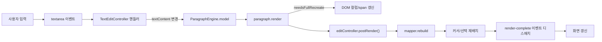
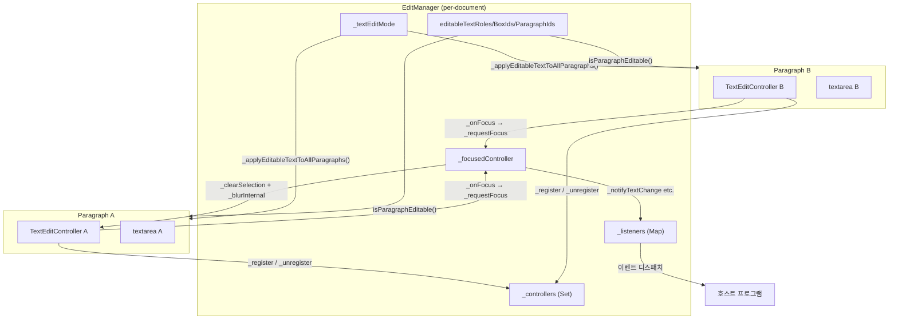
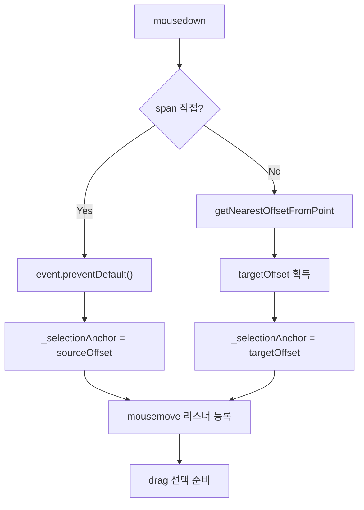
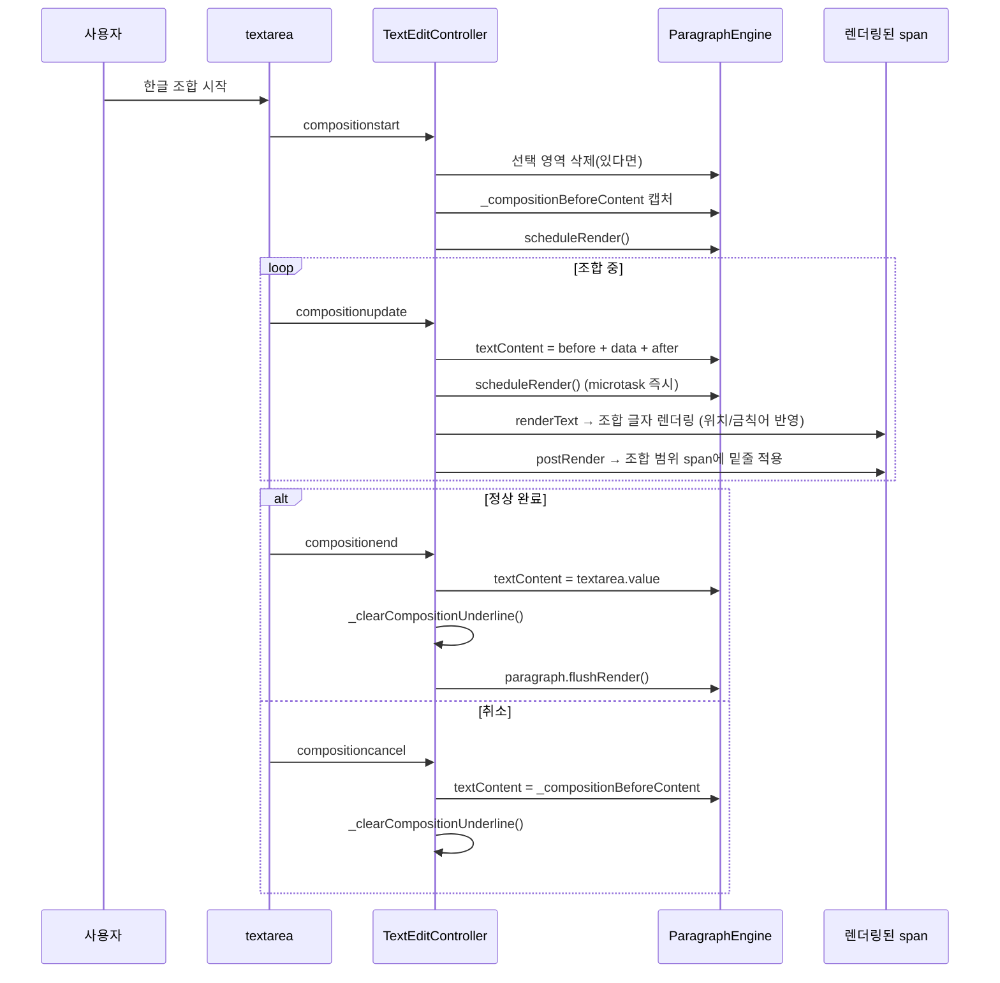
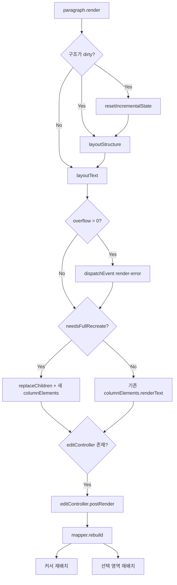
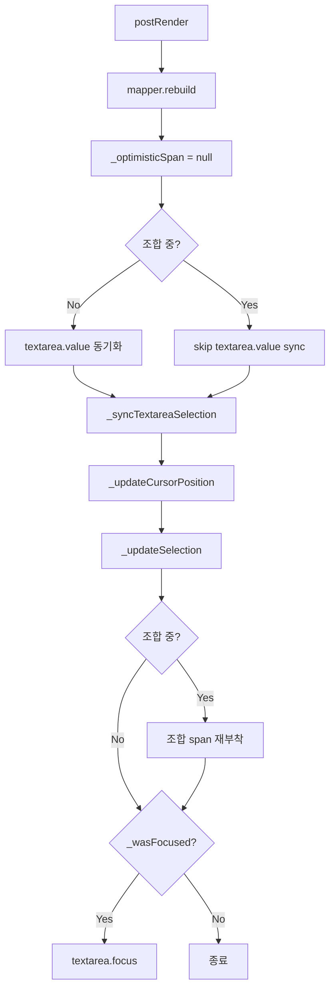
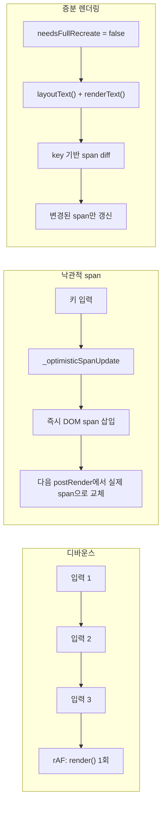
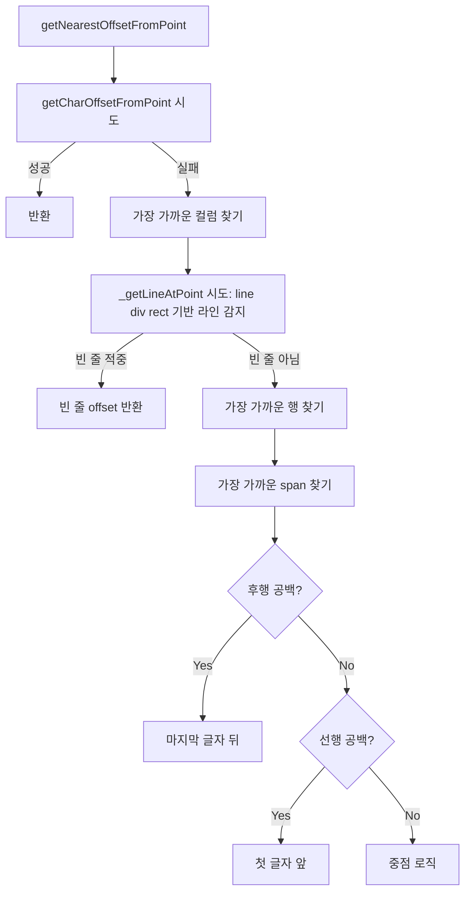
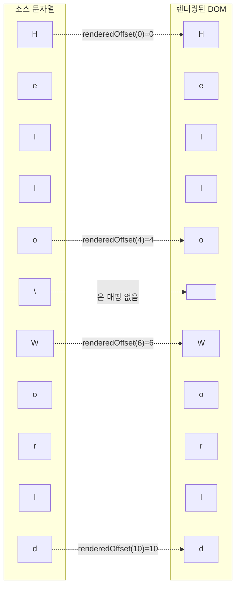
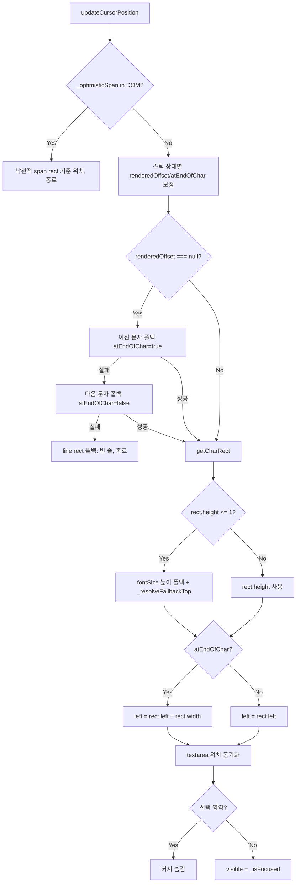

# layout-element 텍스트 편집 모드 상세 명세


> 작성 기준: `src/edit/text-edit-controller.ts`, `src/edit/text-edit-coordinate-mapper.ts`, `src/edit/edit-manager.ts`, `src/types/edit/`, `src/components/edit/cursor.element.ts`, `src/components/edit/selection.element.ts`, `src/components/layout/paragraph.element.ts`
>
> 본 문서는 `layout-element` 라이브러리의 텍스트 편집 모드 기능, 공개 API, 키보드/마우스 입력 처리, IME 조합, 렌더링 생명 주기, 글로벌 편집 관리(`EditManager`), 그리고 호스트 프로그램 연동 방법을 상세히 기술한다.

---

## 1. 개요 (Overview)

`layout-element`는 신문 레이웃을 브라우저에서 렌더링하는 엔진이다. 텍스트 편집 모드는 이 렌더링 엔진 위에서 평문 텍스트를 입력하고 수정할 수 있는 기능이다. 커서, 선택 영역, IME 조합, 키보드 입력, 마우스 상호작용, 클립보드 연동을 제공한다.

### 1.1 텍스트 편집 모드 아키텍처

`TextEditController`는 `LayoutParagraphElement.editableText = true`로 활성화된다. 단락 수준의 직접 활성화 외에, `EditManager`의 `textEditMode`와 3단계 필터(`editableTextRoles`, `editableTextBoxIds`, `editableParagraphIds`)를 통해 문서 전체에서 어떤 단락을 편집 가능하게 할지 중앙에서 관리할 수 있다. 실제 입력 처리(IME, 커서, 선택, 키보드)는 단락에 1:1로 소속된 `TextEditController`가 담당한다.

컨트롤러는 단락 요소의 `shadow root` 안에 다음 세 요소를 배치한다.

1. 숨겨진 `<textarea>`: 1x1 픽셀, 투명, `tabindex="-1"`, `opacity: 0`. 모든 키보드 이벤트, `input` 이벤트, IME 조합 이벤트, 붙여넣기 이벤트를 이 요소가 수신한다. 사용자에게 보이지 않지만 브라우저의 표준 입력기 동작을 그대로 활용한다.
2. `<x-layout-cursor>`: 1px 너비의 수직 커서. 실제 DOM 위치는 `TextEditCoordinateMapper`가 반환하는 문자 rect 기준으로 계산한다.
3. `<x-layout-selection>`: 선택된 텍스트 위에 반투명 사각형 오버레이를 렌더링한다.

모든 `TextEditController` 인스턴스는 생성 시 per-document `EditManager`에 등록된다. `EditManager`는 문서 전체의 편집 상태를 관리하며, 한 번에 하나의 단락만 포커스를 가지도록 보장한다. 포커스가 다른 단락으로 이동하면 이전 단락의 선택 영역이 자동으로 해제된다.

```mermaid
flowchart TD
    subgraph Paragraph["<x-layout-paragraph> shadow root"]
        TA["<textarea> (숨겨진 입력기)"]
        CUR["<x-layout-cursor>"]
        SEL["<x-layout-selection>"]
        COL["<x-layout-column> ..."]
    end

    subgraph UserInput["사용자 입력"]
        KEY[키보드]
        MOUSE[마우스]
        IME[IME 조합]
        CLIP[클립보드]
    end

    UserInput -->|이벤트| TA
    TA -->|input/composition| EC["TextEditController"]
    EC -->|model.textContent 갱신| TLE["ParagraphEngine"]
    TLE -->|columnContents| RENDER["paragraph.render()"]
    RENDER --> COL
    RENDER -->|postRender()| EC
    EC -->|rebuild()| ECM["TextEditCoordinateMapper"]
    ECM -->|오프셋/좌표| EC
    EC -->|위치/보이기 갱신| CUR
    EC -->|ranges 갱신| SEL
```

### 1.2 `TextEditCoordinateMapper`의 역할

`TextEditCoordinateMapper`는 소스 오프셋과 렌더링 오프셋 사이의 양방향 매핑을 유지한다.

- 소스 오프셋: `model.textContent` 문자열 내 0-based 인덱스. `\n`과 제거되지 않은 공백을 모두 포함한다.
- 렌더링 오프셋: 실제 DOM span의 `data-offset` 값. `\n`과 줄 앞뒤로 제거된 공백은 매핑에서 제외된다.

매퍼는 `rebuild()` 호출 시 `ParagraphEngine.columnContents`를 순회하며 두 Map(`_renderedToSource`, `_sourceToRendered`)을 재구축한다. 이 매핑은 커서/선택 위치 계산, 마우스 클릭 처리, 클립보드 복사 등 거의 모든 편집 동작의 기반이 된다.

### 1.3 렌더링 엔진과 텍스트 편집 컨트롤러의 관계

편집 동작은 다음 흐름으로 전체 화면에 반영된다.



요약하면, 텍스트 편집 컨트롤러는 입력을 받아 모델을 바꾸고, 단락의 `render()`가 실제 DOM을 다시 그린 뒤, `postRender()`를 통해 매퍼와 커서/선택을 동기화한다. `postRender()`는 항상 `render()` 내부에서 자동 호출되므로 호스트 프로그램은 별도로 호출할 필요가 없다. `render()`의 최종 단계에서 `render-complete` 커스텀 이벤트가 디스패치되어 배치된 글자/라인 수와 오버플로우 통계를 호스트 프로그램에 전달한다. 오버플로우 발생 시에는 `render-error` 이벤트가 먼저 디스패치된다. 두 이벤트 모두 `EditManager` 이벤트 시스템과 독립적인 요소 자체의 CustomEvent이다.

### 1.4 활성화된 단락의 텍스트 편집 데이터 흐름

```mermaid
sequenceDiagram
    participant User as 사용자
    participant TA as textarea
    participant EC as TextEditController
    participant ECM as TextEditCoordinateMapper
    participant TLE as ParagraphEngine
    paragraph P as LayoutParagraphElement
    participant DOM as x-layout-column/spans

    User->>TA: 키/마우스/IME 입력
    TA->>EC: input / compositionupdate
    EC->>TLE: model.textContent = newContent
    EC->>EC: _debouncedRender()
    EC->>P: requestAnimationFrame -> render()
    P->>TLE: layoutText()
    P->>DOM: replaceChildren() 또는 renderText()
    P->>EC: postRender(needsFullRecreate)
    EC->>ECM: rebuild()
    ECM->>ECM: _rebuildMappings()
    EC->>EC: textarea.value 동기화
    EC->>EC: _updateCursorPosition()
    EC->>EC: _updateSelection()
    EC->>DOM: cursor/selection 위치 갱신
    P->>P: dispatchEvent('render-complete', _computeRenderStats())
```

`render-complete` 이벤트는 `postRender()` 이후에 디스패치된다. 페이로드는 `RenderCompleteEventDetail` 타입이며, 배치된 글자/라인 수(`placed.chars`, `placed.lines`), 오버플로우 여부 및 통계(`overflow.hasOverflow`, `overflow.chars`, `overflow.lines`), 컬럼 수(`columnCount`)를 포함한다. 오버플로우 발생 시에는 `render-complete` 이전에 `render-error` 이벤트가 먼저 디스패치된다.

### 1.5 현재 지원 범위

- 커서 이동 및 표시
- 텍스트 선택 (마우스 드래그, 키보드 확장, 더블/트리플 클릭)
- 한국어, 일본어, 중국어 IME 조합 입력
- 키보드 입력 (문자 삽입/삭제, 줄바꿈, 탐색 단축키)
- 단어 단위 커서 이동 (Ctrl+ArrowLeft/ArrowRight)
- 마우스 클릭 및 드래그
- 클립보드 복사/붙여넣기/잘라내기

### 1.6 제약 사항

- **서식 있는 텍스트 편집 지원**한다. 굵게(`Ctrl+B`), 기울임(`Ctrl+I`), 글자 크기/색상/폰트 변경은 `EditManager.applyInlineStyle()` / `toggleInlineStyle()`로 편집하며, 내부적으로 `RunMap`(`src/edit/run-map.ts`)이 평문 오프셋 ↔ 인라인 런 매핑을 관리한다. IME 조합(한글 입력)도 인라인 런 단락에서 동작한다.
- **단일 단락 편집**만 가능하다. 단락을 넘어가는 선택이나 여러 단락 동시 편집은 지원하지 않는다.

---

## 2. 텍스트 편집 모드 활성화

### 2.1 `LayoutParagraphElement.editableText`

`x-layout-paragraph` 요소의 `editableText` 속성으로 텍스트 편집 모드를 켜고 끈다.

```ts
const paragraph = document.querySelector('x-layout-paragraph') as LayoutParagraphElement;

// 활성화
paragraph.editableText = true;

// 비활성화
paragraph.editableText = false;
```

동작:

- `editableText = true`를 처음 설정하면 `TextEditController` 인스턴스가 생성된다.
- `editableText = false`를 설정하면 `TextEditController.destroy()`가 호출되며, 이벤트 리스너와 DOM 요소가 모두 제거된다.
- 같은 단락에서 다시 `editableText = true`를 설정하면 새 `TextEditController`가 생성된다.
- **lock 제한**: 조상 box 중 하나라도 `lock`이 `true`이면, `EditManager.isParagraphEditable()`은 이 단락에 대해 `false`를 반환하므로 `EditManager`를 통해 `editableText = true`로 강제할 수 없다. 단, 호스트 프로그램이 paragraph 요소에 직접 `editableText = true`를 설정하면 `TextEditController`는 생성되지만, `EditManager`의 전역 필터와 독립적으로 동작하며 이벤트/상태가 달라질 수 있으므로 권장하지 않는다.

### 2.2 더블클릭으로 텍스트 편집 모드 전환

현재 모드(읽기 모드, 레이아웃 편집 모드 등)에 상관없이 paragraph를 더블클릭하면 텍스트 편집 모드로 전환되고 해당 paragraph에 포커스가 부여된다. `LayoutSelectionController`가 `document.documentElement` capture phase에 `dblclick` 리스너를 등록하여 처리한다.

**동작 순서:**

1. `LayoutSelectionController._onDblClick`가 `composedPath()`에서 `LayoutParagraphElement`를 찾는다. 부모 box가 `isBoxSelectable()`을 통과해야 한다 (lock된 box 내부의 paragraph는 무시된다).
2. `EditManager.textEditMode = true`로 설정하여 다른 모드를 모두 끄고 문서 전체의 paragraph 편집 가능 여부를 갱신한다. 이때 `modeChange` 이벤트가 발생한다.
3. `EditManager.focusParagraph(paragraph)`로 해당 paragraph에 포커스를 부여한다. 이 호출은 `editableText = true` 설정과 `TextEditController` 생성을 내부적으로 수행한다.
4. `TextEditController.getOffsetFromPoint(event.clientX, event.clientY)`로 더블클릭한 위치의 소스 오프셋을 구한다.
5. `controller.setCursor({ textOffset: offset })`로 커서를 더블클릭한 위치로 이동한다.

**제약:**

- **삽입 모드**: 삽입 모드(`insertMode !== null`)에서는 더블클릭이 무시된다.
- **lock**: 조상 box 중 하나라도 `lock`이 `true`이면 더블클릭이 무시된다.

```ts
// 사용자가 paragraph를 더블클릭하면:
// 1. 텍스트 편집 모드로 자동 전환
// 2. 해당 paragraph에 포커스
// 3. 커서가 더블클릭한 위치로 이동
// 4. modeChange 이벤트 발생

manager.addEventListener('modeChange', (event) => {
  console.log('모드 전환:', event.previousMode, '→', event.mode);
  // 툴바 UI 갱신 등
});
```

### 2.3 `editController` 게터

활성화된 `TextEditController`에 접근할 때 사용한다.

```ts
const controller = paragraph.editController;
if (controller) {
  controller.focus();
}
```

### 2.4 `TextEditController` 생성 시 추가되는 DOM 요소

`TextEditController` 생성자는 단락의 `shadow root`에 다음 세 가지 요소를 추가한다. 텍스트 편집을 위한 숨겨진 입력기, 커서, 선택 영역이다.

| 요소 | 태그 | 설명 |
|------|------|------|
| 숨겨진 입력기 | `<textarea>` | 실제 키보드 이벤트와 IME 이벤트를 수신한다. 투명하고 1x1 픽셀 크기이며, `tabindex="-1"`로 설정되어 있다. |
| 커서 | `<x-layout-cursor>` | 1px 너비의 수직 커서를 렌더링한다. |
| 선택 영역 | `<x-layout-selection>` | 선택된 텍스트 위에 반투명 사각형 오버레이를 렌더링한다. |

### 2.5 생성자 초기화 과정 상세

`new TextEditController(paragraph)`는 다음 순서로 실행된다.

1. `TextEditCoordinateMapper` 생성. `paragraph.model`이 있으면 `rebuild()`가 즉시 실행되어 초기 매핑을 구축한다.
2. `_createTextarea()`로 숨겨진 `<textarea>` 생성:
   - `position: absolute`
   - `opacity: 0`
   - `width: 1px`, `height: 1px`
   - `pointerEvents: auto`
   - `border: none`, `padding: 0`, `margin: 0`
   - `resize: none`, `overflow: hidden`
   - `zIndex: 9999`
   - `tabindex="-1"`, `role="textbox"`, `aria-label="텍스트 편집 영역"`
3. `<x-layout-cursor>` 요소 생성.
4. `<x-layout-selection>` 요소 생성.
5. 세 요소를 `paragraph.shadowRoot`에 `appendChild`로 추가.
6. 이벤트 리스너 등록:
   - paragraph: `click`, `mousedown`, `dblclick`
   - document: `mouseup`
   - textarea: `focus`, `blur`, `input`, `compositionstart`, `compositionupdate`, `compositionend`, `compositioncancel`, `keydown`, `paste`
   - document: `visibilitychange`
7. `textarea.value`를 `model.textContent`로 초기화한다. 이렇게 해야 이후 `_onInput`에서 올바른 텍스트 diff를 계산할 수 있다.
8. `_updateCursorPosition()`을 초기 호출하여 커서를 첫 번째 문자 위치 또는 빈 단락의 첫 컬럼 위치로 배치한다.

```mermaid
flowchart LR
    A[editableText = true] --> B[TextEditController 생성]
    B --> C["TextEditCoordinateMapper 생성"]
    C --> D["textarea + cursor + selection 생성"]
    D --> E[shadow root에 추가]
    E --> F[이벤트 리스너 등록]
    F --> G["textarea.value 초기화"]
    G --> H["_updateCursorPosition()"]
    H --> I[편집 가능 상태]

    J[editableText = false] --> K[TextEditController.destroy() 호출]
    K --> L[이벤트 리스너 제거]
    L --> M[타이머 취소]
    M --> N[조합 상태 리셋]
    N --> O[DOM 요소 제거]
    O --> P[TextEditController = null]
```

### 2.6 `destroy()`의 정리 과정 상세

`TextEditController.destroy()`는 다음 작업을 순서대로 수행한다.

1. 단락에서 `click`, `mousedown`, `dblclick` 리스너 제거.
2. document에서 `mouseup`, `mousemove` 리스너 제거.
3. `_clickTimer`가 있으면 `clearTimeout`으로 취소하고 null로 초기화.
4. textarea에서 `focus`, `blur`, `keydown`, `input`, `compositionstart`, `compositionupdate`, `compositionend`, `compositioncancel`, `paste` 리스너 제거.
5. `_debounceTimer`가 있으면 `cancelAnimationFrame`으로 취소.
6. `_mousemoveRafId`가 있으면 `cancelAnimationFrame`으로 취소.
7. document에서 `visibilitychange` 리스너 제거.
8. `_isFocused = false`로 설정.
9. `_resetCompositionState()` 호출: `_isComposing = false`, `_compositionData = ""` 초기화.
10. `_optimisticSpan`이 있으면 DOM에서 제거하고 참조를 null로 초기화.
11. `textarea`, `<x-layout-cursor>`, `<x-layout-selection>`을 각각 `parentNode.removeChild`로 제거.

---

## 3. 공개 API 참조

### 3.1 `LayoutParagraphElement`

| API | 타입 | 설명 |
|-----|------|------|
| `editableText` | `boolean` get/set | 텍스트 편집 모드를 활성화하거나 비활성화한다. `true` 설정 시 `TextEditController`가 생성되고, `false` 설정 시 제거된다. |
| `editController` | `TextEditController \| null` get | 현재 연결된 `TextEditController` 인스턴스를 반환한다. 텍스트 편집 모드가 꺼져 있으면 `null`이다. |
| `model` | `ParagraphEngine \| null` get | 단락에 연결된 `ParagraphEngine` 모델을 반환한다. |
| `render()` | `void` | 단락을 다시 렌더링한다. 편집 중이면 `editController.postRender()`를 자동으로 호출한다. 렌더링 완료 후 항상 `render-complete` 커스텀 이벤트를 디스패치하여 배치/오버플로우 통계를 전달한다. 오버플로우 발생 시에는 `render-error` 커스텀 이벤트도 디스패치한다. 오버플로우 시 하단 8px 빨간 inset shadow로 시각적 표시를 적용한다. |

### 3.2 `TextEditController`

| API | 타입 | 설명 |
|-----|------|------|
| `cursorOffset` | `number` get | 현재 커서 위치를 소스 텍스트 오프셋(0-based, `\n` 포함)으로 반환한다. |
| `selection` | `SelectionRange \| null` get | 현재 선택 영역을 반환한다. 선택이 없으면 `null`이다. |
| `currentStyle` | `CurrentStyle` get | 현재 커서/선택 위치에서 유효한 `TextStyle`과 `ParagraphStyle`을 반환한다. 상속 스타일 + 문단 스타일 + 인라인 런 스타일을 병합한 **최종(effective) 스타일**이다. selection이 있으면 영역 내 모든 위치에서 **공통인 필드만** 반환하며(상이한 필드는 생략), selection이 없으면 커서 위치의 최종 스타일을 반환한다. |
| `computeSelectionCommonStyle(start, end)` | `CurrentStyle` | `[start, end)` 범위 내 모든 오프셋의 유효 스타일을 비교해 공통 필드만 반환한다. `currentStyle`의 selection 경로가 내부적으로 사용하는 메서드로, 외부에서도 직접 호출 가능하다. |
| `applyInlineStyle(style)` | `void` | 현재 선택 영역에 인라인 스타일(`Partial<TextInlineStyle>`)을 적용한다. 선택 영역이 없으면 무시. `runMap`을 갱신하고 `plainToInline`으로 `model.textContent`를 재구성한 뒤 재렌더링한다. |
| `toggleInlineStyle(field, value)` | `void` | 현재 선택 영역의 인라인 스타일 필드를 토글한다. 선택 영역 전체가 이미 해당 값이면 제거(기본 복귀), 아니면 적용한다. `Ctrl+B`(fontWeight 700), `Ctrl+I`(fontStyle italic) 단축키가 이 메서드를 호출한다. |
| `normalizeNow()` | `void` | 현재 런 맵을 문단 유효 텍스트 스타일 기준으로 정규화한다. 문단 기본과 모든 필드가 동일한 런은 해제하고 인접 동일 런을 병합한다. 텍스트 길이가 변하지 않으므로 커서/selection 오프셋은 불변. 포커스 획득/blur 시 자동 호출된다. |
| `focus()` | `void` | 숨겨진 `textarea`에 포커스를 주어 커서를 표시한다. |
| `blur()` | `void` | 숨겨진 `textarea`에서 포커스를 해제하여 커서를 숨긴다. |
| `setCursor(position: CursorPosition)` | `void` | 프로그래밍 방식으로 커서 위치를 설정한다. |
| `setSelection(range: SelectionRange)` | `void` | 프로그래밍 방식으로 선택 영역을 설정한다. |
| `getOffsetFromPoint(x: number, y: number)` | `number \| null` | 뷰포트 좌표(x, y)에서 가장 가까운 텍스트 위치의 소스 오프셋을 반환한다. 더블클릭 등 외부 이벤트에서 클릭 위치를 커서 오프셋으로 변환할 때 사용한다. 매핑할 수 없으면 `null`을 반환한다. |
| `postRender(fullRebuild?: boolean)` | `void` | 렌더링 이후 호출한다. 좌표 매퍼를 재구축하고 커서/선택 영역을 다시 배치한다. **호스트 프로그램은 편집 중인 단락에 영향을 주는 모든 렌더링 후에 이 메서드를 호출해야 한다.** `paragraph.render()`가 자동으로 호출한다. |
| `destroy()` | `void` | 모든 이벤트 리스너와 DOM 요소를 정리하고 컨트롤러를 제거한다. |

### 3.3 API 동작 상세

#### `postRender()`

`paragraph.render()` 내부에서 DOM 갱신 직후 호출된다. 다음 순서로 동작한다.

1. `this._mapper.rebuild()` — 오프셋 매핑을 새 DOM 기준으로 재구축.
2. `this._optimisticSpan = null` — 낙관적 span 참조 제거. 실제 렌더링된 span으로 대체된다.
3. 조합 중이 아닌 경우 `textarea.value`를 `model.textContent`로 동기화.
4. `_syncTextareaSelection()` — textarea의 선택 영역을 `_cursorModel` 상태에 맞춘다.
5. `_updateCursorPosition()` — 커서를 새 DOM 위치에 재배치. `getCursorPlacement(offset, preferLineEnd=true)`를 통해 커서 배치 정보(`sourceOffset`, `atEndOfChar`)를 얻는다. `_sourceToPlacement` 맵은 `_rebuildMappings()`에서 모든 source offset에 대해 채워진다 — 가시 문자는 `atEndOfChar: false`, trailing space는 `atEndOfChar: true` + 누적 스페이스 폭, `\n` 위치는 `atEndOfChar: true`, 매핑 구멍(빈 줄 등)은 역방향으로 가장 가까운 placement로 채워진다. 단, `\n` 바로 다음 위치(새 라인 시작)는 line rect 폴백으로 처리된다. `endOfBlock`에서 `textContent`에 실제 `\n`이 있을 때만 `sourceOffset++`를 수행하여 phantom offset을 방지한다. **phantom end placement**: trailing space 없이 끝나는 라인의 마지막 가시 문자 다음 offset(= 다음 라인 첫 글자 offset)은 `_lineEndPlacements`에 별도 저장되며, `preferLineEnd=true`로 조회 시 우선 반환되어 커서가 라인 끝 문자의 오른쪽에 배치된다. `crossRightState === 'crossed'`일 때는 `preferLineEnd=false`로 다음 라인 첫 글자의 왼쪽에 배치한다. `getCursorPlacement()`가 null을 반환하는 경우(빈 줄 시작, offset=0 등) line rect 또는 first column rect로 폴백한다. **height≈0 span(공백 문자) 처리**: `getCharRect(placement.sourceOffset)`의 `rect.height <= 1`이면 `useFallback=true`로 전환하여 `_resolveFallbackTop()`으로 커서 top을 결정한다. `_resolveFallbackTop`은 (1) 인접 가시 문자의 `rect.top`, (2) `getLineRect()`의 라인 div top, (3) span 자체 `rect.top`, (4) `getFirstColumnRect().top` 순서로 폴백한다. `rect.top - cursorHeight`를 사용하지 않는다 — 라인 끝 스페이스에서 위 라인으로 커서가 올라가는 버그를 방지.
6. `_updateSelection()` — 선택 영역을 새 DOM 위치에 재배치.
7. 조합 중이면 `_applyCompositionUnderline()`로 엔진 렌더링 결과의 조합 범위 span에 밑줄 적용. 조합이 종료된 직후면 `_clearCompositionUnderline()`로 밑줄 제거.
8. `_wasFocused`가 true면 `textarea.focus({ preventScroll: true })`로 포커스 복원. `preventScroll: true`로 스크롤 컨테이너의 좌상단 점프를 방지한다.

#### `setCursor()`

`_cursorModel.offset`을 주어진 `textOffset`로 설정하고 `_updateCursorPosition()`을 호출한다. 그러나 커서를 시각적으로 표시하려면 별도로 `focus()`를 호출해야 한다.

```ts
controller.setCursor({ textOffset: 5 });
controller.focus(); // 커서가 보임
```

#### `setSelection()`

`_cursorModel.selection`을 주어진 `SelectionRange`로 설정하고 `_updateSelection()`을 호출한다. 선택 영역을 시각적으로 표시하려면 `focus()`를 별도로 호출해야 한다.

```ts
controller.setSelection(SelectionRange.fromOffsets(0, 10));
controller.focus();
```

#### `currentStyle`

커서 위치에서 유효한 `TextStyle`과 `ParagraphStyle`을 반환한다. 내부 동작:

1. `model.inheritStyle`과 `model.textStyle`/`model.paragraphStyle`을 필드별로 `??` 병합하여 기본 스타일을 구성한다.
2. 런 스타일 조회로 커서가 속한 런의 `TextInlineStyle`을 찾는다. 컨트롤러가 보유한 `runMap`(`src/edit/run-map.ts`)에서 `getStyleAtOffset(runMap, cursorOffset)`으로 조회한다.
3. `TextInlineStyle`의 정의된 필드만 기본 스타일 위에 오버라이드한다.

```ts
const { textStyle, paragraphStyle } = controller.currentStyle;
// textStyle.fontSize, textStyle.fontWeight, textStyle.color, ...
// paragraphStyle.textAlign, paragraphStyle.lineGap, ...
```

모델이 없거나 텍스트 편집 모드가 비활성화된 경우 빈 객체(`{ textStyle: {}, paragraphStyle: {} }`)를 반환한다.

#### `focus()` / `blur()`

- `focus()`: `this._textarea.focus({ preventScroll: true })`를 호출한다. `preventScroll: true` 옵션으로 브라우저의 기본 스크롤-인토-뷰 동작을 억제하여, 포커스 시 스크롤 컨테이너가 textarea 위치(paragraph shadow root의 1x1 투명 요소)로 강제 스크롤되어 좌상단으로 점프하는 부작용을 방지한다. 커서/선택의 시각적 위치는 `_updateCursorPosition()`과 `_updateSelection()`이 별도로 관리하므로 포커스 자체의 스크롤은 불필요하다. 포커스를 받으면 `_onFocus()` 콜백이 실행되고, 선택 영역이 없을 때만 커서를 보이게 한다.
- `blur()`: `this._textarea.blur()`를 호출한다. 포커스를 잃으면 `_onBlur()` 콜백이 실행되고, 진행 중인 IME 조합이 있으면 완료 처리한 뒤 커서를 숨긴다.

### 3.4 `TextEditCoordinateMapper`

`TextEditController` 내부에서 사용하는 좌표 매핑 객체이다.

소스 오프셋은 `textContent` 기반 0-indexed 위치이며 `\n`과 공백을 포함한다. 렌더링에서 생략된 leading/trailing space와 `\n`은 span이 생성되지 않지만 `data-source-offset`이 연속된 가시 문자에 부여되므로 소스 오프셋 기반으로 span을 직접 찾을 수 있다.

**plainText 규약 (중요)**: 첫 텍스트 편집 후 `ParagraphEngine.textContent`는 `plainToInline` 결과인 **배열**(`(string | TextInlineData)[]`)이 된다. 따라서 오프셋 기반 문자 판정(`\n` 스킵, 라인 끝 검사, 커서 매핑 등)은 반드시 `model.plainText`를 사용해야 하며, `textContent[i] === '\n'` 같은 문자열 인덱싱은 배열에서 항상 실패한다. `plainText`는 `textContent`가 배열이면 런 content를 이어붙인 평문을 캐시하여 반환한다(`ParagraphEngine.plainText` — `textContent`/`data` setter에서 캐시 무효화). 이 규약을 위반하면 `\n` 스킵이 전부 무시되어, 단(column)을 넘어갈수록 커서/선택 영역/타이핑 주입 오프셋이 실제 소스 오프셋보다 작아지는 누적 드리프트(블록당 −1)가 발생한다.

**좌표계 메모**: paragraph의 shadow root 자식 요소(cursor/selection)의 `top`/`left`는 paragraph local coordinate(transform: scale 적용 전 픽셀)를 기대하지만 `getBoundingClientRect()`는 transform 적용 후 viewport 픽셀을 반환한다. `getCharRect`/`getTextRange`/`getFirstColumnRect`가 반환하는 top/left/width/height는 모두 `EditManager.scale`로 나누어 local coordinate로 변환한다.

| API | 타입 | 설명 |
|-----|------|------|
| `rebuild()` | `void` | 렌더링된 DOM을 기준으로 오프셋 매핑을 다시 구축한다. `postRender()`가 호출한다. |
| `getCursorPlacement(sourceOffset, preferLineEnd?)` | `CursorPlacement \| null` | 주어진 소스 오프셋에 커서를 표시할 위치를 반환한다. 가시 문자와 중간 스페이스(단어 사이)는 `{ sourceOffset, atEndOfChar: false }`로 설정되어 커서가 문자/스페이스 앞(왼쪽)에 배치된다. 라인 마지막 trailing space와 endOfBlock은 이전 가시 문자를 `atEndOfChar: true`로 참조하여 커서가 스페이스 뒤(이전 가시 문자의 오른쪽)에 배치된다. 생략된 leading space와 `\n` 다음 위치는 null을 반환하여 line rect 폴백으로 처리된다. `preferLineEnd=true`면 `_lineEndPlacements`를 우선 조회하여 라인 끝 문자의 오른쪽에 배치한다 (trailing space 없이 끝나는 라인에서 다음 라인 첫 글자 offset과 충돌할 때 사용). |
| `getCharOffsetFromPoint(x, y)` | `CursorPosition \| null` | 뷰포트 좌표(x, y) 위치의 문자에 해당하는 소스 오프셋을 반환한다. y 범위에 있는 컬럼들 중 x에 가장 가까운 컬럼을 찾고, 해당 컬럼에서 y에 가장 가까운 라인 div를 찾은 후, 그 라인의 span들 중 x에 가장 가까운 span을 선택한다. **라인 소속 판별은 DOM 조상 귀속**(span → part div → line div, `_getLineDivOfSpan`)을 사용한다 — 하단 앵커(bottom anchor) 때문에 큰 폰트 span의 top은 라인 top과 다르므로 rect 기반(top/bottom/y-중점) 매칭은 특정 크기의 span을 누락한다. 빈 라인(span이 없는 경우)이면 라인 시작 오프셋을 반환한다. |
| `getNearestOffsetFromPoint(x, y)` | `CursorPosition \| null` | `getCharOffsetFromPoint`와 동일하다. |
| `getCharRect(sourceOffset)` | `DOMRect \| null` | 주어진 소스 오프셋에 해당하는 문자 span의 위치를 단락 로컬 좌표로 반환한다. |
| `getFirstColumnRect()` | `{ top, left, fontSize } \| null` | 첫 번째 컬럼의 첫 번째 라인 div의 단락 로컬 rect와 폰트 크기를 반환한다. 빈 단락에서 커서를 배치할 때 사용한다. |
| `getLineInfoBySourceOffset(sourceOffset)` | `{ columnIndex, lineIndex } \| null` | 소스 오프셋이 속한 라인의 컬럼 인덱스와 라인 인덱스를 반환한다. 빈 줄(\\n 위치)도 해당 라인으로 반환한다. |
| `getLineStartSourceOffset(columnIndex, lineIndex)` | `number \| null` | 주어진 컬럼/라인 인덱스의 시작 source 오프셋을 반환한다. |
| `getLineRect(columnIndex, lineIndex)` | `{ top, left, width, height } \| null` | 주어진 컬럼/라인 인덱스에 해당하는 line div의 단락 로컬 rect를 반환한다. 빈 줄도 line div가 존재하므로 rect를 반환한다. |
| `totalLineCount` | `number` | 전체 라인 수(모든 컬럼 합)를 반환한다. |
| `getTextRange(start, end)` | `Rect[]` | `start`부터 `end`까지(끝 제외)의 선택 사각형 배열을 단락 로컬 좌표로 반환한다. **top 기준으로 행을 그룹핑**한다 — 같은 라인 내 크기가 다른 런은 하단 앵커로 top이 달라 분리된 rect가 되어 각 크기의 실제 영역이 하이라이트된다. 인접 라인 간 top 우연 일치는 불가능하다(라인 간격 lineHeight > 침범 깊이). |
| `getTextContent(start, end)` | `string` | `start`부터 `end`까지(끝 제외)의 소스 텍스트를 반환한다. span의 `innerText`를 읽고 블록 사이의 `\n`을 복원한다. |
| `findVisualLineBounds(sourceOffset)` | `{ start, end } \| null` | 소스 오프셋이 속한 시각적 라인의 시작/끝 오프셋을 반환한다. `Home`/`End` 키 처리에 사용한다. |
| `getSpanByOffset(sourceOffset)` | `HTMLSpanElement \| null` | 주어진 소스 오프셋에 해당하는 문자 `span` 요소를 반환한다. `[data-source-offset]` 속성으로 검색하며 임시 span은 제외한다. |

### 3.5 타입

```ts
/** 커서 배치 정보: 특정 source offset에 커서를 표시할 위치를 나타낸다. */
interface CursorPlacement {
  /** 커서가 참조할 가시 문자의 source offset */
  sourceOffset: number;
  /** true면 커서를 문자의 우측 끝에 배치, false면 좌측에 배치 */
  atEndOfChar: boolean;
}

type CursorPosition = {
  textOffset: number;  // 0-based offset in source text (including \n)
};

class SelectionRange {
  readonly anchor: CursorPosition;  // where selection started
  readonly focus: CursorPosition;   // where selection ended

  static fromOffsets(anchor: number, focus: number): SelectionRange;

  normalized(): { start: CursorPosition; end: CursorPosition };  // always start ≤ end
}

type CurrentStyle = {
  textStyle: TextStyle;        // 커서 위치의 유효한 글자 스타일
  paragraphStyle: ParagraphStyle;  // 커서 위치의 유효한 문단 스타일
};
```

### 3.5.1 `TextEditCoordinateMapper.useEngineCoordinateQueries` (마이그레이션 플래그)

`TextEditCoordinateMapper`는 정적 프로퍼티 `useEngineCoordinateQueries: boolean = false`를 가진다. 이 플래그는 `getCharRect()`의 동작 경로를 전환한다. 점진적 엔진 마이그레이션을 위한 기능 플래그이다.

| 값 | `getCharRect()` 동작 경로 |
|----|---------------------------|
| `false` (기본값) | DOM `getBoundingClientRect()` 기반. span rect에서 paragraph rect를 빼고 `EditManager.scale`로 나누어 paragraph local coordinate(mm)를 반환. 기존 동작. |
| `true` | `ParagraphEngine.getCharRect()` 엔진 쿼리 기반. 엔진이 mm 단위로 직접 계산한 결과를 `ppm`으로 변환하여 반환. DOM 의존성 없음. |

- **기본값 `false`**: 기존 동작을 유지하여 호환성 보장.
- **`true`로 전환 시**: `ParagraphEngine.getCharRect()`가 mm 단위로 반환한 결과를 `ppm`으로 나누어 픽셀 좌표로 변환. DOM 측정(`getBoundingClientRect`)을 거치지 않으므로 transform: scale 환경에서의 보정(`EditManager.scale`로 나누기)이 불필요.
- **마이그레이션 목적**: 엔진 레이어(`src/engine/paragraph-engine.ts`)로의 점진적 전환을 위해 도입. 전체 전환 전 두 경로를 공존시켜 검증할 수 있다.
- **적용 범위**: 현재 `getCharRect()`에만 영향. `getTextRange()`, `getFirstColumnRect()`, `getLineRect()` 등 다른 좌표 API는 여전히 DOM 기반.

- `anchor`는 선택이 시작된 위치, `focus`는 선택이 끝난 위치이다.
- 역방향 드래그(아래에서 위로)라면 `anchor.textOffset > focus.textOffset`이 될 수 있다.
- 문서 순서대로 정렬된 범위가 필요하면 `normalized()`를 사용한다.

#### `CurrentStyle` 상세

`currentStyle` 게터는 커서 위치에서 유효한 스타일을 계산한다. 계산 순서:

1. **단락 수준 스타일 + 상속 스타일 병합**: `model.textStyle`의 각 필드와 `model.inheritStyle`의 같은 필드를 `??` 연산자로 병합한다. 단락 자체 스타일이 우선하고, 없으면 상속값을 사용한다.
2. **런 스타일 찾기**: 컨트롤러가 보유한 `runMap`(`src/edit/run-map.ts`)에서 `getStyleAtOffset(runMap, cursorOffset)`으로 커서가 속한 런의 `TextInlineStyle`을 찾는다. `runMap`은 `model.textContent`(`string | (string \| TextInlineData)[]`)에서 `inlineToPlain()`으로 분해한 평문 오프셋 ↔ 런 매핑이다.
3. **런 스타일로 오버라이드**: `TextInlineStyle`의 정의된 필드(`fontFamily`, `fontSize`, `fontWeight`, `fontStyle`, `color`)만 기본 스타일 위에 오버라이드한다. `undefined`인 필드는 무시한다. 인라인 런은 정렬(`textAlign`)을 오버라이드하지 않는다.

```ts
// 사용 예시
const controller = paragraph.editController!;
const { textStyle, paragraphStyle } = controller.currentStyle;

console.log(textStyle.fontSize);     // 커서 위치의 글자 크기 (mm)
console.log(textStyle.fontWeight);   // 커서 위치의 폰트 굵기
console.log(textStyle.color);        // 커서 위치의 글자 색상
console.log(paragraphStyle.textAlign); // 커서 위치의 정렬 방식
```

스타일 우선순위 (높은 것부터):

```
TextInlineStyle (런 단위 오버라이드)
  ↓ undefined 필드는 무시
TextStyle / ParagraphStyle (단락 수준)
  ↓ undefined 필드는 무시
InheritStyle (부모에서 상속)
  ↓
기본값 (DEFAULT_FONT_SIZE 등)
```

---

## 3.6 `EditManager` — 문서 단위 편집 관리자

`EditManager`는 문서 전체의 편집 상태를 중앙에서 관리하는 **per-document 인스턴스**이다. `ColorRegistry`, `FontLoader`와 달리 싱글톤이 아니며, 각 `LayoutDocumentElement`가 자체 `EditManager`를 소유한다.

### 3.6.1 역할

- **텍스트 편집 모드 활성화 관리**: `textEditMode`와 3단계 필터(`editableTextRoles`, `editableTextBoxIds`, `editableParagraphIds`), 그리고 `editableRootId`를 통해 문서 전체에서 어떤 단락을 편집 가능하게 할지 중앙에서 제어한다.
- **편집 잠금 상속**: 조상 box 중 하나라도 `lock`이면 해당 box 내부의 모든 paragraph는 텍스트 편집 불가이다.
- **포커스 관리**: 한 번에 하나의 단락만 포커스를 가진다. 포커스가 B 단락으로 이동하면 A 단락의 선택 영역이 자동으로 해제된다.
- **이벤트 시스템**: `focusChange`, `textChange`, `styleChange`, `cursorMove`, `selectionStart`, `selectionEnd` 이벤트를 외부 편집 UI에 전달한다.
- **상태 조회**: 현재 포커스된 단락, 커서 위치, 선택 영역, 스타일을 조회할 수 있다.
- **Selection 객체 조회**: DOM `Selection` API처럼 현재 `SelectionRange` 객체를 직접 조회할 수 있다.

### 3.6.2 API 참조

| API | 타입 | 설명 |
|-----|------|------|
| `getInstance()` | — | (제거됨) per-document 인스턴스는 `LayoutDocumentElement.editManager`로 접근 |
| `focusedParagraph` | `LayoutParagraphElement \| null` get | 현재 포커스된 단락 요소. 없으면 `null`. |
| `focusedController` | `TextEditController \| null` get | 현재 포커스된 편집 컨트롤러. 없으면 `null`. |
| `cursorOffset` | `number \| null` get | 현재 커서 위치. 포커스된 단락이 없으면 `null`. |
| `selection` | `SelectionRange \| null` get | 현재 선택 영역. 선택이 없거나 포커스된 단락이 없으면 `null`. DOM `Selection` API와 유사하게 현재 selection 객체를 직접 조회. |
| `currentStyle` | `CurrentStyle \| null` get | 현재 커서 위치의 유효 스타일. 포커스된 단락이 없으면 `null`. |
| `applyInlineStyle(style)` | `void` | 포커스된 단락의 현재 선택 영역에 인라인 스타일(`Partial<TextInlineStyle>`)을 적용한다. 선택 영역이 없거나 포커스된 단락이 없으면 무시. |
| `toggleInlineStyle(field, value)` | `void` | 포커스된 단락의 현재 선택 영역에서 인라인 스타일 필드를 토글한다. 선택 영역 전체가 이미 해당 값이면 제거, 아니면 적용. |
| `applyTextStyle(textPatch?, paragraphPatch?)` | `boolean` | 텍스트/문단 스타일 주입의 단일 진입점. 편집 상태에 따라 주입 대상을 판별한다: (1) 포커스 + selection → 선택 범위 인라인 주입, (2) 포커스 + 커서가 런 안 → 해당 런만 업데이트, (3) 포커스 + 커서가 런 밖 → paragraph 스타일 수정 + 명시 필드 전체 캐스케이드, (4) 포커스 없이 paragraph/paragraph-box(selected) → 대상 paragraph 스타일 + 전체 캐스케이드. 인라인 불가 필드(textAlign, lineGap, verticalAlign, letterSpacing, widthRatio)는 항상 paragraph로 라우팅. 처리 후 런 맵 정규화 + 커서/selection 보존. |
| `controllers` | `Set<TextEditController>` get | 등록된 모든 편집 컨트롤러. |
| `focusParagraph(target, options?)` | `boolean` | 단락 요소 또는 ID로 포커스를 설정한다. 텍스트 편집 모드가 아니면 자동 활성화. `options.cursorOffset`으로 커서 위치, `options.selection`으로 선택 영역을 지정할 수 있다. 성공 시 `true`, 실패 시 `false`. |
| `blurParagraph(target?)` | `boolean` | 단락 요소, ID, 또는 생략으로 포커스를 해제한다. 생략하면 현재 포커스된 단락을 blur. 성공 시 `true`, 실패 시 `false`. |
| `addEventListener(type, listener)` | `void` | 이벤트 리스너를 등록한다. |
| `removeEventListener(type, listener)` | `void` | 이벤트 리스너를 제거한다. |
| `textEditMode` | `boolean` get/set | 전역 텍스트 편집 모드 토글. `false`이면 모든 단락의 편집을 비활성화하고 포커스를 해제한다. |
| `editableTextRoles` | `ReadonlySet<BoxRole> \| null` get | 부모 상자의 `role` 필터. `null`이면 역할 필터가 없다. |
| `setEditableTextRoles(roles)` | `void` | `BoxRole[] \| null`을 받아 `editableTextRoles` 필터를 설정한다. `null`이면 역할 필터를 해제한다. |
| `editableTextBoxIds` | `ReadonlySet<string> \| null` get | 부모 상자의 `id` 필터. `null`이면 상자 ID 필터가 없다. |
| `setEditableTextBoxIds(ids)` | `void` | `string[] \| null`을 받아 `editableTextBoxIds` 필터를 설정한다. `null`이면 상자 ID 필터를 해제한다. |
| `editableParagraphIds` | `ReadonlySet<string> \| null` get | 단락 자체의 `id` 필터. `null`이면 단락 ID 필터가 없다. |
| `setEditableParagraphIds(ids)` | `void` | `string[] \| null`을 받아 `editableParagraphIds` 필터를 설정한다. `null`이면 단락 ID 필터를 해제한다. |
| `addEditableParagraph(id)` | `void` | 개별 단락 ID를 `editableParagraphIds` 필터에 추가한다. |
| `removeEditableParagraph(id)` | `void` | 개별 단락 ID를 `editableParagraphIds` 필터에서 제거한다. |
| `isParagraphEditable(paragraph)` | `boolean` | 3단계 AND 필터와 lock/Root 제한을 적용해 단락이 편집 가능한지 판정한다. `textEditMode`가 `false`이면 `false`를 반환한다. 조상 box 중 하나라도 lock이면 `false`를 반환한다. `editableRootId`가 지정된 경우 Root 외부 단락은 `false`를 반환한다. 세 필터가 모두 `null`이면 Root 내부의 모든 단락이 편집 가능하다. 그 외에는 `editableTextRoles`로 부모 상자 역할, `editableTextBoxIds`로 부모 상자 ID, `editableParagraphIds`로 단락 ID를 각각 검사한다. |
| `deactivateAll()` | `void` | `textEditMode`를 `false`로 설정한 뒤, 모든 단락의 텍스트 편집 모드를 비활성화한다. |
| `setEditableRootId(id)` | `void` | 편집 루트 box ID를 설정한다. `null`이면 문서 전체. 지정 시 해당 box 내부 paragraph만 편집 가능하며, layout/text 모드 모두에 공유 적용된다. |
| `editableRootId` | `string \| null` get | 현재 편집 루트 box ID |

### 3.6.3 이벤트 시스템

| 이벤트 | 발생 시점 | `EditManagerEvent` 필드 |
|--------|----------|------------------------|
| `focusChange` | 포커스가 다른 단락으로 이동할 때 | `paragraph`, `controller`, `previousParagraph`, `previousController` |
| `textChange` | 텍스트 내용이 변경될 때 (입력, 삭제, 붙여넣기, 줄바꿈) | `paragraph`, `controller` |
| `styleChange` | 커서 위치/선택 영역이 변경되어 유효 스타일이 달라질 때. **`style` 페이로드에 현재 유효 스타일이 담긴다** — selection이 없으면 커서 위치의 최종 스타일, selection이 있으면 영역 내 공통 필드만 (상이한 필드는 생략) | `paragraph`, `controller`, `style` |
| `cursorMove` | 커서 위치가 변경될 때. 키보드 연속 입력 시 모든 KeyDown과 마지막 KeyUp에 발생 | `paragraph`, `controller` |
| `selectionStart` | 텍스트 선택이 생성될 때 (드래그 시작, 더블클릭, Ctrl+A, triple-click) | `paragraph`, `controller` |
| `selectionEnd` | 텍스트 선택이 확정/제거될 때 (드래그 종료, 더블클릭, Ctrl+A, triple-click, ESC 해제). 드래그 종료 시 `styleChange`도 함께 발생 | `paragraph`, `controller` |

#### `styleChange` 이벤트의 `style` 페이로드

`styleChange`는 유효 스타일이 실제로 변경되었을 때만 발생하며, 이벤트 객체의 `style` 필드로 현재 스타일을 즉시 조회할 수 있다 (호스트가 별도로 `manager.currentStyle`을 읽을 필요 없음).

```ts
manager.addEventListener('styleChange', (e) => {
  const { textStyle, paragraphStyle } = e.style;
  // 툴바 상태 갱신에 그대로 사용
});

manager.addEventListener('cursorMove', (e) => {
  // cursorMove에는 style 페이로드가 없다 — 필요하면 manager.currentStyle 조회
});
```

**스타일 계산 규칙**:

| 상태 | 반환 값 |
|------|---------|
| selection 없음 (커서만) | 커서 위치의 **최종 스타일** — 상속값 + 문단 스타일 + 커서가 속한 런의 `TextInlineStyle`을 병합 |
| selection 있음 | 영역 내 모든 오프셋의 유효 스타일을 비교해 **공통 필드만**. 영역 내에 상이한 값이 있는 필드는 생략 (`undefined` 처리와 동일) |

selection 공통값 판정은 인라인 가능 필드(`color`, `fontFamily`, `fontWeight`, `fontStyle`, `fontSize`)에 대해 수행된다. `paragraphStyle`은 selection이 있어도 문단 단위 속성이므로 항상 현재 문단의 유효값을 반환한다.

```ts
type EditManagerEventType =
  | 'focusChange'
  | 'textChange'
  | 'styleChange'
  | 'cursorMove'
  | 'selectionStart'
  | 'selectionEnd';

interface EditManagerEvent {
  type: EditManagerEventType;
  paragraph: LayoutParagraphElement;
  controller: TextEditController;
  previousParagraph?: LayoutParagraphElement | null;
  previousController?: TextEditController | null;
  style?: CurrentStyle;  // styleChange 이벤트에서만
}

type EditManagerEventListener = (event: EditManagerEvent) => void;
```

### 3.6.4 텍스트 편집 모드 활성화 API 상세

`EditManager`는 레이아웃 편집 모드와 유사한 방식으로 텍스트 편집 활성화를 중앙에서 관리한다. 단, 실제 입력 처리(IME, 커서, 선택, 키보드)는 여전히 단락에 종속된 `TextEditController`가 담당한다.

#### `setEditableRootId(id)` / `editableRootId`

```ts
// 특정 box 내부 단락만 텍스트 편집 가능
manager.setEditableRootId('article-1');
manager.textEditMode = true;
// → article-1 내부의 paragraph만 editableText = true
// → article-1 외부의 paragraph는 편집 불가

// 제한 해제
manager.setEditableRootId(null);
```

| 매개변수 | 타입 | 설명 |
|----------|------|------|
| `id` | `string \| null` | 편집 루트로 지정할 box ID. `null`이면 문서 전체 |

`setEditableRootId`는 레이아웃 편집 모드와 텍스트 편집 모드 모두에 동시에 적용된다. 값이 변경되면 활성화된 모드의 box/paragraph 상태를 갱신한다.

#### `textEditMode`

전역 텍스트 편집 모드 스위치이다.

- `true`로 설정하면 `_applyEditableTextToAllParagraphs()`가 호출되어 조건에 맞는 단락의 `editableText`가 `true`로 설정된다.
- `false`로 설정하면 포커스를 해제하고, 모든 단락의 `editableText`를 `false`로 설정한다.
- 현재 포커스된 단락이 비활성화 대상이면 `blurParagraph()`로 포커스를 먼저 해제한다.
- **기본적으로 모든 단락이 허용된다.** `textEditMode`만 켜고 세 필터(`editableTextRoles`, `editableTextBoxIds`, `editableParagraphIds`)를 모두 `null`로 두면, lock과 `editableRootId` 제한만 적용된 채 문서 전체(또는 Root 내부)의 단락이 편집 가능하다. 편집을 막으려면 `textEditMode`를 `false`로 설정해야 한다.

```ts
const manager = layoutDocEl.editManager;
manager.textEditMode = true;  // 조건에 맞는 단락만 편집 가능
manager.textEditMode = false; // 모든 단락 비활성화 + 포커스 해제
```

#### `setEditableTextRoles(roles)` / `editableTextRoles`

부모 상자의 `role`(`BoxRole`)로 편집 가능 단락을 제한한다. 예를 들어 본문(`'body'`)과 캡션(`'caption'`) 영역만 편집 가능하게 할 수 있다.

```ts
manager.setEditableTextRoles(['body', 'caption']);
console.log(manager.editableTextRoles); // ReadonlySet { 'body', 'caption' }

manager.setEditableTextRoles(null); // 역할 필터 해제
```

#### `setEditableTextBoxIds(ids)` / `editableTextBoxIds`

부모 상자의 `id`로 편집 가능 단락을 제한한다. 특정 기사 상자나 광고 상자 안의 단락만 편집 가능하게 할 때 사용한다.

```ts
manager.setEditableTextBoxIds(['article-1', 'article-2']);
console.log(manager.editableTextBoxIds); // ReadonlySet { 'article-1', 'article-2' }

manager.setEditableTextBoxIds(null); // 상자 ID 필터 해제
```

#### `setEditableParagraphIds(ids)` / `editableParagraphIds`

단락의 `id`로 직접 편집 가능 집합을 제한한다. 가장 세밀한 필터이다.

```ts
manager.setEditableParagraphIds(['p-1', 'p-2', 'p-3']);
console.log(manager.editableParagraphIds); // ReadonlySet { 'p-1', 'p-2', 'p-3' }

manager.setEditableParagraphIds(null); // 단락 ID 필터 해제
```

#### `addEditableParagraph(id)` / `removeEditableParagraph(id)`

`editableParagraphIds`에 개별 단락 ID를 추가하거나 제거한다. ID 기반 필터가 `null`이면 `addEditableParagraph(id)` 호출 시 자동으로 새 집합이 생성된다.

```ts
manager.addEditableParagraph('p-new');    // editableParagraphIds에 추가
manager.removeEditableParagraph('p-old'); // editableParagraphIds에서 제거
```

#### `isParagraphEditable(paragraph)`

세 단계 AND 필터와 lock/Root 제한을 적용해 단락이 현재 편집 가능한지 판정한다.

**반환 규칙:**

1. `textEditMode === false`이면 `false`.
2. 조상 box 중 하나라도 `lock`이면 `false`.
3. `editableRootId`가 지정된 경우, 단락이 Root box 내부의 자손이어야 한다. Root box 자체는 paragraph가 아니므로 판별 대상이 아니다.
4. `editableTextRoles`, `editableTextBoxIds`, `editableParagraphIds`가 모두 `null`이면, Root 제한과 lock 제한을 제외한 모든 단락이 편집 가능하다 (모두 허용 규칙).
5. 각 필터가 `null`이 아니면 해당 조건을 AND로 검사:
   - `editableTextRoles`: 단락의 부모 상자 `role`이 집합에 포함되어야 한다.
   - `editableTextBoxIds`: 단락의 부모 상자 `id`가 집합에 포함되어야 한다.
   - `editableParagraphIds`: 단락의 `id`가 집합에 포함되어야 한다.

```ts
const paragraph = document.getElementById('p-1') as LayoutParagraphElement;
if (manager.isParagraphEditable(paragraph)) {
  manager.focusParagraph(paragraph);
}
```

#### `_applyEditableTextToAllParagraphs()`

`textEditMode`나 필터가 변경될 때 내부적으로 호출된다. 문서의 모든 `x-layout-paragraph`를 순회하며 `isParagraphEditable(paragraph)` 결과에 따라 `paragraph.editableText`를 갱신한다. 이 메서드는 직접 호출할 필요는 없지만, 호스트 프로그램이 동적으로 단락을 추가한 뒤에는 `textEditMode`를 다시 할당하거나 `_applyEditableTextToAllParagraphs()`를 호출해 새 단락에 필터를 적용해야 한다.

### 3.6.5 포커스 이동 메커니즘

포커스가 B 단락으로 이동할 때의 내부 처리 순서:

```
1. 사용자가 B 단락 클릭 → controllerB.focus() → textarea.focus()
2. 브라우저가 A 단락의 textarea에서 blur 발생
   → controllerA._onBlur() (시각적 상태만 업데이트, _releaseFocus 호출 안 함)
3. B 단락의 textarea에 focus 발생
   → controllerB._onFocus() → EditManager._requestFocus(controllerB)
4. _requestFocus 내부:
   a. previousController = controllerA
   b. controllerA._clearSelection() ← A 단락의 selection 해제!
   c. controllerA._blurInternal() → textarea.blur() + _releaseFocus(controllerA)
   d. _clearBoxSelectionForParagraph(previousParagraph) ← A 부모 box의 selected 제거
   e. _selectBoxForParagraph(newParagraph) ← B 부모 box를 단일 selected로 설정
   f. _focusedController = controllerB
   g. focusChange + layoutSelectionChange 이벤트 발생
```

`_onBlur`에서 `_releaseFocus`를 호출하지 않는 이유: `controllerB.focus()`를 호출하면 브라우저가 `controllerA`의 textarea blur를 먼저 처리하고, 그 후 `controllerB`의 textarea focus를 처리한다. 만약 `_onBlur`에서 `_releaseFocus`를 호출하면, `_requestFocus`가 호출될 때 `_focusedController`가 이미 null이 되어 `previousController`를 잡지 못한다.

#### 포커스 시 부모 box 레이아웃 선택

텍스트 편집 포커스가 들어온 paragraph의 부모 `<x-layout-box>`는 레이아웃 선택(`selected` 속성) 상태가 된다. 이는 시각적 하이라이트(빨간색 외곽선)를 표시함과 동시에, 실제 레이아웃 선택 상태로 관리된다.

| 동작 | 부모 box 상태 | `_selectedLayouts` |
|------|--------------|---------------------|
| paragraph 포커스 | `selected` 설정 (기존 선택 해제, 단일 선택) | `[parentBox]` |
| 다른 paragraph로 포커스 이동 | 이전 부모 box `selected` 해제 → 새 부모 box `selected` 설정 | `[newParentBox]` |
| `blurParagraph()` | 부모 box `selected` 유지 (`_clearBoxSelectionForParagraph`는 no-op) | `[parentBox]` (유지) |
| `textEditMode = false` | 포커스 해제되지만 부모 box `selected` 유지 (`_lastFocusedBox`로 보존) | `[parentBox]` (유지) |
| 비 paragraph 요소(이미지 등) 클릭 | 포커스 해제(`blurParagraph()`) 후 클릭한 box 선택 | `[clickedBox]` |
| paragraph DOM에서 제거 | `destroy()` → `_unregister` → 부모 box `selected` 해제 | `[]` |

**ctrl+클릭으로 다른 paragraph 포커스 이동 시**: `_selectBoxForParagraph`가 기존 선택을 모두 해제하고 새 부모 box만 단일 선택으로 설정한다. 텍스트 편집 모드에서는 멀티선택을 허용하지 않으므로, ctrl+클릭을 해도 포커스 이동 + 단일 선택만 발생한다.

**레이아웃 편집 모드로 전환 시**: 텍스트 편집으로 설정된 `selected`는 유지된다. `layoutEditMode = true`는 `clearLayoutSelection()`을 호출하지 않으므로, 사용자는 텍스트 편집 중이던 box가 그대로 레이아웃 선택된 상태로 레이아웃 편집을 이어갈 수 있다. `editableLayout = false` 설정도 `_unregisterLayout()`을 호출하지 않으므로 선택이 유지된다.

**포커스 상실 시 선택 유지**: 포커스가 다른 단락으로 이동하지 않고 blur되는 경우(예: 툴바 클릭), `_lastFocusedBox`를 통해 부모 box의 선택이 유지된다. `_clearBoxSelectionForParagraph`은 의도적으로 no-op으로 구현되어 있어, 포커스 해제만으로는 선택이 해제되지 않는다.

**비 paragraph 요소 클릭 시 포커스 해제**: 텍스트 편집 중 이미지 box 등 비 paragraph 요소를 클릭하면, `LayoutSelectionController._onClick`이 `event.stopPropagation()`으로 textarea blur 이벤트 전파를 차단한다. 이 경우 브라우저가 textarea에서 포커스를 제거하더라도 `_onBlur` 핸들러가 동작하지 않아 `EditManager._focusedController`가 갱신되지 않는 문제가 있다. 이를 해결하기 위해 `_onClick`은 `stopPropagation()` 전에 현재 포커스된 paragraph의 부모 box와 클릭한 box가 다른 경우 `manager.blurParagraph()`를 명시적으로 호출하여 `_focusedController`를 정리한다.

**레이아웃 편집 모드에서 텍스트 편집 모드로 전환 시** (`textEditMode = true`): `_reduceSelectionToSingleForTextMode()`가 호출되어 다음 규칙이 적용된다.

1. 현재 `_selectedLayouts` 중 `contentType === 'paragraph'`인 box(직접 paragraph 자식을 가진 box)들을 후보로 삼는다.
2. 후보들 중 중첩 관계의 하위 box를 제외하고 가장 상위 box 1개만 `selected`로 유지한다.
3. 유지된 box의 첫 번째 paragraph 자식으로 텍스트 편집 포커스를 이동한다.
4. 후보가 없으면 모든 레이아웃 선택을 해제한다.

예시:
- `selectedLayouts = [boxA(paragraph), boxB(image), boxC(paragraph)]`이고 boxA, boxC가 독립적이면 → boxA(첫 번째)만 유지, boxB·boxC `selected` 해제, boxA의 paragraph로 포커스.
- `selectedLayouts = [parentBox(group, 하위에 boxA·boxB), boxA(paragraph)]`이면 → parentBox는 paragraph 자식이 없으므로 후보 아님, boxA만 유지.
- `selectedLayouts = [boxA(image)]`이면 → 후보 없음, 모든 선택 해제.

### 3.6.6 `focusParagraph()` / `blurParagraph()` 동작 상세

#### `focusParagraph(target, options?)`

단락 요소 또는 ID로 포커스를 설정한다. `TextEditController`를 직접 다룰 필요 없이 `EditManager` 레벨에서 포커스를 제어할 수 있다.

**시그니처:**

```ts
focusParagraph(
  target: LayoutParagraphElement | string,
  options?: { cursorOffset?: number; selection?: SelectionRange },
): boolean
```

**매개변수:**

| 매개변수 | 타입 | 설명 |
|----------|------|------|
| `target` | `LayoutParagraphElement \| string` | 포커스를 설정할 단락 요소 또는 단락 요소의 ID |
| `options.cursorOffset` | `number` | (선택) 포커스 후 커서를 배치할 소스 텍스트 오프셋. 생략하면 커서 위치를 변경하지 않는다 |
| `options.selection` | `SelectionRange` | (선택) 포커스 후 설정할 선택 영역. `cursorOffset`보다 우선한다 |

**반환값:** `true` — 포커스 설정 성공, `false` — 단락을 찾을 수 없거나 컨트롤러가 등록되지 않음

**동작 순서:**

1. `target`이 문자열이면 `document.getElementById()`로 요소를 찾고 `localName === 'x-layout-paragraph'`인지 확인한다.
2. `target`이 `LayoutParagraphElement`이면 그대로 사용한다.
3. 단락이 텍스트 편집 모드가 아니면 `editableText = true`로 설정하여 `TextEditController`를 생성한다.
4. 등록된 컨트롤러 중 해당 단락의 컨트롤러를 찾는다.
5. `controller.focus()`로 textarea에 포커스를 준다.
6. `options.selection`이 있으면 `controller.setSelection(selection)`을 호출한다. `setSelection`은 내부적으로 커서 위치를 `focus.textOffset`으로 이동시킨다.
7. `options.selection`이 없고 `options.cursorOffset`이 있으면 `controller.setCursor({ textOffset: cursorOffset })`을 호출한다.

**선택 영역과 커서 위치의 우선순위:**

`selection`과 `cursorOffset`을 모두 지정하면 `selection`이 우선한다. `setSelection()`이 내부적으로 `_cursorModel.offset`을 `focus.textOffset`으로 설정하므로 `cursorOffset` 값은 무시된다.

**`focusChange` 이벤트:** `controller.focus()`가 트리거하는 브라우저 포커스 변경을 통해 `EditManager._requestFocus()`가 호출되고, 이 과정에서 `focusChange` 이벤트가 발생한다.

#### `blurParagraph(target?)`

단락 요소, ID, 또는 생략으로 포커스를 해제한다.

**시그니처:**

```ts
blurParagraph(target?: LayoutParagraphElement | string): boolean
```

**매개변수:**

| 매개변수 | 타입 | 설명 |
|----------|------|------|
| `target` | `LayoutParagraphElement \| string \| undefined` | 포커스를 해제할 단락 요소, 단락 요소의 ID, 또는 생략 |

**반환값:** `true` — 포커스 해제 성공, `false` — 포커스된 단락이 없거나 지정한 단락이 현재 포커스된 단락이 아님

**동작 순서:**

- `target`을 생략하면 현재 포커스된 컨트롤러의 `_blurInternal()`을 호출한다.
- `target`을 지정하면 현재 포커스된 단락과 일치하는 경우에만 blur한다. 다른 단락이면 `false`를 반환한다.
- `_blurInternal()`은 textarea에서 포커스를 해제하고, 커서를 숨기고, `_releaseFocus()`를 호출하여 `focusChange` 이벤트를 발생시킨다.

### 3.6.7 사용 예시

```ts
import {
  EditManager,
  SelectionRange,
  LayoutParagraphElement,
} from 'layout-element';

const manager = layoutDocEl.editManager;

// 텍스트 편집 모드 활성화 + 필터 적용
manager.setEditableTextRoles(['body', 'caption']);
manager.setEditableTextBoxIds(['article-1']);
manager.setEditableRootId('root-box');
manager.textEditMode = true; // 위 역할/상자 ID/루트 조건을 만족하는 단락만 editableText = true

// 이벤트 리스너 등록
manager.addEventListener('focusChange', (e) => {
  console.log('포커스 이동:', e.previousParagraph?.id, '→', e.paragraph.id);
  // 편집 UI의 스타일 패널을 새 단락의 스타일로 갱신
  updateStylePanel(manager.currentStyle);
});

manager.addEventListener('textChange', (e) => {
  console.log('텍스트 변경:', e.paragraph.id);
  // undo/redo 스택에 변경 이력 추가
  pushUndoStack(e.paragraph, e.controller.cursorOffset);
});

manager.addEventListener('selectionStart', (e) => {
  console.log('선택 시작:', e.paragraph.id);
});

manager.addEventListener('selectionEnd', (e) => {
  console.log('선택 종료:', e.paragraph.id);
});

manager.addEventListener('cursorMove', (e) => {
  console.log('커서 이동:', e.controller.cursorOffset);
  // 커서 위치 기반 UI 업데이트 (줄/열 표시, 스크롤 동기화 등)
});

// 상태 조회
const focusedP = manager.focusedParagraph;
const cursor = manager.cursorOffset;
const selection = manager.selection;
const style = manager.currentStyle;

// 포커스 제어
manager.focusParagraph('paragraph-1');                          // ID로 포커스
manager.focusParagraph('paragraph-1', { cursorOffset: 5 });    // ID + 커서 위치
manager.focusParagraph('paragraph-1', {                          // ID + 선택 영역
  selection: SelectionRange.fromOffsets(3, 8),
});

const paragraph = document.querySelector('x-layout-paragraph') as LayoutParagraphElement;
manager.focusParagraph(paragraph);                               // 요소로 포커스
manager.focusParagraph(paragraph, { cursorOffset: 12 });        // 요소 + 커서 위치

// 필터 세밀 조정
manager.addEditableParagraph('paragraph-2');
manager.removeEditableParagraph('paragraph-1');

// 포커스 해제
manager.blurParagraph();                // 현재 포커스된 단락 blur
manager.blurParagraph('paragraph-1');   // 특정 단락이 포커스 상태일 때만 blur
manager.blurParagraph(paragraph);       // 요소로 지정

// 모든 텍스트 편집 모드 비활성화
manager.deactivateAll();
```

### 3.6.8 `EditManager`와 `TextEditController`의 관계



- `EditManager`가 `textEditMode`와 필터를 통해 어떤 단락을 편집 가능하게 할지 결정한다.
- `TextEditController`는 실제 입력 처리(IME, 커서, 선택, 키보드)를 담당하며 단락에 1:1로 소속된다.
- `TextEditController` 생성자에서 `EditManager._register(this)` 호출.
- `TextEditController.destroy()`에서 `EditManager._unregister(this)` 호출.
- `TextEditController._onFocus()`에서 `EditManager._requestFocus(this)` 호출.
- `TextEditController`의 텍스트/선택/스타일 변경 시 `EditManager._notify*()` 호출.
- `paragraph.editableText = true/false`는 하위 호환을 위해 그대로 동작하며, `EditManager._applyEditableTextToAllParagraphs()`도 이 setter를 호출한다.
- `EditManager`는 이벤트 리스너를 통해 호스트 프로그램에 변경을 알림.

---

## 4. 키보드 단축키

`TextEditController`는 다음 키보드 단축키를 처리한다. 대부분은 `_onKeydown()` 메서드에서 처리하며, 인쇄 가능한 문자 입력은 숨겨진 `textarea`의 `input` 이벤트로 처리한다.

| 키 | 보조키 | 동작 |
|---|--------|------|
| `ArrowLeft` | 없음 | 커서를 왼쪽으로 한 문자 이동. 시각적 라인 시작에 도달하면 2단계로 멈추고(sticking→crossed), 세 번째 누름에서 이전 라인 끝으로 이동 |
| `ArrowLeft` | `Shift` | 선택 영역을 왼쪽으로 한 문자 확장 |
| `ArrowLeft` | `Ctrl`/`Cmd` | 이전 단어의 시작으로 이동 |
| `ArrowLeft` | `Shift`+`Ctrl`/`Cmd` | 선택 영역을 이전 단어의 시작까지 확장 |
| `ArrowRight` | 없음 | 커서를 오른쪽으로 한 문자 이동. 시각적 라인 끝에 도달하면 2단계로 멈추고(sticking→crossed), 세 번째 누름에서 다음 라인 시작으로 이동 |
| `ArrowRight` | `Shift` | 선택 영역을 오른쪽으로 한 문자 확장 |
| `ArrowRight` | `Ctrl`/`Cmd` | 다음 단어의 시작으로 이동 |
| `ArrowRight` | `Shift`+`Ctrl`/`Cmd` | 선택 영역을 다음 단어의 시작까지 확장 |
| `ArrowUp` | 없음 | 커서를 위 시각적 라인으로 이동. 라인 시작에서는 target 라인 시작으로, 라인 끝에서는 상대 위치를 유지하며 이동 |
| `ArrowUp` | `Shift` | 선택 영역을 위 시각적 라인으로 확장 |
| `ArrowDown` | 없음 | 커서를 아래 시각적 라인으로 이동. 라인 시작에서는 target 라인 시작으로, 라인 끝에서는 상대 위치를 유지하며 이동 |
| `ArrowDown` | `Shift` | 선택 영역을 아래 시각적 라인으로 확장 |
| `Home` | 없음 | 현재 시각적 라인의 시작으로 이동. 라인 시작에 도달하면 2단계로 멈추고(sticking→crossed), 세 번째 누름에서 이전 라인 시작으로 이동 |
| `Home` | `Shift` | 선택 영역을 현재 시각적 라인의 시작까지 확장 |
| `End` | 없음 | 현재 시각적 라인의 끝으로 이동. 라인 끝에 도달하면 2단계로 멈추고(sticking→crossed), 세 번째 누름에서 다음 라인 끝으로 이동 |
| `End` | `Shift` | 선택 영역을 현재 시각적 라인의 끝까지 확장 |
| `Backspace` | 없음 | 커서 앞 문자를 삭제. 선택 영역이 있으면 선택 영역을 삭제 |
| `Delete` | 없음 | 커서 뒤 문자를 삭제. 선택 영역이 있으면 선택 영역을 삭제 |
| `Enter` | 없음 | 줄바꿈(`\n`) 삽입. 선택 영역이 있으면 선택 영역을 대체 |
| `Escape` | 없음 | 활성 선택 영역이 있으면 `_clearSelection()`으로 선택 영역을 해제하고 `selectionEnd` 이벤트 발생. 선택 영역이 없으면 `blurParagraph()`로 포커스를 해제한다. `textEditMode`는 유지되며, `stopPropagation()`으로 외부 핸들러(`use-editor-keyboard`)로의 전파를 차단한다 |
| `a` | `Ctrl` 또는 `Cmd` | 전체 선택 |
| `b` | `Ctrl` 또는 `Cmd` | 선택 영역에 굵게(`fontWeight: 700`) 토글 적용 |
| `i` | `Ctrl` 또는 `Cmd` | 선택 영역에 기울임(`fontStyle: 'italic'`) 토글 적용 |
| `c` | `Ctrl` 또는 `Cmd` | 선택 영역을 클립보드에 복사 |
| `x` | `Ctrl` 또는 `Cmd` | 선택 영역을 잘라내기(클립보드 복사 + 삭제) |
| `v` | `Ctrl` 또는 `Cmd` | 클립보드에서 평문 붙여넣기 |
| 인쇄 가능한 모든 문자 | 없음 | `textarea`의 `input` 이벤트를 통해 문자 삽입 |
| `Escape` | IME 조합 중 | 조합을 취소 |

`Ctrl`/`Cmd` 단축키는 `event.ctrlKey || event.metaKey` 조건으로 감지한다.

### 4.1 Tab / Shift+Tab: 단락 간 포커스 이동

텍스트 편집 모드에서 `Tab`과 `Shift+Tab`은 문서 내 모든 편집 가능한 단락 사이를 순환하며 포커스를 이동한다. 이 단축키는 `LayoutDocumentElement._onWindowKeyDown`이 `window`의 capture 단계에서 먼저 가로채며, `EditManager.navigateByTab(shiftKey)`를 호출한다. 호스트 프로그램은 동일한 공개 API를 프로그래밍 방식으로 호출할 수 있다.

| 동작 | 키 | 결과 |
|------|-----|------|
| 다음 단락으로 포커스 이동 | `Tab` | 편집 가능한 단락 목록에서 현재 단락의 다음 항목에 포커스. 마지막 단락이면 첫 단락으로 순환. |
| 이전 단락으로 포커스 이동 | `Shift+Tab` | 편집 가능한 단락 목록에서 현재 단락의 이전 항목에 포커스. 첫 단락이면 마지막 단락으로 순환. |
| 포커스 없을 때 첫 단락 포커스 | `Tab` | `candidates` 목록의 첫 번째 단락에 포커스. |
| 포커스 없을 때 마지막 단락 포커스 | `Shift+Tab` | `candidates` 목록의 마지막 단락에 포커스. |

#### 4.1.1 순회 순서

편집 가능한 단락 목록은 다음 규칙으로 평탄화된다.

1. 문서 루트에서 시작해 자식 요소를 **pre-order DFS**로 순회한다.
2. 같은 깊이의 형제 요소는 **zIndex 오름차순**으로 정렬한다. zIndex가 같으면 DOM 자식 순서를 유지한다.
3. `<x-layout-box>` 내부에 또 다른 `<x-layout-box>`가 있으면 재귀적으로 먼저 탐색한다.
4. `<x-layout-table>` 내부의 단락은 표 셀 좌표(`gridRow` 오름차순, 같은 행 내에서는 `gridCol` 오름차순) 순서로 삽입된다.
5. 셀 안에는 각 셀에 포함된 첫 번째 단락(`box.items`에서 `LayoutParagraphElement`)을 먼저 추가한 뒤, 셀 안의 자식 box를 재귀로 탐색한다.

따라서 순서는 "좌상단 → 우상단 → 좌하단 → 우하단"의 문서 흐름이며, 표 내부에서는 셀 좌표 순서대로 단락을 방문한다.

#### 4.1.2 표와의 경계

- 표 **마지막 셀**에서 `Tab`을 누르면, 다음 평탄화 후보가 표 외부에 있다면 그 단락으로 포커스를 이동한다. 표 내부에서는 순환하지 않는다.
- 표 **내부**에서 `Tab`/`Shift+Tab` 처리는 `TableKeyboardController.handleTab`을 통해 셀 좌표 순서로 동작한다. 이는 `EditManager.navigateByTab`의 전체 문서 평탄화와 일관성을 유지한다.

#### 4.1.3 제약 조건

- **삽입 모드**(`insertMode !== null`): `navigateByTab`은 아무 동작도 하지 않고 `false`를 반환한다.
- **레이아웃 편집 모드**(`textEditMode === false`, `layoutEditMode === true`): 단락이 아닌 선택 가능한 box 목록을 순환한다. 이 문서에서는 텍스트 편집 모드의 동작을 다룬다.
- **외부 input/textarea/button/select 포커스**: `document.activeElement`가 `HTMLInputElement`, `HTMLTextAreaElement`, `HTMLButtonElement`, 또는 `HTMLSelectElement`인 경우(예: 호스트 프로그램의 툴바 입력창, 검색어 입력 필드, 버튼, 드롭다운), `_onWindowKeyDown`은 `navigateByTab`을 호출하지 않고 즉시 반환하여 외부 입력 요소의 기본 Tab 동작을 보존한다.

#### 4.1.4 프로그래밍 방식 호출

```ts
const manager = layoutDocEl.editManager;

// Tab과 동일
const handled = manager.navigateByTab(false);

// Shift+Tab과 동일
const handledReverse = manager.navigateByTab(true);
```

`navigateByTab(shiftKey: boolean): boolean`

- `shiftKey: false` — 순방향(Tab).
- `shiftKey: true` — 역방향(Shift+Tab).
- 반환값: 포커스 이동이 실제로 처리되면 `true`, 가드 조건(삽입 모드, 후보 없음)으로 중단되면 `false`.

### 4.2 각 키의 내부 처리 과정

#### `ArrowLeft` / `ArrowRight`

- **보조키 없음 (3단계 스틱 동작)**: 라인 경계에서 2단계로 멈추고, 세 번째 누름에서 라인을 넘어간다. 상태 머신: `none` → `sticking` → `crossed` → `none`.

  스틱 동작은 라인 경계에서 커서가 시각적으로 어느 라인에 속하는지를 명확히 하기 위한 장치이다. 자동 줄바꿈 지점에서는 offset이 이전 라인의 끝이자 다음 라인의 시작이 된다. 스틱 없이 바로 넘어가면 사용자가 어느 라인에 있는지 알기 어렵다. 3단계 스틱은 "현재 라인 끝에서 멈춤 → 다음 라인 시작으로 시각 전환 → 실제로 다음 라인으로 이동"의 흐름을 제공한다.

  - **ArrowRight** (`_crossRightState`):
    1. `_crossLeftState === 'crossed'`이면: 즉시 양쪽 상태 리셋, `offset` 유지(crossed 처리 완료).
    2. `Ctrl`/`Cmd` + ArrowRight: `_crossRightState = 'none'`, `_findWordEnd()` 호출.
    3. `Shift` + ArrowRight: `_crossRightState = 'none'`, `offset + 1`로 선택 확장.
    4. 보조키 없음:
       - `_crossLeftState = 'none'`으로 리셋 (방향 전환 시 반대 상태 리셋).
       - `findVisualLineBounds(offset - 1)`로 이전 문자 기준 라인 경계 계산 (이전 문자가 속한 라인의 끝을 구함).
       - `atLineEnd = offset === lineBounds.end`
       - `atLastChar = offset === lineBounds.end - 1` (마지막 보이는 문자)
       - **`_crossRightState === 'sticking'` + `atLineEnd`**: 제자리, `_crossRightState = 'crossed'` 설정. 커서는 다음 라인 첫 번째 문자 왼쪽에 그려짐.
       - **`_crossRightState === 'crossed'`**: `offset + 1`로 이동(다음 라인 두 번째 문자), `_crossRightState = 'none'` 리셋.
       - **`atLastChar`**: `offset + 1`로 이동(라인 끝), `_crossRightState = 'sticking'` 설정. 커서는 현재 라인 끝에 그려짐.
       - **그 외**: `offset + 1`로 일반 이동, `_crossRightState = 'none'` 유지.
    5. `findVisualLineBounds`가 `null`이면 `offset + 1`로 폴백.

  - **ArrowLeft** (`_crossLeftState`):
    1. `_crossRightState === 'crossed'`이면: 즉시 양쪽 상태 리셋, `offset` 유지.
    2. `Ctrl`/`Cmd` + ArrowLeft: `_crossLeftState = 'none'`, `_findWordStart()` 호출.
    3. `Shift` + ArrowLeft: `_crossLeftState = 'none'`, `offset - 1`로 선택 확장.
    4. 보조키 없음:
       - `_crossRightState = 'none'`으로 리셋.
       - `findVisualLineBounds(offset)`로 현재 문자 기준 라인 경계 계산.
       - `atLineStart = offset === lineBounds.start`
       - `atSecondChar = offset === lineBounds.start + 1` (두 번째 문자)
       - **`_crossLeftState === 'sticking'` + `atLineStart`**: 제자리, `_crossLeftState = 'crossed'` 설정. 커서는 이전 라인 마지막 문자의 오른쪽에 그려짐.
       - **`_crossLeftState === 'crossed'`**: `offset - 1`로 이동(이전 라인 마지막 문자), `_crossLeftState = 'none'` 리셋.
       - **`atSecondChar`**: `offset - 1`로 이동(라인 시작), `_crossLeftState = 'sticking'` 설정. 커서는 현재 라인 첫 번째 문자 왼쪽에 그려짐.
       - **그 외**: `offset - 1`로 일반 이동, `_crossLeftState = 'none'` 유지.
    5. `findVisualLineBounds`가 `null`이면 `offset - 1`로 폴백.

  - **스틱 상태 리셋 조건**: `_crossRightState`/`_crossLeftState`는 다음 키(ArrowUp, ArrowDown, Home, End, Backspace, Delete, Enter), 마우스 클릭, `Ctrl`/`Cmd` 단어 이동, `Shift` 선택 확장 시 `none`으로 리셋된다. 단, ArrowLeft/ArrowRight 자체는 반대 상태만 리셋하고 자기 상태는 유지한다.

  - **스틱 상태에 따른 커서 시각적 위치** (`_updateCursorPosition()`에서 처리):
    - `_crossRightState === 'sticking'` + `offset > 0`: `renderedOffset(offset - 1)` 사용, `atEndOfChar = true` → 이전 문자의 오른쪽(현재 라인 끝)에 커서 표시.
    - `_crossRightState === 'crossed'`: `renderedOffset(offset)` 사용, `atEndOfChar = false` → 다음 라인 첫 번째 문자 왼쪽에 커서 표시. `renderedOffset(offset)`이 null이면 `renderedOffset(offset + 1)`로 폴백.
    - `_crossLeftState === 'crossed'` + `offset > 0`: `renderedOffset(offset - 1)` 사용, `atEndOfChar = true` → 이전 라인 마지막 문자의 오른쪽에 커서 표시.
    - `_crossLeftState === 'sticking'`: `renderedOffset(offset)` 사용, `atEndOfChar = false` → 현재 라인 첫 번째 문자 왼쪽에 커서 표시.
    - 위 조건에 해당하지 않으면 기본 로직(`renderedOffset(offset)`, `atEndOfChar = false`)으로 커서 위치 결정.

  - **overflow 시 textarea 위치 클램핑**: `_updateCursorPosition()`은 paragraph visible 영역 높이(`getBoundingClientRect().height / scale`)를 구하고, `textarea.style.top`을 `0 ~ visibleHeightPx - 1`로 클램핑한다. 커서 요소(`_cursorEl`)는 overflow 영역에 그대로 표시되지만, textarea(브라우저 스크롤 유발원)만 visible 영역 내에 머물러 `focus()`/`setSelectionRange()` 시 브라우저가 상위 스크롤 컨테이너를 강제 스크롤하는 것을 방지한다.

- **`Shift`**: 스틱 동작 없이 `offset ± 1`로 선택 영역을 확장한다. `_extendSelection(targetOffset)` 호출.
- **`Ctrl`/`Cmd`**: 단어 단위 이동 (`_findWordStart` / `_findWordEnd`). 스틱 동작 없음.
- 마지막으로 `_syncTextareaSelection()`으로 textarea의 선택 영역을 동기화하고, `_updateCursorPosition()`과 `_updateSelection()`을 호출한다.

#### `ArrowUp` / `ArrowDown`

- `_computeVerticalOffset(direction)` 메서드를 호출한다. `direction`은 위쪽이 `-1`, 아래쪽이 `1`이다.
- **스틱 상태 참조하지 않음**: `_computeVerticalOffset`은 `_crossRightState`/`_crossLeftState`를 참조하지 않는다. 라인 시작/끝 판정은 `findVisualLineBounds`의 결과만으로 결정한다.
- **라인 경계 처리**:
  - 라인 시작에서 ↓/↑ → target 라인 **시작**으로 이동 (`isAtLineStart` 판정 시 `targetLineStart` 반환).
  - 라인 끝에서 ↓/↑ → 상대 위치를 유지하며 target 라인으로 이동. clamp 시 `targetVisualEnd`를 사용한다.
  - **후행 공백/`\n` 위치 처리**: `renderedOffset(offset)`이 `null`인 offset(`\n` 또는 후행 공백)은 커서가 직접 위치할 수 없으므로, 마지막 visible 문자(`offset === visualBounds.end - 1`)를 라인 끝으로 취급한다.
  - **targetVisualEnd 보정**: `findVisualLineBounds(targetLineStart)`이 폴백으로 잘못된 라인을 반환할 수 있으므로, `targetVisualBounds.start === targetLineStart`인 경우에만 `targetVisualBounds.end - 1`을 사용하고, 그렇지 않으면 `targetLineEnd`를 사용한다.

- **내부 로직 (라인 인덱스 기반)**:
  1. `findVisualLineBounds(offset)`으로 현재 offset의 시각적 라인 경계(`visualBounds`)를 구한다.
  2. `findVisualLineBounds(offset - 1)`으로 이전 문자 기준 라인 경계(`visualBoundsPrev`)를 구한다.
  3. `atVisualLineEnd = offset === visualBoundsPrev.end` (현재 offset이 이전 문자가 속한 라인의 끝인지).
  4. `atVisualLineStart = offset === visualBounds.start` (현재 offset이 현재 라인의 시작인지).
  5. `isAtLineStart = atVisualLineStart`.
  6. `isAtLineEnd = atVisualLineEnd || (visualBounds !== null && offset === visualBounds.end - 1 && renderedOffset(offset + 1) === null)`. 후행 공백이나 `\n` 위치 다음이 렌더링되지 않으면 마지막 visible 문자를 라인 끝으로 취급.
  7. `getLineInfoBySourceOffset(offset)`으로 현재 라인의 `{columnIndex, lineIndex}`를 찾는다.
  8. `_toFlatLineIndex(columnIndex, lineIndex)`으로 전체 라인 평탄화 인덱스 계산.
  9. `targetFlatIndex = flatIndex + direction`. 범위 밖이면 `null` 반환.
  10. `_fromFlatLineIndex(targetFlatIndex)`으로 target 라인의 `{columnIndex, lineIndex}` 계산.
  11. `targetLineStart = getLineStartSourceOffset(targetColumn, targetLine)`.
  12. `targetLineEnd = _getLineEndSourceOffset(targetColumn, targetLine)` (다음 라인 시작 - 1, 마지막 라인은 content.length).
  13. `targetVisualBounds = findVisualLineBounds(targetLineStart)`.
  14. `targetVisualEnd = (targetVisualBounds && targetVisualBounds.start === targetLineStart) ? targetVisualBounds.end - 1 : targetLineEnd`. 폴백으로 잘못된 라인이 반환된 경우 `targetLineEnd` 사용.
  15. **`isAtLineStart`이면**: `targetLineStart` 반환 (라인 시작에서 위/아래는 무조건 target 라인 시작).
  16. **`isAtLineEnd`이면**: `offsetInLine = offset - currentLineStart`, `Math.min(targetLineStart + offsetInLine, targetVisualEnd)` 반환.
  17. **그 외**: `offsetInLine = offset - currentLineStart`, `Math.min(targetLineStart + offsetInLine, targetVisualEnd)` 반환.

- `_computeVerticalOffset` 호출 **후** `_crossRightState`/`_crossLeftState`가 `'none'`으로 리셋된다.
- **빈 줄 처리**: `columnContents`의 각 라인(빈 줄 포함)이 라인 인덱스 기반 이동에 사용되므로, 빈 줄(span 없는 라인)도 정확히 통과한다.

#### `Home` / `End`

- **보조키 없음 (3단계 스틱 동작)**: ArrowLeft/Right와 동일한 `none` → `sticking` → `crossed` → `none` 상태 머신을 사용한다. 라인 시작/끝은 `findVisualLineBounds`가 아닌 **논리적 라인 정보**(`_getLogicalLineStart`/`_getLogicalLineEnd`)에서 가져온다. `findVisualLineBounds`는 선행/후행 공백 제거와 폴백으로 인해 잘못된 라인 경계를 반환할 수 있기 때문이다.
  - `End` (`_crossRightState`):
    1. `_getEndKeyOffset(offset)`으로 라인 끝 offset 계산. `_getLogicalLineEnd`가 반환하는 값이 렌더링된 문자이면 +1(문자 오른쪽), `\n` 위치나 `content.length`이면 그대로.
    2. `atLineEnd = offset === lineEnd`.
    3. `sticking`: 제자리, `crossed` 설정. 커서는 다음 라인 시작에 그려짐.
    4. `crossed`: `_getEndKeyOffset(offset + 1)`로 다음 라인 끝 계산 후 이동, `none` 리셋.
    5. `atLineEnd`: 제자리, `sticking` 설정.
    6. 그 외: `lineEnd`로 이동, `sticking` 설정.
  - `Home` (`_crossLeftState`):
    1. `_getLogicalLineStart(offset)`으로 현재 라인의 시작 source offset 계산.
    2. `atLineStart = offset === lineStart`.
    3. **블록 시작 무시**: `atLineStart && offset === 0`이면 Home을 무시하고 break (스틱 상태 변경 없음).
    4. `sticking`: 제자리, `crossed` 설정. 커서는 이전 라인 끝에 그려짐.
    5. `crossed`: `_getLogicalLineStart(offset - 1)`로 이전 라인 시작 계산 후 이동, `none` 리셋.
    6. `atLineStart`: 제자리, `sticking` 설정.
    7. 그 외: `lineStart`로 이동, `sticking` 설정.
  - 방향 전환 시 반대 상태 리셋: Home 시작 시 `_crossRightState = 'none'`, End 시작 시 `_crossLeftState = 'none'`.
  - `Ctrl`/`Cmd`: 문서 전체 시작/끝으로 이동 (`_findLineStart`/`_findLineEnd`), 스틱 없음.
  - `Shift`: 스틱 없이 선택 영역 확장 (`_getLogicalLineStart`/`_getLogicalLineEnd` 사용).

**`_getLogicalLineStart(offset)`**: `getLineInfoBySourceOffset(offset)`으로 `{columnIndex, lineIndex}`를 찾고, `getLineStartSourceOffset()`으로 라인 시작 source offset을 반환한다. `findVisualLineBounds`와 달리 선행/후행 공백 제거에 영향받지 않는다.

**`_getLogicalLineEnd(offset)`**: `getLineInfoBySourceOffset(offset)`으로 `{columnIndex, lineIndex}`를 찾고, `_getLineEndSourceOffset()`으로 라인 끝 source offset(`\n` 위치 또는 텍스트 끝)을 반환한다. `findVisualLineBounds.end`는 마지막 visible 문자 다음 위치를 반환하므로, 커서가 위치할 수 있는 마지막 offset과 1 차이가 난다. `_getLogicalLineEnd`는 이를 보정한다.

**`_getEndKeyOffset(offset)`**: End 키가 이동해야 할 실제 offset을 반환한다. `_getLogicalLineEnd`가 반환한 값이 렌더링된 문자(`renderedOffset !== null`)이면 +1을 반환하여 커서가 마지막 문자의 오른쪽에 표시되도록 한다. `\n` 위치나 `content.length`이면 그대로 반환한다.

#### `Ctrl`+`ArrowLeft` / `Ctrl`+`ArrowRight` (단어 이동)

- `Ctrl`+`ArrowLeft`: `_findWordStart(content, offset)`을 호출해 이전 단어의 시작 위치로 이동한다.
- `Ctrl`+`ArrowRight`: `_findWordEnd(content, offset)`을 호출해 다음 단어의 시작 위치로 이동한다.
- `Shift`+`Ctrl`+`ArrowLeft`: `_extendSelection(_findWordStart(...))`로 선택 영역을 이전 단어 시작까지 확장한다.
- `Shift`+`Ctrl`+`ArrowRight`: `_extendSelection(_findWordEnd(...))`로 선택 영역을 다음 단어 시작까지 확장한다.

단어 경계는 공백 문자(`\s`)와 비공백 문자의 전환 지점으로 정의한다.

**`_findWordStart(content, offset)` 내부 로직:**

1. `offset <= 0`이면 `0`을 반환한다.
2. 현재 위치에서 왼쪽으로 공백 문자를 모두 건너뛴다 (`/\s/` 테스트).
3. 공백이 아닌 문자를 모두 건너뛴다.
4. 도달한 위치가 이전 단어의 시작이다.

**`_findWordEnd(content, offset)` 내부 로직:**

1. `offset >= content.length`이면 `content.length`를 반환한다.
2. 현재 위치에서 오른쪽으로 비공백 문자를 모두 건너뛴다 (`!/\s/` 테스트).
3. 공백 문자를 모두 건너뛴다.
4. 도달한 위치가 다음 단어의 시작이다.

**예시:** `"hello  world"`에서 offset 7(`w` 위치)에서 `Ctrl+ArrowLeft` → offset 0, `Ctrl+ArrowRight` → offset 12.

#### `Backspace` / `Delete`

1. 활성 선택 영역이 있으면 `_replaceSelection("")`을 호출해 선택 영역을 삭제한다.
2. 선택 영역이 없고 `Backspace`라면 offset이 0보다 클 때 `content.slice(0, offset - 1) + content.slice(offset)`로 모델을 갱신하고 offset을 1 감소시킨다.
3. 선택 영역이 없고 `Delete`라면 offset이 콘텐츠 길이보다 작을 때 `content.slice(0, offset) + content.slice(offset + 1)`로 모델을 갱신한다.
4. `textarea.value`를 동기화하고 `_debouncedRender()`로 지연 렌더링을 예약한다. 커서 위치는 `postRender()`에서 최신 DOM 기준으로 갱신된다 (즉시 `_updateCursorPosition()`을 호출하지 않음).

#### `Enter`

1. 활성 선택 영역이 있으면 그 시작/끝을 `replaceStart`/`replaceEnd`로 사용한다. 없으면 현재 offset을 사용한다.
2. `content.slice(0, replaceStart) + "\n" + content.slice(replaceEnd)`로 새 콘텐츠를 만든다.
3. `model.textContent`와 `textarea.value`를 동기화.
4. 커서 offset을 `replaceStart + 1`로 이동.
5. `_debouncedRender()` 호출. 커서 위치는 `postRender()`에서 최신 DOM 기준으로 갱신된다.

#### `Ctrl+A`

1. `_selectAll()` 메서드가 실행된다.
2. `SelectionRange.fromOffsets(0, content.length)`로 전체 선택 영역을 만든다.
3. `_cursorModel.offset`을 `content.length`로 설정하고, `textarea.setSelectionRange(0, content.length)`로 textarea 선택 영역을 동기화한다.
4. `_updateCursorPosition()`, `_updateSelection()` 호출.
5. `_notifySelectionStart` + `_notifySelectionEnd` 이벤트 발생 (이산 선택 액션이므로 시작과 끝을 함께 발생).

#### `Ctrl+C` / `Ctrl+X`

1. `_copySelection()` 메서드가 실행된다.
2. 선택 영역의 `normalized()` 범위로 `getTextContent(start, end)`를 호출해 텍스트를 얻는다.
3. `navigator.clipboard.writeText(text)`를 우선 시도한다. 사용 불가능하면 `_copyWithFallback(text)`로 `textarea` 값을 임시로 바꾸고 `document.execCommand("copy")`를 사용한다.
4. `Ctrl+X`일 경우 추가로 `_deleteSelection()`을 호출해 선택 영역을 삭제한다.

---

## 5. 마우스 상호작용

`TextEditController`는 단락 요소에서 발생하는 마우스 이벤트를 처리한다. `_onClick`, `_onMouseDown`, `_onMouseMove`, `_onMouseUp`, `_onDoubleClick`, `_onTripleClick` 메서드가 담당한다.

| 동작 | 동작 |
|------|------|
| 문자 span 한 번 클릭 | 클릭한 위치의 중점을 기준으로 커서 배치(왼쪽/오른쪽 결정) |
| 후행 공백 한 번 클릭 | 해당 행의 마지막 문자 뒤에 커서 배치 |
| 선행 공백 한 번 클릭 | 해당 행의 첫 번째 문자 앞에 커서 배치 |
| 빈 공간 한 번 클릭 | 가장 가까운 텍스트 위치로 커서 배치 |
| `Shift` + 클릭 | 클릭한 위치까지 선택 영역 확장 |
| 더블 클릭 | 클릭한 위치의 단어 선택 |
| 트리플 클릭 | 단락 전체 텍스트 선택 |
| 마우스 드래그 | `mousedown` 위치를 anchor로, 마우스 위치를 focus로 하는 선택 영역 생성 |
| 드래그 중 마우스 이동 | `requestAnimationFrame`과 저장된 최신 좌표를 사용해 빠른 이동에도 선택 영역이 정확히 따라간다. `_onMouseMove`는 `clientX`/`clientY`를 즉시 저장하고, 실제 계산은 `requestAnimationFrame` 콜백에서 수행한다. |
| `MouseUp` | 드래그 상태를 종료하고 문서 전체의 `mousemove` 리스너를 제거한다. `_wasDragged === true`이면 `EditManager._suppressLayoutClick()`로 후속 `click` 이벤트를 소비하여 `LayoutSelectionController._onClick`이 텍스트 선택을 가로채지 못하도록 한다. |

### 5.1 클릭 이벤트 흐름

`_onClick(event)`는 다음 순서로 동작한다.

1. 방금 드래그가 끝난 상태라면(`_wasDragged`) 무시하고 플래그를 해제한다.
2. 클릭 카운트를 증가시키고, 300ms 타이머 후 카운트를 초기화한다.
3. 클릭 카운트가 3 이상이면 `_onTripleClick(event)`를 호출하고 종료한다.
4. `_getSourceOffsetFromEvent(event)`를 호출해 `composedPath`에서 `data-offset` 속성을 가진 `HTMLSpanElement`를 찾는다.
   - span이 있으면 span의 중점을 계산. 클릭 위치가 중점 오른쪽이면 `sourceOffset + 1`, 왼쪽이면 `sourceOffset`을 반환.
   - span이 없으면 null을 반환.
5. 반환된 offset이 null이 아니면:
   - `Shift`가 눌려 있으면 `_extendSelection(sourceOffset)`.
   - 아니면 `_cursorModel.offset`과 `textarea` 선택 영역을 설정.
   - `_syncTextareaSelection()`, `focus()`, `_updateCursorPosition()`, `_updateSelection()` 호출.
6. null이면 단락 rect 내부 클릭인지 확인하고, `getNearestOffsetFromPoint()`로 가까운 offset을 찾아 동일한 후처리를 한다.

### 5.2 빈 공간 클릭

`_getSourceOffsetFromEvent()`가 null을 반환하면 `_onClick`은 다음을 수행한다.

1. 클릭이 단락 rect 내부인지 확인.
2. `this._mapper.getNearestOffsetFromPoint(clientX, clientY)`를 호출.
3. `getNearestOffsetFromPoint`는 먼저 `getCharOffsetFromPoint`로 정확한 span 위를 시도한다.
4. 실패하면 가장 가까운 컬럼, 가장 가까운 행, 가장 가까운 span 순서로 후행/선행 공백 검사를 한다.
5. 후행 공백: `x >= rightmostRight`이면 마지막 글자 뒤(`rightmostSource + 1`).
6. 선행 공백: `x <= leftmostLeft`이면 첫 글자 앞(`leftmostSource`).
7. 일반: span 중점 기준으로 offset 결정.

### 5.3 드래그 선택

`_onMouseDown`에서 드래그 준비를 시작하고, `_onMouseMove`와 `_onMouseUp`으로 선택을 완성한다.

1. `_onMouseDown`:
   - `event.button !== 0`이면 무시.
   - `_wasDragged = false`.
   - `_getSourceOffsetFromEvent(event)`로 span 클릭 또는 빈 공간 클릭을 판단.
   - span 클릭이면 `event.preventDefault()`로 기본 선택 동작을 막는다.
   - `Shift`가 눌려 있으면 즉시 `_extendSelection()`.
   - 그렇지 않으면 `_selectionAnchor`를 설정하고 `_cursorModel` 초기화.
   - `_isMouseDown = true`, `_lastMouseX`, `_lastMouseY` 저장.
   - document에 `mousemove` 리스너를 등록.
2. `_onMouseMove`:
   - `_isMouseDown`이 false면 무시.
   - `_lastMouseX`, `_lastMouseY`를 즉시 갱신.
   - 이미 예약된 rAF가 있으면 중복 rAF를 방지.
   - `_wasDragged = true`.
   - `requestAnimationFrame` 콜백에서 `_mapper.getCharOffsetFromPoint(_lastMouseX, _lastMouseY)`로 focus offset을 얻는다.
   - `SelectionRange.fromOffsets(anchor, focusOffset)`로 선택 영역을 만들고, `_syncTextareaSelection()`, `_updateCursorPosition()`, `_updateSelection()` 호출.
3. `_onMouseUp`:
   - `_isMouseDown = false`, `_selectionAnchor = null`.
   - 예약된 rAF를 취소.
   - document에서 `mousemove` 리스너 제거.
   - `_wasDragged === true`이면 `EditManager._suppressLayoutClick()` 호출. 이 호출은 window capture phase에 일회성 `click` 리스너를 등록하여, 드래그 종료 직후에 발생하는 `click` 이벤트가 `LayoutSelectionController._onClick`에 도달하지 못하도록 소비한다. 마우스가 paragraph를 벗어나거나 오버랩된 다른 요소 위에서 `mouseup`이 발생해도, `mousedown`으로 시작된 드래그 시퀀스가 `mouseup`까지 마우스 이벤트의 소유권을 유지하여 텍스트 선택이 다른 요소 선택으로 가로채이지 않는다. `click`이 발생하지 않으면 200ms 타임아웃 후 자동 제거된다.

### 5.4 더블클릭

`_onDoubleClick(event)`는 다음을 수행한다.

1. `event.preventDefault()`.
2. `_getSourceOffsetFromEvent(event)`로 source offset 획득.
3. `_findWordBoundaries(content, offset)`로 단어 범위를 찾는다.
   - offset 위치가 공백 문자(`\s`)이면 해당 공백 런을 선택.
   - 아니면 좌우로 공백(`_isWordBoundary`)이 나올 때까지 확장.
4. `_cursorModel.selection = SelectionRange.fromOffsets(start, end)`.
5. `_cursorModel.offset = end`, textarea 선택 동기화, `focus()`, `_updateCursorPosition()`, `_updateSelection()`.

### 5.5 트리플클릭

`_onClick`에서 클릭 카운트가 3에 도달하면 `_onTripleClick(event)`를 호출한다. `_onTripleClick`은 `event.preventDefault()` 후 `_selectAll()`을 호출해 단락 전체를 선택한다. `_selectAll()` 내부에서 `selectionStart` + `selectionEnd` 이벤트가 발생한다.

### 5.6 `_onMouseDown`의 두 경로

`_onMouseDown`은 `_getSourceOffsetFromEvent` 결과에 따라 두 경로로 분기한다.

1. span 직접 클릭: `_getSourceOffsetFromEvent`가 성공. `event.preventDefault()`로 기본 브라우저 선택을 막고 `_selectionAnchor`를 sourceOffset으로 설정.
2. 빈 공간 클릭: `_getSourceOffsetFromEvent`가 null. 단락 rect 내부이면 `getNearestOffsetFromPoint`로 폴백 offset을 얻고, 동일하게 `_selectionAnchor`를 설정.



---

## 6. IME 조합 (한국어, 일본어, 중국어)

IME 입력은 `compositionstart` → `compositionupdate` (여러 번) → `compositionend` 또는 `compositioncancel`의 생명 주기를 가진다.

**엔진 통합 방식**: 조합 중인 텍스트를 `model.textContent`에 즉시 반영하여 `ParagraphEngine`이 라인 넘침(overflow) 계산과 금칙어 규칙 적용에 조합 글자를 포함하도록 한다. 별도의 임시 조합 span을 사용하지 않고, `scheduleRender()`(microtask)로 엔진 재레이아웃을 즉시 트리거하여 글자 위치 변경(금칙어 규칙 등)을 지연 없이 DOM에 반영한다. 엔진이 렌더링한 결과의 조합 범위 span에 밑줄 스타일을 적용한다.



### 6.1 `compositionstart` 내부 처리

1. `_compositionSession`을 증가시키고 `_isComposing = true`로 설정. `_compositionData = ""` 초기화.
2. 진행 중인 `_debounceTimer`가 있으면 취소하고 즉시 `paragraph.render()`를 호출.
3. 활성 선택 영역이 있으면:
   - `selection.normalized()`로 시작/끝을 구한다.
   - `_compositionStartOffset = normalized.start.textOffset`.
   - 모델에서 선택 영역을 삭제: `shiftRunMap(runMap, start, -deletedLen)`으로 런 맵 갱신 후 `model.textContent = plainToInline(newContent, runMap)`.
   - `textarea.value`를 갱신하고 선택 영역을 초기화.
4. 활성 선택 영역이 없으면 `_compositionStartOffset = _cursorModel.offset`.
5. `_compositionBeforeContent`를 선택 삭제 후의 `textarea.value`로 캡처.
6. `_cursorModel.selection = null`, `_updateSelection()`.
7. `paragraph.scheduleRender()` 호출 (마이크로태스크 배치).
8. `_updateCursorPosition()` 호출.

### 6.2 `compositionupdate` 내부 처리

1. `_isComposing`이 false면 무시.
2. `model.textContent`에 조합 텍스트 반영 (인라인 런 단락 포함 — string 전용 가드 없음):
   - `newText = _compositionBeforeContent.slice(0, _compositionStartOffset) + event.data + _compositionBeforeContent.slice(_compositionStartOffset)`.
   - 조합 중 텍스트는 삽입 위치가 속한 런의 스타일을 이어받는다. `_runMap`은 조합 시작 전 상태를 유지하므로, 매 업데이트마다 `shiftRunMap(_runMap, start, data.length)`으로 임시 확장한 맵으로 `plainToInline` 변환한다 (확정 시 `_onCompositionEnd`에서 실제 shift).
   - `model.textContent = plainToInline(newText, tempRunMap)`.
   - `_compositionData = event.data`.
   - `_cursorModel.offset = _compositionStartOffset + event.data.length`.
3. `paragraph.scheduleRender()` 호출 (microtask). 엔진이 조합 텍스트를 포함하여 라인 넘침과 금칙어 규칙을 재계산. microtask이므로 현재 실행 스택 종료 직후 즉시 렌더링됨.
4. `_updateCursorPosition()` 호출.
5. `_emitStyleChange()` 호출.

### 6.3 `compositionend` 내부 처리

1. `_isComposing = false`. `_compositionData = ""`.
2. `_debounceTimer`가 있으면 취소.
3. `composedLength = textarea.value.length - _compositionBeforeContent.length`가 0이 아니면 `shiftRunMap(_runMap, _compositionStartOffset, composedLength)`으로 런 맵에 조합 삽입을 반영.
4. `model.textContent = plainToInline(textarea.value, _runMap)`.
5. 커서 offset 계산: `_cursorModel.offset = _compositionStartOffset + composedLength`.
6. `paragraph.flushRender()` 호출로 전체 재래핑.
7. `_clearCompositionUnderline()` 호출로 밑줄 제거.
8. `_updateCursorPosition()` 호출.

### 6.4 `compositioncancel` 내부 처리

1. `_isComposing = false`. `_compositionData = ""`.
2. `model.textContent = plainToInline(_compositionBeforeContent, _runMap)`.
3. `textarea.value = _compositionBeforeContent`.
4. `_cursorModel.offset = _compositionStartOffset`.
5. `textarea.setSelectionRange(_compositionStartOffset, _compositionStartOffset)`.
6. `_debounceTimer`가 있으면 취소.
7. `paragraph.render()` 호출.
8. `_clearCompositionUnderline()` 호출로 밑줄 제거.
9. `_updateCursorPosition()` 호출.
10. `_manager._notifyTextChange(this)` 호출.
11. `_manager._notifyCursorMove(this)` 호출.

### 6.5 blur/visibilitychange 중 조합 처리

조합 중에 포커스를 잃거나(`blur`) 탭을 전환(`visibilitychange`, `document.hidden`)하면 조합은 **취소되지 않고 완료**로 처리된다.

- `_resetCompositionState()`로 조합 상태를 초기화 (`_isComposing = false`, `_compositionData = ""`).
- `composedLength = textarea.value.length - _compositionBeforeContent.length`가 0이 아니면 `shiftRunMap`으로 런 맵 갱신.
- `model.textContent = plainToInline(textarea.value, _runMap)`.
- `composedLength`로 커서 offset 갱신.
- `_debounceTimer`가 있으면 취소.
- `paragraph.render()` 호출.
- `_updateCursorPosition()` 호출.

### 6.6 조합 중 키보드 제어

`_onKeydown`은 `_isComposing`이 true일 때 다음 키를 특별 처리한다.

- 화살표 키(`ArrowLeft`, `ArrowRight`, `ArrowUp`, `ArrowDown`, `Home`, `End`, `PageUp`, `PageDown`):
  - `event.preventDefault()`.
  - `textarea.setSelectionRange(_compositionStartOffset, _compositionStartOffset)`로 textarea 커서를 조합 시작 위치로 이동. 이는 브라우저에 조합을 시각적으로 취소하도록 신호를 보낸다.
- `Escape`:
  - `event.preventDefault()`.
  - `_isComposing = false`.
  - 이 상태에서 `compositionend`나 `compositioncancel`이 추가로 발생할 수 있다.

### 6.7 조합 중 동작 요약

- 조합 중인 텍스트를 `model.textContent`에 즉시 반영하여 엔진이 라인 넘침 계산과 금칙어 규칙 적용에 조합 글자를 포함하도록 한다.
- `compositionupdate`가 발생할 때마다 `model.textContent`를 갱신하고 `paragraph.scheduleRender()` (microtask)로 엔진 재레이아웃을 즉시 트리거한다.
- 별도의 임시 조합 span을 사용하지 않는다. 엔진이 조합 텍스트를 일반 텍스트로 렌더링하므로 글자 위치 변경(금칙어 규칙, 라인 넘침 등)이 DOM에 즉시 반영된다.
- `postRender()`에서 조합 범위 `[_compositionStartOffset, start + _compositionData.length)`의 엔진 렌더링 span에 `text-decoration: underline` 스타일을 적용한다.
- 조합 종료(`compositionend`/`compositioncancel`) 시 `_clearCompositionUnderline()`로 모든 span에서 밑줄을 제거한다.
- 조합 중에 화살표 키를 누르면, 조합을 시각적으로 취소하고 `textarea` 커서를 조합 시작 위치로 되돌린다.
- `Escape` 키를 누르면 조합 상태를 해제한다. `model.textContent`는 조합 전 내용으로 복원된다.

---

## 6A. RunMap — 인라인 스타일 편집 데이터 구조

`src/edit/run-map.ts`는 textarea(평문만 다룸)와 인라인 런 `model.textContent`(`(string | TextInlineData)[]`) 사이의 매핑을 담당한다. 편집기는 항상 평문을 다루고, 스타일은 별도의 런 맵으로 관리한다.

### 6A.1 데이터 구조

```ts
type RunEntry = {
  start: number;  // 런 시작 오프셋 (평문 기준, 포함)
  end: number;    // 런 종료 오프셋 (평문 기준, 미포함)
  style: TextInlineStyle | undefined;  // undefined면 문단 기본 스타일
};

type RunMap = RunEntry[];
```

### 6A.2 변환 함수

| 함수 | 설명 |
|------|------|
| `plainToInline(text, runMap)` | 평문 + 런 맵 → 엔진 content 배열. **runMap이 덮지 않은 구간(런 갭, 맵 앞/뒤)은 기본 스타일 텍스트로 채운다** — 런 경계 삽입 시 `shiftRunMap`이 만드는 갭에서 새 글자가 유실되지 않도록 한다. |
| `inlineToPlain(content)` | 엔진 content → `{ text, runMap }`. 컨트롤러 생성 시 초기 런 맵을 구축하고, `postRender()`에서 model과 textarea 불일치 검사에 사용한다. |
| `getStyleAtOffset(runMap, offset)` | 오프셋이 속한 런의 스타일 반환. `currentStyle`이 커서 위치의 유효 스타일을 계산할 때 사용. |
| `applyStyleToRange(runMap, start, end, style)` | 범위에 스타일 적용. 기존 런 경계를 가로지르면 분할하고, 인접 동일 스타일 런은 병합. `applyInlineStyle`/`toggleInlineStyle`이 사용. |
| `shiftRunMap(runMap, at, delta)` | `at` 위치 이후의 런 offset을 `delta`만큼 이동. 걸친 런은 `end`만 이동(삽입 시 연장, 삭제 시 단축). 입력/삭제/붙여넣기/조합 확정 시 사용. |
| `mergeAdjacentSameStyle(runMap)` | 인접 동일 스타일 런 병합 + 빈 런 제거 (정규화). |
| `normalizeRunMap(runMap, paragraphTextStyle)` | 문단 유효 텍스트 스타일 기준 정규화. 상세는 § 6A.5. |
| `resolvePatchAgainstInherit(patch, inheritStyle)` | patch를 상속 기준으로 해석 — inherit 동등 필드와 undefined 필드를 제거한 patch 반환. 상속 회귀 규칙의 첫 단계 (§ 6A.5.1). |
| `stripRunFields(runMap, fields)` | 모든 런에서 지정 필드의 오버라이드 제거 + 빈 런 해제 + 병합. 상속 회귀 실행 (§ 6A.5.1). |

### 6A.3 편집 동기화 흐름

모든 텍스트 변경 경로는 **① 런 맵 갱신 → ② `model.textContent = plainToInline(textarea.value, runMap)`** 순서를 유지한다.

| 경로 | 런 맵 갱신 |
|------|-----------|
| `_onInput` (삽입/삭제/교체) | `_computeTextChange` 결과에 따라 `shiftRunMap` |
| 선택 영역 대체/삭제 | 삭제 길이 → `shiftRunMap(at, -len)`, 삽입 길이 → `shiftRunMap(at, +len)` |
| IME 조합 (`compositionupdate`) | 매 업데이트마다 원본 맵에서 임시 확장 (확정 전까지 `_runMap` 불변) |
| IME 확정 (`compositionend`) | 조합 길이만큼 `shiftRunMap(start, composedLength)` — 1회 |
| 조합 취소 (`compositioncancel`) | 런 맵 갱신 없이 원본 복원 |
| `applyInlineStyle` / `toggleInlineStyle` | `applyStyleToRange` |
| `applyTextStyle` (상태 기반 라우팅) | 커서 상태별 상이 — 상세는 § 6A.5.1 판별표 |

**불일치 안전망**: `postRender()`는 `inlineToPlain(model.textContent)` 결과가 `textarea.value`와 다르면(외부에서 `data` setter로 content를 교체한 경우 등) textarea와 런 맵을 모두 model 기준으로 재동기화한다.

### 6A.5 정규화 (normalize)

`normalizeRunMap(runMap, paragraphEffectiveTextStyle)`은 런 맵을 문단 기본 스타일 기준으로 정규화한다:

1. **런 해제**: 런에 정의된 모든 필드가 문단 유효 텍스트 스타일과 동일하면 `style: undefined`로 복귀 — 문단과 차이가 없는 런은 인라인 구조를 유지할 의미가 없다. 런의 일부 필드만 문단과 같고 다른 필드가 다르면 유지한다(전체 해제만 수행; 필드 단위 정리는 캐스케이드가 담당 — § 6A.5.1).
2. **병합**: 인접 동일 스타일 런을 병합한다.

정규화는 텍스트 길이를 바꾸지 않으므로 오프셋이 불변이며, 다음 시점에 자동 수행된다:

- 포커스 획득 시 (`_onFocus` → `normalizeNow`)
- blur 시 (`_onBlur` → `normalizeNow`)
- `applyTextStyle` 주입 후

정규화 결과에 `style: undefined` 런과 무스타일 구간이 인접하면 `mergeAdjacentSameStyle` 규칙으로 하나로 합쳐진다. 최종 content 배열은 항상 최소 런 형태를 유지한다: 런이 전혀 없으면 단일 `string`, 있으면 `(string | TextInlineData)[]`.

### 6A.5.1 `EditManager.applyTextStyle` — 스타일 주입 라우팅

호스트 프로그램은 **인라인 데이터를 직접 생성하지 않는다.** 텍스트/문단 스타일 주입은 `EditManager.applyTextStyle(textPatch?, paragraphPatch?)` 단일 진입점이 편집 상태를 판별하여 대상을 결정한다. 편집컨트롤러가 존재하는 DOM 레이어에서 스타일 주입의 책임을 가진다 (엔진은 순수 계산만 담당).

#### 엔진 우선 원칙과의 관계 (중요)

스타일 주입 파이프라인의 각 단계와 책임 계층:

| 단계 | 수행 계층 | 설명 |
|------|----------|------|
| 런 맵 갱신 (`applyStyleToRange`, `shiftRunMap`) | 편집 계층 (`run-map.ts`) | textarea 평문 ↔ 인라인 런 매핑은 편집 도메인의 데이터 구조다. 엔진은 이 맵을 모른다. |
| **문단 기본중복 필드 정리** (주입 후 `effectiveTextStyle`와 동일해진 필드의 런 제거) | **편집 계층** (`TextEditController._applyTextStyle`, runMap 위에서 수행) | **의도된 편집 영역 배치다.** 이 정리는 편집 정책(사용자 주입의 해석)이며, 엔진이 받는 것은 정규화가 끝난 런 배열이다. `run-map.ts`/컨트롤러에 두는 것이 계층 규약에 부합 — `normalizeRunMap`에 흡수하지 않는다. |
| `model.textContent = plainToInline(text, runMap)` | 편집 → 엔진 경계 | 편집 계층의 유일한 엔진 반영 지점. 여기까지만 데이터를 만들고 |
| 래핑/금칙어/컬럼 배치 (`layoutText`) | **엔진** (`ParagraphEngine`) | 엔진이 단일 소스. DOM은 관여하지 않는다 |
| 렌더링 (`columnContents` 소비, span 스타일 적용) | DOM (`column.element.ts`) | 엔진 출력(`TextLineData.parts[].inlineStyles`)의 디스플레이만 |

즉 **새 인라인 영역(런)은 반드시 엔진에 반영되며**(`model.textContent` 경유 — `ParagraphEngine.textContent` setter가 `_dirty` 플래그 후 `layoutText()`가 재계산), **스타일 주입은 엔진을 경유**해 데이터가 갱신되고 **DOM은 엔진의 출력(`columnContents`)을 표시만 한다.** 편집 계층이 수행하는 런 맵 가공(위 표 2·3행)은 엔진에 도달하기 전 편집 데이터를 정형하는 단계로, `AGENTS.md`의 "엔진 우선, 단일 소스" 원칙과 충돌하지 않는다 — 엔진은 언제나 정규화 완료된 `TextInlineData[]`만 입력받는다.

> ⚠️ 유지 보수 규칙: `normalizeRunMap`(run-map.ts)은 "런 전체 해제 + 인접 병합"만 담당하고, "문단 기본과 동일해진 개별 필드의 제거"는 `TextEditController._applyTextStyle`(selection 경로와 캐스케이드 경로 2곳)이 담당한다. 이 책임 분할을 run-map.ts로 흡수하거나 엔진으로 옮기지 않는다 — 편집 정책은 편집 계층에 둔다.

#### 판별표

| 편집 상태 | 인라인 가능 필드<sup>※1</sup> | 인라인 불가 필드<sup>※2</sup> |
|-----------|------------------------------|------------------------------|
| 텍스트편집모드, 포커스 + **selection 있음** | 선택 범위에 런 주입 (`applyStyleToRange`). 이미 런이 있으면 **새 런을 만들지 않고 해당 필드만 오버라이드** | paragraph |
| 텍스트편집모드, 포커스 + selection 없음 + **커서가 런 안** | **해당 런만** 업데이트. paragraph는 무변경 | paragraph |
| 텍스트편집모드, 포커스 + selection 없음 + **커서가 런 밖(평문)** | **paragraph 자체 스타일** 수정 + 명시 주입 필드를 **내부 모든 런에 캐스케이드** | paragraph |
| 포커스 없음 + **paragraph / paragraph-box selected (단일·복수 모두)** | **선택된 모든 대상**의 paragraph 자체 스타일 수정 + 명시 주입 필드 전체 캐스케이드. lock된 대상은 스킵. 하나라도 성공하면 `true` | paragraph |

> ※1 인라인 가능 필드: `fontFamily`, `fontSize`, `fontWeight`, `fontStyle`, `color` (TextInlineStyle에 존재)
> ※2 인라인 불가 필드: `textAlign`, `lineGap`, `verticalAlign` (ParagraphStyle), `letterSpacing`, `widthRatio`, `spaceRatio`, `indent` (TextStyle 중 인라인 미지원) — **항상 paragraph에 적용**

#### paragraph-box 선택 시 대상 결정 (단일·복수)

- `content-type='paragraph'` box는 바로 하위에 paragraph를 **하나만** 가진다.
- selected 요소가 paragraph이면 그 paragraph, content-type='paragraph' box면 그 box의 `contentElement`(단일 paragraph)가 주입 대상이다.
- **복수 선택이면 모든 selected 요소가 대상이다** — 마키/Shift+클릭으로 여러 paragraph-box를 선택한 뒤 주입하면 각 box의 paragraph에 순회 적용된다.
- lock된 box(또는 lock 조상을 가진 paragraph)는 스킵하며, 나머지는 정상 적용된다. 부분 성공이 허용되어 **하나라도 적용되면 `true`**를 반환하고, 적용 가능한 대상이 하나도 없으면 `false`를 반환한다.
- content-type이 paragraph가 아닌 box(이미지, 그룹 등)가 선택에 포함되면 그 요소는 무시된다.

#### 상속 회귀(inherit revert) 규칙

호스트 UI가 서브모듈에 스타일을 전달할 때 **inherit 동등성 체크를 직접 수행할 필요가 없다** — `applyTextStyle`이 다음 규칙으로 처리한다. (`layout-ui`의 `applyPopoverTextStyle`이 하던 "inherit과 같으면 delete"를 서브모듈이 흡수한다.)

| 전달 값 | 해석 | 동작 |
|---------|------|------|
| patch 값 === 대상 paragraph의 `inheritStyle` 같은 필드 | "사용자가 기본값을 골랐다" | 오버라이드를 생성하지 않고, 기존 오버라이드를 **제거** (기본으로 회귀) |
| patch 필드 값이 **`undefined`** (명시 전달) | "해당 필드의 오버라이드를 취소" | 기존 오버라이드 **제거** |
| patch 값이 inherit과 다른 정의된 값 | 일반 주입 | 기존 규칙대로 런/paragraph에 주입 |

- 제거는 `stripRunFields`로 수행: **모든 런**에서 해당 필드를 delete하고, 빈 스타일 런은 해제, 인접 동일 런 병합.
- paragraph 자체 스타일에는 "inherit과 동일한 값"을 명시로 저장하지 않는다 — `resolvedTextPatch`/`resolvedParagraphPatch`가 이미 inherit 동등 필드를 제거한 상태로 병합된다.
- 구현: `run-map.ts`의 `resolvePatchAgainstInherit()` (patch 정리) + `stripRunFields()` (런 필드 제거).

> ⚠️ **구현 시 주의 (Partial 함수 함정)**: "undefined 전달" 판별은 반드시 `Object.prototype.hasOwnProperty.call(textPatch, field)`로 **명시 전달** 여부를 먼저 확인해야 한다. `Partial` 객체의 미정의 필드도 `undefined`이므로 이 체크가 없으면 patch에 없는 모든 인라인 필드가 전체 런에서 삭제되는 재앙이 발생한다.

**selection 경로와 paragraph 선반영의 상호 배타**: selection 주입 시 인라인 가능 필드를 paragraph 자체 스타일에 먼저 반영하면 안 된다 — `effectiveTextStyle`이 런 값과 동일해져 `normalizeRunMap`이 방금 만든 런을 해제해버린다. paragraph 반영은 (a) 런 밖(캐스케이드) 경로의 인라인 가능 필드, (b) 인라인 불가 필드에서만 수행한다.

#### 캐스케이드(cascade) 동작

커서가 런 밖이거나 selected 경로에서 paragraph 스타일을 수정할 때, **사용자가 명시적으로 주입한 필드만** paragraph 내부 **모든 인라인 런**에 일괄 적용된다:

- 예: `applyTextStyle({ fontFamily: 'Batang' })` → `paragraph.textStyle.fontFamily = 'Batang'` + 모든 런의 fontFamily가 'Batang'으로 교체. 런의 fontSize/색 등 **다른 필드는 유지**.
- 이는 paragraph 레벨 변경의 시각적 결과가 전체 텍스트에 반영되도록 하기 위함이다 — 런이 fontFamily 오버라이드를 가지면 문단 폰트 변경의 영향을 받지 않기 때문.

#### 캐스케이드 후 필드 정리

캐스케이드로 런 필드가 **주입 후의** 문단 기본값과 동일해지면 해당 필드는 런에서 **제거**된다 (문단 기본을 따르는 중복이므로). 비교는 반드시 paragraph 스타일 갱신 **이후**의 `effectiveTextStyle`로 수행한다 — 갱신 전 값으로 비교하면 캐스케이드로 기본과 같아진 필드가 런에 남는 버그가 발생한다.

> 예: 문단 기본 fontSize 4, 런 A = `{ fontSize: 7 }`. `applyTextStyle({ fontSize: 7 })`을 실행하면 문단 기본이 7이 되고 캐스케이드로 런의 fontSize도 7이 된다. 주입 후 기본(7)과 비교하므로 런의 fontSize 필드는 제거되고, 런에 다른 차이 필드가 없으면 `normalizeRunMap`이 런을 완전히 해제한다.

#### 테이블 셀 선택과의 경계 (TD 누락 아님)

셀 클릭 시 `LayoutSelectionController._findSelectableBoxFromEvent`는 **TD 자체가 아니라 TD 내부의 box를 반환**한다 (`el.items[0]`). 따라서 `_selectedLayouts`에 들어가는 것은 box이며, box의 `contentType === 'paragraph'`이면 `_resolveSelectedParagraphTargets`가 정상 처리한다 — `LayoutTableCellElement`를 별도 처리하지 않는 것은 누락이 아니라 구조상 불필요하다.

| 선택 요소                                      | 주입 처리                                                  |
| ---------------------------------------------- | ---------------------------------------------------------- |
| 셀 내부 box (content-type='paragraph') — 셀 클릭의 기본 결과 | 정상 주입 ✓                                                |
| **빈 셀** (box 없음 — 유일하게 TD 자체가 selected) | paragraph가 없어 텍스트 스타일 대상이 아님 → 스킵 (의도됨) |
| 셀 블록 선택 (`TableKeyboardController`, `cellSelectionChange`) | `_selectedLayouts`에 오지 않는 별도 상태. 호스트 UI도 텍스트 스타일 팝오버를 셀 블록에 적용하지 않으므로 미지원 유지 — 회귀 아님 |

> 셀 블록 선택에 텍스트 스타일 주입이 필요해지면 별도 스펙으로 추가해야 한다 (셀 집합 → 각 셀의 paragraph 수집이 필요).

#### undo/redo 스냅샷과 런 배열 — 스냅샷은 자연 반영, 복원에는 가드 우회 필요

**스냅샷 반영은 자동이다.** 런 배열(`TextInlineData[]`)은 `ParagraphEngine.extractData`가 `ParagraphData.content`에 원본 그대로 담아 반환하므로(순수 JSON 구조 — 직렬화 무손실), 호스트가 `element.data`(DocumentData)를 스냅샷으로 찍으면 런 구조가 별도 처리 없이 포함된다. 텍스트 입력/삭제/IME/스타일 주입 등 모든 편집 경로가 `model.textContent = plainToInline(...)`으로 끝나므로 직렬화 시점의 런 구조는 항상 최신이다.

**복원 경로(`element.data = snapshot`)에서의 런 구조 보존:**

- `paragraph.data` setter가 `_sourceContent = data.content` + `_model.textContent = data.content`로 런 배열을 반영한다.
- `TextEditController`가 재생성되면 생성자가 `inlineToPlain(model.textContent)`로 런 맵을 모델에서 재구축한다 — 스냅샷의 런 스타일 유지.
- 기존 컨트롤러 재사용 시 `postRender()`의 불일치 안전망(`modelText !== textarea.value`)이 런 맵을 model 기준으로 재동기화한다.

**⚠️ 호스트 구현 주의 — 편집 중 복원의 `isEditingThis` 가드:**

`paragraph.data` setter는 `manager.focusedParagraph === this`이면 **`_model.textContent = data.content`를 스킵한다** (편집 중 외부 데이터 주입이 사용자 입력을 덮지 않도록 하는 규칙). undo 복원은 이 가드를 우회해야 하는 유일한 경로다 — 포커스 유지 상태에서 복원하면 스냅샷의 content(런 배열 포함)가 model에 반영되지 않는다. 호스트의 `restoreSnapshot`은 다음 순서를 권장한다:

1. `manager.blurParagraph()` — 가드 해제
2. `element.data = snapshot.documentData` — 런 배열 포함 전체 복원
3. `manager.focusParagraph(focusedParagraphId, { selection })` — 커서/selection 재복원 (스냅샷의 `cursorOffset`/`selectionOffsets` 이용)

추가 방어: 복원 후 커서 오프셋이 새 content 길이를 초과하면 컨트롤러의 오프셋 클램프(`setCursor`의 maxOffset 처리)가 방어한다. 런 배열이 바뀌어도 평문 오프셋 체계는 유지되므로, 길이가 다른 스냅샷(텍스트 편집 undo)에서만 클램프가 발동한다.

**회귀 테스트 체크리스트** (호스트 마이그레이션 시):
1. 스타일 주입 후 스냅샷 → undo → 런 스타일이 스냅샷 시점으로 복원되는지
2. 텍스트 편집 중(포커스 유지) undo → content와 런 배열이 모두 복원되는지 (가드 우회 확인)
3. 복원 후 커서 오프셋이 content 길이 내로 클램프되는지
4. 복원 후 즉시 타이핑 → `_runMap`이 복원된 런 구조와 일치하는지 (`_onInput`이 올바른 before를 계산하는지)

#### 커서/selection 보존

스타일 주입과 정규화는 텍스트 길이를 변경하지 않는다. 처리 전 `_cursorModel.offset` / `selection`을 캡처하고, 처리 후 동일 오프셋으로 복원하며 `textarea.setSelectionRange`와 커서/selection DOM을 재동기화한다.

#### 커밋 선행 불변식 (중요)

`textContent`/`textStyle`/`paragraphStyle` 등 ParagraphEngine 개별 setter는 `_dirty` 플래그만 설정하고, 커밋(`layoutText()` → `_dirty = false`)은 `paragraph.render()`에서 수행된다. dirty 상태에서 `extractData`/`printPostData`를 읽으면 `createDirtyError`가 throw된다 (`src/engine/types.ts` Dirty Guard).

따라서 **스타일 주입 경로는 이벤트 styleChange/textChange를 dispatch하기 전에 반드시 커밋을 완료해야 한다** — 이벤트 리스너는 동기적으로 `element.data` getter(→ extractData 체인)를 읽을 수 있다. 주입 후 `scheduleRender()`(microtask 지연) 대신 `flushRender()`(동기 렌더링 = 즉시 커밋)를 사용한다:

- `TextEditController._applyTextStyle` / `_applyInlineStyle` / `_toggleInlineStyle` / `normalizeNow`
- `EditManager._applyParagraphLevelStyle` (focus 없는 selected 경로)

일반 타이핑 경로(`_onInput` 등)는 rAF 디바운스(`_debouncedRender`)를 유지하되, `textContent` 커밋 전에 리스너에 `extractData`를 노출하는 이벤트를 발행하지 않도록 유지한다. dirty 가드와 편집 계층의 책임 분할은 유지 보수 규칙에서 변경하지 않는다.

#### 내부 구성 요소

| 구성 요소 | 파일 | 역할 |
|-----------|------|------|
| `EditManager.applyTextStyle` | `src/edit/edit-manager.ts` | 진입점. 편집 상태 판별 후 컨트롤러 위임 or selected 경로 직접 처리 |
| `EditManager._resolveSelectedParagraphTargets` | 同 | selected paragraph / paragraph-box → 대상 paragraph 목록 수집 (복수·lock 스킴) |
| `EditManager._applyParagraphLevelStyle` | 同 | 컨트롤러 없는 selected 경로: 부분 업데이트 + 캐스케이드 + 정규화 |
| `TextEditController._applyTextStyle` | `src/edit/text-edit-controller.ts` | 포커스 있는 3방향 라우팅(selection/런 안/런 밖) 실행 + 커서/selection 보존 |
| `TextEditController.normalizeNow` | 同 | 런 맵 정규화 + content 재구성 + 커서/selection 보존. 포커스/blur 시 자동 호출 |

#### React 계층

`useEditManager` 훅이 `applyTextStyle(textPatch?, paragraphPatch?)`를 노출한다. React 호스트 UI(툴바 등)는 이 메서드만 호출하면 된다.

### 6A.6 사용 예시

```ts
// EditManager API로 선택 영역에 스타일 적용
const manager = layoutDocEl.editManager;
manager.applyInlineStyle({ color: 'red', fontSize: 7 });

// 토글 (선택 전체가 이미 700이면 제거)
manager.toggleInlineStyle('fontWeight', 700);

// 키보드 단축키: Ctrl+B = toggleInlineStyle('fontWeight', 700)
//               Ctrl+I = toggleInlineStyle('fontStyle', 'italic')

// ─── applyTextStyle: 상태 기반 스타일 주입 ───

// 텍스트편집모드에서 커서가 런 안이면 그 런만, 런 밖이면 paragraph + 전체 캐스케이드
manager.applyTextStyle({ fontFamily: 'Batang' });

// 정렬/행간 등 인라인 불가 필드는 항상 paragraph에 적용
manager.applyTextStyle({}, { textAlign: 'center', lineGap: 1.8 });

// 동시 주입: 컬러(인라인 가능) + 정렬(인라인 불가) — 커서 상태로 각각 라우팅
manager.applyTextStyle({ color: 'darkred' }, { textAlign: 'right' });

// 레이아웃 편집 모드 등 포커스 없이 box/paragraph가 selected인 상태라면
// 동일 호출이 대상 paragraph의 자체 스타일을 수정 + 전체 캐스케이드한다
const box = manager.selectedLayouts[0];
manager.applyTextStyle({ fontWeight: 500 });
```

---

## 7. 렌더링 생명 주기와 `TextEditController`

### 7.1 `paragraph.render()` 호출 시 흐름

`LayoutParagraphElement.render()`는 다음 단계로 실행된다.

1. `_structureDirty` 플래그를 확인.
   - true면 `this._model.resetIncrementalState()` → `this._model.layoutStructure()` → `this._model.layoutText()` 순서로 실행. 그 후 `_structureDirty = false`.
   - false면 `this._model.layoutText()`만 실행.
2. `this._model.overflow > 0`이면 `render-error` CustomEvent를 디스패치한다.
3. 라인 수 변화를 체크. `lineCountBefore`와 `lineCountAfter`, `overflowBefore`와 `overflowAfter`를 비교.
4. `needsFullRecreate`를 결정:
   - `wasStructureDirty`가 true이거나
   - `lineCountBefore === -1`이거나
   - `lineCountBefore !== lineCountAfter`이거나
   - `overflowBefore !== overflowAfter`이면 true.
5. `needsFullRecreate`가 true면:
   - `replaceChildren()`으로 기존 컬럼 제거.
   - `columnContents` 길이만큼 새 `<x-layout-column>`을 생성해 추가.
6. false면:
   - 기존 컬럼 요소 개수가 `columnContents`와 다르면 재생성.
   - 같으면 각 컬럼의 `renderText()`만 호출.
7. `this._editController`가 있으면 `postRender(needsFullRecreate)`를 호출.



### 7.2 `postRender()`의 전체 흐름

`TextEditController.postRender()`는 렌더링된 DOM을 기준으로 편집 UI를 동기화한다.

1. `this._mapper.rebuild()` — 오프셋 매핑 재구축.
2. `this._optimisticSpan = null` — 낙관적 span 참조 제거.
3. 조합 중이 아닌 경우 `textarea.value`를 `model.textContent`로 동기화.
4. `this._syncTextareaSelection()` — textarea 선택 영역 동기화.
5. `this._updateCursorPosition()` — 커서 재배치.
6. `this._updateSelection()` — 선택 영역 재배치.
7. 조합 중이면 `_compositionSpan`을 새 DOM에 재부착. `_compositionStartOffset`의 `renderedOffset`으로 위치를 찾고, 실패 시 이전 문자 또는 첫 컬럼 첫 요소에 폴백.
8. `_wasFocused`이면 `textarea.focus()`로 포커스 복원.



### 7.3 호스트 프로그램의 책임

호스트 프로그램은 외부에서 `model.textContent`를 변경한 후, 반드시 `paragraph.render()`를 호출해야 한다. `postRender()`는 `render()` 내부에서 자동으로 호출되므로 별도로 호출할 필요는 없다.

```ts
// 외부에서 텍스트 변경
paragraph.model!.textContent = "변경된 텍스트";

// 렌더링 + postRender 자동 호출
paragraph.render();
```

### 7.4 렌더링 성능 향상 전략

> **전체 성능 최적화 전략은 `docs/PERFORMANCE.md`를 참조.** 이 절에서는 텍스트 편집 모드 특화 전략만 다룬다.

텍스트 편집 모드는 빠른 입력 응답성이 중요하다. 다음 전략을 사용해 렌더링 비용을 준인다.

#### 7.4.1 요약

| 전략 | 대상 | 효과 |
|------|------|------|
| 디바운스 렌더링 | `_debouncedRender()` | rAF 프레임 병합: 연속 입력을 프레임당 단일 렌더링으로 통합. dirty 시 `flushRender()` 동기 커밋 후 `textChange`/`cursorMove`를 프레임당 1회 발행. Enter/compositionend는 `flushRender()`로 즉시 실행 |
| 낙관적 span | `_optimisticSpanUpdate()` | 단일 문자 입력 시 전체 렌더링 대기 없이 즉시 시각적 피드백 제공 |
| key 기반 증분 span 렌더링 | `renderText()` | `data-source-offset` key로 span 재사용 + `_skipSpanStyleIfUnchanged()`로 변경 없는 span 스킵 |
| 스타일 시트 증분 갱신 | `renderText()` `:host` rule | `_cachedColStyleKey` 비교 후 변경 시에만 재구축 |
| opentype.js 폰트 메트릭 + LRU 캐시 | `_charWidthMm()` | DOM 조작 없이 mm 직접 계산 + `_charWidthCache`(LRU 5000)로 캐싱 |
| 오버랩 rect 캐시 | `_overlayRectsMm` | 렌더링 사이클당 `getBoundingClientRect()` 1회로 통합 |
| mm 좌표계 직접 계산 | `_layoutTextIntoColumns()` | vcolumn DOM 제거, 강제 리플로우 0회 |

#### 7.4.2 디바운스 렌더링 커서 갱신 시점

텍스트 변경(Backspace, Delete, 붙여넣기, 문자 입력) 후에는 `_updateCursorPosition()`을 즉시 호출하지 않고 `_debouncedRender()`만 예약한다. `_debouncedRender()`는 rAF 콜백 내에서 `_commitPendingInput()`을 호출한다 — `model.hasPendingChanges`가 true면 `paragraph.flushRender()`로 동기 커밋한 뒤 같은 프레임 안에서 `textChange`/`cursorMove`를 프레임당 1회 발행하고, 아니면 `paragraph.scheduleRender()`로 `queueMicrotask` 배치에 참여한다. 연속 타이핑 시 같은 프레임의 여러 키 입력은 하나의 rAF로 병합된다. 커서 위치는 `paragraph.render()` → `postRender()` → `_updateCursorPosition()` 흐름에서 **최신 DOM 기준**으로 갱신된다. 예외: (1) `_onInput`에서 `_optimisticSpan`이 생성된 경우(단일 문자 입력)에는 즉시 `_updateCursorPosition()`을 호출하여 즉각적인 피드백을 제공한다. (2) Enter/compositionend 핸들러는 `paragraph.flushRender()`를 사용하여 대기 중인 `scheduleRender()` 배치를 취소하고 즉시 `render()`를 실행한 후 동기적으로 `_updateCursorPosition()`을 호출한다.

#### 7.4.3 편집 델타 경로 (run-map 스플라이스)

모든 텍스트 편집 지점(`_onInput` 일반/선택 분기, Backspace, Delete, Enter, `_onPaste`, `_replaceSelection`, `_deleteSelection`, `_onCompositionUpdate`)은 `run-map.ts`의 `insertTextIntoInline`/`deleteTextFromInline` 스플라이스 프리미티브로 `model.textContent`를 갱신한다. 이전의 `plainToInline(plainText, runMap)` 전체 재구축(문단 길이 O(N) 런 배열 신규 생성) 대신 변경 런 수에만 비례한다.

- **`insertTextIntoInline(content, at, text, insertStyle?)`**: 인라인 콘텐츠의 평문 `at` 위치에 텍스트를 스플라이스. 런 경계에 걸치면 런을 분할하고, `insertStyle`이 `undefined`면 직전 런의 스타일을 이어받는다 (타이핑 연속성).
- **`deleteTextFromInline(content, start, deleteCount)`**: 평문 범위를 삭제하고 경계가 맞닿은 동일 스타일 런을 병합한다.
- **`\n` 처리**: 삽입/삭제 텍스트에 `\n`이 포함되어도 엔진 `_parseContents`가 런을 `\n` 기준으로 라인 분할하므로 스플라이스가 그대로 동작한다 (Enter/붙여넣기 줄바꿈).
- **IME 조합**: `_onCompositionUpdate`는 자모당 이전 조합 범위를 `deleteTextFromInline`으로 지우고 새 조합 텍스트를 `insertTextIntoInline`으로 삽입한다. `_runMap`은 조합 시작 전 상태를 유지하며 확정(`_onCompositionEnd`) 시 실제 shift가 반영된다.
- **레이어링 규칙 준수**: 스플라이스 로직은 edit 영역(`run-map.ts`)에 존재하며, 엔진은 여전히 완성된 `(string | TextInlineData)[]`만 받는다 (엔진 우선 원칙 §Architecture).

증분 렌더 후 `postRender(fullRebuild=false)`는 `mapper.rebuildMappingsOnly()`로 엔진 기반 매핑만 재구축하고 span 캐시는 무효화만 수행한다 — 컬럼별 `querySelectorAll` 재쿼리가 타이핑 패스에서 제거된다.

### 7.5 렌더링 비용 분석

| 상황 | 비용 |
|------|------|
| 전체 재렌더링 (`needsFullRecreate = true`) | `replaceChildren()` + 모든 컬럼 재생성 + 모든 span 재생성. 가장 비싸다. |
| 증분 렌더링 (`needsFullRecreate = false`) | 기존 컬럼의 `renderText()` 호출. key 기반 diff로 변경된 span만 갱신, 나머지 재사용. 구조 변경이 없을 때 사용. |
| 디바운스 렌더링 | 최대 1회/프레임. `requestAnimationFrame`으로 다음 프레임에 실행. 연속 입력을 묶는다. |
| 낙관적 span | 렌더링 대기 시간 동안 사용자에게 즉각적인 피드백. 추가 DOM 요소 1개만 삽입. |



---

## 8. 낙관적 span 업데이트

단일 문자를 삽입할 때, 전체 렌더링을 기다리지 않고 즉시 화면에 표시하기 위해 "낙관적 span"을 사용한다.

- 낙관적 span은 `data-temporary="true"` 속성을 가진다.
- 삽입된 문자 바로 이전(또는 `\n` 위치라면 이전 문자 다음)에 생성된다.
- `TextEditController._createOptimisticSpan()`은 `ParagraphEngine.genCharStyle()`로 스타일을 적용한다.
- 다음 `postRender()` 호출 시 낙관적 span은 제거되고, 실제 렌더링된 span으로 대체된다.

이 메커니즘은 키 입력과 화면 갱신 사이의 지연을 줄여, 사용자가 입력 지연을 덜 느끼도록 한다.

### 8.1 `_optimisticSpanUpdate()` 내부 로직

1. 이전 낙관적 span이 있으면 DOM에서 제거하고 `_optimisticSpan = null`로 초기화.
2. `getCursorPlacement(sourceOffset)`로 커서 배치 정보를 얻는다.
3. placement가 null인 경우(`\n` 바로 다음 위치 = 새 라인 시작): `_insertOptimisticSpanAtLineStart()`를 호출하여 새 라인의 line div 첫 자식으로 span 삽입.
4. placement가 유효한 경우: `_computeTempSpanLeft()`로 기준 span의 `data-char-offset`/`data-swidth`로부터 임시 span의 `left`(mm)를 동적 계산하여 absolute 배치. `placement.atEndOfChar`가 true면 해당 span 뒤에, false면 앞에 새 span 삽입.
5. `_optimisticSpan = newSpan`으로 참조 저장.

#### `_insertOptimisticSpanAtLineStart()` 내부 로직

\n 바로 다음 위치(새 라인 시작)에 입력된 문자의 optimistic span을 삽입한다.

1. `getLineInfoBySourceOffset(sourceOffset)`로 컬럼/라인 인덱스 획득.
2. `paragraph.querySelectorAll('x-layout-column')`로 컬럼 요소 찾기 (light DOM).
3. 컬럼의 shadowRoot에서 `lineIndex`번째 자식(line div)을 찾기.
4. 임시 span에 `position: absolute; left: 0mm; top: 0` 적용 (라인 시작이므로 offset 0).
5. line div의 첫 자식 앞에 optimistic span 삽입 (`lineDiv.insertBefore(newSpan, lineDiv.firstChild)`).
6. `_optimisticSpan = newSpan`으로 참조 저장.

### 8.2 `_createOptimisticSpan()` 내부 로직

1. `model.genCharStyleFlat()`로 단일 span용 통합 스타일(`scale`/`transformOrigin`/`display`)을 얻는다.
2. `Object.assign`로 span의 style에 적용.
3. `dataset.sourceOffset = String(sourceOffset)`: 소스 오프셋.
4. `dataset.temporary = "true"`: 임시 span 표시. `TextEditCoordinateMapper`는 이 속성이 있는 span을 매핑 대상에서 제외.
5. `textContent = char`: 단일 span에 직접 글자 설정 (outer/inner 중첩 없음).
6. 호출자가 `_computeTempSpanLeft()`로 계산한 `left`值으로 `position: absolute; left: ${mm}mm; top: 0`를 추가 적용.

### 8.3 낙관적 span이 있는 경우의 커서 위치 처리

`_updateCursorPosition()`은 `_optimisticSpan`이 DOM에 있으면 기존 매핑보다 낙관적 span을 우선한다.

1. `this._optimisticSpan.getBoundingClientRect()`로 span rect 획득.
2. `cursorEl.top = spanRect.top - paragraphRect.top`.
3. `cursorEl.left = spanRect.right - paragraphRect.left` (span 오른쪽 끝).
4. `cursorEl.height = spanRect.height`.
5. `textarea` 위치도 span rect 기준으로 동기화.
6. 선택 영역이 있으면 커서를 숨긴다.

---

## 9. 좌표계

### 9.1 뷰포트 좌표와 단락 로컬 좌표

- 마우스 이벤트의 `clientX`/`clientY`는 뷰포트 좌표이다.
- `TextEditCoordinateMapper`는 `paragraph.getBoundingClientRect()`를 빼서 단락 로컬 좌표로 변환한다.
- `getCharRect()`와 `getTextRange()`는 단락 로컬 좌표를 반환한다.
- `getCharOffsetFromPoint()`와 `getNearestOffsetFromPoint()`는 뷰포트 좌표를 인자로 받는다.

뷰포트 좌표 → 단락 로컬 좌표 변환 공식:

```ts
const paragraphRect = paragraph.getBoundingClientRect();
const localX = event.clientX - paragraphRect.left;
const localY = event.clientY - paragraphRect.top;
```

`getCharRect()` 내부 변환:

```ts
const spanRect = span.getBoundingClientRect();
const paragraphRect = paragraph.getBoundingClientRect();
const scale = layoutDocEl.editManager.scale;
return new DOMRect(
  (spanRect.left - paragraphRect.left) / scale,
  (spanRect.top - paragraphRect.top) / scale,
  spanRect.width / scale,
  spanRect.height / scale,
);
```

> **transform: scale 환경에서의 보정**: 부모 요소에 CSS `transform: scale(s)`가 적용되어 있으면 `getBoundingClientRect()`는 transform 적용 후의 viewport 픽셀을 반환한다. 그런데 커서/선택 DOM 요소는 paragraph의 shadow root 자식이라 paragraph local coordinate(transform 적용 전 픽셀)를 기대한다. 따라서 `getCharRect` / `getFirstColumnRect` / `getTextRange`가 반환하는 top/left/width/height는 모두 `EditManager.scale`로 나누어 local coordinate로 변환한다. 단 `fontSize`는 `getComputedStyle`에서 오므로 local coordinate와 동일하여 보정하지 않는다.
>
> ~EditContext API(`TextEditContextAdapter`)는 viewport coordinate를 요구하므로, adapter에서 `getCharRect` 결과에 다시 `scale`을 곱하고 `paragraphRect.left/top`을 더해 viewport 좌표로 복원한다.~ **사용 중단**: `TextEditContextAdapter`는 Safari에서 EditContext API가 구현될 때까지 사용하지 않습니다. 모든 브라우저에서 textarea 기반 경로로 동작합니다.

### 9.2 `getCharOffsetFromPoint()`의 binary search 전략

1. `paragraph.querySelectorAll('x-layout-column')`으로 모든 컬럼을 구한다.
2. 컬럼 범위를 기준으로 x 좌표로 binary search. 클릭한 x가 컬럼 rect 안에 들어오면 해당 컬럼을 선택.
3. 해당 컬럼의 shadow root 내 span 목록을 얻는다.
4. span 목록에서 y 좌표로 binary search. y가 span rect 안에 들어오면 x 좌표를 확인.
5. 정확히 span 위에 있으면 해당 span의 `data-offset`을 source offset로 변환해 반환.
6. span 위가 아니면 같은 행(`top` 동일)의 span 중 x 거리가 가장 가까운 span을 선형 탐색으로 찾는다.

### 9.3 `getNearestOffsetFromPoint()`의 전략

1. `getCharOffsetFromPoint(x, y)`를 먼저 시도. 성공하면 그대로 반환.
2. 실패하면 가장 가까운 컬럼을 찾는다. x가 컬럼 rect 안에 없으면 좌/우 거리로 결정.
3. 해당 컬럼에서 가장 가까운 행(row)을 y 좌표 기준으로 찾는다.
4. 해당 행에서 가장 가까운 span을 x 좌표 기준으로 찾는다.
5. 후행 공백 검사: `x >= rightmostRight`이면 마지막 글자 뒤(`rightmostSource + 1`).
6. 선행 공백 검사: `x <= leftmostLeft`이면 첫 글자 앞(`leftmostSource`).
7. 일반: span 중점 기준으로 `sourceOffset` 또는 `sourceOffset + 1` 반환.



### 9.4 빈 줄(엔터만 있는 줄) 처리

텍스트에 연속된 빈 줄이 있을 때, 빈 줄은 span을 가지지 않으므로 일반적인 span 기반 탐지로는 커서를 이동시킬 수 없다. 라인 인덱스 기반 접근으로 이를 해결한다.

#### 9.4.1 라인별 source offset 기록

`_rebuildMappings()`는 `columnContents`의 각 라인 시작 source offset을 `_lineSourceOffsets[columnIndex][lineIndex]`에 기록한다. 빈 줄도 라인으로 존재하므로 빈 줄의 시작 offset도 기록된다.

#### 9.4.2 ArrowUp / ArrowDown — 라인 인덱스 기반 이동

`_computeVerticalOffset()`는 픽셀 좌표 기반 탐지 대신 라인 인덱스를 사용한다:

1. `findVisualLineBounds(offset)`으로 현재 offset의 시각적 라인 경계를 구한다.
2. `findVisualLineBounds(offset - 1)`으로 이전 문자 기준 라인 경계를 구한다.
3. `atVisualLineEnd = offset === visualBoundsPrev.end`로 라인 끝 판정.
4. `atVisualLineStart = offset === visualBounds.start`로 라인 시작 판정.
5. `isAtLineStart = atVisualLineStart`.
6. `isAtLineEnd = atVisualLineEnd || (visualBounds !== null && offset === visualBounds.end - 1 && renderedOffset(offset + 1) === null)`. 후행 공백이나 `\n` 위치는 커서가 직접 위치할 수 없으므로, 마지막 visible 문자를 라인 끝으로 취급.
7. `getLineInfoBySourceOffset(offset)`으로 현재 라인의 `{columnIndex, lineIndex}`를 찾는다.
8. `_toFlatLineIndex()`로 전체 라인 평탄화 인덱스 계산 후 `±1`로 target 라인 찾기.
9. `isAtLineStart`이면 target 라인 시작으로 이동. 라인 첫 번째 칸에서 ↑/↓는 무조건 target 라인 시작으로 간다.
10. `isAtLineEnd`이면 상대 위치(`offsetInLine`)를 유지하며 `targetVisualEnd`로 clamp. `\n` 위치가 아닌 마지막 문자로 이동.
11. 그 외: 상대 위치를 유지하며 `targetVisualEnd`로 clamp.

**`targetVisualEnd` 보정**: `findVisualLineBounds(targetLineStart)`이 폴백으로 잘못된 라인을 반환할 수 있다(`\n`/trailing space 위치에서 sourceOffset - 1 폴백이 이전 라인을 가리키는 경우). 이를 방지하기 위해 `targetVisualBounds.start === targetLineStart`인 경우에만 `targetVisualBounds.end - 1`을 사용하고, 그렇지 않으면 `_getLineEndSourceOffset()`로 계산한 `targetLineEnd`를 사용한다.

#### 9.4.3 마우스 클릭 — line div rect 기반 라인 감지

`getNearestOffsetFromPoint()`는 컬럼을 찾은 후 `_getLineAtPoint()`로 line div rect를 직접 측정하여 클릭한 y가 어느 라인에 속하는지 찾는다. 빈 줄의 line div도 높이를 가지므로 정확히 감지된다.

#### 9.4.4 `findVisualLineBounds()` 상세

`findVisualLineBounds(sourceOffset)`는 주어진 source offset이 속한 시각적 라인(렌더링된 줄)의 시작과 끝 source offset을 반환한다. Home/End 키와 ArrowUp/Down에서 사용한다.

**내부 로직**:

1. `renderedOffset(sourceOffset)`으로 렌더링 오프셋을 찾는다.
2. `null`이면 폴백: `sourceOffset > 0`이면 `renderedOffset(sourceOffset - 1)`을 시도. `sourceOffset === 0`이면 `{start: 0, end: 0}` 반환. 여전히 null이면 `null` 반환.
   - **폴백 주의점**: `\n` 위치나 trailing space에서 폴백하면 이전 라인의 마지막 문자를 anchor로 사용하므로, 이전 라인의 bounds가 반환될 수 있다. `_computeVerticalOffset`에서 `targetVisualBounds.start === targetLineStart` 검사로 이를 보정한다.
3. anchor span을 찾고, 그 span이 속한 컬럼을 식별한다.
4. anchor span의 `getBoundingClientRect().top`을 시각적 행 기준으로 사용한다.
   - **공백 span 보정**: `height <= 1`인 공백 span은 `top`이 실제 텍스트 행과 다를 수 있으므로, 같은 컬럼 내에서 가장 가까운 `height > 1` span의 `top`으로 보정한다.
5. 같은 컬럼 내에서 같은 `top`을 가진 `height > 1` span(가시 span)들을 수집한다. `height <= 1` span(공백)은 제외.
6. 수집된 span의 첫 번째와 마지막의 `data-offset`을 source offset으로 변환.
7. `{start: startSource, end: endSource + 1}` 반환. `end`는 마지막 글자 "다음" 위치.

**다중 컬럼 주의점**: 같은 Y 좌표가 다른 컬럼에서 다른 단(줄)일 수 있으므로, anchor span이 속한 컬럼만 검색한다.

#### 9.4.5 라인 인덱스 변환 유틸리티

**`_toFlatLineIndex(columnIndex, lineIndex)`**: 컬럼/라인 인덱스를 전체 라인 평탄화 인덱스로 변환한다.
- `columnIndex` 이전 컬럼들의 라인 수를 모두 합산 후 `lineIndex`를 더한다.

**`_fromFlatLineIndex(flatIndex)`**: 평탄화 인덱스를 `{columnIndex, lineIndex}`로 변환한다.
- 각 컬럼의 라인 수를 빼가며 `flatIndex`가 속한 컬럼을 찾는다.

**`_getLineEndSourceOffset(columnIndex, lineIndex)`**: 주어진 라인의 끝 source offset을 반환한다.
- `_findNextLineStart()`로 다음 라인의 시작 offset을 구한다.
- 다음 라인이 있으면 `nextStart - 1` (`\n` 위치 = 라인의 마지막 커서 위치). 빈 줄은 `nextStart - 1 = lineStart` (시작 = 끝).
- 다음 라인이 없으면(마지막 라인) `content.length`.

**`_findNextLineStart(columnContents, columnIndex, lineIndex)`**: 다음 라인의 시작 source offset을 반환한다.
- 같은 컬럼 내 다음 라인: `getLineStartSourceOffset(columnIndex, lineIndex + 1)`.
- 다음 컬럼의 첫 라인: `getLineStartSourceOffset(columnIndex + 1, 0)`.
- 둘 다 없으면 `null`.

#### 9.4.6 커서 표시 — 3단계 폴백

`_updateCursorPosition()`는 `renderedOffset()`이 null인 offset(\\n 위치)에서 다음 순서로 커서 위치를 결정한다.

1. **이전 문자 폴백**: `renderedOffset(offset - 1)`이 존재하면 `atEndOfChar = true`로 설정하여 이전 문자 rect의 오른쪽 끝에 커서를 표시한다. 일반 라인 끝의 \\n 위치(line2 마지막 글자 다음)에서 커서가 라인 끝에 표시되는 것은 이 경로이다.
2. **다음 문자 폴백**: 이전 문자도 없으면 `renderedOffset(offset + 1)`이 존재하면 다음 문자 rect의 왼쪽에 커서를 표시한다.
3. **line rect 폴백**: 인접 문자가 모두 없는 경우(빈 줄 시작)에만 `getLineInfoBySourceOffset()` + `getLineRect()`로 line div rect를 구하여 빈 줄의 시각적 위치에 커서를 표시한다. 커서 높이는 line div 높이가 아닌 폰트 크기(`getFirstColumnRect().fontSize`)를 사용하고, `top`은 line div 내 수직 중앙 정렬(`lineRect.top + (lineRect.height - fontSize) / 2`)로 배치한다.

빈 줄 자체(\\n이 연속하는 영역)에서는 인접 문자가 없으므로 3단계 line rect 폴백이 사용된다.

---

## 10. 소스 오프셋 vs 렌더링 오프셋

`TextEditCoordinateMapper`는 두 종류의 오프셋을 관리한다.

| 종류 | 정의 | 사용 위치 |
|------|------|-----------|
| 소스 오프셋 (source offset) | 원본 입력 문자열 내 위치. `\n` 문자와 제거되지 않은 공백을 모두 포함한다. | `cursorOffset`, `selection`, `setCursor`, `setSelection`, `getTextContent` |
| 렌더링 오프셋 (rendered offset) | 실제 DOM에 렌더링된 문자 위치. `\n`과 줄 앞뒤로 제거된 공백은 제외된다. | `getCharRect`, `getSpanByOffset`, `getTextRange` 내부 계산 |

`TextEditCoordinateMapper.sourceOffset()`과 `renderedOffset()`으로 양방향 변환이 가능한다.

### 10.1 `_rebuildMappings()`의 매핑 구축 과정

`_rebuildMappings()`는 `model.columnContents`를 순회하며 source offset과 rendered offset 간의 양방향 매핑을 구축한다. 이 매핑은 `column.element.ts`의 `renderText()`가 span에 기록하는 `data-source-offset`과 정확히 일치해야 한다.

**처리 순서**:

1. `renderedOffset = 0`, `sourceOffset = 0`로 시작.
2. 각 컬럼(column)의 각 라인(line)을 순회:
   a. 라인 시작 source offset을 `_lineSourceOffsets[columnIndex][lineIndex]`에 기록. 빈 줄도 포함.
   b. 각 파트(part)를 순회:
       - **선행 공백 처리** (`p === 0`, 첫 파트): `original[k] === ' '`인 동안 `leadingSpaces++`, 매핑 루프 **전**에 `sourceOffset += leadingSpaces`. 공백은 렌더링되지 않으므로 `renderedOffset`은 증가하지 않는다. 단, `firstOfBlock`가 true이면(텍스트 블록 맨 앞) 선행 공백을 유지하므로 이 처리를 건너뛰고 공백도 매핑 루프에서 일반 문자로 처리된다.
      - **매핑**: `_stripSpaces(original, isFirst, isLast)`로 양끝 공백을 제거한 content를 문자 단위로 순회. 각 문자에 대해 `_renderedToSource.set(renderedOffset, sourceOffset)`, `_sourceToRendered.set(sourceOffset, renderedOffset)`. 양쪽 모두 `++`.
       - **후행 공백 처리** (`p === line.parts.length - 1`, 마지막 파트): 매핑 루프 **후**에 `sourceOffset += trailingSpaces`. 공백은 렌더링되지 않으므로 `renderedOffset`은 증가하지 않는다. 단, `endOfBlock`가 true이면(텍스트 블록 맨 끝) 후행 공백을 유지하므로 이 처리를 건너뛰고 공백도 매핑 루프에서 일반 문자로 처리된다.
   c. `line.endOfBlock`이면 `sourceOffset++` (`\n` 문자 반영). `renderedOffset`은 증가하지 않는다.
3. 컬럼 범위(`_columnRanges`)와 컬럼 시작 오프셋(`_columnStartOffsets`) 기록.

**`_stripSpaces(content, isFirst, isLast, firstOfBlock, endOfBlock)`**: `renderText()`의 `_stripSpaces()`와 동일한 로직.
- `isFirst`이면 content 앞쪽 공백 제거. 단, `firstOfBlock`가 true이면(텍스트 블록 맨 앞) 선행 공백을 유지.
- `isLast`이면 content 뒤쪽 공백 제거. 단, `endOfBlock`가 true이면(텍스트 블록 맨 끝) 후행 공백을 유지.

**선행/후행 공백 처리 순서가 중요한 이유**: 선행 공백은 매핑 루프 **전**에 `sourceOffset`에 반영하고, 후행 공백은 매핑 루프 **후**에 반영한다. 이 순서가 뒤바뀌면 source offset과 rendered offset이 어긋나서(`off-by-one`) 커서 이동이 깨진다.

**`renderText()`와의 일치성**: `column.element.ts`의 `renderText()`는 동일한 `_stripSpaces()` 로직으로 공백을 제거하고, 선행 공백은 매핑 전에 `curSourceOffset += leadingSpaces`, 후행 공백은 매핑 후에 `curSourceOffset += trailingSpaces`로 처리한다. `_rebuildMappings()`는 이와 정확히 동일한 순서를 따른다. `firstOfBlock`/`endOfBlock`인 경우 양쪽 모두 공백 제거 및 offset 건너뛰기를 하지 않고 일반 문자로 처리한다.

### 10.2 매핑 예시

```
소스: "Hello\nWorld"
렌더링: "Hello" (컬럼 0) + "World" (컬럼 1)

소스 오프셋 0-4 → 렌더링 오프셋 0-4 (Hello)
소스 오프셋 5 (\n) → 렌더링 오프셋 없음
소스 오프셋 6-10 → 렌더링 오프셋 0-4 (World, 컬럼 1)
```



매핑 규칙:

- `\n` 문자는 렌더링되지 않으므로 소스 오프셋에만 존재한다.
- 줄의 첫 파트 선행 공백과 마지막 파트 후행 공백은 렌더링에서 제거되어 매핑에 포함되지 않는다. `renderText()`의 `_stripSpaces()`와 동일한 처리다. 단, 텍스트 블록의 맨 앞(`firstOfBlock`)이나 맨 끝(`endOfBlock`)의 공백은 사용자 의도일 수 있으므로 제거하지 않고 일반 문자로 렌더링 및 매핑한다.
- 블록 경계(`endOfBlock`)마다 소스 오프셋이 1 증가하여 `\n`을 반영한다.

---

## 11. 커서 요소 (`<x-layout-cursor>`) 및 커서 렌더링 메커니즘

`<x-layout-cursor>`는 단락 shadow root 안에 절대 위치로 배치된 1px 너비의 수직 막대이다.

- 너비는 항상 `1px`이다.
- 깜빡이지 않는다.
- `visible` 속성으로 표시 여부를 제어한다. blur 상태에서는 숨기고, focus 상태에서 선택이 없을 때만 표시한다.
- 선택 영역이 있으면(`_cursorModel.selection !== null`이고 `anchor !== focus`) 커서를 숨긴다.

### 11.1 `_updateCursorPosition()` 전체 로직

`_updateCursorPosition()`은 현재 `_cursorModel.offset`과 스틱 상태(`_crossRightState`/`_crossLeftState`)를 기준으로 커서의 DOM 위치를 결정한다. 다음 우선순위로 처리한다.

#### 11.1.1 낙관적 span 경로 (최우선)

`_optimisticSpan`이 DOM에 존재하면 (`_optimisticSpan.parentNode !== null`), 낙관적 span의 rect를 기준으로 커서 위치를 결정하고 종료한다.

1. `spanRect = _optimisticSpan.getBoundingClientRect()`.
2. `paragraphRect = paragraph.getBoundingClientRect()`.
3. `scale = layoutDocEl.editManager.scale`.
4. `localLeft = (spanRect.left - paragraphRect.left) / scale`.
5. `visualWidth = spanRect.width / scale`.
6. `widthRatio = paragraph.model?.widthRatio ?? 1`.
7. `layoutWidth = widthRatio > 0 ? visualWidth / widthRatio : visualWidth`. span은 `transform: scale(widthRatio, 1)` 스타일을 가지므로, `getBoundingClientRect().width`는 `레이아웃 너비 × widthRatio`이다. `widthRatio < 1`(장평 축소)일 때 시각적 right가 레이아웃 right보다 작아 커서가 왼쪽으로 어긋나는 것을 방지하기 위해 레이아웃 너비를 복원한다.
8. `cursorEl.top = (spanRect.top - paragraphRect.top) / scale`.
9. `cursorEl.left = localLeft + layoutWidth` (span의 레이아웃 right).
10. `cursorEl.height = spanRect.height / scale`.
11. `textarea` 위치도 span rect 기준으로 동기화 (IME 입력기가 커서 근처에 떠 있도록).
12. 선택 영역이 있으면 커서 숨김, 아니면 `visible = _isFocused`.

#### 11.1.2 스틱 상태 기반 커서 위치 보정

낙관적 span이 없으면, 스틱 상태에 따라 `renderedOffset`과 `atEndOfChar`를 보정한다. 기본은 `renderedOffset(offset)`, `atEndOfChar = false`.

- **`_crossRightState === 'sticking'` + `offset > 0`**: `renderedOffset(offset - 1)` 사용, `atEndOfChar = true`. → 이전 문자의 오른쪽(현재 라인 끝)에 커서 표시.
- **`_crossRightState === 'crossed'`**: `renderedOffset(offset)` 사용. null이면 `renderedOffset(offset + 1)` 폴백. `atEndOfChar = false`. → 다음 라인 첫 번째 문자 왼쪽에 커서 표시.
- **`_crossLeftState === 'crossed'` + `offset > 0`**: `renderedOffset(offset - 1)` 사용, `atEndOfChar = true`. → 이전 라인 마지막 문자의 오른쪽에 커서 표시.
- **`_crossLeftState === 'sticking'`**: `renderedOffset(offset)` 사용, `atEndOfChar = false`. → 현재 라인 첫 번째 문자 왼쪽에 커서 표시.

#### 11.1.3 `renderedOffset === null` 폴백 (3단계)

스틱 상태 보정 후에도 `renderedOffset`이 null이면(`\n` 위치, trailing space, 빈 줄 시작 등), 다음 3단계 폴백으로 커서 위치를 결정한다.

1. **이전 문자 폴백** (`atEndOfChar = true`): `offset > 0`이면 `renderedOffset(offset - 1)`을 시도. 존재하면 이전 문자 rect의 오른쪽 끝에 커서 표시. 일반 라인 끝의 `\n` 위치(라인 마지막 글자 다음)에서 커서가 라인 끝에 표시되는 것이 이 경로이다.
2. **다음 문자 폴백** (`atEndOfChar = false`): 이전 문자도 없으면 `offset < content.length`이면 `renderedOffset(offset + 1)`을 시도. 존재하면 다음 문자 rect의 왼쪽에 커서 표시.
3. **line rect 폴백**: 인접 문자가 모두 없는 경우(빈 줄 시작)에만 `getLineInfoBySourceOffset(offset)` + `getLineRect(columnIndex, lineIndex)`로 line div rect를 구하여 빈 줄의 시각적 위치에 커서를 표시한다.
   - 커서 높이: `getFirstColumnRect().fontSize` (line div 높이가 아님).
   - 커서 top: `lineRect.top + (lineRect.height - fontSize) / 2` (line div 내 수직 중앙 정렬).
   - 커서 left: `textAlign`에 따라 `left`/`center`/`right` 정렬.
   - 종료 후 return.

#### 11.1.4 `offset === 0` 빈 단락

`renderedOffset === null`이고 `offset === 0`이면 `getFirstColumnRect()`로 커서 위치를 결정한다.
- `cursorEl.top = firstCol.top`, `left = firstCol.left`, `height = firstCol.fontSize`.
- 종료 후 return.

#### 11.1.5 일반 문자 위치

`renderedOffset !== null`이면 `getCharRect(renderedOffset)`로 문자 rect를 획득한다.

- `rect.height <= 1`이면(공백 문자 등):
  - `cursorHeight = getFirstColumnRect().fontSize`.
  - `cursorTop = _resolveFallbackTop(renderedOffset, cursorHeight)`.
- 그 외: `cursorHeight = rect.height`, `cursorTop = rect.top`.
- `atEndOfChar`이면 `left = rect.left + rect.width` (문자의 오른쪽).
- 아니면 `left = rect.left` (문자의 왼쪽).
- `textarea` 위치도 커서 위치로 동기화.
- 선택 영역이 있으면 커서 숨김, 아니면 `visible = _isFocused`.



### 11.2 `_resolveFallbackTop()` 로직

공백 등 `height <= 1`인 span에서 커서의 `top`을 결정한다. 공백 span은 `top`이 실제 텍스트 행과 다를 수 있으므로, 인접한 일반 문자의 `top`을 우선 사용한다.

1. 후보: `[renderedOffset - 1, renderedOffset + 1]` (이전/다음 문자).
2. 각 후보의 `getCharRect()`를 확인.
3. `height > 1`인 첫 번째 인접 문자의 `top`을 반환.
4. 둘 다 실패하면 `rect.top - cursorHeight` 반환 (공백이 첫 행에 있는 경우 등).

### 11.3 커서 좌표계

커서 요소의 `top`/`left`/`height`는 모두 **paragraph local coordinate**(transform: scale 적용 전 픽셀)를 기대한다. `getBoundingClientRect()`는 transform 적용 후의 viewport 픽셀을 반환하므로, 모든 좌표를 `EditManager.scale`로 나누어 local coordinate로 변환한다. 단 `fontSize`는 `getComputedStyle`에서 오므로 local coordinate와 동일하여 보정하지 않는다.

---

## 12. 선택 영역 요소 (`<x-layout-selection>`)

`<x-layout-selection>`은 선택된 텍스트 위에 반투명 사각형 오버레이를 렌더링한다.

- 기본 색상은 `rgba(0, 100, 200, 0.3)`이다.
- `setRanges(rects: Rect[])`로 시각적 선택 영역을 갱신한다.
- `rects`는 `TextEditCoordinateMapper.getTextRange()`에서 반환된 단락 로컬 좌표이다.
- 선택 영역이 있을 때는 커서를 숨긴다.

### 12.1 `_updateSelection()` 로직

1. `_cursorModel.selection`이 null이면 `this._selectionEl.setRanges([])`로 선택 영역을 제거.
2. 선택이 있으면 `normalized()`로 시작/끝을 정렬.
3. `getTextRange(start.textOffset, end.textOffset)`로 선택 사각형 배열을 획득.
4. `setRanges(ranges)`로 시각적 선택 영역을 갱신.
5. `this._cursorEl.visible = false`로 커서를 숨긴다.

### 12.2 `getTextRange()` 로직

1. 모든 컬럼을 순회하며, `startOffset < columnEndOffset`이고 `endOffset > columnStartOffset`인 컬럼만 처리.
2. 해당 컬럼의 span 중 source offset이 범위 안에 드는 rect를 단락 로컬 좌표로 수집.
3. rect를 `top`, `left` 순서로 정렬.
4. 같은 행의 연속된 rect를 간격에 관계없이 병합. 오른쪽 끝까지 확장해 글자 사이 빈 공간도 선택 영역으로 덮는다.
5. 행별로 하나의 rect를 결과 배열에 추가.

```mermaid
flowchart TD
    A[getTextRange] --> B[모든 컬럼 순회]
    B --> C[범위 내 span rect 수집]
    C --> D["top/left로 정렬"]
    D --> E{"같은 행?"}
    E -->|Yes| F["병합: rightmost 확장"]
    E -->|No| G[결과에 현재 rect 추가]
    F --> H[다음 rect]
    G --> H
    H --> I[최종 Rect[] 반환]
```

---

## 13. 호스트 프로그램 연동 가이드

아래 예시는 신문 레이아웃 편집 프로그램에서 `layout-element`의 텍스트 편집 모드를 사용하는 전형적인 패턴이다.

```ts
import {
  LayoutParagraphElement,
  SelectionRange,
  ColorRegistry,
  FontLoader,
} from 'layout-element';

// 1. 레이아웃 문서 초기화
async function initDocument() {
  await ColorRegistry.getInstance().init();
  await FontLoader.getInstance().init();

  const doc = document.createElement('x-layout-document');
  document.body.appendChild(doc);
  doc.data = documentData; // DocumentData
}

// 2. 텍스트 편집 모드 활성화
const paragraph = doc.querySelector('x-layout-paragraph') as LayoutParagraphElement;
paragraph.editableText = true;

// 3. 상태 읽기
const controller = paragraph.editController!;
console.log(controller.cursorOffset);       // 현재 커서 오프셋
console.log(controller.selection);          // 현재 선택 영역

// 4. 커서 설정 및 포커스
controller.setCursor({ textOffset: 5 });
controller.focus();

// 5. 선택 영역 설정
controller.setSelection(SelectionRange.fromOffsets(0, 10));

// 6. 텍스트 변경 이벤트 감시
paragraph.addEventListener('render-error', (e) => {
  const detail = (e as CustomEvent).detail;
  if (detail.type === 'text-overflow') {
    console.warn(`Text overflow: ${detail.overflow} lines`);
  }
});

// 7. 텍스트 편집 모드 비활성화
paragraph.editableText = false;
```

### 13.1 초기화 순서 상세

1. `ColorRegistry.getInstance().init()` — `color.json`을 fetch하여 CSS 변수 `--colorman-{name}`을 주입.
2. `FontLoader.getInstance().init()` — `fonts.json`을 fetch하여 `FontFace`를 등록.
3. `<x-layout-document>`를 생성하고 `data` 속성에 `DocumentData`를 설정.
4. `document.render()`를 호출. `connectedCallback`에서 자동으로 `layout()`은 실행되지만, 첫 렌더링을 보장하려면 수동 호출이 필요할 수 있다.
5. 편집할 `<x-layout-paragraph>` 요소를 찾는다.
6. `paragraph.editableText = true`로 텍스트 편집 모드를 활성화.

### 13.2 외부 텍스트 변경 패턴

호스트 프로그램이 단락의 텍스트를 코드로 변경할 때는 반드시 `paragraph.render()`를 호출해야 한다.

```ts
paragraph.model!.textContent = "새 텍스트";
paragraph.render(); // postRender() 자동 호출
```

`render()`가 실행되면 내부에서 `postRender()`를 호출하므로, 호스트는 별도로 `postRender()`를 호출할 필요가 없다.

### 13.3 편집된 텍스트 읽기

`paragraph.data`의 `content` 필드는 렌더링된 실제 텍스트를 반환한다.
편집 모드에서 텍스트가 수정된 경우, `model.textContent`의 값이 반영되며,
모델이 아직 없는 초기 상태에서는 setter로 전달된 원본 콘텐츠를 반환한다.

```ts
const currentText = paragraph.data.content; // 편집 반영된 실제 텍스트
```

편집 중인 텍스트를 읽을 때 `paragraph._content`가 아닌 `paragraph.data.content`를 사용해야
최신 렌더링 상태를 가져올 수 있다.

### 13.4 커서/선택 프로그래밍 방식 제어

```ts
controller.setCursor({ textOffset: 5 });
controller.setSelection(SelectionRange.fromOffsets(0, 10));
controller.focus(); // 커서/선택 표시
```

`setCursor`와 `setSelection`은 `_cursorModel`만 갱신하고 시각적 업데이트를 수행한다. 실제로 보이게 하려면 `focus()`를 호출해 textarea에 포커스를 줘야 한다.

### 13.5 오버플로우 처리

```ts
paragraph.addEventListener('render-error', (e) => {
  const detail = (e as CustomEvent).detail;
  if (detail.type === 'text-overflow') {
    console.warn(`오버플로우: ${detail.overflow}줄`);
  }
});
```

`render-error` 이벤트는 `paragraph.render()` 내부에서 overflow가 0보다 클 때 `bubbles: true`, `composed: true`로 디스패치된다. 호스트는 이 이벤트를 받아 사용자에게 경고하거나 단락 높이를 조정할 수 있다.

### 13.6 undo/redo 구현 가이드

- 호스트 프로그램이 `model.textContent` 변경 이력을 스택으로 관리한다.
- undo: 이전 `textContent`를 복원한 후 `paragraph.render()` 호출.
- redo: 다음 `textContent`를 복원한 후 `paragraph.render()` 호출.
- 커서 위치도 함께 저장/복원해야 사용자 경험이 자연스럽다.

```ts
const history: { content: string; cursor: number }[] = [];
let historyIndex = -1;

function pushState(content: string, cursor: number) {
  historyIndex++;
  history.length = historyIndex;
  history.push({ content, cursor });
}

function undo() {
  if (historyIndex <= 0) return;
  historyIndex--;
  const state = history[historyIndex];
  paragraph.model!.textContent = state.content;
  paragraph.render();
  paragraph.editController?.setCursor({ textOffset: state.cursor });
  paragraph.editController?.focus();
}

function redo() {
  if (historyIndex >= history.length - 1) return;
  historyIndex++;
  const state = history[historyIndex];
  paragraph.model!.textContent = state.content;
  paragraph.render();
  paragraph.editController?.setCursor({ textOffset: state.cursor });
  paragraph.editController?.focus();
}
```

호스트 프로그램은 다음 사항을 유의해야 한다.

- `ColorRegistry`와 `FontLoader`를 먼저 초기화해야 한다.
- 외부에서 텍스트를 변경하면 `paragraph.render()`를 호출해야 한다.
- `render-error` 이벤트로 텍스트 오버플로우를 감지할 수 있다.
- undo/redo 스택은 호스트 프로그램이 직접 구현해야 한다.

---

## 14. 알려진 제약 사항

| 제약 | 설명 | 이유 및 향후 개선 방향 |
|------|------|------------------------|
| 인라인 스타일 편집 (구현됨) | 굵게, 기울임, 글자 색상/크기/폰트 편집은 `EditManager.applyInlineStyle()` / `toggleInlineStyle()`(또는 `Ctrl+B` / `Ctrl+I`)로 지원한다. | 내부적으로 `RunMap`(`src/edit/run-map.ts`)이 textarea 평문 오프셋 ↔ 인라인 런 매핑을 관리한다. 입력/삭제(`shiftRunMap`), 스타일 적용(`applyStyleToRange`), IME 조합(조합 중 임시 확장 + 확정 시 shift)이 모두 런 맵과 동기화된다. `plainToInline`은 runMap이 덮지 않은 구간(갭/앞/뒤)을 기본 스타일로 채워 런 경계 편집 시 글자 유실을 방지한다. |
| 상태 기반 스타일 주입 (구현됨) | 텍스트/문단 스타일 주입은 `EditManager.applyTextStyle()` 단일 진입점이 담당한다. 커서/선택 상태에 따라 주입 대상(런 또는 paragraph)이 결정된다. | 판별표와 캐스케이드 동작은 § 6A.5.1 참조. 호스트는 인라인 데이터를 직접 생성하지 않는다. 정규화(`normalizeRunMap`)가 문단 기본과 동일한 런을 자동 해제하므로 content 배열은 항상 최소 런 형태를 유지한다. 정규화는 포커스/blur/주입 시 자동 수행된다. |
| 단일 단락 편집 | 단락을 넘어가는 선택이나 여러 단락 동시 편집은 지원하지 않는다. | `_cursorModel`과 `_selectionAnchor`가 하나의 `LayoutParagraphElement`에만 연결. 향후 문서 전역 `TextEditController`와 paragraph 간 매핑이 필요하다. |
| undo/redo 없음 | 실행 취소/다시 실행 스택은 호스트 프로그램이 직접 구현해야 한다. | 텍스트 변경 이력을 보관하면 메모리/복잡도 증가. 라이브러리는 최소한의 상태만 유지하고, 호스트가 정책을 결정하도록 설계되었다. |
| 드래그 앤 드롭 없음 | 텍스트를 마우스로 끌어 이동하는 기능은 지원하지 않는다. | 선택 핸들과 drop target 계산이 추가로 필요. 클립보드 기반 잘라내기/붙여넣기로 대체 가능하다. |
| 모바일 키보드 제한 | `_computeTextChange`가 모든 모바일 입력 패턴을 처리하지 못할 수 있다. | 모바일 IME는 composition 없이도 `beforeinput`/`input` 데이터를 변형. 더 많은 입력 이벤트를 수집하고 테스트해야 한다. |
| 폰트 패밀리 고정 | `FontLoader.getFontFamily()`는 현재 `'Myoungjo'`를 하드코딩으로 반환한다. 폰트 패밀리 매핑은 구현되어 있지 않다. | font name → family 매핑 테이블이 아직 없다. `fonts.json`에 family 필드를 추가하고 매핑 로직을 구현해야 한다. |
| 단어 경계 단순화 | `_isWordBoundary()`는 공백 문자(`\s`)만 검사한다. 따라서 CJK 단어 선택이 예상대로 동작하지 않을 수 있다. | CJK 문장 부호, 음절 경계, 언어별 단어 분할을 추가해야 한다. |

---

## 15. 연관 문서

- `docs/TEXT_ENGINE.md` — `ParagraphEngine`의 렌더링 파이프라인과 텍스트 래핑 상세 설명
- `AGENTS.md` — 프로젝트 전체 아키텍처 개요
- `RULES.md` — 코드 수정 규칙과 의도된 설계 결정
