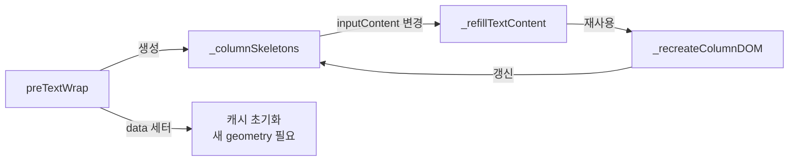
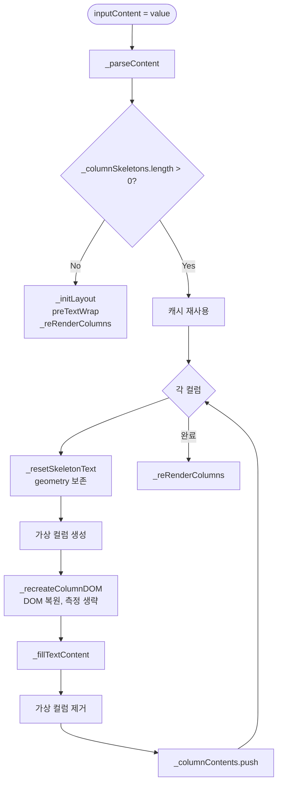
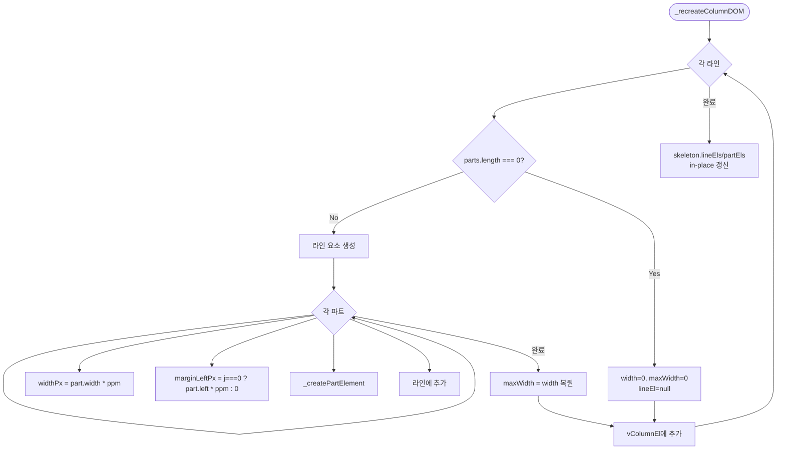
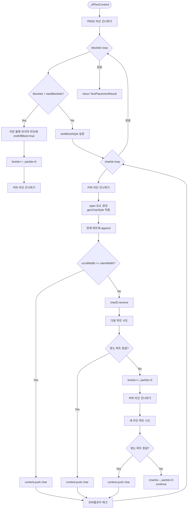

# TextLayoutEngine 상세 명세

> 작성 기준: `src/core/text-layout-engine.ts` 및 관련 타입,
> 컴포넌트, 유틸리티 소스 코드
>
> 본 문서는 `TextLayoutEngine`의 렌더링 파이프라인, 스켈레톤 캐싱, 오버랩 회피,
> 데이터 구조, DOM 계층, 스타일 생성, 측정 단위를 상세히 기술한다.

---

## 1. 개요 (Overview)

`TextLayoutEngine`은 신문 레이아웃 엔진의 핵심 텍스트 래핑 모델이다.
입력된 텍스트를 다중 컬럼 구조에 맞게 줄바꿈하고, 이미지 등 다른 요소와의 겹침을 회피하며,
글자 단위로 DOM에 배치할 수 있는 `TextLineData[][]`를 생성한다.

인스턴스는 `TextLayoutEngine.create(options)` 팩토리 메서드로만 생성할 수 있다. 직접 `new` 사용은 금지되며,
생성자가 `private`이기 때문이다.

```ts
const model = TextLayoutEngine.create({
  content: "...",
  column: 2,
  gap: 3,
  paragraphStyle: { textAlign: 'justify', lineGap: 1.2 },
  textStyle: { widthRatio: 0.95 },
  inheritStyle: { ... },
  paragraphEl: paragraphElement,
  rootNode: shadowRoot,
});
```

핵심 특징:

- 모든 레이아웃 크기는 **mm**(밀리미터) 단위이다.
- `ppm`(pixels-per-mm)을 통해 화면 픽셀로 변환한다.
- 텍스트 래핑은 DOM 기반 측정(`scrollWidth > clientWidth`)으로 수행한다.
- 오버랩 회피는 실제 렌더링된 요소의 `getBoundingClientRect()`를 기준으로 계산한다.
- 스켈레톤 캐싱을 통해 텍스트 내용만 변경될 때 오버랩 측정을 생략하고 빠르게 재배치한다.

---

## 2. 3단계 렌더링 파이프라인

`TextLayoutEngine`은 다음 3단계 파이프라인으로 동작한다.

```mermaid
flowchart TD
    A[입력 콘텐츠] -->|_parseContent| B[TextBlockData[]]
    B -->|_createColumnSkeleton| C[ColumnSkeleton[]<br/>geometry + DOM 요소]
    C -->|_fillTextContent| D[TextLineData[][]<br/>글자 배치 완료]
    D -->|_columnContents| E[LayoutColumnElement.renderText]
```

### 2.1 Phase 1: 파싱 (`_parseContent`)

입력 콘텐츠를 `\n` 단위로 분리하여 `TextBlockData[]`로 변환한다.

- 단순 문자열: `{ content: "..." }`로 래핑 후 분리
- 배열: 각 원소가 `string`이면 `{ content: "..." }`로 변환, `TextBlockData`이면 그대로 사용 후 분리
- 분리된 각 블록은 독립적인 줄바꿈 단위가 된다.

결과는 `this._contents`에 저장된다.

### 2.2 Phase 2: 스켈레톤 생성 (`_createColumnSkeleton`)

컬럼 하나의 라인/파트 구조(geometry)를 생성한다. 텍스트 내용에는 의존하지 않는다.

주요 작업:

1. 라인 요소 생성 → 가상 컬럼에 추가
2. `_applyOverlap()`로 오버랩 감지
3. 오버랩 유형에 따라 처리
4. 라인/파트 DOM 요소와 데이터를 `ColumnSkeleton`에 저장

### 2.3 Phase 3: 텍스트 배치 (`_fillTextContent`)

미리 생성된 스켈레톤에 글자를 하나씩 배치한다.

- 각 글자를 현재 파트에 추가 후 `scrollWidth > clientWidth` 확인
- 파트에 안 맞으면 다음 파트 시도
- 모든 파트에 안 맞으면 다음 라인으로 이동
- 다음 라인에서도 안 맞으면 빈 파트로 진행 후 재시도

---

## 3. `preTextWrap()` 흐름

`preTextWrap()`은 전체 텍스트 래핑을 수행하는 공개 메서드이다.

```mermaid
flowchart TD
    Start([preTextWrap]) --> Parse[_parseContent]
    Parse --> Count{columnCount >= 1?}
    Count -->|No| End1[return]
    Count -->|Yes| Init[캐시 초기화<br/>_columnSkeletons = []<br/>_ppmValues = []]
    Init --> Loop{각 컬럼}
    Loop --> CreateVC[가상 컬럼 생성<br/>x-layout-vcolumn]
    CreateVC --> Measure[ppm 측정<br/>width / columnWidths[i]]
    Measure --> CreateSkel[_createColumnSkeleton]
    CreateSkel --> FillText[_fillTextContent]
    FillText --> RemoveVC[가상 컬럼 제거]
    RemoveVC --> Cache[스켈레톤 + ppm 캐시]
    Cache --> Push[_columnContents.push]
    Push --> Loop
    Loop -->|완료| End2([end])
```

각 컬럼 처리 상세:

1. `x-layout-vcolumn` 생성
2. `index`, `model`, `parentElement` 설정
3. `rootNode`에 삽입
4. `ppm = vColumnEl.getBoundingClientRect().width / columnWidths[curColumn]`
5. `_createColumnSkeleton()`로 스켈레톤 생성
6. `_fillTextContent()`로 텍스트 배치
7. `endOfText`인 경우 마지막 비어있지 않은 라인에 `endOfText = true` 설정
8. 가상 컬럼 제거
9. `_columnSkeletons.push(skeleton)`, `_ppmValues.push(ppm)`
10. `_columnContents.push(skeleton.lines)`

---

## 4. 스켈레톤 캐싱과 텍스트 갱신

스켈레톤 캐싱은 `TextLayoutEngine`의 핵심 성능 최적화 기능이다.

### 4.1 캐시 데이터

```ts
private _columnSkeletons: ColumnSkeleton[] = [];
private _ppmValues: number[] = [];
```

- `_columnSkeletons`: 컬럼별 스켈레톤(라인/파트 geometry + DOM 요소 참조)
- `_ppmValues`: 컬럼별 pixels-per-mm 변환 비율

### 4.2 캐시 수명 주기



### 4.3 텍스트 갱신 흐름 (`_refillTextContent`)

`inputContent` 세터가 호출되면 `_refillTextContent()`가 실행된다.



`_refillTextContent()`의 핵심 차이점:

- `_createColumnSkeleton()` 대신 `_recreateColumnDOM()` 사용
- 오버랩 감지(`getBoundingClientRect`, `checkOverlap`) 생략
- 캐시된 `part.width`, `part.left`를 `ppm`으로 변환하여 파트 복원

### 4.4 `_resetSkeletonText()`

스켈레톤에서 텍스트 관련 데이터만 초기화한다. geometry는 보존한다.

초기화하는 필드:

- `line.textBlockStyle` → `undefined`
- `line.endOfBlock`, `line.endOfText`, `line.firstOfBlock`,
  `line.firstOfText` → `undefined`
- `part.content` → `[]`

보존하는 필드:

- `part.left`, `part.width` (mm 단위)
- `lines` 배열 길이, `parts` 배열 길이

### 4.5 `_recreateColumnDOM()`

캐시된 geometry로부터 line/part DOM 요소를 재생성한다.



---

## 5. 오버랩 회피 메커니즘

### 5.1 개념

이미지 등 다른 요소가 텍스트 영역과 겹칠 때, `TextLayoutEngine`은 두 가지 상황을 구분한다.

- **COVER**: 라인 전체가 덮여 글자를 배치할 수 없음
- **PART**: 라인 일부가 덮임

### 5.2 `_applyOverlap()`

`overlayElements`(부모 박스의 오버랩 요소 + 더 높은 zIndex를 가진 형제 박스)를 순회하며 겹침을 계산한다.

```ts
private _applyOverlap(lineEl: HTMLElement): { cover: boolean; overlapParts:
OverlapParts[] }
```

동작:

1. 각 오버랩 요소에 대해 `getOverlapSizePX(lineEl, el)` 호출
2. `COVERS`가 하나라도 있으면 `cover = true`
3. `PART`면 `overlapParts`에 병합
4. `cover`인 경우 `lineEl.style.width = '0'` 설정
5. `maxWidth`를 `width`와 동일하게 설정

### 5.3 `_computeFreeRegions()`

오버랩 영역의 여집합으로부터 텍스트가 배치될 수 있는 자유 영역을 계산한다.

```ts
private _computeFreeRegions(lineWidth: number, overlapParts: OverlapParts[]):
FreeRegion[]
```

```ts
type FreeRegion = { start: number; end: number }; // pixels
```

알고리즘:

1. 오버랩이 없으면 `[{ start: 0, end: lineWidth }]` 반환
2. 정렬된 overlapParts를 순회하며 `prevEnd`부터 `overlap.x1` 사이 구간을 자유 영역으로 추가
3. `prevEnd`를 `max(prevEnd, overlap.x2)`로 갱신
4. 마지막 오버랩 이후 남은 공간도 자유 영역으로 추가

### 5.4 COVER vs PART 시각적 예시

```text
CASE A: COVER (라인 전체 덮임)

    ┌─────────────────────────────────────┐
    │           TEXT LINE                 │  ← 이미지가 라인 전체를 덮음
    └─────────────────────────────────────┘
              ↓
    lineEl.style.width = '0'
    parts: []
    lineEl: null

CASE B: PART (라인 일부 덮임)

    ┌─────┬───────────┬───────────────────┐
    │FREE │  OVERLAP  │       FREE        │
    │     │  (IMAGE)  │                   │
    └─────┴───────────┴───────────────────┘
      ↑        ↑            ↑
    Part0   covered      Part1
    left=0              left=overlap_end
    width=100           width=200

CASE C: FREE (오버랩 없음)

    ┌─────────────────────────────────────┐
    │           FREE SPACE                │
    └─────────────────────────────────────┘
              ↓
    parts: [{ left: 0, width: lineWidth }]
```

### 5.5 자유 영역 계산 예시

```text
lineWidth = 300px
overlapParts = [{ x1: 80, x2: 120 }, { x1: 200, x2: 240 }]

    0        80   120       200   240     300
    ├────────┤────┤─────────┤────┤───────┤
    │ FREE 1 │OL1 │  FREE 2 │OL2 │ FREE 3│
    └────────┘────┘─────────┘────┘───────┘

freeRegions = [
  { start: 0,   end: 80  },
  { start: 120, end: 200 },
  { start: 240, end: 300 }
]
```

---

## 6. `_createColumnSkeleton()` 상세

### 6.1 흐름

```mermaid
flowchart TD
    Start([_createColumnSkeleton]) --> Init[lines=[], lineEls=[], partEls=[]]
    Init --> Loop{while true}
    Loop --> CreateLine[_createLineElement]
    CreateLine --> AppendLine[vColumnEl에 추가]
    AppendLine --> ApplyOverlap[_applyOverlap]
    ApplyOverlap --> Cover{cover?}
    Cover -->|Yes| PushCover[
        lines.push: parts=[]
        lineEls.push null
        partEls.push []
    ]
    PushCover --> Overflow1{vColumnEl.isOverflow?}
    Overflow1 -->|Yes| Break1[break]
    Overflow1 -->|No| Continue[continue]
    Cover -->|No| Overflow2{vColumnEl.isOverflow?}
    Overflow2 -->|Yes| RemoveLine[lineEl.remove<br/>break]
    Overflow2 -->|No| Compute[_computeFreeRegions]
    Compute --> CreateParts[TextPartData[] 생성]
    CreateParts --> CreatePartEls[파트 DOM 생성]
    CreatePartEls --> BuildLine[파트를 라인에 추가]
    BuildLine --> PushNormal[
        lines.push
        lineEls.push lineEl
        partEls.push curPartEls
    ]
    PushNormal --> Loop
    Break1 --> Return[return ColumnSkeleton]
    RemoveLine --> Return
    Continue --> Loop
```

### 6.2 파트 geometry 계산

```ts
const parts: TextPartData[] = freeRegions.map((region, i) => ({
  content: [],
  left: i === 0
    ? region.start / ppm
    : (region.start - freeRegions[i - 1].end) / ppm,
  width: (region.end - region.start) / ppm,
}));
```

첫 번째 파트의 `left`는 컬럼 시작부터의 거리이다. 이후 파트의 `left`는 이전 자유 영역 끝과의 간격이다.

파트 DOM의 `marginLeft`는 실제 픽셀 간격으로 설정된다.

```ts
const gapPx = i === 0
  ? freeRegions[0].start
  : freeRegions[i].start - freeRegions[i - 1].end;
if (gapPx > 0) partEl.style.marginLeft = `${gapPx}px`;
```

---

## 7. `_fillTextContent()` 글자 배치 알고리즘

### 7.1 흐름



### 7.2 블록 경계 처리

`\n`으로 분리된 각 블록은 새 라인에서 시작한다.

```ts
if (blockIdx > startBlockIdx) {
  // 이전 블록의 마지막 content 라인에 endOfBlock 설정
  for (let i = lineIdx; i >= 0; i--) {
    if (lines[i].parts.some(p => p.content.length > 0)) {
      lines[i].endOfBlock = true;
      break;
    }
  }

  lineIdx++;
  partIdx = 0;
}
```

### 7.3 오버플로우 처리

- 마지막 컬럼이 아닌 경우: 빈 라인 제거 후 다음 컬럼으로
- 마지막 컬럼인 경우: `_overflow++`

```ts
if (vColumnEl.isOverflow) {
  if (!isLastColumn) {
    if (charIdx < block.content.length - 1 &&
        lines[lineIdx].parts.every(p => p.content.length === 0)) {
      lines.splice(lineIdx, 1);
      lineEls.splice(lineIdx, 1);
      partEls.splice(lineIdx, 1);
    }
    break;
  } else {
    this._overflow++;
  }
}
```

### 7.4 반환 값

```ts
type TextPlacementResult = {
  endBlockIdx: number;
  endCharIdx: number;
  endOfText: boolean;
};
```

---

## 8. 데이터 구조

### 8.1 `TextLayoutEngineOptions`

```ts
type TextLayoutEngineOptions = {
  content: string | (string | TextBlockData)[];
  column: number | number[];
  gap: number | number[];
  paragraphStyle: ParagraphStyle;
  textStyle: TextStyle;
  inheritStyle: InheritStyle;
  paragraphEl: LayoutParagraphElement;
  rootNode: Node;
};
```

### 8.2 `ColumnSkeleton`

```ts
type ColumnSkeleton = {
  lines: TextLineData[];              // 라인 데이터 배열
  lineEls: (HTMLDivElement | null)[]; // 라인 DOM 요소 (COVER면 null)
  partEls: HTMLDivElement[][];        // 파트 DOM 요소
};
```

### 8.3 `TextLineData`

```ts
export type TextLineData = {
  firstOfBlock?: boolean;
  firstOfText?: boolean;
  endOfBlock?: boolean;
  endOfText?: boolean;
  parts: TextPartData[];
  textBlockStyle?: TextBlockStyle;
};
```

플래그 조합:

| firstOfBlock | endOfBlock | firstOfText | endOfText | 의미 |
| :---: | :---: | :---: | :---: | ------ |
| ✓ | ✓ | ✓ | ✓ | 전체 텍스트가 한 줄 |
| ✓ | | ✓ | | 첫 블록의 첫 줄 |
| | ✓ | | | 어떤 블록의 마지막 줄 |
| ✓ | | | | 새 블록의 시작 줄 |
| | | | ✓ | 전체 텍스트의 마지막 줄 |

### 8.4 `TextPartData`

```ts
export type TextPartData = {
  content: string[]; // 글자 배열
  left: number;      // mm 단위 좌측 여백
  width: number;     // mm 단위 폭
};
```

### 8.5 `OverlapParts`

```ts
export type OverlapParts = { x1: number; x2: number; };
```

픽셀 단위의 겹침 구간이다.

### 8.6 `FreeRegion`

```ts
type FreeRegion = { start: number; end: number };
```

`_computeFreeRegions()`의 반환 타입. 픽셀 단위이다.

---

## 9. DOM 구조 계층

### 9.1 전체 트리

```text
<x-layout-document>
  └── <x-layout-box>
        └── <x-layout-paragraph>
              ├── #shadow-root
              │     ├── <style>
              │     ├── <slot>
              │     ├── <x-layout-vcolumn>    (임시, 측정 중에만 존재)
              │     │     ├── #shadow-root
              │     │     │     └── <style>
              │     │     └── <div>           (line)
              │     │           └── <div>     (part)
              │     │                 └── <span>  (char)
              │     └── <x-layout-column>
              │           ├── #shadow-root
              │           │     └── <style>
              │           └── <div>           (line)
              │                 └── <div>     (part)
              │                       └── <span>  (char)
              └── (slot을 통해 박스 자식 접근)
```

### 9.2 ASCII 다이어그램

```text
┌─────────────────────────────────────────┐
│      <x-layout-paragraph>               │
│  ┌─────────────────────────────────┐    │
│  │  #shadow-root                   │    │
│  │                                 │    │
│  │  ┌─────────────────────────┐    │    │
│  │  │ <x-layout-vcolumn>      │    │    │
│  │  │  (측정용, 임시)          │    │    │
│  │  │  ┌─────┐ ┌─────┐ ┌────┐ │    │    │
│  │  │  │line │ │line │ │line│ │    │    │
│  │  │  │ ┌─┐ │ │ ┌─┐ │ │ ┌┐ │ │    │    │
│  │  │  │ │p│ │ │ │p│ │ │ │p│ │ │    │    │
│  │  │  │ │┌┐│ │ │ │┌┐│ │ │ └┘ │ │    │    │
│  │  │  │ ││c││ │ │ ││c││ │ │    │ │    │    │
│  │  │  │ │└┘│ │ │ │└┘│ │ │    │ │    │    │
│  │  │  └─────┘ └─────┘ └────┘ │    │    │
│  │  └─────────────────────────┘    │    │
│  │            ↓ 측정 완료 후 제거    │    │
│  │  ┌─────────────────────────┐    │    │
│  │  │ <x-layout-column>       │    │    │
│  │  │  (실제 렌더링)           │    │    │
│  │  │  ┌─────┐ ┌─────┐ ┌────┐ │    │    │
│  │  │  │line │ │line │ │line│ │    │    │
│  │  │  │ ┌─┐ │ │ ┌─┐ │ │ ┌┐ │ │    │    │
│  │  │  │ │p│ │ │ │p│ │ │ │p│ │ │    │    │
│  │  │  │ │┌┐│ │ │ │┌┐│ │ │ └┘ │ │    │    │
│  │  │  │ ││c││ │ │ ││c││ │ │    │ │    │    │
│  │  │  │ │└┘│ │ │ │└┘│ │ │    │ │    │    │
│  │  │  └─────┘ └─────┘ └────┘ │    │    │
│  │  └─────────────────────────┘    │    │
│  └─────────────────────────────────┘    │
└─────────────────────────────────────────┘

legend:
  line = <div>  (flex row)
  p    = <div>  (part, inline-flex)
  c    = <span> (char, inline-block)
```

---

## 10. 스타일 생성

### 10.1 `genColumnStyle(idx)`

컬럼의 absolute positioning 스타일을 생성한다.

```ts
public genColumnStyle(idx: number): Partial<CSSStyleDeclaration>
```

주요 계산:

- `left`: 이전 컬럼들의 너비 + 간격 합
- `width`, `minWidth`, `maxWidth`, `flex`: `columnWidths[idx]`
- `height`, `minHeight`, `maxHeight`: `inheritStyle.parentHeight`
- `justifyContent`: `verticalAlign`에 따라 `center`, `flex-end`, `flex-start`

### 10.2 `genLineStyle(textBlockStyle?)`

줄(line) 요소의 스타일을 생성한다.

```ts
public genLineStyle(textBlockStyle?: TextBlockStyle):
Partial<CSSStyleDeclaration>
```

- `display: 'flex'`, `flexDirection: 'row'`, `flexWrap: 'nowrap'`
- `height`: `_lineHeight` mm
- `fontSize` override가 줄 높이보다 크면 `alignItems: 'center'` 및 높이 조정

### 10.3 `genPartStyle(textBlockStyle?)`

파트(part) 요소의 스타일을 생성한다.

```ts
public genPartStyle(textBlockStyle?: TextBlockStyle):
Partial<CSSStyleDeclaration>
```

- `display: 'inline-flex'`, `flexDirection: 'row'`, `alignItems: 'baseline'`
- `letterSpacing`: em 단위
- `textAlign` → `justify-content` 매핑
  - `'left'` → `flex-start`
  - `'right'` → `flex-end`
  - `'center'` → `center`
  - `'justify'` → `space-between`
- `textBlockStyle`이 있으면 폰트, 크기, 색상, 정렬 오버라이드

### 10.4 `genCharStyle(char)`

글자(char) 요소의 스타일을 생성한다.

```ts
public genCharStyle = (char: string): Partial<CSSStyleDeclaration>
```

- `display: 'inline-block'`
- `maxWidth`: `${widthRatio}em`
- `minWidth`: 공백 `0.15em`, 1바이트 문자 `0.35em`, 그 외 `0.15em`
- `scale`: `${widthRatio} 1` (장평)
- `textAlign`: `'center'`
- `transformOrigin`: `'0'`

---

## 11. 측정 단위

### 11.1 mm와 px의 관계

- 모든 레이아웃 크기는 **mm** 단위이다.
- DOM 요소의 `getBoundingClientRect()`나 `scrollWidth`는 **px** 단위이다.
- `ppm`(pixels-per-mm) = px / mm

### 11.2 ppm 측정

```ts
const ppm = vColumnEl.getBoundingClientRect().width /
this._columnWidths[curColumn];
```

가상 컬럼의 실제 렌더링 너비(px)를 컬럼 너비(mm)로 나누어 구한다.

### 11.3 단위 변환 예시

| mm 값 | ppm | px 값 |
| ------- | ----- | ------- |
| 50 mm | 3.78 | 189 px |
| 30 mm | 3.78 | 113.4 px |
| 100 mm | 3.78 | 378 px |

### 11.4 스켈레톤의 단위

- `TextPartData.left`, `TextPartData.width`: **mm**
- `FreeRegion.start`, `FreeRegion.end`: **px**
- `OverlapParts.x1`, `OverlapParts.x2`: **px**
- DOM 파트 요소의 `width`, `marginLeft`: **px**

---

## 12. 공개 API 참조

### 12.1 정적 메서드

| 메서드 | 설명 |
|--------|------|
| `TextLayoutEngine.create(...)` | 팩토리 메서드. `new` 대신 사용 |

### 12.2 공개 메서드

| 메서드 | 반환 타입 | 설명 |
| -------- | ----------- | ------ |
| `preTextWrap()` | `void` | 전체 텍스트 래핑 수행. `_columnContents` 생성 및 스켈레톤 캐시 |
| `genColumnStyle(idx)` | `Partial<CSSStyleDeclaration>` | 컬럼 absolute |
|                       |                                | positioning 스타일 |
|                       |                                | `left`는 이전 컬럼 |
|                       |                                | 너비+간격 합 |
| `genLineStyle(...)` | `Partial<CSSStyleDeclaration>` | 줄(line) 스타일 |
| `genPartStyle(...)` | `Partial<CSSStyleDeclaration>` | 파트(part) 스타일 |
| `genCharStyle(char: string)` | `Partial<CSSStyleDeclaration>` | 글자(char) 스타일 |

### 12.3 세터

| 세터 | 타입 | 설명 |
| ------ | ------ | ------ |
| `data` | `TextLayoutEngineOptions` | 모델 전체 데이터 설정. 컬럼, 스타일, 콘텐츠 갱신 |
| `inheritStyle` | `InheritStyle` | 상속 스타일 설정. `_initLayout()` 호출 |
| `inputContent` | `string \| ...` | 텍스트 콘텐츠 갱신. 스켈레톤 재사용 또는 전체 재계산 |

### 12.4 게터

| 게터 | 반환 타입 | 설명 |
| ------ | ----------- | ------ |
| `contents` | `TextBlockData[]` | `\n`으로 분리된 텍스트 블록 배열 |
| `inheritStyle` | `InheritStyle` | 상속 스타일 |
| `textStyle` | `TextStyle` | 단락 수준 텍스트 스타일 |
| `paragraphStyle` | `ParagraphStyle` | 단락 레이아웃 스타일 |
| `columnCount` | `number` | 컬럼 수 |
| `columnContents` | `TextLineData[][]` | 컬럼별 줄 데이터. 컬럼 요소가 렌더링에 사용 |
| `gaps` | `number[]` | 컬럼 간 간격(mm) 배열 |
| `lineHeight` | `number` | 줄 높이(mm) |
| `overflow` | `number` | 오버플로우된 줄 수 |
| `widthRatio` | `number` | 장평 비율 |
| `columnWidths` | `number[]` | 컬럼별 너비(mm) 배열 |
| `inputContent` | `string \| (string \| TextBlockData)[]` | 현재 입력 콘텐츠 |

---

## 13. 비공개 메서드 참조

| 메서드 | 설명 |
| -------- | ------ |
| `_initLayout()` | 레이아웃 상태 초기화. |
|  | `_lineHeight` 계산, |
|  | `_columnContents`/`_overflow` |
|  | 리셋 |
| `_createLineElement(textBlockStyle?)` | 줄 DOM 요소 생성 |
| `_createPartElement(widthPx, marginLeftPx)` | 파트 DOM 요소 생성 |
| `_computeFreeRegions(lineWidth, overlapParts)` | 오버랩 영역의 여집합으로 자유 영역 계산 |
| `_applyOverlap(lineEl)` | 오버랩 요소와의 겹침 계산. COVER/PART 판정 |
| `_parseContent()` | 입력 콘텐츠를 `\n` 단위로 분리하여 `_contents` 생성 |
| `_createColumnSkeleton(curColumn, vColumnEl, ppm)` | 컬럼 라인/파트 스켈레톤 생성 |
| `_resetSkeletonText(skeleton)` | 스켈레톤 텍스트 데이터 초기화. geometry 보존 |
| `_recreateColumnDOM(...)` | 캐시된 geometry로 DOM 요소 재생성. 측정 생략 |
| `_fillTextContent(...)` | 스켈레톤에 실제 글자 배치 |
| `_refillTextContent()` | 텍스트 갱신 시 스켈레톤 재사용 또는 폴백 |
| `_reRenderColumns()` | 화면 컬럼 DOM 제거 및 재생성 |

---

## 14. 상수 및 기본값

`src/define/defaults.define.ts`에서 정의된 상수:

| 상수 | 값 | 설명 |
| ------ | ----- | ------ |
| `DEFAULT_FONT_SIZE` | `4` | 기본 글자 크기 (mm) |
| `DEFAULT_LINE_GAP` | `1` | 기본 행간 배율 |
| `DEFAULT_FONT_STYLE` | `'normal'` | 기본 폰트 스타일 |
| `DEFAULT_FONT_WEIGHT` | `400` | 기본 폰트 굵기 |
| `DEFAULT_PPM` | `96 / 25.4` | 기본 pixels-per-mm |

`_lineHeight` 계산:

```ts
const fontSize = this.textStyle?.fontSize || this.inheritStyle?.fontSize ||
DEFAULT_FONT_SIZE;
const lineGap = this.paragraphStyle?.lineGap || this.inheritStyle?.lineGap || DEFAULT_LINE_GAP;
this._lineHeight = fontSize * lineGap;
```

---

## 15. 코드 예시

### 15.1 기본 사용

```ts
const model = TextLayoutEngine.create({
  content: "신문 본문 텍스트입니다.\n두 번째 단락입니다.",
  column: 2,
  gap: 3,
  paragraphStyle: { textAlign: 'justify', lineGap: 1.2 },
  textStyle: { widthRatio: 0.95 },
  inheritStyle: {
    parentWidth: 180,
    parentHeight: 260,
    fontSize: 4,
    fontFamily: 'Myoungjo',
  },
  paragraphEl,
  rootNode,
});

model.preTextWrap();
console.log(model.columnContents);
console.log(model.overflow);
```

### 15.2 텍스트 갱신 (스켈레톤 재사용)

```ts
model.inputContent = "새로운 텍스트입니다.";
// 스켈레톤 캐시가 있으면 geometry 재사용, 텍스트만 재배치
```

---

## 16. 스켈레톤 캐시 라이프사이클 ASCII 다이어그램

```text
[초기 상태]
   _columnSkeletons = []
   _ppmValues = []
          ↓
[preTextWrap() 실행]
   ┌─────────────────────────────┐
   │ 컬럼 0: 스켈레톤 생성 + ppm │
   │ 컬럼 1: 스켈레톤 생성 + ppm │
   │ 컬럼 2: 스켈레톤 생성 + ppm │
   └─────────────────────────────┘
          ↓
   _columnSkeletons = [S0, S1, S2]
   _ppmValues = [ppm0, ppm1, ppm2]
          ↓
[inputContent 변경]
          ↓
[_refillTextContent() 실행]
   ┌─────────────────────────────┐
   │ _resetSkeletonText(S0)      │  ← 텍스트만 초기화
   │ _recreateColumnDOM(S0)      │  ← geometry 재사용
   │ _fillTextContent(S0)        │  ← 새 텍스트 배치
   │ _resetSkeletonText(S1)      │
   │ _recreateColumnDOM(S1)      │
   │ _fillTextContent(S1)        │
   │ ...                         │
   └─────────────────────────────┘
          ↓
   _columnSkeletons = [S0', S1', S2']
   (geometry 동일, content만 갱신)
          ↓
[data 세터 호출]
   캐시 초기화 → 다음 preTextWrap()에서 새 스켈레톤 생성
```

---

## 17. 오버랩 회피 상세 다이어그램

### 17.1 이미지와 라인의 수직/수평 관계

```text
컬럼 (가상 컬럼)
┌────────────────────────────────────────┐
│ line 0  ┌────────────────────────┐     │
│         │                        │     │
│ line 1  │      IMAGE BOX         │     │
│         │      (zIndex 높음)     │     │
│ line 2  │                        │     │
│         └────────────────────────┘     │
│ line 3                               │
│ line 4                               │
└────────────────────────────────────────┘

line 0: FREE → parts = [{ left:0, width:colWidth }]
line 1: COVER → parts = [], width=0
line 2: COVER → parts = [], width=0
line 3: PART  → parts = [{left:0, width:x1}, {left:x2, width:colWidth-x2}]
line 4: FREE  → parts = [{ left:0, width:colWidth }]
```

### 17.2 픽셀 단위 겹침 탐지 (`getOverlapSizePX`)

이미지 요소인 경우 캔버스 픽셀 데이터를 사용하여 불투명 픽셀이 있는 열을 탐지한다.

```text
baseElement (line)        targetElement (image box)
┌─────────────────┐       ┌─────────────────────┐
│                 │       │                     │
│    ┌────────────┼───────┼────┐                │
│    │            │       │    │                │
│    │  겹치는 영역│       │    │                │
│    │            │       │    │                │
│    └────────────┼───────┼────┘                │
│                 │       │                     │
└─────────────────┘       └─────────────────────┘
        ↑
   intersectionStart, intersectionEnd
        ↑
   relStart = intersectionStart - r1.left
   relEnd   = intersectionEnd - r1.left
```

불투명 픽셀이 있는 열을 연속 구간으로 그룹화하여 `OverlapParts[]`를 생성한다.

---

## 18. `_refillTextContent()`와 `preTextWrap()` 비교

| 항목 | `preTextWrap()` | `_refillTextContent()` |
| ------ | ----------------- | ------------------------ |
| 캐시 사용 여부 | 캐시 초기화 후 새로 생성 | 기존 캐시 재사용 |
| 오버랩 측정 | `_applyOverlap()` 사용 | 생략 |
| 자유 영역 계산 | `_computeFreeRegions()` 사용 | 생략 |
| DOM 측정 | `getBoundingClientRect()` 사용 | 캐시된 mm × ppm 사용 |
| `_createColumnSkeleton()` | 호출 | 미호출 |
| `_recreateColumnDOM()` | 미호출 | 호출 |
| `_resetSkeletonText()` | 미호출 | 호출 |
| `_fillTextContent()` | 호출 | 호출 |
| 사용 시점 | 초기 렌더링, data 세터 후 | `inputContent` 변경 시 |

---

## 19. 연관 컴포넌트와의 관계

### 19.1 `LayoutParagraphElement`

- `layout()`에서 `TextLayoutEngine.create()` 또는 `model.data = ...` 호출
- `render()`에서 `model.preTextWrap()` 호출
- `render()`에서 `columnContents` 길이만큼 `<x-layout-column>` 생성
- `overlayElements` 게터가 `_applyOverlap()`에 사용될 오버랩 요소 제공

### 19.2 `LayoutColumnElement`

- `connectedCallback()`에서 `renderText()` 호출
- `renderText()`에서 `model.columnContents[index]`로 줄 데이터 획득
- `genColumnStyle()`, `genLineStyle()`, `genPartStyle()`, `genCharStyle()` 사용
- 마지막 파트 + `endOfBlock`이면 `justify-content: flex-start`로 조정
- 양 끝 공백 제거

### 19.3 `LayoutVirtualColumnElement`

- `preTextWrap()`과 `_refillTextContent()`에서 임시로 생성
- `isOverflow`로 컬럼 높이 초과 여부 감지
- 측정 완료 후 제거됨

---

## 20. 주의사항 및 제약

- `TextLayoutEngine`은 `create()`로만 인스턴스화해야 한다.
- `preTextWrap()`과 `_fillTextContent()`는 가상 컬럼이 실제 DOM에 삽입된 상태에서 호출해야 한다.
- 이미지 오버랩 탐지는 `LayoutImageElement.canvas`가 존재할 때만 픽셀 수준으로 수행한다.
- 텍스트 오버플로우는 마지막 컬럼에서 `_overflow`로 집계되며 `render-error` 이벤트로 통지된다.

---

## 21. 텍스트 정렬별 오버랩 회피 유효성

오버랩 회피와 텍스트 래핑은 `textAlign` 값(정렬 방식)과 무관하게 동일하게 동작한다.
이 섹션에서는 왜 모든 정렬(`left`, `right`, `center`, `justify`)에서 이미지 회피와 오버플로우 감지가 올바르게 작동하는지 설명한다.

### 21.1 오버랩 회피는 정렬과 무관하다

`_applyOverlap()`과 `_computeFreeRegions()`는 모두 **물리적 픽셀 좌표**를 기준으로 계산된다.

```ts
private _applyOverlap(lineEl: HTMLElement): { cover: boolean; overlapParts: OverlapParts[] }
private _computeFreeRegions(lineWidth: number, overlapParts: OverlapParts[]): FreeRegion[]
```

- `_applyOverlap()`은 `getBoundingClientRect()`로 라인과 이미지의 실제 렌더링 영역을 측정한다.
- `_computeFreeRegions()`은 겹침 구간의 여집합을 기하학적으로 계산한다.
- 두 메서드 모두 `textAlign`, `justifyContent`와 같은 정렬 속성을 읽지 않는다.

따라서 동일한 이미지와 동일한 텍스트 내용이라면, `textAlign`이 `left`이든 `right`이든, `center`이든 `justify`이든 생성되는 `TextPartData`의 `left`과 `width` 값은 동일하다.

### 21.2 scrollWidth 기반 오버플로우 감지도 정렬과 무관하다

`_fillTextContent()`에서 글자 하나를 추가한 뒤 다음 조건으로 초과 여부를 판단한다.

```ts
if (partEls[currentPartIdx].scrollWidth > partEls[currentPartIdx].clientWidth) {
  charEl.remove();
  // 다음 파트 시도 ...
}
```

`scrollWidth`는 자식 요소들의 **전체 레이아웃 너비 합계**를 반환한다.
`justifyContent`는 플렉스 컨테이너 내부에서 자식의 시각적 배치만 조정할 뿐, 자식의 총 너비나 `scrollWidth`를 변경하지 않는다.

즉, `space-between`이든 `center`이든 `flex-end`이든 같은 글자들이 들어 있으면 `scrollWidth`는 같다.
그러므로 `scrollWidth > clientWidth` 검사는 모든 정렬에서 동일한 결과를 낸다.

또한 글자 배치 순서는 항상 **왼쪽에서 오른쪽**이다. 정렬은 배치가 끝난 뒤 CSS로 시각적으로만 이동시키므로 래핑 결과에 영향을 주지 않는다.

### 21.3 정렬은 어디에서 적용되는가

정렬은 모델이 아니라 렌더링 단계에서 `genPartStyle()`과 `LayoutColumnElement.renderText()`가 생성하는 CSS에 반영된다.

#### `genPartStyle()`의 매핑

| textAlign | justifyContent |
| :-------- | :------------- |
| `left`    | `flex-start`   |
| `right`   | `flex-end`     |
| `center`  | `center`       |
| `justify` | `space-between` |

`textBlockStyle?.textAlign`이 명시되면 그 값으로 `justifyContent`가 재정의된다.

#### `LayoutColumnElement.renderText()`의 마지막 줄 처리

블록의 마지막 줄(`endOfBlock`)이면 일부 정렬에 대해 시각적 조정이 추가된다.

```ts
let partJustify = curPartStyle.justifyContent;
if (p === line.parts.length - 1 && endOfBlock && partJustify === 'space-between') {
  partJustify = 'flex-start';  // justify: 마지막 줄은 왼쪽 정렬
}
switch (textBlockStyle?.textAlign) {
  case 'center': partJustify = 'center'; break;  // center: 그대로 유지
  case 'right': partJustify = 'flex-end'; break; // right: 그대로 유지
  default: break;
}
```

| textAlign | 마지막 줄 처리 | 시각적 결과 |
| :-------- | :------------- | :---------- |
| `left`    | 재정의 없음 (`flex-start`) | 마지막 줄 왼쪽 정렬 |
| `right`   | `flex-end`로 명시 유지 | 마지막 줄 오른쪽 정렬 |
| `center`  | `center`로 명시 유지 | 마지막 줄 가운데 정렬 |
| `justify` | `space-between` → `flex-start` | 마지막 줄 왼쪽 정렬 |

이 조정은 모두 래핑이 완료된 뒤 **CSS 시각 정렬**만 바꾸는 것이다. `TextPartData.content`에 들어 있는 글자 배열과 파트의 `width` 값은 변하지 않는다.

### 21.4 정렬별 오버랩 예시

아래 예시는 동일한 이미지와 동일한 텍스트를 두고, 정렬만 바꿨을 때 렌더링이 어떻게 달라지는지 보여준다.
파트 경계(자유 영역)는 모두 동일하고, 글자 배치도 동일하다. 달라지는 것은 파트 내부에서 글자가 정렬되는 위치뿐이다.

```text
textAlign = 'left' (flex-start)

컬럼
┌────────────────────────────────────────┐
│ line 0  ┌──────────┐                   │
│         │  IMAGE   │ 텍스트 텍스트     │
│ line 1  │          │                   │
│ line 2  └──────────┘ 텍스트            │
│ line 3                               │
└────────────────────────────────────────┘

텍스트는 항상 자유 영역 안에서 왼쪽부터 배치된다.
```

```text
textAlign = 'right' (flex-end)

컬럼
┌────────────────────────────────────────┐
│ line 0  ┌──────────┐           텍스트 │
│         │  IMAGE   │ 텍스트           │
│ line 1  │          │                  │
│ line 2  └──────────┘      텍스트      │
│ line 3                               │
└────────────────────────────────────────┘

같은 자유 영역 안에서 글자가 오른쪽으로 밀린다.
```

```text
textAlign = 'center'

컬럼
┌────────────────────────────────────────┐
│ line 0  ┌──────────┐     텍스트       │
│         │  IMAGE   │   텍스트 텍스트  │
│ line 1  │          │                  │
│ line 2  └──────────┘    텍스트       │
│ line 3                               │
└────────────────────────────────────────┘

같은 자유 영역 안에서 글자가 가운데로 배치된다.
```

```text
textAlign = 'justify' (space-between)

컬럼
┌────────────────────────────────────────┐
│ line 0  ┌──────────┐ 텍스트    텍스트│
│         │  IMAGE   │                  │
│ line 1  │          │ 텍스트           │
│ line 2  └──────────┘ 텍스트    텍스트 │
│ line 3                               │
└────────────────────────────────────────┘

자유 영역의 양끝에 글자가 붙고, 중간 공백이 늘어난다.
```

모든 경우에 이미지와 겹치는 영역(COVER/PART)은 완전히 동일하게 계산되며, 텍스트는 그 영역을 피해서만 배치된다.

### 21.5 정렬 영향 요약

| 관심사 | 정렬에 영향받는가 | 이유 |
| :----- | :--------------- | :--- |
| 오버랩 영역 계산 | 아니오 | `_applyOverlap()`이 `getBoundingClientRect()`로 물리 좌표만 사용 |
| 자유 영역 분할 | 아니오 | `_computeFreeRegions()`이 기하 여집합만 계산 |
| 글자 래핑 | 아니오 | `scrollWidth > clientWidth`는 자식 총 너비를 측정, `justifyContent`와 무관 |
| 글자 배치 순서 | 아니오 | 항상 왼쪽에서 오른쪽으로 추가 |
| 파트의 `left` / `width` | 아니오 | 스켈레톤 geometry는 정렬과 무관 |
| 시각적 정렬 위치 | 예 | `genPartStyle()`의 `justifyContent` 매핑과 `renderText()`의 오버라이드 |
| 마지막 줄 처리 | 예 | `justify`일 때만 `flex-start`로 강제 |

결론적으로, TextLayoutEngine의 핵심 기능인 오버랩 회피와 텍스트 래핑은 어떤 `textAlign` 값이 오든 정확하게 동작한다. 정렬은 최종 렌더링 단계에서 시각적 위치만 바꾼다.
