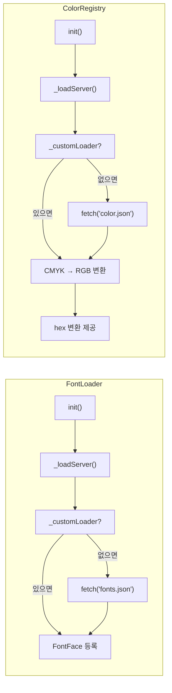
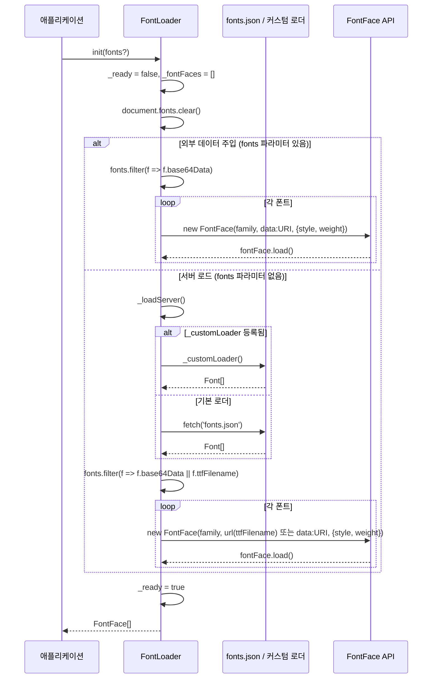
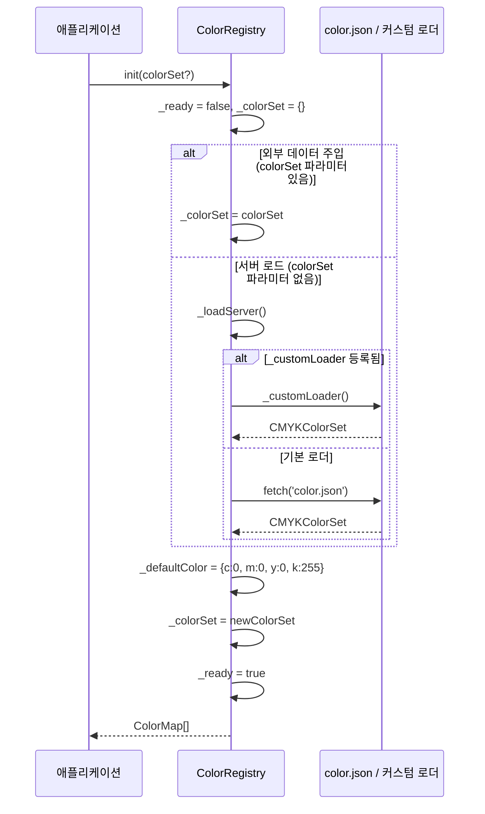
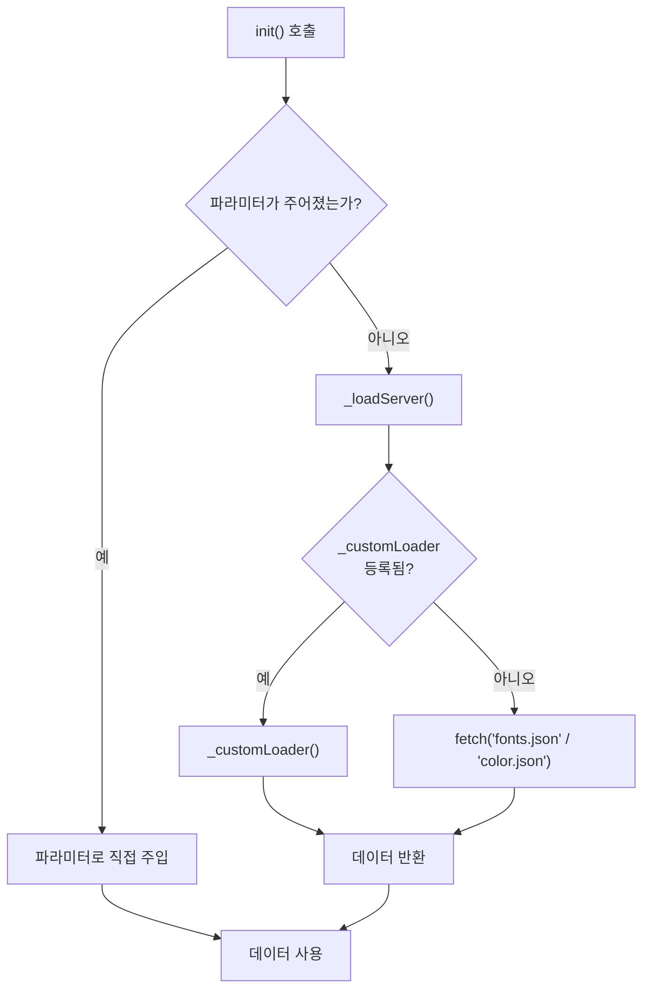
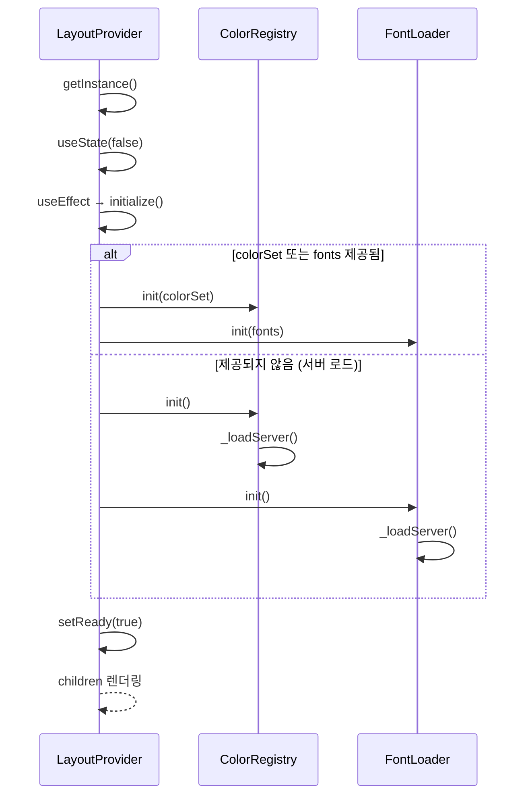

# FontLoader & ColorRegistry 상세 명세


> 작성 기준: `src/resource/font-loader.ts`, `src/resource/color-registry.ts`, `src/react/context.tsx`, `src/types/style/font.type.ts`, `src/types/print/color-map.type.ts`
>
> 본 문서는 `FontLoader`와 `ColorRegistry`의 아키텍처, 초기화 흐름, 커스텀 로더 등록, 외부 데이터 주입, React 연동, 공개 API를 상세히 기술한다.

---

## 1. 개요 (Overview)

`FontLoader`와 `ColorRegistry`는 `layout-element`의 리소스 관리 싱글톤이다. 각각 폰트 메타데이터와 CMYK 색상 데이터를 로드하여 브라우저에 등록한다.

두 매니저는 동일한 패턴을 따른다:

- **싱글톤**: `getInstance()`로 유일한 인스턴스를 반환한다.
- **초기화 필요**: 렌더링 전에 반드시 `init()`을 호출하고 대기해야 한다.
- **단일 로딩 경로**: 기본적으로 `_loadServer()`를 통해 `fonts.json` / `color.json`을 `fetch`하며, 외부 데이터 주입이 필요하면 `init(fonts)` / `init(colorSet)` 파라미터로 직접 전달한다.
- **커스텀 로더 등록**: `registerLoader()`로 기본 `fetch` 동작을 대체할 수 있다.



---

## 2. FontLoader

### 2.1 역할

`FontLoader`는 폰트 메타데이터를 로드하고, `FontFace` API로 브라우저에 폰트를 등록하는 싱글톤 매니저이다.

- **기본 로드**: `fonts.json` (또는 커스텀 로더)에서 `Font[]`를 가져오고, 각 폰트의 `ttfFilename` 또는 `base64Data`를 이용해 `FontFace`를 생성하여 브라우저에 등록한다.
- **외부 데이터 주입**: `init(fonts)`로 `Font[]`를 직접 주입할 수 있다. 이 경우 `_loadServer()`를 호출하지 않으며, `base64Data`가 있으면 `data:` URI로 `FontFace`를 생성한다.
- **외부 데이터 미사용 시**: `init()`을 `fonts` 없이 호출하면 `_loadServer()`로 데이터를 가져온다.

스타일 필드(`TextStyle.fontFamily`, `TextBlockStyle.fontFamily`)에서 지정하는 폰트 패밀리값은 `FontLoader.getFontFamily()`를 통해 `Font.family`와 매칭되어 실제 `FontFace.family`로 변환된다. 일치하는 `family`가 없으면 등록된 첫 번째 폰트로 폴백된다. CSS `font-family` 키워드(`"serif"`, `"sans-serif"` 등)는 사용할 수 없다.

### 2.2 `Font` 타입

```ts
type Font = {
  /**
   * 폰트 패밀리명 (예: "Myoungjo", "Noto Sans KR").
   * 이 값이 스타일 필드(`TextStyle.fontFamily` 등)에서 참조하는 식별자이다.
   */
  family: string;

  /** 폰트 굵기 (400, 700 등) */
  weight: number;

  /** 폰트 스타일 */
  style: 'normal' | 'italic';

  /** TTF 파일명 (서버에서 로드할 때 사용) */
  ttfFilename?: string;

  /** Base64 인코딩된 폰트 데이터 (인라인 로드용) */
  base64Data?: string;
};
```

- `ttfFilename`: 서버 로드 시 `FontFace`의 `src`에 URL로 사용된다.
- `base64Data`: 외부 데이터 주입 또는 서버 로드 시 `FontFace`의 `src`에 `data:` URI로 사용된다.
- `family`: 스타일 필드의 `fontFamily` 값이 참조하는 키이다. `FontLoader.getFontFamily(name)`이 일치하는 `family`를 찾아 실제 `FontFace.family`를 반환한다.

### 2.3 `FontLoaderFn` 타입

```ts
type FontLoaderFn = () => Promise<Font[]>;
```

`FontLoader.registerLoader()`로 등록할 커스텀 로더의 시그니처이다. `Font[]`를 반환하는 비동기 함수여야 한다.

### 2.4 초기화 흐름



### 2.5 커스텀 로더 등록

`FontLoader.registerLoader()`를 사용하면 기본 `fetch('fonts.json')` 대신 외부 API나 다른 소스에서 폰트 데이터를 가져올 수 있다.

```ts
// 커스텀 API에서 폰트 데이터 로드
FontLoader.registerLoader(async () => {
  const res = await fetch('/api/v1/fonts');
  if (!res.ok) throw new Error('failed to load fonts');
  return res.json() as Promise<Font[]>;
});

// 기본 로더로 복귀
FontLoader.resetLoader();
```

**등록 시점**: `init()` 호출 전에 `registerLoader()`를 호출해야 다음 초기화 시 반영된다. 이미 인스턴스가 존재하더라도 정적 필드이므로 즉시 적용된다.

**외부 데이터 주입과의 관계**: `init(fonts)`로 폰트 데이터를 직접 주입하면 `_loadServer()`가 호출되지 않는다. 커스텀 로더는 서버 로드 경로에서만 사용된다.

### 2.6 공개 API

#### 정적 메서드

| 메서드 | 시그니처 | 설명 |
|--------|----------|------|
| `getInstance()` | `() => FontLoader` | 싱글톤 인스턴스를 반환한다. 처음 호출 시 인스턴스를 생성한다. |
| `registerLoader(loader)` | `(loader: FontLoaderFn) => void` | 커스텀 폰트 로더를 등록한다. 다음 `init()` 호출부터 기본 `fetch('fonts.json')` 대신 사용된다. |
| `resetLoader()` | `() => void` | 등록된 커스텀 로더를 제거하고 기본 로더로 되돌린다. |

#### 인스턴스 메서드

| 메서드 | 시그니처 | 설명 |
|--------|----------|------|
| `init(fonts?)` | `(fonts?: Font[]) => Promise<FontFace[]>` | 폰트를 로드하고 브라우저에 등록한다. `fonts`를 직접 주입하면 외부 데이터 주입 경로를 사용하고, 생략하면 `_loadServer()`로 데이터를 가져온다. **이미 초기화된 상태에서 동일한 폰트 데이터로 재호출하면 스킵하고 기존 `_fontFaces`를 그대로 반환한다.** 동일성 판단은 `_computeFontsSignature()`로 생성한 signature 문자열 비교를 통해 수행한다. `fonts` 파라미터 없이 호출한 경우에는 signature 비교가 불가능하므로 항상 재로드한다. **폰트 메트릭 파싱**: `init()` 완료 후 `base64Data`가 있는 폰트를 파싱하여 캐싱한다. `ParagraphEngine._charWidthMm`이 사용한다. |
| `getFontFamily(fontName?)` | `(fontName?: string) => string` | 폰트 패밀리명을 반환한다. 등록된 `Font` 중 `family`가 `fontName`과 일치하는 폰트를 찾아 해당 `FontFace.family`를 반환한다. 일치하는 폰트가 없으면 등록된 첫 번째 폰트의 `FontFace.family`로 폴백된다. |

#### 게터

| 게터 | 타입 | 설명 |
|------|------|------|
| `fontFaces` | `FontFace[]` | 등록된 `FontFace` 배열을 반환한다. `ready`가 `true`가 아니면 에러를 던진다. |
| `ready` | `boolean` | 초기화 완료 여부. `init()`이 성공하면 `true`가 된다. |

### 2.7 중복 초기화 스킵

`init()`은 이미 `_ready === true`인 상태에서 동일한 폰트 데이터로 재호출되면 `document.fonts.clear()` 및 `FontFace` 재생성을 스킵하고 기존 `_fontFaces`를 그대로 반환한다.

- **Signature 비교**: `_computeFontsSignature(fonts)`는 각 폰트의 `family`/`weight`/`style`/`ttfFilename`/`base64Data`를 결합한 문자열을 생성하며, 이전 호출 시 저장한 `_lastFontsSignature`와 비교한다.
- **스킵 조건**: `_ready === true` && `fonts !== undefined` && `_computeFontsSignature(fonts) === _lastFontsSignature`.
- **서버 로드**: `init()`을 `fonts` 없이 호출하면 signature 비교가 불가능하므로 항상 재로드한다. 단, 재로드 후 `_lastFontsSignature`가 갱신되므로 이후 동일한 `fonts`를 인자로 넘겨 호출하면 스킵된다.
- **외부 데이터 주입**: `init(fonts)`로 폰트를 주입하면 signature 비교가 항상 가능하다. 같은 `fonts` 배열로 재호출하면 스킵된다.

### 2.8 에러 처리

- `init()` 호출 전 `getFontFamily()`, `fontFaces`에 접근하면 `'font map is not ready'` 에러가 발생한다.
- `fetch` 실패 또는 커스텀 로더 예외 시 `'server connection error'` 에러가 발생한다.

### 2.9 폰트 메트릭 파싱 (opentype.js 연동)

> **파싱된 메트릭이 텍스트 레이아웃 중 어떻게 캐싱/재사용되는지는 `docs/PERFORMANCE.md`를 참조.**

`FontLoader`는 opentype.js를 필수 의존성으로 사용한다. `ParagraphEngine._charWidthMm`이 폰트 메트릭 테이블에서 직접 advance width를 읽어 환경에 무관한 측정 결과를 보장한다.

- **정적 import**: `opentype.js`는 번들에 포함되어 항상 사용 가능하다. IIFE 빌드에 포함되며, React ESM 빌드에도 포함된다.
- **파싱**: `_parseFonts()`가 `base64Data`가 있는 폰트를 `opentype.parse()`로 파싱하여 `Map<family, ParsedFont>`에 캐싱한다. `ttfFilename` 경로의 폰트도 fetch 후 파싱한다.
- **조회**: `getParsedFont(fontName?)`이 파싱된 폰트 객체를 반환한다. 파싱 실패/해당 폰트 누락 시 `null`을 반환하며, 호출자(`ParagraphEngine._charWidthMmFromFont`)는 `minWidthMm` 바닥값으로 폴백한다. (외부 API가 아닌 내부용 메서드)
- **패키지 의존**: `opentype.js`는 `peerDependencies`로 선언되어 있다. 사용처 프로젝트에서 반드시 설치해야 한다.

---

## 3. ColorRegistry

### 3.1 역할

`ColorRegistry`는 CMYK 색상 데이터를 로드하고 RGB로 변환하여 제공하는 싱글톤 레지스트리이다.

- **기본 로드**: `color.json` (또는 커스텀 로더)에서 `CMYKColorSet`을 가져와 내부에 보관한다.
- **외부 데이터 주입**: `init(colorSet)`으로 외부에서 주입한 `CMYKColorSet`을 직접 사용한다.

스타일 필드(`TextStyle.color`, `TextBlockStyle.color`, `BoxData.backgroundColor`, `BoxData.borderColor`)에서 지정하는 색상값은 `ColorRegistry.getCSSColor()`를 통해 `#RRGGBB` hex 문자열로 변환된다. 여기서 `{name}`은 `CMYKColorSet`에 등록된 키(색상 이름)이어야 한다. 등록되지 않은 이름이나 CSS 색상 문자열(`#000`, `rgb(...)`)을 넣으면 기본 색상 hex로 폴백되어 의도한 색상이 나오지 않는다. 예: `backgroundColor: "red"` → `#FF0000`로 렌더링.

배경색 투명도는 `BoxData.backgroundOpacity`(0~1)로 지정하며, `ColorRegistry.getOpacityHex(opacity)`가 2자리 hex alpha(`00`~`FF`)로 변환한다. `getCSSColor()` 반환값 뒤에 결합하여 `#RRGGBBAA` 8자리 hex로 적용한다.

### 3.2 `CMYKColorSet` 및 관련 타입

```ts
type CMYKColor = {
  c: number;  // Cyan (0-255)
  m: number;  // Magenta (0-255)
  y: number;  // Yellow (0-255)
  k: number;  // Key/Black (0-255)
};

type CMYKColorSet = Record<string, CMYKColor>;

type RGBColor = {
  r: number;  // Red (0-255)
  g: number;  // Green (0-255)
  b: number;  // Blue (0-255)
};

type ColorMap = {
  rgb: RGBColor;
  cmyk: CMYKColor;
};
```

- `CMYKColorSet`의 키는 색상 이름(예: `"red"`, `"blue"`)이다. 이 키가 스타일 필드(`TextStyle.color`, `BoxData.backgroundColor` 등)의 색상값으로 사용된다.
- `CMYKColor`의 각 값은 0-255 범위이다.
- `RGBColor`의 각 값은 0-255 범위이다.

### 3.3 `ColorLoaderFn` 타입

```ts
type ColorLoaderFn = () => Promise<CMYKColorSet>;
```

`ColorRegistry.registerLoader()`로 등록할 커스텀 로더의 시그니처이다. `CMYKColorSet`를 반환하는 비동기 함수여야 한다.

### 3.4 초기화 흐름



### 3.5 커스텀 로더 등록

`ColorRegistry.registerLoader()`를 사용하면 기본 `fetch('color.json')` 대신 외부 API나 다른 소스에서 색상 데이터를 가져올 수 있다.

```ts
// 커스텀 API에서 색상 데이터 로드
ColorRegistry.registerLoader(async () => {
  const res = await fetch('/api/v1/colors');
  if (!res.ok) throw new Error('failed to load colors');
  return res.json() as Promise<CMYKColorSet>;
});

// 기본 로더로 복귀
ColorRegistry.resetLoader();
```

**등록 시점**: `init()` 호출 전에 `registerLoader()`를 호출해야 다음 초기화 시 반영된다. 이미 인스턴스가 존재하더라도 정적 필드이므로 즉시 적용된다.

**외부 데이터 주입과의 관계**: `init(colorSet)`으로 색상 데이터를 직접 주입하면 `_loadServer()`가 호출되지 않는다. 커스텀 로더는 서버 로드 경로에서만 사용된다.

### 3.6 CMYK → RGB 변환

`_cmykToRgb()`는 CMYK 값을 RGB로 변환한다.

```ts
_cmykToRgb(cmyk?: CMYKColor): RGBColor
```

변환 공식 (표준 인쇄 변환):

```
c_ = clamp(c / 255, 0, 1)
m_ = clamp(m / 255, 0, 1)
y_ = clamp(y / 255, 0, 1)
k_ = clamp(k / 255, 0, 1)

r = round(255 * (1 - c_) * (1 - k_))
g = round(255 * (1 - m_) * (1 - k_))
b = round(255 * (1 - y_) * (1 - k_))
```

- `cmyk`가 생략되면 `_defaultColor`({ c: 0, m: 0, y: 0, k: 255 }, K100 검정)를 사용한다.
- 검은 잉크(k)가 포함된 중간 톤도 올바르게 변환된다 (예: C128 + K128 → R64).

### 3.7 색상 변환 및 적용

`init()`은 로드한 `CMYKColorSet`을 내부에 보관하고, `getCSSColor(name)` 호출 시 해당 색상을 CMYK → RGB → `#RRGGBB` hex로 변환하여 반환한다. 스타일시트에 CSS 변수를 주입하지 않는다 — 런타임에서 `getCSSColor()`가 직접 hex를 반환한다.

**`'default'` 색상 이름 사용 금지**: `getCSSColor('default')` / `get('default')`는 `Error`를 throw한다. 외부 코드는 명시적인 색상 이름을 사용해야 한다.

```
getCSSColor('red')     → '#FF0000'  (예시)
getCSSColor('blue')    → '#0000FF'  (예시)
getCSSColor('default') → throw Error  (사용 금지)
```

- 런타임 색상 적용: `getCSSColor(name)` → `#RRGGBB` hex 직접 반환
- 투명도 결합: `getCSSColor(name) + getOpacityHex(opacity)` → `#RRGGBBAA` 8자리 hex
- 기본 색상: 등록되지 않은 이름 폴백 시 `_defaultColor`(K100 검정) 사용
- SSR/테스트 환경에서도 stylesheet 접근 없이 `getCSSColor()`/`colorMap`이 동작한다 (데이터는 `_colorSet` 기반으로 동작).

### 3.8 공개 API

#### 정적 메서드

| 메서드 | 시그니처 | 설명 |
|--------|----------|------|
| `getInstance()` | `() => ColorRegistry` | 싱글톤 인스턴스를 반환한다. 처음 호출 시 인스턴스를 생성한다. |
| `registerLoader(loader)` | `(loader: ColorLoaderFn) => void` | 커스텀 색상 로더를 등록한다. 다음 `init()` 호출부터 기본 `fetch('color.json')` 대신 사용된다. |
| `resetLoader()` | `() => void` | 등록된 커스텀 로더를 제거하고 기본 로더로 되돌린다. |

#### 인스턴스 메서드

| 메서드 | 시그니처 | 설명 |
|--------|----------|------|
| `init(colorSet?)` | `(colorSet?: CMYKColorSet) => Promise<ColorMap[]>` | 색상을 로드하여 내부에 보관한다. `colorSet`을 직접 주입하면 외부 데이터 주입 경로를 사용하고, 생략하면 `_loadServer()`로 데이터를 가져온다. `getCSSColor()` 호출 시 CMYK → RGB → hex 변환을 수행한다. |
| `getCSSColor(name)` | `(name: string) => string` | `#RRGGBB` hex 문자열을 반환한다. `name`이 `CMYKColorSet`에 등록된 키이면 해당 색상의 hex, 등록되지 않은 이름(또는 CSS 색상 문자열)이면 기본 색상(K100 검정) hex로 폴백된다. **`name === 'default'`인 경우 `Error`를 throw한다.** `getOpacityHex()`로 생성한 alpha hex를 뒤에 결합하여 `#RRGGBBAA` 형태로 투명도를 적용할 수 있다. |
| `getOpacityHex(opacity)` | `(opacity: number) => string` | 0~1 투명도 값을 2자리 hex alpha 문자열(`00`~`FF`)로 변환한다. 범위를 벗어나면 clamp 처리된다. `getCSSColor()` 반환값 뒤에 결합하여 사용한다. |
| `get(name)` | `(name: string) => CMYKColor` | 색상 이름으로 CMYK 값을 반환한다. 등록되지 않은 이름이면 `_defaultColor`({ c: 0, m: 0, y: 0, k: 255 }, K100 검정)를 반환한다. **`name === 'default'`인 경우 `Error`를 throw한다.** |

#### 게터

| 게터 | 타입 | 설명 |
|------|------|------|
| `colorMap` | `ColorMap[]` | 모든 등록된 색상의 RGB-CMYK 쌍 배열. 마지막 요소는 항상 기본 색상이다. `ready`가 `true`가 아니면 에러를 던진다. |
| `ready` | `boolean` | 초기화 완료 여부. `init()`이 성공하면 `true`가 된다. |

### 3.9 에러 처리

- `init()` 호출 전 `getCSSColor()`, `get()`, `colorMap`에 접근하면 `'color map is not ready'` 에러가 발생한다.
- `fetch` 실패 또는 커스텀 로더 예외 시 `'server connection error'` 에러가 발생한다.

---

## 4. 로더 등록 패턴 비교

두 매니저는 동일한 커스텀 로더 등록 패턴을 사용한다.

| 항목 | FontLoader | ColorRegistry |
|------|-----------|---------------|
| 로더 타입 | `FontLoaderFn` (`() => Promise<Font[]>`) | `ColorLoaderFn` (`() => Promise<CMYKColorSet>`) |
| 정적 필드 | `_customLoader?: FontLoaderFn` | `_customLoader?: ColorLoaderFn` |
| 등록 메서드 | `FontLoader.registerLoader(loader)` | `ColorRegistry.registerLoader(loader)` |
| 제거 메서드 | `FontLoader.resetLoader()` | `ColorRegistry.resetLoader()` |
| 기본 로더 | `fetch('fonts.json')` | `fetch('color.json')` |
| 우선순위 | `_customLoader` → 기본 `fetch` | `_customLoader` → 기본 `fetch` |
| 외부 데이터 주입 | `init(fonts)` 직접 주입 | `init(colorSet)` 직접 주입 |
| 외부 데이터 주입 시 `_loadServer` 호출 | 아니오 | 아니오 |

### 4.1 로더 선택 흐름



---

## 5. React 연동 (`LayoutProvider`)

`LayoutProvider`는 React 컨텍스트로 두 매니저의 초기화를 관리한다.

### 5.1 `LayoutProviderProps`

```ts
interface LayoutProviderProps {
  colorSet?: CMYKColorSet;  // 외부에서 주입할 색상 데이터
  fonts?: Font[];           // 외부에서 주입할 폰트 데이터
  children: ReactNode;
}
```

- `colorSet`과 `fonts`를 생략하면 `_loadServer()`로 데이터를 가져온다.
- `colorSet`이나 `fonts`를 제공하면 외부 데이터 주입으로 처리하고, `init(colorSet)` / `init(fonts)`로 직접 주입한다.

### 5.2 초기화 흐름



### 5.3 컨텍스트 값

```ts
interface LayoutContextValue {
  ready: boolean;                    // 초기화 완료 여부
  error: Error | null;               // 초기화 에러
  colorRegistry: ColorRegistry;      // 색상 레지스트리 인스턴스
  fontLoader: FontLoader;            // 폰트 로더 인스턴스
}
```

### 5.4 `useLayoutContext()`

```ts
function useLayoutContext(): LayoutContextValue
```

`LayoutProvider` 내부에서만 호출 가능하다. 외부에서 호출하면 `'useLayoutContext must be used within a LayoutProvider'` 에러가 발생한다.

---

## 6. 커스텀 로더 사용 예시

### 6.1 기본: 커스텀 API 엔드포인트

```ts
import { FontLoader, ColorRegistry } from 'layout-element';

// 커스텀 API 엔드포인트에서 데이터 로드
FontLoader.registerLoader(async () => {
  const res = await fetch('/api/v1/fonts');
  if (!res.ok) throw new Error('failed to load fonts');
  return res.json() as Promise<Font[]>;
});

ColorRegistry.registerLoader(async () => {
  const res = await fetch('/api/v1/colors');
  if (!res.ok) throw new Error('failed to load colors');
  return res.json() as Promise<CMYKColorSet>;
});

// init()은 자동으로 커스텀 로더를 사용
const fontLoader = FontLoader.getInstance();
await fontLoader.init();

const colorRegistry = ColorRegistry.getInstance();
await colorRegistry.init();
```

### 6.2 React에서 커스텀 로더 사용

```tsx
import { FontLoader, ColorRegistry } from 'layout-element';
import { LayoutProvider } from 'layout-element/react';

// 앱 진입점에서 등록
FontLoader.registerLoader(async () => {
  const res = await fetch(`${API_BASE}/fonts`);
  return res.json();
});

ColorRegistry.registerLoader(async () => {
  const res = await fetch(`${API_BASE}/colors`);
  return res.json();
});

function App() {
  return (
    <LayoutProvider>
      <MyLayout />
    </LayoutProvider>
  );
}
```

### 6.3 동적 로더 교체

```ts
// 개발 환경에서는 로컬 JSON, 프로덕션에서는 API
if (import.meta.env.DEV) {
  FontLoader.registerLoader(async () => {
    const res = await fetch('/fonts.json');
    return res.json();
  });
} else {
  FontLoader.registerLoader(async () => {
    const res = await fetch('https://api.example.com/fonts');
    return res.json();
  });
}

// 언제든 기본 로더로 복귀 가능
FontLoader.resetLoader();
```

### 6.4 로더에서 데이터 가공

```ts
ColorRegistry.registerLoader(async () => {
  const res = await fetch('/api/colors?format=rgb');
  const rgbColors = await res.json() as Array<{ name: string; r: number; g: number; b: number }>;

  // RGB → CMYK 변환 후 CMYKColorSet 반환
  const colorSet: CMYKColorSet = {};
  for (const { name, r, g, b } of rgbColors) {
    colorSet[name] = rgbToCmyk(r, g, b);
  }
  return colorSet;
});
```

### 6.5 외부 데이터 주입

```tsx
import { LayoutProvider } from 'layout-element/react';

// 외부에서 데이터를 직접 주입하면 서버 fetch를 생략할 수 있다
function InjectedLayout({ injectedFonts, injectedColors }) {
  return (
    <LayoutProvider fonts={injectedFonts} colorSet={injectedColors}>
      <MyContent />
    </LayoutProvider>
  );
}
```

> **참고**: `init(fonts)` / `init(colorSet)`으로 데이터를 직접 주입하면 `_loadServer()`가 실행되지 않으므로, 커스텀 로더는 사용되지 않는다.

---

## 7. 주의사항 및 제약

- **초기화 순서**: `FontLoader.getInstance().init()`과 `ColorRegistry.getInstance().init()`은 렌더링 전에 반드시 호출되고 완료되어야 한다. `ready`가 `true`가 되기 전에 `getFontFamily()`, `fontFaces`, `getCSSColor()`, `get()`, `colorMap`에 접근하면 에러가 발생한다.
- **`getFontFamily()` 폴백**: `getFontFamily(fontName)`는 등록된 `Font` 중 `family`가 `fontName`과 일치하는 폰트를 찾아 해당 `FontFace.family`를 반환한다. 일치하는 폰트가 없으면 등록된 첫 번째 폰트의 `FontFace.family`로 폴백된다. CSS `font-family` 키워드(`"serif"` 등)는 등록된 `family`가 아니므로 폴백된다.
- **`getCSSColor()` 폴백**: `getCSSColor(name)`는 `name`이 `CMYKColorSet`에 등록된 키인 경우에만 해당 색상의 `#RRGGBB` hex를 반환하고, 그 외의 모든 값(등록되지 않은 이름, CSS 색상 문자열 `#000`/`rgb(...)` 등)은 기본 색상 hex로 폴백된다. 스타일 필드에는 등록된 색상 이름만 사용해야 한다.
- **`getOpacityHex()` 범위**: 0~1 범위를 벗어나는 값은 clamp 처리된다(음수 → `00`, 1 초과 → `FF`). `getCSSColor()`가 반환한 `#RRGGBB` hex 뒤에 결합하여 `#RRGGBBAA` 8자리 hex 색상을 만든다.
- **stylesheet 미의존**: `ColorRegistry`는 `document.styleSheets`에 접근하지 않는다. `init()`은 `CMYKColorSet`을 내부에 보관만 하며, `getCSSColor()`가 호출 시점에 CMYK → RGB → `#RRGGBB` hex 변환을 수행한다. SSR/테스트 환경에서도 `_ready = true`로 설정되어 `getCSSColor()`/`colorMap`이 정상 동작한다.
- **커스텀 로더 에러**: 커스텀 로더에서 예외가 발생하면 `init()`이 해당 에러를 그대로 전파한다. 호출자가 `try/catch`로 처리해야 한다.
- **정적 필드**: `_customLoader`는 정적 필드이므로, `FontLoader.registerLoader()` / `ColorRegistry.registerLoader()`는 인스턴스가 없는 상태에서도 호출할 수 있다. 등록된 로더는 모든 인스턴스에 영향을 미친다.
- **로더 재등록**: `registerLoader()`를 여러 번 호출하면 마지막에 등록한 로더가 사용된다. 이전 로더는 덮어쓰기된다.
- **`resetLoader()`**: `resetLoader()`를 호출하면 커스텀 로더가 제거되고, 다음 `init()` 시 기본 `fetch` 동작으로 돌아간다.
