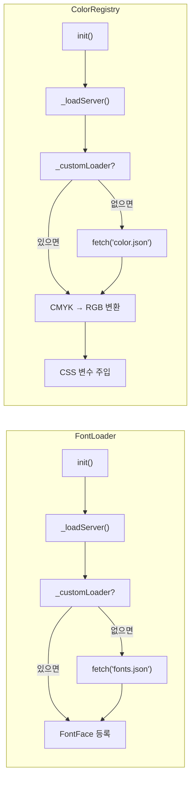
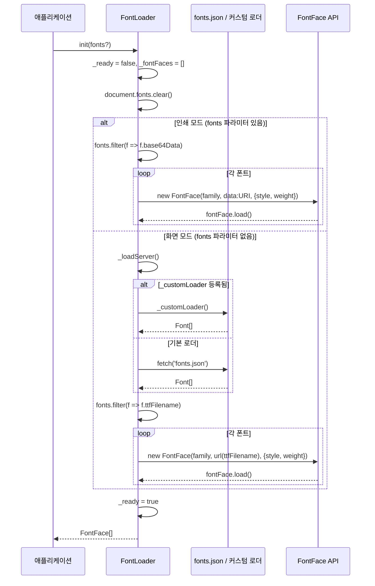
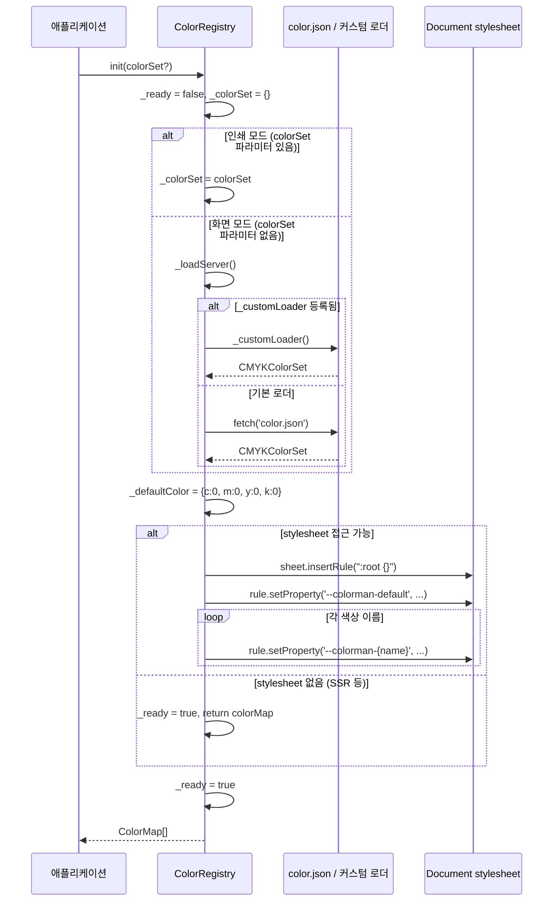
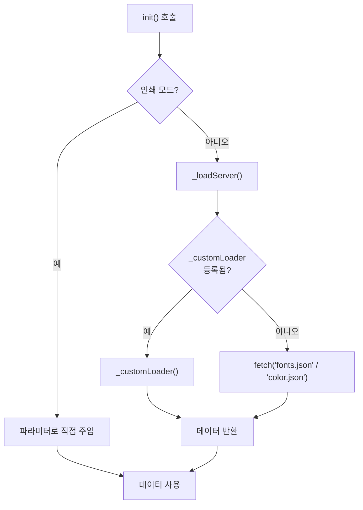
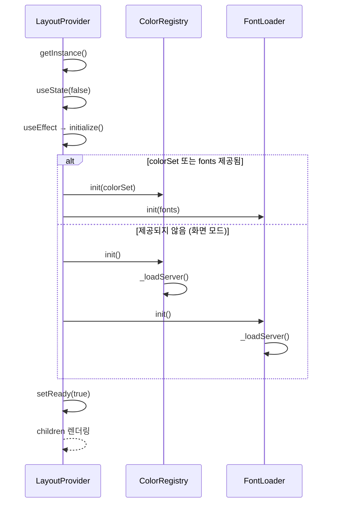

# FontLoader & ColorRegistry 상세 명세

> 작성 기준: `src/resource/font-loader.ts`, `src/resource/color-registry.ts`, `src/react/context.tsx`, `src/types/style/font.type.ts`, `src/types/print/color-map.type.ts`
>
> 본 문서는 `FontLoader`와 `ColorRegistry`의 아키텍처, 초기화 흐름, 커스텀 로더 등록, 인쇄 모드 대응, React 연동, 공개 API를 상세히 기술한다.

---

## 1. 개요 (Overview)

`FontLoader`와 `ColorRegistry`는 `layout-element`의 리소스 관리 싱글톤이다. 각각 폰트 메타데이터와 CMYK 색상 데이터를 로드하여 브라우저에 등록한다.

두 매니저는 동일한 패턴을 따른다:

- **싱글톤**: `getInstance()`로 유일한 인스턴스를 반환한다.
- **초기화 필요**: 렌더링 전에 반드시 `init()`을 호출하고 대기해야 한다.
- **이중 로딩 모드**: 화면 모드에서는 서버(`fonts.json` / `color.json`)에서 `fetch`하고, 인쇄 모드에서는 외부에서 직접 데이터를 주입한다.
- **커스텀 로더 등록**: `registerLoader()`로 기본 `fetch` 동작을 대체할 수 있다.



---

## 2. FontLoader

### 2.1 역할

`FontLoader`는 폰트 메타데이터를 로드하고, `FontFace` API로 브라우저에 폰트를 등록하는 싱글톤 매니저이다.

- **화면 모드**: `fonts.json` (또는 커스텀 로더)에서 `Font[]`를 가져오고, 각 폰트의 `ttfFilename`을 이용해 `FontFace`를 생성하여 브라우저에 등록한다.
- **인쇄 모드**: 외부에서 주입한 `Font[]`의 `base64Data`를 이용해 `data:` URI로 `FontFace`를 생성한다. 서버 요청을 하지 않는다.

### 2.2 `Font` 타입

```ts
type Font = {
  /** 폰트 패밀리명 (예: "Noto Sans KR") */
  family: string;

  /** 폰트 굵기 (400, 700 등) */
  weight: number;

  /** 폰트 스타일 */
  style: 'normal' | 'italic';

  /** TTF 파일명 (서버에서 로드할 때 사용) */
  ttfFilename?: string;

  /** Base64 인코딩된 폰트 데이터 (인라인 로드용) */
  base64Data?: string;
};
```

- `ttfFilename`: 화면 모드에서 `FontFace`의 `src`에 URL로 사용된다.
- `base64Data`: 인쇄 모드에서 `FontFace`의 `src`에 `data:` URI로 사용된다.

### 2.3 `FontLoaderFn` 타입

```ts
type FontLoaderFn = () => Promise<Font[]>;
```

`FontLoader.registerLoader()`로 등록할 커스텀 로더의 시그니처이다. `Font[]`를 반환하는 비동기 함수여야 한다.

### 2.4 초기화 흐름



### 2.5 커스텀 로더 등록

`FontLoader.registerLoader()`를 사용하면 기본 `fetch('fonts.json')` 대신 외부 API나 다른 소스에서 폰트 데이터를 가져올 수 있다.

```ts
// 커스텀 API에서 폰트 데이터 로드
FontLoader.registerLoader(async () => {
  const res = await fetch('/api/v1/fonts');
  if (!res.ok) throw new Error('failed to load fonts');
  return res.json() as Promise<Font[]>;
});

// 기본 로더로 복귀
FontLoader.resetLoader();
```

**등록 시점**: `init()` 호출 전에 `registerLoader()`를 호출해야 다음 초기화 시 반영된다. 이미 인스턴스가 존재하더라도 정적 필드이므로 즉시 적용된다.

**인쇄 모드와의 관계**: 인쇄 모드에서는 `init(fonts)`로 데이터를 직접 주입하므로 `_loadServer()`가 호출되지 않는다. 커스텀 로더는 화면 모드에서만 의미가 있다.

### 2.6 공개 API

#### 정적 메서드

| 메서드 | 시그니처 | 설명 |
|--------|----------|------|
| `getInstance()` | `() => FontLoader` | 싱글톤 인스턴스를 반환한다. 처음 호출 시 인스턴스를 생성한다. |
| `registerLoader(loader)` | `(loader: FontLoaderFn) => void` | 커스텀 폰트 로더를 등록한다. 다음 `init()` 호출부터 기본 `fetch('fonts.json')` 대신 사용된다. |
| `resetLoader()` | `() => void` | 등록된 커스텀 로더를 제거하고 기본 로더로 되돌린다. |

#### 인스턴스 메서드

| 메서드 | 시그니처 | 설명 |
|--------|----------|------|
| `init(fonts?)` | `(fonts?: Font[]) => Promise<FontFace[]>` | 폰트를 로드하고 브라우저에 등록한다. 인쇄 모드에서는 `fonts`를 직접 주입받는다. 화면 모드에서는 `_loadServer()`로 데이터를 가져온다. |
| `getFontFamily(_fontFamily?)` | `(_fontFamily?: string) => string` | 폰트 패밀리명을 반환한다. 현재는 항상 `'Myoungjo'`를 반환한다. `_fontFamily` 파라미터는 향후 매핑 구현을 위해 예약되어 있다. |

#### 게터

| 게터 | 타입 | 설명 |
|------|------|------|
| `fontFaces` | `FontFace[]` | 등록된 `FontFace` 배열을 반환한다. `ready`가 `true`가 아니면 에러를 던진다. |
| `ready` | `boolean` | 초기화 완료 여부. `init()`이 성공하면 `true`가 된다. |

### 2.7 에러 처리

- `init()` 호출 전 `getFontFamily()`, `fontFaces`에 접근하면 `'font map is not ready'` 에러가 발생한다.
- 인쇄 모드에서 `fonts` 파라미터 없이 `init()`을 호출하면 `'not given fonts'` 에러가 발생한다.
- `fetch` 실패 또는 커스텀 로더 예외 시 `'server connection error'` 에러가 발생한다.

---

## 3. ColorRegistry

### 3.1 역할

`ColorRegistry`는 CMYK 색상 데이터를 로드하고 RGB로 변환하여 CSS 변수로 문서에 주입하는 싱글톤 레지스트리이다.

- **화면 모드**: `color.json` (또는 커스텀 로더)에서 `CMYKColorSet`을 가져오고, 각 색상을 RGB로 변환하여 `:root`에 CSS 변수(`--colorman-{name}`)로 주입한다.
- **인쇄 모드**: 외부에서 주입한 `CMYKColorSet`을 직접 사용한다.

컴포넌트에서 `backgroundColor: "red"`처럼 CMYK 이름을 사용하면, 해당 CSS 변수로 렌더링된다.

### 3.2 `CMYKColorSet` 및 관련 타입

```ts
type CMYKColor = {
  c: number;  // Cyan (0-100)
  m: number;  // Magenta (0-100)
  y: number;  // Yellow (0-100)
  k: number;  // Key/Black (0-100)
};

type CMYKColorSet = Record<string, CMYKColor>;

type RGBColor = {
  r: number;  // Red (0-255)
  g: number;  // Green (0-255)
  b: number;  // Blue (0-255)
};

type ColorMap = {
  rgb: RGBColor;
  cmyk: CMYKColor;
};
```

- `CMYKColorSet`의 키는 색상 이름(예: `"red"`, `"blue"`)이다.
- `CMYKColor`의 각 값은 0-100 범위이다.
- `RGBColor`의 각 값은 0-255 범위이다.

### 3.3 `ColorLoaderFn` 타입

```ts
type ColorLoaderFn = () => Promise<CMYKColorSet>;
```

`ColorRegistry.registerLoader()`로 등록할 커스텀 로더의 시그니처이다. `CMYKColorSet`를 반환하는 비동기 함수여야 한다.

### 3.4 초기화 흐름



### 3.5 커스텀 로더 등록

`ColorRegistry.registerLoader()`를 사용하면 기본 `fetch('color.json')` 대신 외부 API나 다른 소스에서 색상 데이터를 가져올 수 있다.

```ts
// 커스텀 API에서 색상 데이터 로드
ColorRegistry.registerLoader(async () => {
  const res = await fetch('/api/v1/colors');
  if (!res.ok) throw new Error('failed to load colors');
  return res.json() as Promise<CMYKColorSet>;
});

// 기본 로더로 복귀
ColorRegistry.resetLoader();
```

**등록 시점**: `init()` 호출 전에 `registerLoader()`를 호출해야 다음 초기화 시 반영된다. 이미 인스턴스가 존재하더라도 정적 필드이므로 즉시 적용된다.

**인쇄 모드와의 관계**: 인쇄 모드에서는 `init(colorSet)`로 데이터를 직접 주입하므로 `_loadServer()`가 호출되지 않는다. 커스텀 로더는 화면 모드에서만 의미가 있다.

### 3.6 CMYK → RGB 변환

`_cmykToRgb()`는 CMYK 값을 RGB로 변환한다.

```ts
_cmykToRgb(cmyk?: CMYKColor): RGBColor
```

변환 공식:

```
c_ = clamp(c / 100, 0, 1)
m_ = clamp(m / 100, 0, 1)
y_ = clamp(y / 100, 0, 1)
k_ = clamp(k / 100, 0, 1)

r = round(255 * (1 - min(1, c_ + k_)))
g = round(255 * (1 - min(1, m_ + k_)))
b = round(255 * (1 - min(1, y_ + k_)))
```

- `cmyk`가 생략되면 `_defaultColor`({ c: 0, m: 0, y: 0, k: 0 })를 사용한다.
- `min(1, ...)`으로 1을 넘지 않도록 클램프한다.

### 3.7 CSS 변수 주입

`init()`은 문서의 첫 번째 스타일시트에 `:root` 규칙을 추가하고, 각 색상을 CSS 변수로 주입한다.

```
--colorman-default  →  #FFFFFF  (CMYK 0,0,0,0 → RGB 255,255,255)
--colorman-red      →  #FF0000  (예시)
--colorman-blue     →  #0000FF  (예시)
```

- 변수명 형식: `--colorman-{name}`
- 기본 색상: `--colorman-default`
- 스타일시트에 접근할 수 없는 환경(SSR, 테스트)에서는 CSS 변수 주입을 건너뛰고 `_ready = true`로 설정한다. `colorMap` 게터로 데이터 자체는 접근 가능하다.

### 3.8 공개 API

#### 정적 메서드

| 메서드 | 시그니처 | 설명 |
|--------|----------|------|
| `getInstance()` | `() => ColorRegistry` | 싱글톤 인스턴스를 반환한다. 처음 호출 시 인스턴스를 생성한다. |
| `registerLoader(loader)` | `(loader: ColorLoaderFn) => void` | 커스텀 색상 로더를 등록한다. 다음 `init()` 호출부터 기본 `fetch('color.json')` 대신 사용된다. |
| `resetLoader()` | `() => void` | 등록된 커스텀 로더를 제거하고 기본 로더로 되돌린다. |

#### 인스턴스 메서드

| 메서드 | 시그니처 | 설명 |
|--------|----------|------|
| `init(colorSet?)` | `(colorSet?: CMYKColorSet) => Promise<ColorMap[]>` | 색상을 로드하고 CSS 변수를 주입한다. 인쇄 모드에서는 `colorSet`을 직접 주입받는다. 화면 모드에서는 `_loadServer()`로 데이터를 가져온다. |
| `getCSSColor(name)` | `(name: string) => string` | CSS 변수 형태의 색상을 반환한다. 등록된 색상이면 `var(--colorman-{name})`, 아니면 `var(--colorman-default)`. |
| `get(name)` | `(name: string) => CMYKColor` | 색상 이름으로 CMYK 값을 반환한다. 등록되지 않은 이름이면 `_defaultColor`({ c: 0, m: 0, y: 0, k: 0 })를 반환한다. |

#### 게터

| 게터 | 타입 | 설명 |
|------|------|------|
| `colorMap` | `ColorMap[]` | 모든 등록된 색상의 RGB-CMYK 쌍 배열. 마지막 요소는 항상 기본 색상이다. `ready`가 `true`가 아니면 에러를 던진다. |
| `ready` | `boolean` | 초기화 완료 여부. `init()`이 성공하면 `true`가 된다. |

### 3.9 에러 처리

- `init()` 호출 전 `getCSSColor()`, `get()`, `colorMap`에 접근하면 `'color map is not ready'` 에러가 발생한다.
- 인쇄 모드에서 `colorSet` 파라미터 없이 `init()`을 호출하면 `'not given color set'` 에러가 발생한다.
- `fetch` 실패 또는 커스텀 로더 예외 시 `'server connection error'` 에러가 발생한다.

---

## 4. 로더 등록 패턴 비교

두 매니저는 동일한 커스텀 로더 등록 패턴을 사용한다.

| 항목 | FontLoader | ColorRegistry |
|------|-----------|---------------|
| 로더 타입 | `FontLoaderFn` (`() => Promise<Font[]>`) | `ColorLoaderFn` (`() => Promise<CMYKColorSet>`) |
| 정적 필드 | `_customLoader?: FontLoaderFn` | `_customLoader?: ColorLoaderFn` |
| 등록 메서드 | `FontLoader.registerLoader(loader)` | `ColorRegistry.registerLoader(loader)` |
| 제거 메서드 | `FontLoader.resetLoader()` | `ColorRegistry.resetLoader()` |
| 기본 로더 | `fetch('fonts.json')` | `fetch('color.json')` |
| 우선순위 | `_customLoader` → 기본 `fetch` | `_customLoader` → 기본 `fetch` |
| 인쇄 모드 | `init(fonts)` 직접 주입 | `init(colorSet)` 직접 주입 |
| 인쇄 모드 시 `_loadServer` 호출 | 아니오 | 아니오 |

### 4.1 로더 선택 흐름



---

## 5. React 연동 (`LayoutProvider`)

`LayoutProvider`는 React 컨텍스트로 두 매니저의 초기화를 관리한다.

### 5.1 `LayoutProviderProps`

```ts
interface LayoutProviderProps {
  colorSet?: CMYKColorSet;  // 인쇄 모드용 색상 데이터
  fonts?: Font[];           // 인쇄 모드용 폰트 데이터
  children: ReactNode;
}
```

- `colorSet`과 `fonts`를 생략하면 화면 모드로 동작하며, 각 매니저가 `_loadServer()`로 데이터를 가져온다.
- `colorSet`이나 `fonts`를 제공하면 인쇄 모드로 간주하고, `init(colorSet)` / `init(fonts)`로 직접 주입한다.

### 5.2 초기화 흐름



### 5.3 컨텍스트 값

```ts
interface LayoutContextValue {
  ready: boolean;                    // 초기화 완료 여부
  error: Error | null;               // 초기화 에러
  colorRegistry: ColorRegistry;      // 색상 레지스트리 인스턴스
  fontLoader: FontLoader;            // 폰트 로더 인스턴스
}
```

### 5.4 `useLayoutContext()`

```ts
function useLayoutContext(): LayoutContextValue
```

`LayoutProvider` 내부에서만 호출 가능하다. 외부에서 호출하면 `'useLayoutContext must be used within a LayoutProvider'` 에러가 발생한다.

---

## 6. 커스텀 로더 사용 예시

### 6.1 기본: 커스텀 API 엔드포인트

```ts
import { FontLoader, ColorRegistry } from 'layout-element';

// 커스텀 API 엔드포인트에서 데이터 로드
FontLoader.registerLoader(async () => {
  const res = await fetch('/api/v1/fonts');
  if (!res.ok) throw new Error('failed to load fonts');
  return res.json() as Promise<Font[]>;
});

ColorRegistry.registerLoader(async () => {
  const res = await fetch('/api/v1/colors');
  if (!res.ok) throw new Error('failed to load colors');
  return res.json() as Promise<CMYKColorSet>;
});

// init()은 자동으로 커스텀 로더를 사용
const fontLoader = FontLoader.getInstance();
await fontLoader.init();

const colorRegistry = ColorRegistry.getInstance();
await colorRegistry.init();
```

### 6.2 React에서 커스텀 로더 사용

```tsx
import { FontLoader, ColorRegistry } from 'layout-element';
import { LayoutProvider } from 'layout-element/react';

// 앱 진입점에서 등록
FontLoader.registerLoader(async () => {
  const res = await fetch(`${API_BASE}/fonts`);
  return res.json();
});

ColorRegistry.registerLoader(async () => {
  const res = await fetch(`${API_BASE}/colors`);
  return res.json();
});

function App() {
  return (
    <LayoutProvider>
      <MyLayout />
    </LayoutProvider>
  );
}
```

### 6.3 동적 로더 교체

```ts
// 개발 환경에서는 로컬 JSON, 프로덕션에서는 API
if (import.meta.env.DEV) {
  FontLoader.registerLoader(async () => {
    const res = await fetch('/fonts.json');
    return res.json();
  });
} else {
  FontLoader.registerLoader(async () => {
    const res = await fetch('https://api.example.com/fonts');
    return res.json();
  });
}

// 언제든 기본 로더로 복귀 가능
FontLoader.resetLoader();
```

### 6.4 로더에서 데이터 가공

```ts
ColorRegistry.registerLoader(async () => {
  const res = await fetch('/api/colors?format=rgb');
  const rgbColors = await res.json() as Array<{ name: string; r: number; g: number; b: number }>;

  // RGB → CMYK 변환 후 CMYKColorSet 반환
  const colorSet: CMYKColorSet = {};
  for (const { name, r, g, b } of rgbColors) {
    colorSet[name] = rgbToCmyk(r, g, b);
  }
  return colorSet;
});
```

### 6.5 인쇄 모드에서 데이터 주입

```tsx
import { LayoutProvider } from 'layout-element/react';

// 인쇄 모드에서는 커스텀 로더 대신 직접 데이터 주입
function PrintLayout({ printFonts, printColors }) {
  return (
    <LayoutProvider fonts={printFonts} colorSet={printColors}>
      <PrintContent />
    </LayoutProvider>
  );
}
```

> **참고**: 인쇄 모드에서 `init(fonts)` / `init(colorSet)`을 호출하면 `_loadServer()`가 실행되지 않으므로, 커스텀 로더는 사용되지 않는다.

---

## 7. 주의사항 및 제약

- **초기화 순서**: `FontLoader.getInstance().init()`과 `ColorRegistry.getInstance().init()`은 렌더링 전에 반드시 호출되고 완료되어야 한다. `ready`가 `true`가 되기 전에 `getFontFamily()`, `fontFaces`, `getCSSColor()`, `get()`, `colorMap`에 접근하면 에러가 발생한다.
- **`getFontFamily()` 하드코딩**: 현재 `getFontFamily()`는 인수와 관계없이 항상 `'Myoungjo'`를 반환한다. 폰트 패밀리 매핑은 구현되지 않았다.
- **stylesheet 접근 불가**: `ColorRegistry.init()`은 `document.styleSheets[0]`에 접근할 수 없는 환경(SSR, 테스트)에서도 `_ready = true`로 설정한다. `colorMap` 게터로 데이터에 접근할 수 있지만, CSS 변수는 주입되지 않는다.
- **커스텀 로더 에러**: 커스텀 로더에서 예외가 발생하면 `init()`이 해당 에러를 그대로 전파한다. 호출자가 `try/catch`로 처리해야 한다.
- **정적 필드**: `_customLoader`는 정적 필드이므로, `FontLoader.registerLoader()` / `ColorRegistry.registerLoader()`는 인스턴스가 없는 상태에서도 호출할 수 있다. 등록된 로더는 모든 인스턴스에 영향을 미친다.
- **로더 재등록**: `registerLoader()`를 여러 번 호출하면 마지막에 등록한 로더가 사용된다. 이전 로더는 덮어쓰기된다.
- **`resetLoader()`**: `resetLoader()`를 호출하면 커스텀 로더가 제거되고, 다음 `init()` 시 기본 `fetch` 동작으로 돌아간다.
- **인쇄 모드 감지**: `window.matchMedia("print").matches`로 인쇄 모드를 감지한다. 이 값은 생성자에서 한 번만 평가된다.