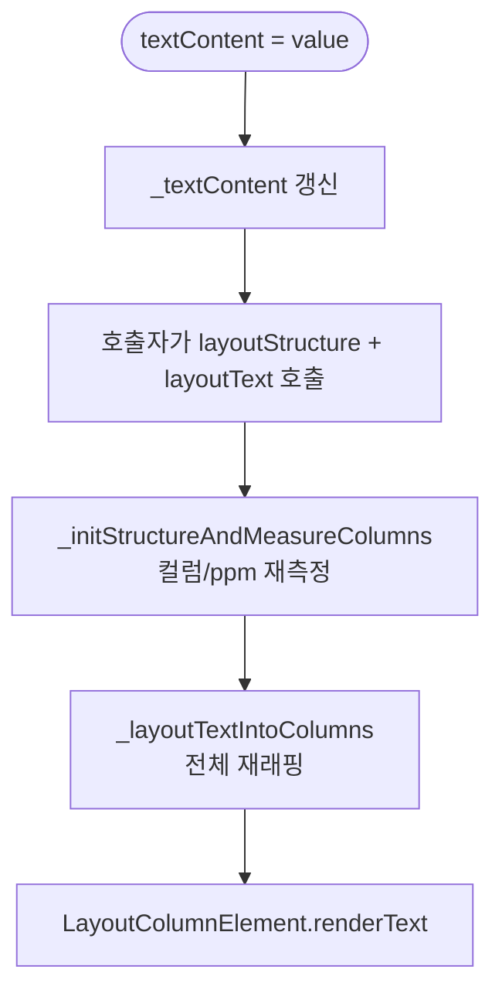
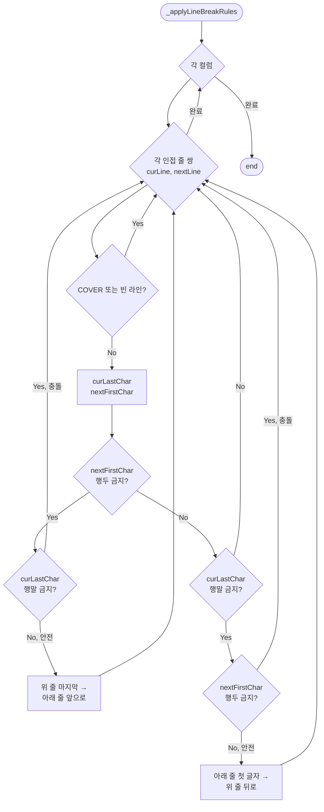

# ParagraphEngine 상세 명세


> 작성 기준: `src/engine/paragraph-engine.ts` 및 관련 타입, 컴포넌트, 유틸리티 소스 코드
>
> 본 문서는 `ParagraphEngine`의 렌더링 파이프라인, 텍스트 측정, 오버랩 회피, 데이터 구조, DOM 계층, 스타일 생성, 공개 API를 상세히 기술한다.

---

## 1. 개요 (Overview)

`ParagraphEngine`은 신문 레이아웃 엔진의 핵심 텍스트 래핑 모델이다.
입력된 텍스트를 다중 컬럼 구조에 맞게 줄바꿈하고, 이미지 등 다른 요소와의 겹침을 회피하며,
글자 단위로 DOM에 배치할 수 있는 `TextLineData[][]`를 생성한다.

인스턴스는 `ParagraphEngine.create(data)` 팩토리 메서드로만 생성할 수 있다. 직접 `new` 사용은 금지되며,
생성자가 `private`이기 때문이다.

```ts
const model = ParagraphEngine.create({
  content: "...",
  column: 2,
  gap: 3,
  paragraphStyle: { textAlign: 'justify', lineGap: 1.2 },
  textStyle: { widthRatio: 0.95 },
  inheritStyle: { ... },
  overlayEngines: [...],
  parentAbsRect: { left: 0, top: 0, width: 180, height: 260 },
  resources: { ppm: 3.78, parsedFonts: ... },
});
```

핵심 특징:

- 모든 레이아웃 크기는 **mm**(밀리미터) 단위이다.
- `ppm`(pixels-per-mm)을 통해 화면 픽셀로 변환한다.
- 텍스트 래핑은 **폰트 메트릭(`glyph.advanceWidth`)** 기반으로 수행한다. DOM `scrollWidth > clientWidth` 방식은 사용하지 않는다.
- 오버랩 회피는 요소의 mm 좌표(`absLeft`/`absTop`/`absWidth`/`absHeight`)를 기준으로 계산한다. `getBoundingClientRect()`를 사용하지 않는다.
- 한 렌더링 사이클 내에서 오버랩 요소의 mm rect를 캐싱하여 반복 측정을 줄인다.

---

## 2. 3단계 렌더링 파이프라인

`ParagraphEngine`은 다음 3단계 파이프라인으로 동작한다.

```mermaid
flowchart TD
    A[입력 콘텐츠] -->|_parseContents| B[TextInlineData[][]<br/>라인 × 런]
    B -->|_layoutTextIntoColumns| C[TextLineData[][]<br/>줄, 파트, 글자 배치 완료]
    C -->|columnContents| D[LayoutColumnElement.renderText]
```

### 2.1 Phase 1: 파싱 (`_parseContents`)

입력 콘텐츠를 하나의 연속 텍스트 흐름으로 취급하며, `\n` 단위로 라인을 분리하여 `TextInlineData[][]`(라인 × 런)로 변환한다.

- 단순 문자열: `{ content: "..." }`로 래핑 후 분리
- 배열: 각 원소가 `string`이면 `{ content: "..." }`로 변환, `TextInlineData`이면 그대로 사용 후 분리
- 배열 원소(런)는 독립적인 블록이 아니라 하나의 텍스트 흐름 안에서 스타일이 적용된 구간이다. 런은 여러 라인에 걸쳐 흐를 수 있고, 한 라인 안에 여러 런이 포함될 수 있다.
- `\n`은 라인 경계를 만든다. `\n` 다음 라인의 시작에 문단 indent가 적용된다.

결과는 `this._contents`에 저장된다.

### 2.2 Phase 2: 구조 측정 (`layoutStructure` / `_initStructureAndMeasureColumns`)

`_initStructureAndMeasureColumns()`에서 컬럼 폭, 간격, 줄 높이를 계산하고, `DocumentEngine.ppm`을 직접 사용한다.

- `_columnWidths`, `_gaps`, `_lineHeight` 초기화
- `DocumentEngine.ppm`으로 mm→px 변환 비율 확보 (DOM 측정 불필요)

### 2.3 Phase 3: 텍스트 배치 (`layoutText` / `_layoutTextIntoColumns`)

`_layoutTextIntoColumns()`가 전체 래핑을 담당한다. 이 메서드 안에서 다음 작업이 한 번에 이루어진다.

1. `_parseContents()`로 최신 텍스트 반영
2. 컬럼별 가상 컬럼 생성
3. 라인 단위로 `_createLineWithParts()` 호출 (오버랩 감지 + 자유 영역 분할 + 파트 생성)
4. 글자를 `partWidths`와 `_charWidthPx()`로 비교해 배치
5. 라인 경계(`\n`), 오버플로우, COVER 라인, 무한 루프 방지 처리
6. 결과를 `_columnContents`에 저장

---

## 3. `layoutText()` 흐름

`layoutText()`는 전체 텍스트 래핑을 수행하는 공개 메서드이다.

```mermaid
flowchart TD
    Start([layoutText]) --> Reset[_overlayRects = null<br/>_columnContents = []<br/>_overflow = 0]
    Reset --> Parse[_parseContents]
    Parse --> Count{columnCount >= 1?}
    Count -->|No| End1[return]
    Count -->|Yes| Loop{각 컬럼}
    Loop --> InitState[partWidths, cumulativeWidths<br/>currentPartIdx 초기화]
    InitState --> RunLoop{라인 × 런 순회<br/>연속 텍스트 흐름}
    RunLoop --> NeedLine{새 라인 필요?}
    NeedLine -->|Yes| CreateLine[_createLineWithParts]
    CreateLine --> Cover{cover?}
    Cover -->|Yes| PushCover[columnContent.push<br/>빈 파트 라인]
    PushCover --> Overflow1{isOverflow?}
    Overflow1 -->|Yes| ColumnBreak1[break]
    Overflow1 -->|No| NeedLine
    Cover -->|No| PushLine[columnContent.push<br/>lineEl, partEls, partWidths]
    PushLine --> CharLoop{각 문자}
    CharLoop --> Width[_charWidthPx + letterSpacing]
    Width --> TryPart[현재 파트에 적용]
    TryPart --> Fits{cumulative + charWidth <= partWidth?}
    Fits -->|Yes| PlaceChar[content.push char]
    Fits -->|No| NextPart[다음 파트 시도]
    NextPart --> Fits2{맞는 파트?}
    Fits2 -->|Yes| PlaceChar2[content.push char]
    Fits2 -->|No| NewLine[_createLineWithParts]
    NewLine --> Fits3{맞는 파트?}
    Fits3 -->|Yes| PlaceChar3[content.push char]
    Fits3 -->|No| InfiniteGuard{charWidth > maxPartWidth?}
    InfiniteGuard -->|Yes| ForcePlace[첫 번째 파트에 강제 배치]
    InfiniteGuard -->|No| RemoveEmpty[빈 마지막 줄 제거<br/>재시도]
    ForcePlace --> CharLoop
    RemoveEmpty --> NewLine
    PlaceChar --> CharLoop
    PlaceChar2 --> CharLoop
    PlaceChar3 --> CharLoop
    CharLoop -->|완료| BlockLoop
    BlockLoop -->|완료| EndOfText[endOfText 플래그 설정]
    EndOfText --> RemoveVC[가상 컬럼 제거]
    RemoveVC --> Cache[_columnContents.push]
    Cache --> Loop
    Loop -->|완료| End2([end])
    ColumnBreak1 --> EndOfText
```

각 컬럼 처리 상세:

1. `_layoutTextIntoColumns()`가 라인 생성, 오버랩 감지, 글자 배치를 수행
2. `endOfText` 조건이면 마지막 라인에 `endOfText = true` 설정
3. `_columnContents.push(columnContent)`

---

## 4. 증분 상태와 재생성

`ParagraphEngine`은 증분 렌더링을 지원하지 않는다. 텍스트 내용이 바뀌면 `layoutText()`를 다시 호출해 전체 래핑을 재계산한다.

### 4.1 상태 초기화 (`resetIncrementalState`)

구조 변경 후 전체 재생성을 보장하기 위해 `_previousLineCount`와 `_previousOverflow`를 `-1`로 되돌린다.

```ts
public resetIncrementalState() {
  this._previousLineCount = -1;
  this._previousOverflow = -1;
}
```

### 4.2 `textContent` 변경 흐름



`textContent` 세터는 값만 갱신하고, 실제 래핑은 호출자가 `layoutStructure()`와 `layoutText()`를 명시적으로 호출할 때 수행된다.

---

## 5. 오버랩 회피 메커니즘

### 5.1 개념

이미지 등 다른 요소가 텍스트 영역과 겹칠 때, `ParagraphEngine`은 두 가지 상황을 구분한다.

- **COVER**: 라인 전체가 덮여 글자를 배치할 수 없음
- **PART**: 라인 일부가 덮임

### 5.2 `_detectOverlapWithCache()`

`overlayElements`(부모 박스의 오버랩 요소 + 더 높은 zIndex를 가진 형제 박스)를 순회하며 겹침을 계산한다.

```ts
private _detectOverlapWithCache(lineEl: HTMLElement): { cover: boolean; overlapParts: OverlapParts[] }
```

동작:

1. `_overlayRectsMm`가 null이면 모든 오버랩 요소의 mm rect(`absLeft`/`absTop`/`absWidth`/`absHeight`)를 `Map`에 저장
2. 각 오버랩 요소에 대해 `computeOverlapSizeMm(lineRectMm, el)` 호출
3. `COVERS`가 하나라도 있으면 `cover = true`
4. `PART`면 `overlapParts`에 병합
5. `cover`인 경우 `lineEl.style.width = '0'` 설정, `maxWidth`도 동일하게 설정

이미지 픽셀 탐색이 먼저 수행된다. `computeOverlapSizeMm`가 `COVERS`를 반환해야 기하학적 COVER 판정으로 이어진다. 투명 영역만 겹치면 COVER로 처리되지 않는다.

### 5.2.1 오버랩 요소 변경 시 단락 재렌더링 트리거

`overlayElements` 게터는 호출 시점에 평가되므로, 오버랩 요소(형제 박스/이미지)가 추가·제거·zIndex 변경되면 기존 단락들이 새 오버랩 관계를 반영하도록 재렌더링되어야 한다.

`LayoutBoxElement`는 `requestRerenderAffectedParagraphs()` 메커니즘을 통해 이를 처리한다. 다음 경로에서 호출된다:

| 경로 | 메서드 | 호출 시점 |
|------|--------|----------|
| 박스 zIndex 변경 | `LayoutBoxElement.zIndex` setter | `layout()` 후 |
| 박스/단락/이미지 추가 (public API) | `LayoutBoxElement.appendChildData()` | `appendChild()` 후 |
| 박스 `data` setter (자식 일괄 구축) | `LayoutBoxElement.data` setter | `render()` 후 |
| 이미지 zIndex 변경 | `LayoutImageElement.zIndex` setter | `render()` 후 |
| 이미지 overlapPadding 변경 | `LayoutImageElement.overlapPadding` setter | `render()` 후 |
| 이미지 overlapMode 변경 | `LayoutImageElement.overlapMode` setter | `render()` 후 |

`requestRerenderAffectedParagraphs()` → `scheduleRerenderAffectedParagraphs()` → `_collectAffectedParagraphs()` → `_renderAffectedParagraphs()` 흐름으로 동작한다:

1. **`_collectAffectedParagraphs()`**: 자식 박스를 재귀 탐색하여 모든 단락 수집 + 형제 박스의 자식 단락도 수집 (오버랩 영향 반영)
2. **`_renderAffectedParagraphs()`**: 수집된 단락의 `markStructureChangedAndRender()` 호출 → `_perfStructureChanged = true` + `render()` → `ParagraphEngine`이 새 `overlayElements`로 재평가

> **주의**: `appendChildData()`는 각 자식 추가마다 `requestRerenderAffectedParagraphs()`를 호출한다. `data` setter는 자식을 일괄 추가한 후 마지막에 한 번만 호출하여 중복 렌더링을 방지한다. `_appendChildData()` (private)는 `data` setter에서만 호출되므로 별도로 호출하지 않는다.

### 5.3 `_computeFreeRegions()`

오버랩 영역의 여집합으로부터 텍스트가 배치될 수 있는 자유 영역을 계산한다.

```ts
private _computeFreeRegions(lineWidth: number, overlapParts: OverlapParts[]): FreeRegion[]
```

```ts
type FreeRegion = { start: number; end: number }; // pixels
```

알고리즘:

1. 오버랩이 없으면 `[{ start: 0, end: lineWidth }]` 반환
2. 정렬된 overlapParts를 순회하며 `prevEnd`부터 `overlap.x1` 사이 구간을 자유 영역으로 추가
3. `prevEnd`를 `max(prevEnd, overlap.x2)`로 갱신
4. 마지막 오버랩 이후 남은 공간도 자유 영역으로 추가

### 5.4 `_createLineWithParts()`

라인 하나를 생성하고 오버랩을 감지해 파트를 구성한다.

```ts
private _createLineWithParts(
  columnIndex: number,
  isFirstInColumn: boolean,
  isFirstOfBlock: boolean,
  alignOffsetMm: number,
  cumulativeTopMm: number,
  pendingMaxFontSizeMm: number,
): {
  cover: boolean;
  overflow: boolean;
  partWidths: number[];
  lineData: TextLineData;
}
```

주요 작업:

1. 라인 rect 구성 — top은 **per-line 누적 높이**(`cumulativeTopMm`), 높이는 **pending max fontSize × lineGap**(`pendingMaxFontSizeMm`)
2. `_detectOverlapWithCache()`으로 오버랩 감지
3. COVER면 빈 `TextLineData` 반환
4. overflow 판정: `cumulativeTopMm + pendingHeight > effectiveColumnHeight` (per-line 누적 — DOM `renderText`의 visible 판정과 동일 공식)
5. `_computeFreeRegions()`로 자유 영역 계산 (mm 단위)
6. **문단 첫 줄 들여쓰기**: `isFirstOfBlock`이 `true`이면(`\n`으로 시작하는 라인의 첫 줄) 첫 자유 영역의 `start`를 `fontSize × indent`만큼 오른쪽으로 밀어준다. `indent`는 `TextStyle.indent`(0.0~1.0)이며 `fontSize`에 대한 비율이다.
7. **좁은 자유 영역 필터링**: 글자 하나가 들어갈 수 없는 좁은 자유 영역은 제외한다. 기준은 전각 문자 폭 상한(`widthRatio × fontSize + letterSpacing × fontSize`)이며, 세 값 모두 **라인 시작 런의 인라인 오버라이드 값**(미정의 시 문단 effective)을 사용한다 — 배치 패스가 런 단위 폭을 사용하므로 필터 기준치도 같은 폴백 체인을 따라야 한다. 런 글자 폭보다 좁은 영역은 제외되어 라인이 COVER 처리되고 글자는 다음 라인으로 흐른다(문단 기본 폰트 크기 기준이면 큰 글자 런이 좁은 영역에 강제 배치되어 오버랩 요소 위로 넘친다). 이 필터링이 없으면 무한 루프 가드가 좁은 틈에 글자를 강제 배치하여 파트 폭을 넘어 렌더링되는 현상이 발생한다. 필터링 후 남은 자유 영역이 없으면 COVER로 처리된다.
8. 자유 영역별 `TextPartData`, `partWidths` 생성 (모두 mm 단위)

#### 5.4.1 per-line 라인 rect — 오버랩 판정과 렌더링 위치의 일치

라인 rect의 top/높이는 두 파라미터로 산출되며, 실제 렌더링 위치(`genLineStyle` → `_getCumulativeLineTop`, `getCharRect`, `buildParagraphPrintPostData`)와 동일한 규칙을 사용한다:

| 파라미터 | 의미 | 균일 경로 |
|---|---|---|
| `cumulativeTopMm` | 이전 라인들의 **확정 높이 합** (`line.lineHeight` = per-line maxFontSize × lineGap) | `lineIndex × lineHeight` (모든 라인 높이가 base 균일) |
| `pendingMaxFontSizeMm` | 이번 라인에 배치될 글자들의 max fontSize **근사** (커서부터 컬럼 폭만큼 폭 누적 스캔) | 문단 기본 fontSize |

- **왜 필요한가**: 인라인으로 큰 글자(예: 2단 인라인 영역 6mm > 문단 기본 4mm)가 섞인 컬럼에서 렌더링 라인 위치는 per-line 높이 누적으로 내려가지만, 과거 판정 rect는 `lineIndex × baseLineHeight` 균일 가정이었다. 이 어긋남으로 오버랩 회피가 실제 위치가 아닌 엉뚱한 라인에서 발생해 텍스트가 오버랩 요소 위로 덮였다.
- **확정 vs 근사**: 라인의 실제 높이는 글자가 배치된 후에야 알 수 있으므로, 라인 생성 시점(rect 계산)에는 pending 근사를 쓰고 **다음 라인 생성 직전에** `_confirmLineHeight()`가 `inlineStyles` 기반 실제 max fontSize로 `line.maxFontSize`/`line.lineHeight`를 확정한다. 확정값이 누적 top(`cumulativeTopMm`)에 반영되므로 이후 라인들의 rect는 렌더링 위치와 정확히 일치한다.
- **pending 근사의 안전 방향**: 폭 누적 스캔 범위(컬럼 폭) ≥ 실제 배치 폭(오버랩 파트가 좁히면)이므로 pending ≥ actual이다. 오차 방향이 과도 회피(텍스트가 요소를 더 피함)이지 그 반대(덮임)가 아니다.
- **성능 이원화**: `_layoutColumnsPass`가 `_contents`에 base를 초과하는 인라인 fontSize 오버라이드가 있는지 먼저 검사한다. 오버라이드가 없으면 모든 라인 높이가 균일하므로 기존 균일 공식(`lineIndex × lineHeight`)을 그대로 사용 — pending 스캔/확정 비용 없이 기존 성능과 결과를 byte 단위로 보존한다. 오버라이드가 있는 문단에서만 `_computePendingMaxFontSize()` 스캔(라인당 컬럼 폭만큼, `_charWidthByFontCache` 공유)이 실행된다.
- **`_removeTrailingEmptyLine` 불변식**: 제거되는 라인은 항상 마지막(아직 확정 전) 라인이므로, 확정된 라인이 제거되어 누적 top이 어긋나는 경우는 없다.
- **`getCharRect` multi-part 파트 누적**: multi-part 라인(오버랩 파트 분할)에서 이후 파트의 x 좌표는 `partStartMm`(첫 파트 start + 이후 파트들의 갭/폭 누적) 기반으로 계산한다 — `buildParagraphPrintPostData`의 `partStartMm` 규칙과 동일하다. 과거에는 `part.left`(첫 파트=절대 start, 이후 파트=이전 파트 끝에서의 갭)를 누적 없이 더해 이후 파트 좌표가 오버랩 쪽으로 어긋났다.

검증: `npx tsx scripts/verify-overlap-inline-fontsize.mjs` (22항목 — 균일 경로 보존/버그 재현/overflow per-line화/혼합 누적 top/COVER).

### 5.5 COVER vs PART 시각적 예시

```text
CASE A: COVER (라인 전체 덮임)

    ┌─────────────────────────────────────┐
    │           TEXT LINE                 │  ← 이미지가 라인 전체를 덮음
    └─────────────────────────────────────┘
              ↓
    lineEl.style.width = '0'
    parts: []
    lineEl: null

CASE B: PART (라인 일부 덮임)

    ┌─────┬───────────┬───────────────────┐
    │FREE │  OVERLAP  │       FREE        │
    │     │  (IMAGE)  │                   │
    └─────┴───────────┴───────────────────┘
      ↑        ↑            ↑
    Part0   covered      Part1
    left=0              left=overlap_end
    width=100           width=200

CASE C: FREE (오버랩 없음)

    ┌─────────────────────────────────────┐
    │           FREE SPACE                │
    └─────────────────────────────────────┘
              ↓
    parts: [{ left: 0, width: lineWidth }]
```

### 5.6 자유 영역 계산 예시

```text
lineWidth = 300px
overlapParts = [{ x1: 80, x2: 120 }, { x1: 200, x2: 240 }]

    0        80   120       200   240     300
    ├────────┤────┤─────────┤────┤───────┤
    │ FREE 1 │OL1 │  FREE 2 │OL2 │ FREE 3│
    └────────┘────┘─────────┘────┘───────┘

freeRegions = [
  { start: 0,   end: 80  },
  { start: 120, end: 200 },
  { start: 240, end: 300 }
]
```

---

## 6. 글자 폭 측정 (`_charWidthMm()`)

### 6.1 개요

`_charWidthMm()`는 폰트 메트릭 테이블(`hmtx`)을 직접 파싱하여 문자의 advance width를 mm 단위로 반환한다. opentype.js로 파싱된 폰트 객체에서 `glyph.advanceWidth / unitsPerEm * fontSize`로 계산한다. 같은 TTF 파일을 사용하는 한 환경(브라우저 엔진/OS/DPI)에 무관하게 동일한 값을 반환하므로, 모니터 작업 결과가 서버 재렌더링/후처리 시스템과 동일하게 보장된다.

```ts
private _charWidthMm(char: string, inlineStyle?: TextInlineStyle): number {
  const fontSize = inlineStyle?.fontSize ?? this._textStyle?.fontSize ?? this._inheritStyle?.fontSize ?? DEFAULT_FONT_SIZE;
  const minWidthMm = this.spaceRatio * fontSize;

  if (char === ' ') {
    return minWidthMm;
  }

  const fontName = inlineStyle?.fontFamily ?? '';
  const cacheKey = `${char}|${fontName}|${fontSize}`;
  const cached = this._charWidthCache.get(cacheKey);
  if (cached !== undefined) {
    return Math.max(cached, minWidthMm);
  }

  const fontWidth = this._charWidthMmFromFont(char, inlineStyle, fontSize);
  if (fontWidth !== null) {
    this._charWidthCache.set(cacheKey, fontWidth);
    return Math.max(fontWidth, minWidthMm);
  }

  return minWidthMm;
}

private _charWidthMmFromFont(char: string, inlineStyle: TextInlineStyle | undefined, fontSize: number): number | null {
  const fontLoader = FontLoader.getInstance();
  const fontName = inlineStyle?.fontFamily;
  const parsedFont = fontLoader.getParsedFont(fontName);
  if (!parsedFont) return null;

  // cmap 미등록 한글 음절 → 기준 글자 '가'의 폭으로 폴백 (§6.4)
  if (this._isUnmappedHangulSyllable(char, parsedFont)) {
    return this._hangulFallbackWidthMm(parsedFont, fontSize);
  }

  const glyph = parsedFont.charToGlyph(char);
  if (!glyph || glyph.advanceWidth === undefined || glyph.advanceWidth === null) {
    return null;
  }

  return (glyph.advanceWidth / parsedFont.unitsPerEm) * fontSize;
}
```

### 6.2 핵심 포인트

- `glyph.advanceWidth / unitsPerEm * fontSize`로 mm 폭을 직접 계산한다. ppm 변환을 거치지 않으므로 환경(브라우저 엔진/OS/DPI)에 완전히 무관하며, 같은 TTF 파일을 사용하는 한 클라이언트 ↔ 서버 간 동일한 결과를 보장한다.
- **장평(`widthRatio`) 처리**: `_charWidthMm`은 **원본 폭(장평 미적용)**을 반환. 장평 곱셈은 호출자(`_layoutTextIntoColumns` 줄바꿈 계산, `genCharStyle` DOM `width`)에서 각각 적용한다. DOM은 외부 span에 `width`로 정확히 고정하고 내부 span에 `scale`로 glyph 축소를 적용하여 측정값과 렌더링을 결정론적으로 일치시킨다 — 마지막 글자가 틀을 넘어가는 현상을 방지한다.
- **`Math.round()`를 사용하지 않는다.** 부동소수점 정밀도를 보존하여 서로 다른 scale에서 동일한 줄바꿈 결과를 보장한다.
- **최소 폭(`minWidthMm`)**: 결함 글리프(0폭/비정상적 narrow) 방어. `spaceRatio × fontSize`를 바닥값으로 사용한다.
- **공백 처리**: 공백은 폰트 메트릭 조회 없이 `spaceRatio * fontSize`로 고정한다.
- **LRU 폭 캐시**: `_charWidthMm()`은 `_charWidthCache`(`LRU<string, number>`, 용량 5000)로 폰트 메트릭 결과를 캐싱한다. 키는 `${char}|${fontName}|${fontSize}`. 장평(`widthRatio`)은 키에 포함되지 않는다 (장평 곱셈은 호출자에서 적용하므로 동일 문자/폰트/크기는 장평이 바뀌어도 캐시 적중). 자세한 내용은 `docs/PERFORMANCE.md` 참조.

### 6.3 폰트 파싱 실패 시 폴백

- 폰트 파싱에 실패했거나 특정 글리프를 찾을 수 없는 경우 `_charWidthMmFromFont`가 `null`을 반환하고 `_charWidthMm`은 `minWidthMm` 바닥값을 사용한다.
- `FontLoader._parsed === false`이면 이후 모든 폰트 조회 시도가 즉시 `null`을 반환하여 불필요한 오버헤드를 방지한다.
- **`base64Data`가 없는 폰트**: `ttfFilename` 경로의 폰트는 별도 fetch가 필요하므로 파싱 캐시에서 누락될 수 있다. `base64Data`가 우선되므로 대부분의 케이스가 커버된다.

### 6.4 cmap 미등록 한글 음절 폴백 (`.notdef` 폭 대체)

KS X 1001 완성형 위주로 제작된 한글 폰트는 현대 한글 11,172자(U+AC00~U+D7A3) 중 완성형 2,350자만 cmap에 등록한 경우가 있다 (예제 폰트 KMIBMyoungjo: 2,722자 등록, 8,450자 미등록). 이때 발생하는 문제:

1. opentype.js `charToGlyph()`는 cmap에 없는 문자에 `null`을 반환하지 않고 **`.notdef`(gid 0) 글리프**를 반환한다.
2. `.notdef`의 `advanceWidth`는 반각 수준(이 폰트 기준 0.5em)이라 **정상 측정값으로 보이지만** 실제 브라우저는 폴백 폰트의 풀폭 글리프로 렌더링한다.
3. 결과: `핳` 같은 미등록 음절이 `하`와 같은 폭으로 화면에 표시되는데 측정 폭은 반각 → 글자 겹침, 줄바꿈 위치 오류, `printPostData` 좌표 불일치가 발생한다. `minWidthMm` 바닥값(0.5em)도 `.notdef` 폭과 우연히 같아 이 방어로는 잡히지 않는다.

**폴백 규칙** (`_charWidthMmFromFont` → `_isUnmappedHangulSyllable` / `_hangulFallbackWidthMm`):

- **대상**: 문자가 한글 완성형 음절 범위(U+AC00~U+D7A3)이고 `charToGlyphIndex()`가 0을 반환하는 문자만.
- **폭**: 기준 글자 **`가`(U+AC00)의 advanceWidth**를 `fontSize`에 스케일링한 값 (폴백 폰트가 한글 음절을 풀폭으로 표시하는 것과 정합).
- **예외**: 폰트에 `가` 글리프 자체가 없으면(한글 미지원 폰트) 폴백을 포기하고 기존 `minWidthMm` 경로로 되돌린다.
- **비적용**: 비한글 문자, 한글 자모(U+3131~), cmap에 등록된 음절(폭이 특이해도 자체 메트릭 존중 — 글리프가 있으므로 렌더링도 해당 폰트 글리프로 됨).

폴백 폭도 일반 측정값과 동일하게 `_charWidthCache`에 캐싱되므로 성능 비용은 최초 조회 1회뿐이다.

**검증**: `npx tsx scripts/verify-hangul-glyph-fallback.mjs` (25항목 — 폭 측정/파이프라인 배치 동일성/한글 미지원 폰트 회귀 방어).

---

## 7. `_layoutTextIntoColumns()` 글자 배치 알고리즘

### 7.1 흐름

`_layoutTextIntoColumns()`는 다음 순서로 동작한다.

1. `_parseContents()`로 최신 `_contents` 생성
2. `_columnContents`, `_overflow`, `_overlayRects` 초기화
3. 각 컬럼마다 가상 컬럼 생성
4. 각 블록의 각 문자에 대해
   - 현재 파트에 배치 가능하면 배치
   - 안 되면 다음 파트 시도
   - 전 파트가 안 되면 새 라인 생성 후 재시도
   - 새 라인에서도 안 되면 무한 루프 방지 처리
5. 컬럼이 꽉 차면 다음 컬럼으로 이동. 마지막 컬럼이면 `_overflow` 증가
6. 마지막 컬럼 처리 후 `endOfText` 플래그 설정
7. **`_applyHangingPunctuation()` 후처리** — 걸침표(행말/행두) 교정. 금칙 패스 직전에
   실행되며 교정한 라인 쌍 키 집합을 반환한다 (§23 참조). 걸침 OFF 시 no-op.
8. **`_applyLineBreakRules()` 후처리** — 한글 조판 금칙문자 규칙 적용 (§22 참조).
   걸침 패스가 교정한 페어는 스킵한다 (`skipPairs` 파라미터).
9. **`_computeCharOffsets()` 후처리** — 각 파트의 글자별 x 오프셋을 `textAlign`에 따라 산출.
   걸침 패스/`_applyLineBreakRules()`가 글자를 이동시킨 후 최종 배치를 기준으로 정렬 위치를 계산한다.
   결과는 `TextPartData.charOffsets`에 저장되며, flexbox `justify-content`에 의존하지 않고
   렌더링 시 글자 위치를 결정론적으로 결정한다 (§9.3, §11.5, §23.4 참조).

### 7.2 라인 × 런 흐름 처리

콘텐츠 배열은 독립 블록의 집합이 아니라 **하나의 연속 텍스트 흐름**이다. 런(`TextInlineData`)은 흐름 안에서 스타일이 적용된 구간일 뿐이며, 래핑은 런 경계를 넘어 연속적으로 진행된다.

- 한 라인 안에 여러 런이 포함될 수 있다 (스타일이 다른 구간이 한 줄에 섞임).
- 한 런이 여러 라인에 걸쳐 흐를 수 있다 (런 중간에서 줄바꿈 발생).
- `\n`은 라인 경계를 만든다. `\n`을 만나면 새 라인을 생성하고, 그 라인의 시작에 문단 indent가 적용된다.

```ts
if (idxLine !== beforeIdxLine) idxContentOfLine = 0;
```

라인이 바뀌면 `idxContentOfLine`를 0으로 재설정한다. 라인의 마지막 문자가 배치되면 `endOfBlock = true`를 설정한다. `firstOfBlock`/`endOfBlock` 플래그는 독립 블록이 아니라 `\n`으로 구분되는 라인의 시작/끝을 표시하며, 문단 indent 트리거로 사용된다.

### 7.3 letterSpacing / widthRatio / spaceRatio 처리 (인라인 오버라이드)

```ts
// 런 단위 폴백 체인 — _layoutColumnsPass / _computeCharOffsets 등 배치 폭 루프 공통
const wr = inlineStyle?.widthRatio ?? this.widthRatio;                       // 문단 effective 폴백
const letterSpacingEm = inlineStyle?.letterSpacing ?? this.effectiveTextStyle.letterSpacing!;
const spaceRatio = inlineStyle?.spaceRatio ?? this.spaceRatio;
const letterSpacingMm = letterSpacingEm * runFontSize;
// swidth = rawWidth × widthRatio + letterSpacing × fontSize
```

`letterSpacing`은 em 단위로 지정되며, 실제 mm 폭은 `letterSpacing * fontSize`로 계산된다 (mm 단위).
각 문자 폭에 `letterSpacingMm`를 더해 파트 가용 폭(mm)과 비교한다. `widthRatio`는 문자 원본 폭에
곱하고, `spaceRatio`는 공백 폭(`spaceRatio × fontSize`)과 결함 글리프 최소 폭 바닥값으로 쓰인다.

세 필드는 모두 `TextInlineStyle`로 **런 단위 오버라이드 가능**하다. 미정의 시 문단 effective
값(`TextStyle` → `InheritStyle` → 기본값)을 따른다. 배치(`_layoutColumnsPass`,
`_computeCharOffsets`, `_computePendingMaxFontSize`), 렌더링(`genCharStyle`,
`genCharStyleFlat`, `genCharInnerStyle`, `getCharWidths`), `getCharRect`,
`buildParagraphPrintPostData`가 모두 동일한 per-run 폴백 체인을 사용한다 — 화면/인쇄 좌표
일치는 엔진 단일 소스로 보장된다. 레이아웃 캐시 해시(`_computeLayoutInputHash`,
`_computePrefixHash`)도 런의 세 필드를 포함하므로 오버라이드 변경 시 stale 캐시 없이 재래핑된다.

### 7.3.1 좌우 밀기 탭 (`\t`) 처리

텍스트의 `\t` 문자는 **좌우 밀기 탭** 마커로 취급된다 (InDesign Shift+Tab 대응). 편집 단축키와 레이아웃 의미론은 `docs/EDITING_TEXT.md` § 4.1.5를 참조.

**폭 0 규칙 (모든 폭 경로에 적용)**:

| 경로 | 처리 |
|------|------|
| `_layoutColumnsPass` 인라인 폭 루프 | `charWidth = 0` |
| `_computeCharOffsets` 인라인 폭 루프 | `swidth = 0` (letterSpacing 미부가) |
| `_charWidthMm(char)` | `return 0` (폰트 글리프 조회 스킵) |
| `getCharWidths(char)` | `{ rawWidth: 0, swidth: 0 }` |
| `genCharStyle` / `genCharStyleFlat` | `width: 0mm`, `minWidth: 0mm` (+ flat은 `visibility: hidden`) |
| `buildParagraphPrintPostData` | 출력에서 제외 (iteration은 유지 — offset 산술 보존) |

**배치**: 탭은 폭 0이므로 일반 배치 비교(`cumulative + 0 <= partWidth`)를 통과해 항상 현재 파트에 배치된다. `cumulativeWidths`를 조작하지 않으므로 이후 텍스트의 줄바꿈은 일반 규칙을 따른다.

**정렬 (`_computeCharOffsets` 후처리)**: 파트 content에 탭이 있으면(스트리핑된 범위 내 첫 번째 탭 기준):

```text
파트 (width W)
├─ 탭 이전 글자들: 좌측 정렬 — offsets[i] = Σwidths[0..i-1]
├─ 탭: offsets[tabIdx] = W - Σ(postWidths)   ← 우측 세그먼트 시작
└─ 탭 이후 글자들: 우측 정렬 — offsets[i] = (W - ΣpostWidths) + Σwidths[firstAfter..i-1]
```

- 문단 `textAlign`(`justify`/`center` 포함)은 탭이 있는 파트에서 **무시**된다.
- **오버랩 파트**: 탭은 현재 파트(자유 영역)의 오른쪽 끝에 정렬된다. 컬럼 끝이 아니라 자유 영역 끝이 기준 — 오버랩 회피가 우선한다.
- **다중 탭**: 첫 탭 기준 collapse (두 번째 이후 탭은 0폭 무의미 마커).
- **trailing tab**: 우측 세그먼트가 비면 탭 offset = `partWidth`.
- 배치 단계가 이미 세그먼트를 파트 내에 제한했으므로 `postStart >= leftEnd` (세그먼트 비-겹침)가 항상 성립한다.

**렌더링**: 탭은 0폭 + `visibility: hidden` 단일 span으로 렌더링된다 (`genCharStyleFlat`의 탭 분기). `textContent = '\t'`를 유지하므로 `data-source-offset` diff 키와 `_skipSpanStyleIfUnchanged`의 textContent 비교가 정상 동작한다.

### 7.4 오버플로우 처리

- 마지막 컬럼이 아닌 경우: 비어 있지 않은 마지막 줄은 유지하고, 빈 줄은 제거한 뒤 다음 컬럼으로 이동
- 마지막 컬럼인 경우: `_overflow++`

```ts
if (vColumnEl.isOverflow) {
  if (curColumn < this._columnWidths.length - 1) {
    if (!isLastCharInBlock) {
      columnContent = this._removeTrailingEmptyLine(columnContent);
    }
    break;
  } else {
    this._overflow++;
  }
}
```

### 7.5 무한 루프 방지

문자가 모든 파트 폭보다 넓으면, 해당 문자를 새 라인의 첫 번째 파트에 강제로 배치하고 재시도 루프를 빠져나간다.

```ts
if (currentPartIdx >= partWidths.length) {
  const maxPartWidth = partWidths.length > 0 ? Math.max(...partWidths) : 0;
  if (charWidth > maxPartWidth + 1e-6) {
    columnContent[columnContent.length - 1].parts[0].content.push(char);
    break;
  }
  // ... 기존 재시도 로직
}
```

이 guard는 컬럼 폭보다 넓은 문자(드문 경우)가 있을 때 무한 루프를 방지한다.

### 7.6 빈 마지막 줄 제거

`_removeTrailingEmptyLine()`은 마지막 줄의 모든 파트가 비어 있으면 해당 줄을 제거한다.

```ts
private _removeTrailingEmptyLine(columnContent: TextLineData[]): TextLineData[] {
  if (columnContent.length > 0 && columnContent[columnContent.length - 1].parts.every(p => p.content.length === 0)) {
    return columnContent.slice(0, columnContent.length - 1);
  }
  return columnContent;
}
```

---

## 8. 오버랩 rect 캐시 (`_overlayRectsMm`)

### 8.1 목적

한 번의 렌더링 사이클 내에서 동일한 오버랩 요소의 mm rect를 반복 계산하지 않도록 캐싱한다. `getBoundingClientRect()`를 사용하지 않고 모델 기반 mm 좌표(`absLeft`/`absTop`/`absWidth`/`absHeight`)를 사용한다.

### 8.2 생명 주기

```mermaid
flowchart LR
    A[_initStructureAndMeasureColumns] -->|_overlayRectsMm = null| B[_layoutTextIntoColumns]
    B -->|_overlayRectsMm = null| C[_detectOverlapWithCache 첫 호출]
    C -->|Map 생성| D[이후 _detectOverlapWithCache 호출]
    D -->|Map.get(el)| E[재사용]
    E -->|다음 렌더링 사이클| A
```

### 8.3 동작

```ts
private _overlayRectsMm: Map<LayoutBoxElement, MmRect> | null = null;
```

```ts
if (this._overlayRectsMm === null) {
  this._overlayRectsMm = new Map();
  for (const el of overlapEls) {
    this._overlayRectsMm.set(el, {
      left: el.absLeft,
      right: el.absLeft + el.absWidth,
      top: el.absTop,
      bottom: el.absTop + el.absHeight,
      width: el.absWidth,
      height: el.absHeight,
    });
  }
}
```

`_detectOverlapWithCache()`가 처음 호출될 때 모든 오버랩 요소의 mm rect를 계산해 `Map`에 저장한다. 이후 호출에서는 `this._overlayRectsMm.get(el)`로 재사용한다.

---

## 9. 데이터 구조

### 9.1 `ParagraphEngineData`

```ts
type ParagraphEngineData = {
  content: string | (string | TextInlineData)[];
  column: number | number[];
  gap: number | number[];
  paragraphStyle: ParagraphStyle;
  textStyle: TextStyle;
  inheritStyle: InheritStyle;
  overlayEngines: ImageEngine[];
  parentAbsRect: AbsRect;
  resources: EngineResources;
};
```

### 9.2 `TextLineData`

```ts
export type TextLineData = {
  firstOfBlock?: boolean;
  firstOfText?: boolean;
  endOfBlock?: boolean;
  endOfText?: boolean;
  parts: TextPartData[];
};
```

`firstOfBlock`/`endOfBlock`은 독립 블록이 아니라 `\n`으로 구분되는 라인의 시작/끝을 표시하는 플래그이다. `firstOfBlock` 라인의 시작에 문단 indent가 적용된다.

플래그 조합:

| firstOfBlock | endOfBlock | firstOfText | endOfText | 의미 |
| :---: | :---: | :---: | :---: | ------ |
| ✓ | ✓ | ✓ | ✓ | 전체 텍스트가 한 줄 |
| ✓ | | ✓ | | 첫 라인 (`\n` 이전 구간의 시작) |
| | ✓ | | | `\n` 앞 라인의 끝 |
| ✓ | | | | `\n` 다음 라인의 시작 (문단 indent 적용) |
| | | | ✓ | 전체 텍스트의 마지막 줄 |

### 9.3 `TextPartData`

```ts
export type TextPartData = {
  content: string[];     // 글자 배열
  left: number;          // mm 단위 좌측 여백
  width: number;         // mm 단위 폭
  charOffsets?: number[]; // 각 글자의 파트 내 x 오프셋 (mm, 정렬 반영)
  inlineStyles?: (TextInlineStyle | undefined)[]; // 글자별 인라인 스타일 (content와 평행한 배열)
};
```

`inlineStyles`는 `content` 배열과 평행한 글자별 인라인 스타일 배열이다. 런(`TextInlineData`)이 라인을 가로지르며 흐르기 때문에 한 파트 안의 글자마다 서로 다른 런의 스타일이 적용될 수 있다. `undefined` 요소는 해당 글자에 인라인 스타일이 없음(문단 기본 스타일 사용)을 의미한다.

`charOffsets`는 `_layoutTextIntoColumns()` 이후 `_computeCharOffsets()` 후처리 패스가 산출한다.
`content[i]`의 좌측 끝 x 좌표(파트 기준)가 `charOffsets[i]`에 저장된다.
이 값은 `textAlign`(`left`/`right`/`center`/`justify`)에 따른 정렬 후 위치로,
flexbox `justify-content`에 의존하지 않고 렌더링 시 글자 위치를 결정론적으로 결정한다.

공식 (여기서 `Σ charWidth[0..i-1]`는 `_stripSpaces`로 선행/후행 공백이 제거된
스트리핑된 글자들의 누적 폭):

- `left`:    `offset[i] = Σ charWidth[0..i-1]`
- `right`:   `offset[i] = (partWidth - Σ charWidth) + Σ charWidth[0..i-1]`
- `center`:  `offset[i] = (partWidth - Σ charWidth) / 2 + Σ charWidth[0..i-1]`
- `justify`: 첫 글자는 0, 마지막 글자는 `partWidth - lastCharWidth`,
  중간 간격 `(partWidth - Σ charWidth) / (n - 1)` 균등 분배.
  마지막 줄(`endOfBlock`) 또는 글자 1개 → `left`와 동일.

글자 폭은 `getCharWidths(char, inlineStyle).swidth`를 사용하며, 여기에는 장평(`widthRatio`)과
`letterSpacing`이 이미 포함되어 있다 (모두 per-run 오버라이드 값 — 미정의 시 문단 effective).
따라서 `charOffsets` 산출 시 이들을 별도로 더하지 않는다.

`undefined`인 경우 레거시 호환 — `LayoutColumnElement.renderText()`는
기존 flexbox `justify-content` 경로로 폴백한다.

**스트리핑 동기화**: `LayoutColumnElement.renderText()`가 `_stripSpaces()`로
렌더링하지 않는 선행/후행 공백을 제거한다. `charOffsets`는 이 스트리핑과
동일한 범위만 산출한다(스트리핑된 공백은 offset 배열에서 제외).
그렇지 않으면 `right`/`center`/`justify`의 `partWidth - totalWidth` 계산이
브라우저 flexbox(스트리핑된 flex item만 배치)와 불일치한다.

### 9.4 `OverlapParts`

```ts
export type OverlapParts = { x1: number; x2: number; };
```

픽셀 단위의 겹침 구간이다.

### 9.5 `FreeRegion`

```ts
type FreeRegion = { start: number; end: number };
```

`_computeFreeRegions()`의 반환 타입. 픽셀 단위이다.

---

## 10. DOM 구조 계층

### 10.1 전체 트리

```text
<x-layout-document>
  └── <x-layout-box>
        └── <x-layout-paragraph>
              ├── #shadow-root
              │     ├── <style>
              │     ├── <slot>
              │     └── <x-layout-column>
              │           ├── #shadow-root
              │           │     └── <style>
              │           └── <div>           (line)
              │                 └── <div>     (part)
              │                       └── <span>  (char)
              └── (slot을 통해 박스 자식 접근)
```

### 10.2 ASCII 다이어그램

```text
┌─────────────────────────────────────────┐
│      <x-layout-paragraph>               │
│  ┌─────────────────────────────────┐    │
│  │  #shadow-root                   │    │
│  │                                 │    │
│  │  ┌─────────────────────────┐    │    │
│  │  │ <x-layout-column>       │    │    │
│  │  │  (실제 렌더링)           │    │    │
│  │  │  ┌─────┐ ┌─────┐ ┌────┐ │    │    │
│  │  │  │line │ │line │ │line│ │    │    │
│  │  │  │ ┌─┐ │ │ ┌─┐ │ │ ┌┐ │ │    │    │
│  │  │  │ │p│ │ │ │p│ │ │ │p│ │ │    │    │
│  │  │  │ │┌┐│ │ │ │┌┐│ │ │ └┘ │ │    │    │
│  │  │  │ ││c││ │ │ ││c││ │ │    │ │    │    │
│  │  │  │ │└┘│ │ │ │└┘│ │ │    │ │    │    │
│  │  │  └─────┘ └─────┘ └────┘ │    │    │
│  │  └─────────────────────────┘    │    │
│  └─────────────────────────────────┘    │
└─────────────────────────────────────────┘

legend:
  line = <div>  (flex row)
  p    = <div>  (part, inline-flex)
  c    = <span> (char, inline-block)
```

---

## 11. 스타일 생성

### 11.1 `genColumnStyle(idx)`

컬럼의 absolute positioning 스타일을 생성한다.

```ts
public genColumnStyle(idx: number): Partial<CSSStyleDeclaration>
```

주요 계산:

- `left`: 이전 컬럼들의 너비 + 간격 합
- `width`, `minWidth`, `maxWidth`: `columnWidths[idx]`
- `height`, `minHeight`, `maxHeight`: `inheritStyle.parentHeight`
- `display: 'block'`, `overflow: 'hidden'`: 라인 절대 위치 기반 컨테이너 (flexbox 정렬 미사용)

> **엔진 우선 원칙 — verticalAlign 좌표 기반 전환**: 과거에는 `flexDirection: 'column'` + `justifyContent`로 브라우저 flexbox가 라인의 수직 정렬을 수행했다. 엔진 우선 원칙에 따라 이를 엔진 좌표 기반으로 전환했다. 엔진이 각 라인의 절대 y 좌표(`alignOffsetMm + lineIndex × lineHeight`)를 산출하고, `genLineStyle()`이 `position: absolute` + `top`으로 DOM에 전달한다. `buildParagraphPrintPostData`, `getCharRect`, `getOffsetFromPoint` 모두 동일한 `_computeAlignOffsetMm()` 헬퍼를 사용한다.

### 11.2 `genLineStyle(columnIndex?, lineIndex?)`

줄(line) 요소의 스타일을 생성한다.

```ts
public genLineStyle(columnIndex?: number, lineIndex?: number): Partial<CSSStyleDeclaration>
```

- `display: 'flex'`, `flexDirection: 'row'`, `flexWrap: 'nowrap'`, `flexShrink: '0'`
- `height`: `_lineHeight` mm (문단 기본 `textStyle.fontSize` × lineGap으로 고정)
- `columnIndex` + `lineIndex`가 전달되면 `position: 'absolute'` + `top: ${alignOffsetMm + lineIndex × lineHeight}mm` 적용. 엔진이 라인의 절대 y 좌표를 산출하고 DOM은 좌표에 라인을 배치한다. `buildParagraphPrintPostData`의 `lineTopMm` 계산과 동일하다.

### 11.3 `genPartStyle()`

파트(part) 요소의 스타일을 생성한다.

```ts
public genPartStyle(): Partial<CSSStyleDeclaration>
```

- `display: 'inline-flex'`, `flexDirection: 'row'`, `alignItems: 'baseline'`
- `textAlign` → `justify-content` 매핑
  - `'left'` → `flex-start`
  - `'right'` → `flex-end`
  - `'center'` → `center`
  - `'justify'` → `space-between`

인라인 런 스타일(fontFamily, fontSize, fontWeight, fontStyle, color, letterSpacing, widthRatio, spaceRatio)은 파트 수준이 아니라 글자 span 수준에서 적용된다 (`LayoutColumnElement._applyInlineOverrides()`와 `genCharStyle`/`genCharStyleFlat` 참조). `letterSpacing`/`widthRatio`/`spaceRatio`는 span의 `width`/`scale` 계산에 per-run 값으로 반영된다.

> **`charOffsets` 오버라이드**: `LayoutColumnElement._applyPartStyle()`는
> `part.charOffsets`가 정의되어 있으면 이 매핑을 무시하고 `justify-content: flex-start` +
> `position: relative; height: 100%`로 설정한다. 각 span은 `position: absolute; left`로
> 절대 좌표에 직접 배치된다 (§11.5 참조). `genPartStyle()` 자체는 레거시 호환을 위해
> 기존 매핑을 그대로 반환한다.

### 11.4 `genCharStyle(char, inlineStyle?)`

글자(char) 요소의 외부 span 스타일을 생성한다. 이중 span 구조에서 외부 span을 담당한다.

```ts
public genCharStyle = (char: string, inlineStyle?: TextInlineStyle, lineMaxFontSize?: number): Partial<CSSStyleDeclaration>
```

`inlineStyle`이 제공되면 `letterSpacing`/`widthRatio`/`spaceRatio`/`fontSize`의 런 오버라이드가 `width` 계산에 반영되고, 캐시 키도 per-run 값으로 구분된다.

외부 span과 내부 span의 이중 구조를 사용한다:

```html
<span data-source-offset="N" style="width: 3.2mm; overflow: hidden; display: inline-block;">
  <span data-char-inner style="scale: 1 1; display: inline-block;">
    한
  </span>
</span>
```

**외부 span** (`genCharStyle` 반환):
- `display: 'inline-block'`
- `width`: `${rawWidth × widthRatio + letterSpacing × fontSize}mm` (정확한 폭 고정 — widthRatio/letterSpacing 모두 per-run 오버라이드 반영)
- `overflow: 'hidden'` (glyph 넘침 방지)
- `textAlign`: `'center'`

> **`charOffsets` 경로 추가 속성**: `LayoutColumnElement._applySpanStyle()`가
> `charOffsetMm` 인자로 호출되면 **단일 span**에 `position: absolute; left: ${charOffsetMm}mm; top: 0`와
> `scale`/`transformOrigin`을 직접 적용하여 부모 파트 기준 절대 좌표로 배치한다 (§11.5 참조).
> outer/inner 중첩 span 대신 단일 span을 사용하여 DOM 노드 수를 절반으로 감소.
> 편집 모드에서도 charOffsets가 활성화되며, 임시 span(optimistic/IME 조합)은
> `_computeTempSpanLeft()`로 `left`를 동적 계산하여 absolute 배치한다.
> `charOffsetMm === undefined`이면 레거시 flexbox 경로(outer/inner 중첩 span)를 유지한다.

**내부 span** (`genCharInnerStyle` 반환):
- `display: 'inline-block'`
- `scale`: `${widthRatio * 0.88} 1` (glyph 모양 수평 축소 — 장평. 런 `widthRatio` 오버라이드가 있으면 per-run 값)
- `transformOrigin`: `'0 center'`

> **보정 계수 `0.88`**: opentype.js의 `advanceWidth`(레이아웃 폭, side bearing 포함)와 브라우저 실제 렌더링 glyph 너비(hinting/subpixel 등으로 약간 좁음) 간의 미세한 차이를 보정하는 경험적 값. 이 보정이 없으면 외부 span의 `width`보다 내부 glyph가 약간 넓게 렌더링되어 글자가 오버플로우하거나 인접 글자와 살짝 겹치는 현상이 발생한다. **절대 변경하거나 제거해서는 안 된다.** 제거 시 시각적 정렬이 깨진다.

### 11.5 `charOffsets` 기반 명시적 위치 지정 (`_computeCharOffsets`)

`_computeCharOffsets()`는 `_layoutTextIntoColumns()`와 `_applyLineBreakRules()` 이후에
실행되는 후처리 패스로, 각 파트의 글자별 x 오프셋(mm)을 `textAlign`에 따라 산출하여
`TextPartData.charOffsets`에 저장한다. 이를 통해 flexbox `justify-content`에 의존하지
않고 렌더링 시 글자 위치를 결정론적으로 결정한다.

#### 산출 공식

`_stripSpaces()`로 선행/후행 공백이 제거된 스트리핑된 글자들에 대해
`getCharWidths(char, inlineStyle).swidth`를 사용하여 각 글자의 폭을 구한다
(장평 `widthRatio`와 `letterSpacing`이 이미 포함된 값 — 런 오버라이드 포함).

여기서 `totalWidth = Σ charWidth[i]`, `remaining = max(0, partWidth - totalWidth)`일 때:

| 정렬 | 첫 글자 offset | i번째 글자 offset | 비고 |
|------|----------------|-------------------|------|
| `left`    | 0                          | `Σ charWidth[0..i-1]`                        | 기본 |
| `right`   | `remaining`                | `remaining + Σ charWidth[0..i-1]`            | 우측 정렬 |
| `center`  | `remaining / 2`            | `remaining / 2 + Σ charWidth[0..i-1]`        | 중앙 정렬 |
| `justify` | 0                          | `Σ charWidth[0..i-1] + gap * i`              | `gap = remaining / (n - 1)`, 양끝 정렬 |

`justify`의 경우 마지막 줄(`endOfBlock`)이거나 글자가 1개이면 `left`와 동일하게 처리한다
(CSS `space-between`의 마지막 줄 동작과 일치).

정렬은 문단 수준 `textAlign`만 사용한다. 인라인 런은 정렬을 오버라이드하지 않는다.

#### 렌더링 적용 (`LayoutColumnElement.renderText`)

`renderText()`는 각 span에 대해 계산된 절대 오프셋 `charOffsets[j]`를
`_applySpanStyle()`에 직접 전달한다. flexbox 자연 위치 연산을 거치지 않고
브라우저가 span을 지정 좌표에 직접 배치한다.

```
charOffsetMm = charOffsets[j]  // 절대 좌표 (delta 아님)
```

`_applySpanStyle()`은 `charOffsetMm !== undefined`이면 **단일 span**에 다음 스타일을 적용한다:

```css
display: inline-block;
scale: ${widthRatio * 0.88} 1;
transform-origin: 0 center;
position: absolute;
left: ${charOffsetMm}mm;
top: 0;
```

> **단일 span 구조**: charOffsets 경로에서는 outer/inner 중첩 span 대신 단일 span을
> 사용한다. absolute 배치이므로 outer의 `width`/`textAlign`이 의미 없고, 정렬은
> charOffsets가 직접 산출한다. inner의 `scale`/`transformOrigin`을 단일 span에 직접
> 적용(`genCharStyleFlat()`)하여 DOM 노드 수를 절반으로 감소시키고 querySelector/inner
> span 갱신 비용을 제거한다.

부모 part div는 `position: relative; height: 100%`로 설정되어 absolute 자식의
기준점이 되고, absolute 자식이 플로우에서 벗어나 part div가 높이를 잃지 않도록 보장한다.
`top: 0`은 수직 정렬을 부모 top 기준으로 고정한다 — 폰트 메트릭 기반 렌더링에서
span 높이는 `lineHeight`와 일치하므로 top=0이면 시각적으로 올바르다.

`data-char-offset` 데이터 속성에 절대 offset 값을 저장하여 diff 렌더링 시 변경 감지에 사용한다.

#### 레거시 호환

`charOffsets === undefined`이면(예: 외부에서 임의로 `TextPartData`를 생성한 경우)
`renderText()`는 기존 flexbox `justify-content` 경로로 폴백한다.
이 경로에서는 outer/inner 중첩 span 구조를 유지한다 — outer의 `width`/`textAlign`이
flexbox 정렬에 사용되고 inner의 `scale`이 glyph 축소를 담당한다.
`genPartStyle()`/`genCharStyle()` 자체는 기존 동작을 그대로 반환하므로,
`charOffsets` 경로를 사용하지 않는 기존 코드는 영향을 받지 않는다.

#### 편집 모드에서의 charOffsets

편집 모드(`editableText=true`)에서도 charOffsets가 활성화되어 단일 span + absolute 배치를 사용한다.
임시 span(optimistic, IME 조합)은 `columnContents`에 포함되지 않으므로, 삽입 시 기준 span의
`data-char-offset`과 `data-swidth`로부터 임시 span의 `left`를 동적 계산한다(`_computeTempSpanLeft()`).

| 삽입 케이스 | `left` 계산 |
|---|---|
| 기존 span 이전 (`atEndOfChar=false`) | 기존 span의 `data-char-offset` |
| 기존 span 이후 (`atEndOfChar=true`) | 기존 span의 `data-char-offset` + `data-swidth` |
| 파트 끝 (placement 없음) | 파트의 마지막 span `data-char-offset` + `data-swidth`, 또는 `0` |
| 라인 시작 (`\n` 다음) | `0` |

임시 span은 `data-temporary="true"` 속성으로 표시되며, 다음 `renderText()` 시작 시 모두 제거된 후
실제 `columnContents` 기반 span으로 교체된다.

#### headless 렌더링과의 일치성

이 경로의 핵심 가치는 **편집 화면 렌더링과 PDF 생성 시 계산이 동일하다는 보장**이다.
`charOffsets`가 산출한 mm 단위 오프셋은 ppm을 곱해 픽셀로 변환하면
브라우저 DOM 측정값(`getBoundingClientRect()`)과 정확히 일치한다 —
`position: absolute; left`를 사용하므로 flexbox float 연산 오차가 원천 제거된다.
따라서 후처리 시스템이 동일한 `PrintPostDataChar.rect`를 산출할 수 있다.

`PrintPostDataChar`는 다음 필드를 포함한다:
- `rect`: 글자별 위치·크기 (mm). 높이는 항상 `lineHeight`(고정)
- `fontFamily`: `inlineStyle → textStyle → inheritStyle` 폴백 체인으로 해결 (글자별)
- `fontSize`, `fontWeight`, `fontStyle`: `inlineStyle → textStyle → inheritStyle → default` 폴백 (글자별)
- `widthRatio`: `inlineStyle → textStyle → inheritStyle → DEFAULT_WIDTH_RATIO` (글자별 — 런 오버라이드 가능)
- `letterSpacing`: `inlineStyle → textStyle → inheritStyle → DEFAULT_LETTER_SPACING` (em 단위, 글자별 — 런 오버라이드 가능)
- `spaceRatio`: `inlineStyle → textStyle → inheritStyle → DEFAULT_SPACE_RATIO` (em 단위, 글자별 — 런 오버라이드 가능)
- `color`: `inlineStyle → textStyle → inheritStyle` 폴백 후 CMYK 변환 (글자별). 모두 undefined면 K100 검정 `{ c:0, m:0, y:0, k:255 }`

`width`와 `scale`은 분리되어 작동한다:
- 외부 span의 `width`는 `_charWidthMm(char, inlineStyle)`으로 측정한 원본 폭에 장평을 곱해 정확히 고정한다. 측정값과 DOM 렌더링이 결정론적으로 일치하며, 마지막 글자가 틀을 넘어가는 현상을 방지한다.
- 내부 span의 `scale`은 glyph 모양을 수평으로 `wr × 0.88`배 축소한다. 시각적 장평 효과. `wr`은 런 `widthRatio` 오버라이드가 있으면 per-run 값이다.
- 공백은 `fontSize × spaceRatio`로 고정한다 (폰트 메트릭 무시, per-run spaceRatio 오버라이드 반영).
- 문자별 LRU 캐시(`_charOuterStyleCache`, 키 `${char}|${widthRatio}|${letterSpacing}|${spaceRatio}|${fontSize}|${lineMaxFontSize}|${fontName}` — per-run 오버라이드 값 기준, 용량 5000)로 재계산을 생략한다. 이전에는 `Map` + `size > 5000 → clear()` 전체 삭제 정책을 사용했으나, LRU eviction으로 변경하여 대형 문서에서 성능 급감(cliff)을 방지한다. 자세한 내용은 `docs/PERFORMANCE.md` 참조.

---

## 12. 측정 단위

### 12.1 mm와 px의 관계

- 모든 레이아웃 크기는 **mm** 단위이다.
- DOM 요소의 `getBoundingClientRect()`는 **px** 단위이므로, ppm으로 나누어 mm로 변환한다.
- `ppm`(pixels-per-mm) = px / mm

### 12.2 ppm 측정

```ts
const ppm = vColumnEl.getBoundingClientRect().width / this._columnWidths[curColumn];
```

가상 컬럼의 실제 렌더링 너비(px)를 컬럼 너비(mm)로 나누어 구한다.

### 12.3 단위 변환 예시

| mm 값 | ppm | px 값 |
| ------- | ----- | ------- |
| 50 mm | 3.78 | 189 px |
| 30 mm | 3.78 | 113.4 px |
| 100 mm | 3.78 | 378 px |

### 12.4 데이터 단위

- `TextPartData.left`, `TextPartData.width`: **mm**
- `FreeRegion.start`, `FreeRegion.end`: **mm**
- `OverlapParts.x1`, `OverlapParts.x2`: **mm** (`computeOverlapSizeMm()` 반환값. 라인 좌측 기준 상대 좌표)
- DOM 파트 요소의 `width`, `marginLeft`: **mm** (CSS `Nmm` 형식)
- `_charWidthMm()` 반환값: **mm**
- `_layoutTextIntoColumns()` 내 `partWidths`, `cumulativeWidths`, `charWidth`, `letterSpacingMm`: **mm**

### 12.5 scale 무관성

텍스트 래핑 계산의 모든 산술은 mm 단위로 수행된다. mm는 CSS `transform: scale(s)`의 영향을 받지 않는 절대 단위이므로, scale이 변경되어도 줄바꿈 결과(줄당 문자 수, 컬럼당 줄 수)가 동일하게 보장된다. 폰트 메트릭 기반 문자 폭 측정(`glyph.advanceWidth / unitsPerEm * fontSize`)은 ppm 변환을 거치지 않으므로 환경에 완전히 무관하며, DOM에서 px로 측정한 값은 ppm으로 나누어 mm로 변환한다. 따라서 scale에 무관한 결과를 보장한다.

#### 12.5.1 `getBoundingClientRect()` 정규화

CSS `transform: scale(s)`가 적용된 환경에서 `getBoundingClientRect()`는 scale이 곱해진 viewport 픽셀을 반환한다. 서브픽셀 렌더링 정밀도는 scale에 비례하므로(예: scale=0.5면 반픽셀 단위, scale=2면 2배 정밀도), scale마다 측정값이 미세하게 달라져 텍스트 배치가 어긋나는 원인이 된다.

이를 방지하기 위해 모든 `getBoundingClientRect()` 결과는 `EditManager.scale`로 나누어 **scale=1 기준 픽셀 좌표**로 정규화한 뒤 사용한다. 정규화는 다음 경로에 적용된다:

1. **ppm 측정** (`_initStructureAndMeasureColumns`): 가상 컬럼의 렌더링 폭을 scale로 나누어 ppm을 계산한다. 폰트 메트릭 기반 `_charWidthMm()`은 ppm에 무관하게 동일한 mm 값을 반환하므로, 오버랩이 없는 라인의 글자 배치도 일관된다.
2. **오버랩 rect 캐시** (`_detectOverlapWithCache`): 오버랩 요소의 mm rect(`absLeft`/`absTop`/`absWidth`/`absHeight`)를 사용한다. 이 값들은 모델 기반 mm 좌표이므로 `getBoundingClientRect()`를 호출하지 않으며, scale에 무관하게 동일한 겹침 판정 결과를 보장한다. `computeOverlapSizeMm()`도 mm 좌표계에서 직접 동작하므로 canvas 픽셀 매핑만 `DocumentEngine.ppm`을 통해 수행된다.

`ParagraphEngine.scale` 프로퍼티를 통해 scale 값을 받으며, `LayoutParagraphElement.render()`가 `layoutDocEl.editManager.scale`을 읽어 `model.scale`에 설정한 후 `layoutStructure()`/`layoutText()`를 호출한다. `EditManager.setScale()`은 모든 paragraph의 `markStructureChangedAndRender()`를 호출하므로, scale 변경 시 자동으로 재렌더링되어 새 scale이 반영된다.

---

## 13. 공개 API 참조

### 13.1 정적 메서드

| 메서드 | 설명 |
|--------|------|
| `ParagraphEngine.create(...)` | 팩토리 메서드. `new` 대신 사용 |

### 13.2 공개 메서드

| 메서드 | 반환 타입 | 설명 |
| -------- | ----------- | ------ |
| `layoutText()` | `void` | 전체 텍스트 래핑 수행. `_columnContents` 생성 |
| `layoutStructure()` | `void` | 컬럼 폭, 간격, ppm 등 구조 데이터 측정 및 캐싱 |
| `resetIncrementalState()` | `void` | 증분 렌더링 상태 초기화. `_previousLineCount`, `_previousOverflow`를 -1로 설정 |
| `genColumnStyle(idx)` | `Partial<CSSStyleDeclaration>` | 컬럼 absolute positioning 스타일 |
| `genLineStyle(...)` | `Partial<CSSStyleDeclaration>` | 줄(line) 스타일 |
| `genPartStyle(...)` | `Partial<CSSStyleDeclaration>` | 파트(part) 스타일 |
| `genCharStyle(char: string)` | `Partial<CSSStyleDeclaration>` | 글자(char) 스타일 |

### 13.3 세터

| 세터 | 타입 | 설명 |
| ------ | ------ | ------ |
| `data` | `ParagraphEngineData` | 모델 전체 데이터 설정. 컬럼, 스타일, 콘텐츠 갱신. `_initLayoutMetrics()` 호출 |
| `inheritStyle` | `InheritStyle` | 상속 스타일 설정. `_initLayoutMetrics()` 호출 |
| `textContent` | `string \| (string \| TextInlineData)[]` | 텍스트 콘텐츠 갱신. 래핑은 호출자가 직접 실행 |

### 13.4 게터/세터 (scale)

| 멤버 | 타입 | 설명 |
| ------ | ----------- | ------ |
| `scale` (get) | `number` | 현재 화면 배율. `getBoundingClientRect()` 결과를 scale=1 기준으로 정규화하는 데 사용 |
| `scale` (set) | `number` | 화면 배율 설정. `layoutStructure()`/`layoutText()` 호출 전에 설정해야 scale 무관한 래핑이 보장됨. 0 이하이면 1로 취급 |

### 13.5 게터

| 게터 | 반환 타입 | 설명 |
| ------ | ----------- | ------ |
| `contents` | `TextInlineData[][]` | 라인 × 런 배열 (`\n`으로 분리된 라인별 런 시퀀스) |
| `inheritStyle` | `InheritStyle` | 상속 스타일 |
| `textStyle` | `TextStyle` | 단락 수준 텍스트 스타일 |
| `paragraphStyle` | `ParagraphStyle` | 단락 레이아웃 스타일 |
| `columnCount` | `number` | 컬럼 수 |
| `columnContents` | `TextLineData[][]` | 컬럼별 줄 데이터. 컬럼 요소가 렌더링에 사용 |
| `gaps` | `number[]` | 컬럼 간 간격(mm) 배열 |
| `lineHeight` | `number` | 줄 높이(mm) |
| `fontSize` | `number` | 폰트 크기(mm). `textStyle.fontSize` → `inheritStyle.fontSize` → `DEFAULT_FONT_SIZE` 순서. 마지막 라인 높이 규칙에서 사용 |
| `overflow` | `number` | 오버플로우된 문자 수 (마지막 컬럼에서만 집계) |
| `hasOverflow` | `boolean` | 오버플로우 발생 여부 (`overflow > 0`) |
| `totalChars` | `number` | 입력된 텍스트의 총 문자 수 (`\n` 제외) |
| `visibleChars` | `number` | 컬럼 영역 내 visible 문자 수. 오버플로우 라인의 문자 제외. visible 판정은 `effectiveColumnHeight = parentHeight + (lineHeight - fontSize)` 기준 |
| `widthRatio` | `number` | 장평 비율 |
| `spaceRatio` | `number` | 공백 너비 비율 (em 단위). 기본값: 0.5 |
| `indent` | `number` | 첫 줄 들여쓰기 비율 (fontSize 대비, 0.0~1.0). 기본값: 0 |
| `columnWidths` | `number[]` | 컬럼별 너비(mm) 배열 |
| `textContent` | `string \| (string \| TextInlineData)[]` | 현재 입력 콘텐츠 |
| `previousLineCount` | `number` | 이전 렌더링 사이클의 총 줄 수 |
| `previousOverflow` | `number` | 이전 렌더링 사이클의 오버플로우 문자 수 |

---

## 14. 비공개 메서드 참조

| 메서드 | 설명 |
| -------- | ------ |
| `_initLayoutMetrics()` | 레이아웃 상태 초기화. `_lineHeight` 계산, `_columnContents`/`_overflow` 리셋 |
| `_initStructureAndMeasureColumns()` | 컬럼 폭/간격/lineHeight 계산, 가상 컬럼 생성 후 ppm 측정 및 제거 |
| `_parseContents()` | 입력 콘텐츠를 `\n` 단위로 분리하여 `_contents` 생성 |
| `_layoutTextIntoColumns()` | 메인 래핑 메서드. 라인 생성, 오버랩 적용, 글자 배치를 한 번에 수행. 종료 시 `_applyLineBreakRules()` → `_computeCharOffsets()` 순서로 후처리 호출 |
| `_createLineWithParts(...)` | 라인 DOM 생성 + 오버랩 감지 + 파트/데이터 생성 |
| `_createLineElement()` | 줄 DOM 요소 생성 |
| `_computeFreeRegions(lineWidth, overlapParts)` | 오버랩 영역의 여집합으로 자유 영역 계산 |
| `_detectOverlapWithCache(lineEl)` | 오버랩 요소와의 겹침 계산. COVER/PART 판정. `_overlayRects` 캐시 사용 |
| `_charWidthMm(char, inlineStyle?)` | 폰트 메트릭(`glyph.advanceWidth / unitsPerEm * fontSize`)으로 문자 폭을 mm로 직접 계산. `minWidthMm` 바닥값 적용. `Math.round()` 없음 |
| `_charWidthMmFromFont(char, inlineStyle?, fontSize)` | `FontLoader.getParsedFont()`로 폰트 객체 조회 후 글리프 advance width 계산. 폰트/글리프 누락 시 `null` |
| `_createPartElement(widthMm, marginLeftMm)` | 파트 DOM 요소 생성. mm 단위 CSS 적용 |
| `_removeTrailingEmptyLine(columnContent)` | 빈 파트만 있는 마지막 줄 제거 |
| `_applyHangingPunctuation()` | 걸침표(행말/행두) 후처리. 금칙 패스 직전에 실행되며, 교정한 페어 키 집합을 반환한다 (§23 참조) |
| `_applyLineBreakRules()` | 한글 조판 금칙문자(행두/행말 금지) 후처리. 인접 줄 경계의 금칙 위반 교정. 걸침 패스가 교정한 페어는 `skipPairs`로 스킵한다 (§22 참조) |
| `_computeCharOffsets()` | 각 파트의 글자별 x 오프셋(mm)을 `textAlign`에 따라 산출. `_applyLineBreakRules()` 이후에 호출되어 `TextPartData.charOffsets`를 채움. flexbox `justify-content`에 의존하지 않고 렌더링 시 글자 위치를 결정론적으로 결정 (§9.3 참조) |

---

## 15. 상수 및 기본값

`src/constants/defaults.ts`에서 정의된 상수:

| 상수 | 값 | 설명 |
| ------ | ----- | ------ |
| `DEFAULT_FONT_SIZE` | `4` | 기본 글자 크기 (mm) |
| `DEFAULT_LINE_GAP` | `1.25` | 기본 행간 배율 (ratio 모드) |
| `DEFAULT_LINE_GAP_MODE` | `'ratio'` | 기본 행간 모드 (기존 동작과 byte-identical) |
| `DEFAULT_FONT_STYLE` | `'normal'` | 기본 폰트 스타일 |
| `DEFAULT_FONT_WEIGHT` | `400` | 기본 폰트 굵기 |
| `DEFAULT_PPM` | `96 / 25.4` | 기본 pixels-per-mm |
| `DEFAULT_IMAGE_DPI` | `72` | 기본 이미지 DPI |
| `DEFAULT_SPACE_RATIO` | `0.5` | 기본 공백 너비 비율 (em) |

`_lineHeight` 계산 — `computeLineHeightMm()`(`src/engine/line-height.ts`) 단일 소스:

```ts
const fontSize = this.textStyle?.fontSize || this.inheritStyle?.fontSize || DEFAULT_FONT_SIZE;
const lineGap = this.paragraphStyle?.lineGap || this.inheritStyle?.lineGap || DEFAULT_LINE_GAP;
const lineGapMode = this.paragraphStyle?.lineGapMode ?? this.inheritStyle?.lineGapMode ?? DEFAULT_LINE_GAP_MODE;
this._lineHeight = computeLineHeightMm(lineGap, lineGapMode, fontSize);
```

### 15.x 행간 고정값 모드 (`ParagraphStyle.lineGapMode`)

`lineGapMode`는 `lineGap`의 해석을 제어하는 문단 스타일(비인라인 필드)이다:

| mode | lineGap 해석 | lineHeight 공식 | 용도 |
|------|------------|----------------|------|
| `'ratio'` (기본) | fontSize 배율 | `maxFontSize × lineGap` | 기존 동작 (byte-identical) |
| `'fixed'` | 고정 mm | `lineGap` (fontSize 무시) | InDesign 고정 행간 |
| `'fixed-min'` | 최소 보장 mm | `max(lineGap, maxFontSize)` | 최소 행간 + 인라인 큰 글자 스케일업 |

- **스케일업 규칙**(`'fixed-min'`): 라인의 `maxFontSize`가 고정값보다 크면 그 값(maxFontSize 자체)으로 라인이 커진다. 배율을 재적용하지 않는다.
- **`'fixed'` + `lineGap < fontSize`**: 글자의 행 간 겹침을 허용한다 (InDesign 패리티). 이때 오버랩 회피 rect도 고정 높이를 사용하므로, 고정값을 초과하는 큰 글리프의 시각적 돌출부는 회피 계산에 반영되지 않는다.
- **`'fixed'` 균일 경로**: 인라인 fontSize 오버라이드가 있어도 모든 라인 높이가 균일(lineGap)하므로 `_layoutColumnsPass`가 항상 균일 경로로 배치한다 (fast-path).
- **캐시 해시**: `_computeLayoutInputHash`/`_computePrefixHash`에 원시 `lg:`(lineGap)·`lgm:`(mode) 키를 포함한다 — fixed/fixed-min에서 base lineHeight가 결정적이지 않으므로 모드·값 변경 시 stale 캐시 히트를 방어한다. 검증: `scripts/verify-line-gap-mode.mjs` (58항목).
- **두 층위 소스**: static box 그리드(`GridCalculatorEngine.lineHeight` — `absHeight`, containment, insert 스냅, 가이드 컬럼)는 **문서 수준** `DocumentData.paragraphStyle`의 모드를 따르고, 문단 텍스트 라인 높이는 문단 effective 스타일의 모드를 따른다 (기존 `lineGap`과 동일 구조).
- **모드별 lineGap 기본값**: `resolveLineGap()`(`src/engine/line-height.ts`)이 effective 병합 후 기본값을 채운다 — `'ratio'` 생략 시 `DEFAULT_LINE_GAP`(1.25 배율), `'fixed'`/`'fixed-min'` 생략 시 `DEFAULT_LINE_GAP_FIXED`(6mm). 주입/상속값이 있으면 항상 그 값이 모드로 해석된다 (카스케이드 우선). `effectiveParagraphStyle`은 `DEFAULT_PARAGRAPH_STYLE_NO_LINE_GAP` 스키마로 병합(기본값이 먼저 채워지면 생략 판정 불가) 후 보정한다. 검증: `scripts/verify-line-gap-mode.mjs` (69항목).
- **개별 setter 계약**: `ParagraphEngine.textStyle`/`paragraphStyle` 개별 setter는 `_initLayoutMetrics()`를 호출해 `_lineHeight`를 즉시 재계산한다 (Node.js 엔진 직접 경로에서 stale `_lineHeight` + stale 캐시 히트 방어).

---

## 16. 코드 예시

### 16.1 기본 사용

```ts
const model = ParagraphEngine.create({
  content: "신문 본문 텍스트입니다.\n두 번째 단락입니다.",
  column: 2,
  gap: 3,
  paragraphStyle: { textAlign: 'justify', lineGap: 1.2 },
  textStyle: { widthRatio: 0.95 },
  inheritStyle: {
    parentWidth: 180,
    parentHeight: 260,
    fontSize: 4,
    fontFamily: 'Myoungjo',
  },
  overlayEngines: [],
  parentAbsRect: { left: 0, top: 0, width: 180, height: 260 },
  resources: { ppm: 3.78, parsedFonts: ... },
});

model.layoutStructure();
model.layoutText();
console.log(model.columnContents);
console.log(model.overflow);
```

### 16.2 텍스트 갱신

```ts
model.textContent = "새로운 텍스트입니다.";
model.layoutStructure();
model.layoutText();
```

---

## 17. 오버랩 회피 상세 다이어그램

### 17.1 이미지와 라인의 수직/수평 관계

```text
컬럼 (가상 컬럼)
┌────────────────────────────────────────┐
│ line 0  ┌────────────────────────┐     │
│         │                        │     │
│ line 1  │      IMAGE BOX         │     │
│         │      (zIndex 높음)     │     │
│ line 2  │                        │     │
│         └────────────────────────┘     │
│ line 3                               │
│ line 4                               │
└────────────────────────────────────────┘

line 0: FREE → parts = [{ left:0, width:colWidth }]
line 1: COVER → parts = [], width=0
line 2: COVER → parts = [], width=0
line 3: PART  → parts = [{left:0, width:x1}, {left:x2, width:colWidth-x2}]
line 4: FREE  → parts = [{ left:0, width:colWidth }]
```

### 17.2 mm 단위 겹침 탐지 (`computeOverlapSizeMm`)

이미지 요소인 경우 캔버스 픽셀 데이터를 사용하여 불투명 픽셀이 있는 열을 탐지한다. 모든 좌표는 mm 단위로 처리된다.

```text
lineRectMm (라인, mm)       overlayElement (이미지 박스, mm)
┌─────────────────┐       ┌─────────────────────┐
│                 │       │                     │
│    ┌────────────┼───────┼────┐                │
│    │            │       │    │                │
│    │  겹치는 영역│       │    │                │
│    │            │       │    │                │
│    └────────────┼───────┼────┘                │
│                 │       │                     │
└─────────────────┘       └─────────────────────┘
        ↑
   intersectionStart, intersectionEnd (mm)
        ↑
   relStart = intersectionStart - r1.left
   relEnd   = intersectionEnd - r1.left
```

불투명 픽셀이 있는 열을 연속 구간으로 그룹화하여 `OverlapParts[]`를 생성한다.

### 17.3 overlapPadding: 타원 기반 패딩 감지

`ImageData.overlapPadding`이 설정된 경우, `computeOverlapSizeMm()`는 단순 사각형 교차 대신 **타원 기반 패딩 감지**를 사용한다.

#### 타입

```ts
overlapPadding?: number | { top?: number; right?: number; bottom?: number; left?: number }
```

값은 mm 단위이며, `DocumentEngine.ppm`을 통해 화면 픽셀로 변환된다. `number`이면 상하좌우 동일하게 적용된다.

#### 알고리즘

1. **수직 샘플링 범위**: 텍스트 줄의 위아래로 `padBottom`/`padTop`만큼 확장하여 캔버스 픽셀을 샘플링한다.
2. **타원 거리 검사**: 각 불투명 픽셀에 대해 텍스트 줄까지의 정규화 거리를 계산한다:
   - `ndx = dx / horizPad` (픽셀이 줄 왼쪽이면 `horizPad = padRight`, 오른쪽이면 `padLeft`)
   - `ndy = dy / vertPad` (픽셀이 줄 위쪽이면 `vertPad = padBottom`, 아래쪽이면 `padTop`)
   - `ndx² + ndy² ≤ 1`이면 해당 픽셀의 열을 차단 열로 표시
3. **수평 패딩 확장**: 각 차단 열의 범위를 `padLeft`만큼 왼쪽으로, `padRight`만큼 오른쪽으로 확장한다.
4. **병합**: `mergeOverlapParts()`로 겹치는 범위를 병합한다.

#### 특징

- **투명 영역 제외**: 알파가 0인 픽셀은 차단 영역에서 제외된다. 정사각형이 아닌 이미지에서 투명 영역 주변으로 텍스트가 자연스럽게 흐른다.
- **비대칭 패딩**: `{ top: 2, right: 5, bottom: 2, left: 5 }` 형태로 각 방향마다 다른 패딩 값을 설정할 수 있다.
- **캔버스 없는 경우 폴백**: 캔버스를 사용할 수 없으면 기하학적 확장 사각형(`expandedR2`)으로 폴백한다.

#### 방향 의미

| 패딩 값 | 의미 |
|----------|------|
| `padTop` | 이미지 상단에서 아래로 뻗어나가는 패딩 (아래쪽 텍스트 줄을 차단) |
| `padBottom` | 이미지 하단에서 위로 뻗어나가는 패딩 (위쪽 텍스트 줄을 차단) |
| `padLeft` | 이미지 왼쪽에서 오른쪽으로 뻗어나가는 패딩 (오른쪽 텍스트 줄을 차단) |
| `padRight` | 이미지 오른쪽에서 왼쪽으로 뻗어나가는 패딩 (왼쪽 텍스트 줄을 차단) |

### 17.4 overlapMode: 오버랩 처리 모드

`ImageData.overlapMode`는 단락보다 앞쪽에 떠 있는(z-index가 큰) 이미지가 텍스트와 겹칠 때, 텍스트가 이미지를 어떻게 회피할지 결정한다.

#### 타입

```ts
type OverlapMode = 'path' | 'box' | 'none';
overlapMode?: OverlapMode; // 기본값 'path'
```

#### 모드별 동작

| 모드 | 동작 | `overlapPadding` 적용 | 투명 영역 |
|------|------|----------------------|-----------|
| `'path'` (기본값) | 캔버스 불투명 픽셀 윤곽을 따라 텍스트가 흐름 | 타원 기반 패딩 적용 | 통과 (텍스트가 흐름) |
| `'box'` | 박스 rect 기준으로 텍스트가 회피 | 기하학적 rect에 padding 적용 | 차단 (텍스트가 흐르지 않음) |
| `'none'` | 오버랩 회피 없음 | 미적용 | 텍스트가 이미지 아래에 그대로 쓰여지고 이미지가 덮음 |

#### 구현

- **`'path'`**: `computeOverlapSizeMm()`에서 캔버스 픽셀 단위 검사 수행 (기존 동작과 동일).
- **`'box'`**: 캔버스 픽셀 검사를 skip하고 기하학적 rect + `overlapPadding`만 적용. `computeOverlapSizeMm()`의 이미지 픽셀 검사 블록이 `overlapMode === 'path'`일 때만 진입하도록 분기.
- **`'none'`**: `overlayElements` 게터에서 `overlapMode === 'none'`인 이미지 박스를 제외. `ParagraphEngine`이 이 이미지를 오버랩 요소로 취급하지 않으므로 텍스트가 이미지 아래에 그대로 배치되고 이미지가 시각적으로 덮음.

#### `overlayElements` 필터링

`LayoutBoxElement.overlayElements`와 `LayoutParagraphElement.overlayElements` 게터는 `overlapMode === 'none'`인 이미지 박스를 제외한다:

```ts
overlay = overlay.filter(i => {
  if (i.contentType === 'image') {
    const imgEl = i.contentElement as LayoutImageElement | null;
    if (imgEl && imgEl.overlapMode === 'none') return false;
  }
  return true;
});
```

#### 변경 시 재렌더링

`LayoutImageElement.overlapMode` setter는 `requestRerenderAffectedParagraphs()`를 호출하여 영향받는 단락을 재렌더링한다. `'none'` ↔ `'path'`/`'box'` 전환 시 `overlayElements`에서 추가/제외되므로 단락의 텍스트 배치가 즉시 갱신된다.

---

## 18. 연관 컴포넌트와의 관계

### 18.1 `LayoutParagraphElement`

- `layout()`에서 `ParagraphEngine.create()` 또는 `model.data = ...` 호출
- `render()`에서 `model.layoutStructure()`와 `model.layoutText()` 호출
- `render()`에서 `columnContents` 길이만큼 `<x-layout-column>` 생성
- `overlayElements` 게터가 `_detectOverlapWithCache()`에 사용될 오버랩 요소 제공

**paragraph 위치와 `paddingTop`**: `_applyStyle()`에서 paragraph의 CSS `top`은 부모 box의 `inheritStyle.paddingTop`을 그대로 사용한다 (`top: ${paddingTop}mm`). 라인 그리드(=`lineHeight` 단위)로의 강제 스냅은 수행하지 않는다 — 사용자가 `paddingTop`을 명시적으로 설정한 것은 의도적으로 라인 그리드에서 벗어난 여백을 원한다는 뜻으로 해석하기 때문이다. `paddingTop = 0`(기본값)이면 `top: 0mm`가 되어 자연스럽게 라인 그리드에 정렬된다. `relTop` 게터도 동일하게 `paddingTop`을 그대로 반환한다. `LayoutImageElement`도 같은 방식으로 동작한다.

#### Public API (셋터/게터)

| 프로퍼티 | 타입 | 셋터 동작 | 설명 |
|---|---|---|---|
| `column` | `number \| number[] \| undefined` | 값 변경 시 `layout()` + `_perfStructureChanged = true` + `render()` | 하위 컬럼 그리드 정의. `undefined`면 부모 컬럼 상속 |
| `gap` | `number \| number[] \| undefined` | 값 변경 시 `layout()` + `_perfStructureChanged = true` + `render()` | 하위 컬럼 간격. `undefined`면 부모 간격 상속 |
| `textStyle` | `TextStyle` | 값 변경 시 `layout()` + `_perfStructureChanged = true` + `render()` | 글자 스타일 |
| `paragraphStyle` | `ParagraphStyle` | 값 변경 시 `layout()` + `_perfStructureChanged = true` + `render()` | 문단 스타일 |
| `inheritStyle` | `InheritStyle \| undefined` | 값 변경 시 `layout()` | 상속 스타일 |
| `editableText` | `boolean` | `true` → `TextEditController` 생성, `false` → 제거 | 편집 모드 활성화 |

`column`과 `gap` 셋터는 `ParagraphData`의 `column`/`gap` 필드와 동일한 타입을 사용한다. 각 프로퍼티는 독립적으로 부모 상속 여부를 판단한다: `_column !== undefined`면 자체 컬럼 값을 사용하고, `_gap !== undefined`면 자체 간격 값을 사용한다. 어느 하나가 `undefined`이면 해당 값만 부모에서 상속받는다.

### 18.2 `LayoutColumnElement`

- `connectedCallback()`에서 `renderText()` 호출
- `renderText()`에서 `model.columnContents[index]`로 줄 데이터 획득
- `genColumnStyle()`, `genLineStyle()`, `genPartStyle()`, `genCharStyle()` 사용
- 마지막 파트 + `endOfBlock`이면 `justify-content: flex-start`로 조정
- 양 끝 공백 제거 (단, 텍스트 블록(`\n`으로 분리된 각 블록)의 맨 앞/맨 끝 공백은 유지 — `firstOfBlock`/`endOfBlock` 플래그로 제어)
- **오버플로우 라인 DOM 노드 생략 처리**:
  - `renderText()`에서 각 라인의 누적 높이(mm)를 계산하여 컬럼의 유효 높이를 초과하는 라인을 감지한다
  - 유효 컬럼 높이는 `parentHeight + (lineHeight - fontSize)`이다. 이는 엔진(`_createLineWithParts`)의 overflow 판정 기준과 동일하며, 마지막 라인이 `lineHeight`가 아닌 `fontSize`만큼만 높이를 차지한다는 규칙을 반영한다. `renderText`가 이 기준을 사용하지 않으면 엔진이 visible로 판정한 라인이 overflow로 잘못 숨겨지거나, 반대로 overflow 이후의 라인이 다시 visible로 잘못 판정되어 빈 라인이 표시되는 버그가 발생한다.
  - 라인 높이는 `_getLineHeightMm()` 헬퍼로 `lineEl.style.height`에서 추출 (폴백: `model.lineHeight`)
  - 초과한 라인에는 `lineEl.style.display = 'none'`을 적용하여 시각적으로 숨긴다
  - 한 번 overflow가 발생하면 이후 모든 라인도 overflow로 처리한다(`hasOverflowed` 플래그). 마지막 라인 높이 규칙으로 인해 `accumulatedHeightMm`가 유효 컬럼 높이에 근접한 상태에서 이후 라인이 다시 visible로 잘못 판정되는 것을 방지한다.
  - 오버플로우 라인은 part/span DOM 노드 생성을 완전히 생략한다. `lineEl`의 기존 자식이 있으면 모두 제거하고, 새 partEl/spanEl을 생성하지 않는다. `lineEl` 자체는 diff 렌더링의 인덱스 매칭을 위해 보존한다.
  - 이후 라인의 `data-source-offset` diff 키 정합성을 위해, `_computeSkippedLineOffsets()`로 오버플로우 라인의 part content 길이만큼 `renderedOffset`/`sourceOffset`을 advance시킨다. 정상 렌더링 경로와 동일한 `_stripSpaces`/선행·후행 공백/`endOfBlock`의 `\n` 처리를 미러링한다.
  - 유효 컬럼 높이가 0 이하이면(부모 높이 미설정) 오버플로우 판정을 생략한다
  - mm 기반 계산이므로 scale에 무관하게 동작한다
   - **마지막 라인 높이 규칙**: 컬럼의 마지막 라인(`i === lines.length - 1`)은 `lineHeight`가 아닌 `fontSize`만큼만 높이를 차지한다. 이는 `BoxEngine.absHeight`의 `lineHeight * height - (lineHeight - fontSize)` 공식과 일치하며, N 라인 Box의 실제 높이는 `(N-1) * lineHeight + fontSize`이다. `renderText()`는 마지막 라인의 `lineEl.style.height`를 `fontSize` mm로 덮어쓰고, `_getLineHeightMm()`이 그 값을 반환하므로 누적 높이 계산에 반영된다.
- **key 기반 증분 렌더링** (commit cec32e4):
  - `data-source-offset` 속성을 key로 사용하여 기존 span 재사용
  - `data-offset` (rendered offset)은 `EditCoordinateMapper` 호환성을 위해 유지
  - 기존 span이 있으면 `innerText`, 스타일, `data-offset` 갱신 + DOM 순서 조정
  - 기존 span이 없으면 새 span 생성
  - 사용되지 않은 span 제거
  - `data-temporary` span(낙관적 span)은 diff 시작 전 제거
  - `<style>` 요소는 재사용, CSS 룰만 갱신
  - COVER 라인(`parts: []`)은 라인 div의 자식을 모두 제거
  - 헬퍼 메서드: `computePerfSourceOffsets()`, `_stripSpaces()`,
    `_createLineElement()`, `_applyLineStyle()`, `_getLineHeightMm()`,
    `_createPartElement()`, `_applyPartStyle()`,
    `_createSpanElement()`, `_applySpanStyle()`
  - `innerHTML = ''`는 더 이상 발생하지 않음

### 18.3 `LayoutColumnElement`

텍스트 래핑은 `_layoutTextIntoColumns()`에서 mm 좌표로 직접 수행하며, `isOverflow` 판정은 마지막 라인 높이 규칙을 반영하여 `(lineIndexInColumn + 1) * lineHeight > parentHeight + (lineHeight - fontSize) + 1e-6`로 계산한다.

### 18.4 편집기와의 런 데이터 연계 (RunMap)

텍스트 편집기(`TextEditController`)는 인라인 런 단락(`textContent`가 `(string | TextInlineData)[]`)을 편집할 때 내부 `RunMap`(`src/edit/run-map.ts`)으로 평문 오프셋 ↔ 런 매핑을 관리한다. 모든 텍스트 변경(입력/삭제/조합/스타일 적용)은 런 맵 갱신 후 `plainToInline(textarea.value, runMap)`으로 `textContent`를 재구성하며, 결과적으로 엔진은 항상 런 구조가 보존된 `TextInlineData[]`를 입력받는다. 편집 데이터 구조의 상세는 `EDITING_TEXT.md` § 6A 참조.

---

## 19. 주의사항 및 제약

- `ParagraphEngine`은 `create()`로만 인스턴스화해야 한다.
- `layoutText()`는 `layoutStructure()`가 먼저 호출되어 `_columnWidths`, `_gaps`, `_lineHeight`가 준비된 상태에서 실행해야 한다.
- 이미지 오버랩 탐지는 `LayoutImageElement.canvas`가 존재할 때만 픽셀 수준으로 수행한다.
- `overlapPadding`이 설정된 이미지는 타원 기반 감지를 사용한다. 캔버스가 없으면 기하학적 확장 사각형으로 폴백하며, 이 경우 투명 영역 구분이 불가능하다.
- `overlapMode`가 `'box'`인 이미지는 캔버스 픽셀 검사를 수행하지 않고 기하학적 rect 기준으로 오버랩을 판정한다. `overlapPadding`은 적용되지만 투명 영역도 텍스트를 차단한다. `'none'`인 이미지는 `overlayElements`에서 제외되어 오버랩 회피가 전혀 수행되지 않는다.
- 텍스트 오버플로우는 마지막 컬럼에서 `_overflow`로 집계되며 `render-error` 이벤트로 통지된다. 오버플로우된 라인은 `renderText()`에서 `display: none` 처리되며 part/span DOM 노드 생성을 생략하여 시각적으로 숨김과 동시에 DOM 노드 수를 줄인다. `_createLineWithParts()`가 overflow를 반환한 경우에도 라인 데이터를 `columnContent`에 포함시켜, `_computeRenderStats()`가 라인 기반 오버플로우를 감지할 수 있도록 한다. 이는 텍스트 끝의 `\n`으로 인해 발생하는 빈 라인 오버플로우도 감지하기 위함이다.
- 오버플로우 발생 시 `LayoutParagraphElement`의 `:host`에 하단 8px 빨간 inset shadow(`inset 0 -8px 0 0 #ff0000`)가 자동 적용되어 사용자에게 오버플로우를 시각적으로 알린다. 오버플로우가 해제되면 shadow도 자동 제거된다.
- 폰트 메트릭 테이블에서 직접 읽은 advance width를 사용하므로 브라우저 렌더링 파이프라인 차이에서 오는 불일치가 발생하지 않는다. 폰트 파싱에 실패하면 `minWidthMm` 바닥값으로 폴백한다.
- `LayoutParagraphElement.render()` 완료 후 항상 `render-complete` 커스텀 이벤트가 디스패치된다. 오버플로우 발생 여부와 무관하게 렌더링 결과를 통지하며, 페이로드는 `RenderCompleteEventDetail` 타입을 따른다. 배치된 글자/라인 수(`placed.chars`, `placed.lines`), 오버플로우 여부 및 통계(`overflow.hasOverflow`, `overflow.chars`, `overflow.lines`), 컬럼 수(`columnCount`)를 포함한다. `render-error`와 독립적으로 동작하며 기존 이벤트에 영향을 주지 않는다.

---

## 20. 텍스트 정렬별 오버랩 회피 유효성

오버랩 회피와 텍스트 래핑은 `textAlign` 값(정렬 방식)과 무관하게 동일하게 동작한다.
이 섹션에서는 왜 모든 정렬(`left`, `right`, `center`, `justify`)에서 이미지 회피와 오버플로우 감지가 올바르게 작동하는지 설명한다.

### 20.1 오버랩 회피는 정렬과 무관하다

`_detectOverlapWithCache()`과 `_computeFreeRegions()`는 모두 **물리적 픽셀 좌표**를 기준으로 계산된다.

```ts
private _detectOverlapWithCache(lineEl: HTMLElement): { cover: boolean; overlapParts: OverlapParts[] }
private _computeFreeRegions(lineWidth: number, overlapParts: OverlapParts[]): FreeRegion[]
```

- `_detectOverlapWithCache()`은 `computeOverlapSizeMm()`을 통해 mm 좌표계에서 라인과 오버랩 요소의 겹침을 판정한다. `getBoundingClientRect()`를 호출하지 않으며, `_overlayRectsMm` 캐시를 사용한다.
- `_computeFreeRegions()`은 겹침 구간의 여집합을 기하학적으로 계산한다.
- 두 메서드 모두 `textAlign`, `justifyContent`와 같은 정렬 속성을 읽지 않는다.

따라서 동일한 이미지와 동일한 텍스트 내용이라면, `textAlign`이 `left`이든 `right`이든, `center`이든 `justify`이든 생성되는 `TextPartData`의 `left`과 `width` 값은 동일하다.

### 20.2 Canvas 기반 오버플로우 감지도 정렬과 무관하다

`_layoutTextIntoColumns()`에서 글자 하나를 추가하기 전, 다음 조건으로 초과 여부를 판단한다.

```ts
if (cumulativeWidths[currentPartIdx] + charWidth <= partWidths[currentPartIdx] + 1e-6) {
  // 현재 파트에 배치
}
```

`charWidth`는 폰트 메트릭으로 계산한 고정값이다. `partWidths`는 `_createLineWithParts()`에서 자유 영역 픽셀 폭으로 결정된다. 둘 다 정렬에 영향을 받지 않는다.

즉, `space-between`이든 `center`이든 `flex-end`이든 같은 글자들이 들어 있으면 총 너비는 같고, 파트 폭도 같다. 따라서 래핑 결과는 모든 정렬에서 동일하다.

또한 글자 배치 순서는 항상 **왼쪽에서 오른쪽**이다. 정렬은 배치가 끝난 뒤 CSS로 시각적으로만 이동시키므로 래핑 결과에 영향을 주지 않는다.

### 20.3 정렬은 어디에서 적용되는가

정렬은 모델이 아니라 렌더링 단계에서 `genPartStyle()`과 `LayoutColumnElement.renderText()`가 생성하는 CSS에 반영된다.

#### `genPartStyle()`의 매핑

| textAlign | justifyContent |
| :-------- | :------------- |
| `left`    | `flex-start`   |
| `right`   | `flex-end`     |
| `center`  | `center`       |
| `justify` | `space-between` |

정렬은 문단 수준 `textAlign`만 사용한다. 인라인 런은 정렬을 오버라이드하지 않는다.

#### `LayoutColumnElement.renderText()`의 마지막 줄 처리

블록의 마지막 줄(`endOfBlock`)이면 일부 정렬에 대해 시각적 조정이 추가된다.

```ts
let partJustify = curPartStyle.justifyContent;
if (p === line.parts.length - 1 && endOfBlock && partJustify === 'space-between') {
  partJustify = 'flex-start';  // justify: 마지막 줄은 왼쪽 정렬
}
switch (paragraphStyle.textAlign) {
  case 'center': partJustify = 'center'; break;  // center: 그대로 유지
  case 'right': partJustify = 'flex-end'; break; // right: 그대로 유지
  default: break;
}
```

| textAlign | 마지막 줄 처리 | 시각적 결과 |
| :-------- | :------------- | :---------- |
| `left`    | 재정의 없음 (`flex-start`) | 마지막 줄 왼쪽 정렬 |
| `right`   | `flex-end`로 명시 유지 | 마지막 줄 오른쪽 정렬 |
| `center`  | `center`로 명시 유지 | 마지막 줄 가운데 정렬 |
| `justify` | `space-between` → `flex-start` | 마지막 줄 왼쪽 정렬 |

이 조정은 모두 래핑이 완료된 뒤 **CSS 시각 정렬**만 바꾸는 것이다. `TextPartData.content`에 들어 있는 글자 배열과 파트의 `width` 값은 변하지 않는다.

### 20.4 정렬별 오버랩 예시

아래 예시는 동일한 이미지와 동일한 텍스트를 두고, 정렬만 바꿨을 때 렌더링이 어떻게 달라지는지 보여준다.
파트 경계(자유 영역)는 모두 동일하고, 글자 배치도 동일하다. 달라지는 것은 파트 내부에서 글자가 정렬되는 위치뿐이다.

```text
textAlign = 'left' (flex-start)

컬럼
┌────────────────────────────────────────┐
│ line 0  ┌──────────┐                   │
│         │  IMAGE   │ 텍스트 텍스트     │
│ line 1  │          │                   │
│ line 2  └──────────┘ 텍스트            │
│ line 3                               │
└────────────────────────────────────────┘

텍스트는 항상 자유 영역 안에서 왼쪽부터 배치된다.
```

```text
textAlign = 'right' (flex-end)

컬럼
┌────────────────────────────────────────┐
│ line 0  ┌──────────┐           텍스트 │
│         │  IMAGE   │ 텍스트           │
│ line 1  │          │                  │
│ line 2  └──────────┘      텍스트      │
│ line 3                               │
└────────────────────────────────────────┘

같은 자유 영역 안에서 글자가 오른쪽으로 밀린다.
```

```text
textAlign = 'center'

컬럼
┌────────────────────────────────────────┐
│ line 0  ┌──────────┐     텍스트       │
│         │  IMAGE   │   텍스트 텍스트  │
│ line 1  │          │                  │
│ line 2  └──────────┘    텍스트       │
│ line 3                               │
└────────────────────────────────────────┘

같은 자유 영역 안에서 글자가 가운데로 배치된다.
```

```text
textAlign = 'justify' (space-between)

컬럼
┌────────────────────────────────────────┐
│ line 0  ┌──────────┐ 텍스트    텍스트│
│         │  IMAGE   │                  │
│ line 1  │          │ 텍스트           │
│ line 2  └──────────┘ 텍스트    텍스트 │
│ line 3                               │
└────────────────────────────────────────┘

자유 영역의 양끝에 글자가 붙고, 중간 공백이 늘어진다.
```

모든 경우에 이미지와 겹치는 영역(COVER/PART)은 완전히 동일하게 계산되며, 텍스트는 그 영역을 피해서만 배치된다.

### 20.5 정렬 영향 요약

| 관심사 | 정렬에 영향받는가 | 이유 |
| :----- | :--------------- | :--- |
| 오버랩 영역 계산 | 아니오 | `_detectOverlapWithCache()`이 `_overlayRects`의 `DOMRect`로 물리 좌표만 사용 |
| 자유 영역 분할 | 아니오 | `_computeFreeRegions()`이 기하 여집합만 계산 |
| 글자 래핑 | 아니오 | `_charWidthMm()`와 `partWidths`는 정렬과 무관 |
| 글자 배치 순서 | 아니오 | 항상 왼쪽에서 오른쪽으로 추가 |
| 파트의 `left` / `width` | 아니오 | `_createLineWithParts()`의 geometry는 정렬과 무관 |
| 시각적 정렬 위치 | 예 | `genPartStyle()`의 `justifyContent` 매핑과 `renderText()`의 오버라이드 |
| 마지막 줄 처리 | 예 | `justify`일 때만 `flex-start`로 강제 |

결론적으로, ParagraphEngine의 핵심 기능인 오버랩 회피와 텍스트 래핑은 어떤 `textAlign` 값이 오든 정확하게 동작한다. 정렬은 최종 렌더링 단계에서 시각적 위치만 바꾼다.

---

## 21. 렌더링 성능 최적화 전략

> **전체 성능 최적화 전략의 상세 내용은 `docs/PERFORMANCE.md`를 참조.** 이 절에서는 `ParagraphEngine` 관련 최적화의 요약만 제공한다.

`ParagraphEngine`과 연관 컴포넌트들은 렌더링 성능을 향상하기 위해 다음 최적화 전략을 사용한다.

### 21.1 요약

| 전략 | 대상 | 효과 |
|------|------|------|
| 폰트 메트릭 측정 + LRU 폭 캐시 | `_charWidthMm()` | `glyph.advanceWidth / unitsPerEm * fontSize`로 mm 직접 계산 + `_charWidthCache`(LRU 5000)로 캐싱. DOM 조작 없이 순수 계산, 환경 무관, 재레이아웃 시 폰트 호출 비용 제거 |
| LRU 스타일 캐시 | `genCharStyle()` | `_charOuterStyleCache`를 `Map`에서 `LRU`(5000)로 교체. 안정적 적중률, 성능 cliff 제거 |
| 오버랩 rect 캐시 | `_detectOverlapWithCache()` | `Map`에 오버랩 요소 mm rect 캐싱. 리플로우 0회 (mm 직접 계산) |
| mm 좌표계 직접 계산 | `_initStructureAndMeasureColumns()` / `_layoutTextIntoColumns()` | mm 좌표로 직접 계산, `DocumentEngine.ppm` 사용. 강제 리플로우 0회 |
| key 기반 증분 렌더링 + span 스킵 | `renderText()` | `data-source-offset` key로 span 재사용 + `_skipSpanStyleIfUnchanged()`로 변경 없는 span 스타일 적용 스킵 |
| 스타일 시트 증분 갱신 | `renderText()` `:host` rule | `_cachedColStyleKey`로 `JSON.stringify` 비교 후 변경 시에만 재구축 |
| queueMicrotask 배치 렌더링 | `LayoutParagraphElement.render()` | `scheduleRender()` + `queueMicrotask`로 다중 `render()` 호출 통합 |
| Mapper 캐싱 | `EditCoordinateMapper` | `_columnSpansCache` + 로컬 `spanRects` Map. 드래그 시 프레임당 리플로우 감소 |

### 21.2 캐시 생명 주기

```mermaid
flowchart TD
    subgraph ParagraphEngine["ParagraphEngine 캐시"]
        T1["_initStructureAndMeasureColumns()"] -->|"_overlayRectsMm = null"| T2["_layoutTextIntoColumns()"]
        T2 -->|"_overlayRectsMm = null"| T3["_detectOverlapWithCache() 첫 호출"]
        T3 -->|"Map 생성 + mm rect 구성"| T4["이후 _detectOverlapWithCache() 호출"]
        T4 -->|"Map.get(el) 재사용"| T5["다음 렌더링 사이클"]
        T5 --> T1
    end

    subgraph WidthCache["글자 폭 LRU 캐시"]
        W1["_charWidthMm(char) 호출"] -->|"key `${char}|${fontName}|${fontSize}`"| W2{"_charWidthCache.get()"}
        W2 -->|"히트"| W3["Math.max(cached, minWidthMm) 반환"]
        W2 -->|"미스"| W4["_charWidthMmFromFont() → opentype.js"]
        W4 -->|"_charWidthCache.set()"| W5["다음 호출 시 캐시 히트"]
        W5 --> W2
    end

    subgraph StyleCache["스타일 LRU 캐시"]
        F1["genCharStyle(char) 첫 호출"] -->|"key `${char}|${wr}` 미스"| F2["style 생성"]
        F2 -->|"_charOuterStyleCache.set() (LRU 5000)"| F3["이후 genCharStyle() 호출"]
        F3 -->|"cache hit"| F4["_charOuterStyleCache.get() 반환"]
    end

    subgraph ColumnElement["LayoutColumnElement 캐시"]
        C1["renderText() 호출"] -->|"data-temporary span 제거"| C2["기존 span Map 구축"]
        C2 -->|"data-source-offset key"| C3{"span diff"}
        C3 -->|"재사용 + 동일 내용"| C3a["_skipSpanStyleIfUnchanged() → 스킵"]
        C3 -->|"재사용 + 변경"| C3b["_applySpanStyle() 호출"]
        C3 -->|"신규"| C3c["_createSpanElement()"]
        C3a --> C4["colStyle 변경 확인"]
        C3b --> C4
        C3c --> C4
        C4 -->|"_cachedColStyleKey 비교"| C4a{"JSON.stringify(colStyle) 변경?"}
        C4a -->|"변경"| C4b["styleEl.sheet rule 재구축"]
        C4a -->|"미변경"| C4c["스타일 시트 스킵"]
        C4b --> C5["다음 renderText() 호출"]
        C4c --> C5
        C5 --> C1
    end

    subgraph BatchRender["queueMicrotask 배치"]
        B1["textStyle/column/gap setter"] -->|"scheduleRender()"| B2{"_renderScheduled?"}
        B2 -->|"true"| B3["스킵 (이미 예약됨)"]
        B2 -->|"false"| B4["_renderScheduled = true"]
        B4 -->|"queueMicrotask"| B5["render() 1회 실행"]
        B5 -->|"_renderScheduled = false"| B6["다음 scheduleRender()"]
        B6 --> B1
    end

    subgraph EditMapper["EditCoordinateMapper 캐시"]
        E1["postRender() → rebuild()"] -->|"_columnSpansCache.clear()"| E2["_getColumnSpans() 첫 호출"]
        E2 -->|"querySelectorAll + 캐싱"| E3["이후 _getColumnSpans() 호출"]
        E3 -->|"캐시된 배열 반환"| E4["getNearestOffsetFromPoint()"]
        E4 -->|"spanRects 로컬 Map 구축"| E5["단일 패스로 모든 rect 측정"]
        E5 -->|"메서드 종료 시 폐기"| E6["다음 postRender()"]
        E6 --> E1
    end
```



### 21.3 최적화되지 않은 영역

| 영역 | 메서드 | 문제 |
|------|--------|------|
| `_getAllColumns()` | `EditCoordinateMapper` | 호출마다 `querySelectorAll('x-layout-column')` 수행 |
| `getCharRect()` | `EditCoordinateMapper` | 호출마다 `span.getBoundingClientRect()` 수행 |
| `getCharOffsetFromPoint()` | `EditCoordinateMapper` | binary search 내에서 span마다 `getBoundingClientRect()` 수행 |
| `getTextRange()` | `EditCoordinateMapper` | 선택 영역 계산 시 span마다 `getBoundingClientRect()` 수행 |
| `findVisualLineBounds()` | `EditCoordinateMapper` | Home/End 키 처리 시 span마다 `getBoundingClientRect()` 수행 |
| 라인 rect 측정 | `_detectOverlapWithCache()` | `_overlayRectsMm`는 오버랩 요소만 캐싱, 라인 자체의 rect는 라인마다 측정 |
| `getImageData` 캐싱 | `computeOverlapSizeMm()` | 동일 이미지에 대해 라인마다 `getImageData()` 재호출 |
| `overlayElements` 게터 | `LayoutBoxElement` | 호출마다 오버랩 요소 목록 재계산 |

---

## 22. 한글 조판 금칙문자 줄바꿈 규칙

한글과 CJK 조판에는 서양의 hyphenation 개념 대신 **금칙(禁則)** 규칙이 있다. 줄의 시작(행두)이나 끝(행말)에 특정 문자가 오는 것을 금지하는 규칙이다. `ParagraphEngine`은 `_layoutTextIntoColumns()`가 폭 기준으로 글자를 배치한 뒤, **후처리 패스** `_applyLineBreakRules()`로 이 규칙을 적용한다.

### 22.1 금칙문자 테이블

상수 테이블은 `src/constants/line-break.ts`에 정의되어 있으며 `@/constants`에서 재export된다.

```ts
export const LINE_START_FORBIDDEN: ReadonlySet<string>;  // 행두 금지
export const LINE_END_FORBIDDEN: ReadonlySet<string>;     // 행말 금지
export function isLineStartForbidden(char: string): boolean;
export function isLineEndForbidden(char: string): boolean;
```

| 분류 | 문자 |
|------|------|
| **행두 금지** (줄 시작 X) | `. , ) ] } ） ］ ｝ 〕 』 」 】 》 ’ ” ' "` |
| **행말 금지** (줄 끝 X) | `( [ { （ ［ ｛ 〔 『 「 【 《 ‘ “ ' "` |

> 따옴표(`'` `"`)는 곡선(`’ ” ‘ “`)과 직선(`' "`) 모두 양쪽에 포함된다.

### 22.2 후처리 알고리즘 (`_applyLineBreakRules`)

`_layoutTextIntoColumns()` 종료 직전, `_previousLineCount`/`_previousOverflow` 계산 전에 호출된다.



#### 교정 규칙

1. **행두 금지 위반** (아래 줄의 첫 글자가 행두 금지):
   - 위 줄의 마지막 글자를 아래 줄 앞으로 이동
   - 단, 위 줄 마지막 글자 자체가 행말 금지면 **이동하지 않음** (두 금칙 충돌 시 안전 쪽 택함)
   - 단, 위 줄 마지막 파트에 글자가 2개 이상 있어야 함 (1개면 이동 후 빈 줄 방지)
   - **폭 게이트** (배치 단계 追い出し 통합 후 잔여 위반 폴백): 아래 줄 첫 글자를 위 줄에 합쳤을 때 파트 폭을 초과하면 합치지 않는다. 대신 위 줄의 마지막 글자를 아래 줄로 내보내 금칙 글자와 함께 배치한다(후술 追い出し). 위 줄 파트에 잔여 1자뿐이면 내보낼 수 없으므로 기존 pull-up(넘침 허용)으로 폴백한다. **게이트 폭 공식은 배치 패스와 동일하다**: `_partContentWidthMm`/`nextCharWidth`는 `_charConsumedWidthMm`(raw 폭 × per-run widthRatio + per-run letterSpacing, 탭 0 — charLoop 소비 폭 공식의 헬퍼)로 누산한다. raw 폭만 누산하면 기본 자간(-0.1em)에서 게이트가 과소평가되어(들어맞는 pull-up 누락) 장평 확대 시 파트 폭 초과가 됐었다 (2026-09 정합화).

2. **행말 금지 위반** (위 줄의 마지막 글자가 행말 금지):
   - 아래 줄의 첫 글자를 위 줄 뒤로 이동
   - 단, 아래 줄 첫 글자 자체가 행두 금지면 **이동하지 않음** (충돌 회피)

3. **스킵 조건**:
   - COVER 라인 (`parts: []`)
   - 빈 라인 (모든 파트의 `content`가 빈 배열)
   - 마지막 파트 또는 첫 파트가 빈 배열

4. **단일 패스**: 한 번의 순회로 처리. 이동으로 인해 새로 발생하는 위반은 추가 패스 없이 허용한다. 시각적으로 1글자 어긋남이 전체 깨짐보다 낫기 때문이다.

### 22.2.1 배치 단계 行頭금칙 追い出し (2026-09 개정)

행두 금지 위반의 **1차 해소는 배치 단계에서 이루어진다** — `_layoutColumnsPass`가 새 라인을 생성할 때 적재할 글자가 행두 금지 부호이면, 직전 라인의 마지막 글자들을 그 글자와 함께 새 라인 앞으로 내보낸다 (전통 追い出し/おいだし).

- **가드**: 컬럼/블록 첫 라인 제외, 직전 파트 잔여 2자 이상, 직전 마지막 글자가 행말금칙이면 후처리 위임, 연쇄 pop은 최대 2자(`.”` 같은 연속 부호; 잔여 위반은 후처리 금칙 패스가 폴백)
- **효과**: 배치 시점에 해소되므로 후속 글자들이 자연 재배치된다. 후처리 지역 교정(이후 줄에 초과 전이)이 원천 차단되고, **라인 폭 위반이 발생하지 않는다** — "라인을 넘어간다면 다음 라인으로" 불변식.
- **후처리 금칙 패스의 역할 변화**: 배치 追い出し 가드가 스킵한 잔여 위반(블록 경계, 잔여 1자 등)만 후처리에서 교정하며, 폭 게이트(위 규칙 1)로 라인 폭 위반을 만들지 않는다.

### 22.3 설계 결정: 후처리 방식 + 배치 追い出し 통합

`_layoutTextIntoColumns()`는 매우 복잡한 문자 배치 로직을 가진다:

- 3곳에서 줄바꿈 발생 (첫 라인, 다음 파트 시도, 새 라인 생성)
- 무한 루프 방지 가드 (charWidth > maxPartWidth 시 강제 배치)
- COVER/PART/오버플로우 분기 처리
- `endOfBlock`/`endOfText` 플래그 설정

행두 금지 위반은 **새 라인 생성 지점에서만 발생**하므로 배치에 追い出し를 통합해도 분기가 늘지 않는다 (새 라인 생성 직후 1곳). 나머지 위반(행말 금지, 배치 가드가 스킵한 잔여 위반)은 기존 후처리 `_applyLineBreakRules()`가 그대로 담당한다:

- 배치: 行頭금칙 1차 해소 (폭 위반 없음 보장)
- 후처리: 행말 금지 + 잔여 行頭금칙 (폭 게이트 + 追い出し 폴백)
- 금칙 검사 로직 독립 유지 (테스트/수정 용이), 단일 패스 성능 영향 미미 (O(라인 수))

### 22.4 한계

- **컬럼 경계 미처리**: 마지막 컬럼의 마지막 줄과 첫 컬럼의 첫 줄은 다른 컬럼이므로 검사하지 않는다. (컬럼 간 텍스트 흐름은 없으므로 올바름)
- **블록 경계**: 배치 追い出し는 블록 첫 라인을 스킵한다(읽기 순서 보존). 후처리 금칙은 블록 경계 쌍에서도 이동한다 — 기존 동작.
- **폴백 넘침**: 후처리 폴백(잔여 1자 파트의 pull-up)에서만 시각적 1글자 넘침이 남을 수 있다. 배치 단계 追い出し 경로는 라인 폭 위반을 만들지 않는다.
- **동일 문자 양쪽 포함**: 따옴표(`'` `"`)는 행두·행말 양쪽에 포함된다. 이 경우 충돌 회피 규칙이 적용되어 이동하지 않는다.

---

## 23. 걸침표 (Hanging Punctuation) 줄바꿈 규칙

걸침표는 금칙(§22) 교정에 우선하는 라인 경계 후처리다. 금칙 패스가 위반 부호를 **같은 이동**으로 교정하되 in-flow(파트 폭 내부)에 배치하는 것과 달리, 걸침은 부호를 **틀 밖**에 배치해 visible 글자가 파트 전체 폭을 활용하도록 한다. 한국 신문 조판의 걸침표 관례(문장부호가 단 끝/시작 밖으로 나감)를 따른다.

### 23.1 스타일 설정

`ParagraphStyle.hangingPunctuation` (비인라인 문단 필드):

```ts
type HangingPunctuationConfig = {
  lineEnd?: boolean | 'always'; // 행말 걸침: 닫기 부호를 줄 우측 밖으로
  lineStart?: boolean;          // 행두 걸침: 열기 부호를 다음 줄 시작 왼쪽 밖으로
};
hangingPunctuation?: boolean | HangingPunctuationConfig;
```

| 값 | 의미 |
|---|---|
| `undefined` / `false` | OFF — 기존 배치와 byte 단위로 동일 (기본값) |
| `true` | 행말 + 행두 모두 ON |
| `{ lineEnd: true }` 등 | 방향별 설정 (생략 필드 = OFF) |
| `{ lineEnd: 'always' }` | **행말 강제 걸침** — 표준 걸침 동작을 포함하되, 컬럼 폭 안에 들어맞은 닫기 부호도 우측 밖으로 내보낸다 |

`lineEnd: 'always'`는 InDesign ぶら下げ「強制」/ CSS `hanging-punctuation: force-end`에 대응하고, `true`는 InDesign「標準」/ CSS `allow-end`(전통 burasagari — 오버플로우 시에만 걸침)에 대응한다. `'always'`는 행말 방향 전용 확장이며 `lineStart`에는 없다.

effective 체인(주입값 → 상속값 → 기본값 `false`)을 따르며, 문단 스타일이므로 InheritStyle 캐스케이드로 전파된다. 캐시 해시(`_computeLayoutInputHash`, `_computePrefixHash`)에 `hp:` 키로 포함되어 토글 시 stale 캐시 없이 재래핑된다.

### 23.2 걸침 대상 문자 테이블

`src/constants/line-break.ts`의 별칭 세트 — 기존 금칙 테이블과 미러 관계다:

| 세트 | 정의 | 대상 | 문자 |
|---|---|---|---|
| `HANG_LINE_END` | `= LINE_START_FORBIDDEN` | 닫기 문장부호 (행말 걸침) | `. , ) ] } ） ］ ｝ 〕 』 」 】 》 ’ ”` |
| `HANG_LINE_START` | `= LINE_END_FORBIDDEN` | 열기 문장부호 (행두 걸침) | `( [ { （ ［ ｛ 〔 『 「 【 《 ‘ “` |

닫기 부호가 다음 줄 행두에 놓이는 위반이 행말 걸침의 대상이므로 두 세트는 행두/행말 금지 테이블과 각각 동일하다. 직선 따옴표(`'` `"`)는 금칙 테이블에서 제외되어 있으므로 걸침 대상에도 없다 (곡선 `’ “ ‘ ”`만 해당).

### 23.3 후처리 알고리즘 (`_applyHangingPunctuation`)

`_layoutTextIntoColumns()`에서 vertical-align 반복 뒤, `_applyLineBreakRules()` 직전에 실행된다 (prefix 캐시 경로 `_applyPrefixCache`에도 동일 배선). 교정을 적용한 페어(인접 두 줄) 키(`${col}:${lineIdx}`)의 `ReadonlySet<string>`을 반환하고, 금칙 패스는 이 집합을 `skipPairs` 파라미터로 받아 **같은 페어를 재교정하지 않는다** — 걸침 마킹을 금칙 이동이 훼손하는 것을 원천 차단한다.

페어별 결정 순서 (한 페어에 최대 1회 교정):

```mermaid
flowchart TD
    Pair([인접 줄 쌍 cur, next]) --> Guard{COVER/빈 파트/블록 경계/탭?}
    Guard -->|Yes| Kinjang[금칙 패스에 위임]
    Guard -->|No| S1{1) cur 끝이 열기 부호 + lineStart ON}
    S1 -->|Yes| PushDown[열기 부호 → next 앞 + hangs='start']
    S1 -->|No| S2{2) next 시작이 닫기 부호 + lineEnd ON}
    S2 -->|Yes| PullUp[선행 닫기 run 전체 → cur 끝 + hangs='end']
    S2 -->|No| Kinjang
```

1. **행두 걸침** (cur 마지막 글자가 열기 부호): 부호를 cur에서 pop해 next 첫 파트 앞에 unshift하고 `hangs[0] = 'start'`로 마킹. 두 위반(cur 행말 금지 + next 행두가 닫기 부호인 충돌 케이스)을 동시에 해소한다. 가드: `curLastPart.content.length >= 2` (내보낸 뒤 빈 파트 박스로 인한 파트 갭 방지), next 첫 파트가 컬럼 좌측 끝에서 시작 (`part.left === 0` — indent가 적용된 줄은 게이트 실패).
2. **행말 걸침** (next 첫 글자가 닫기 부호): next 첫 파트의 선행 닫기 부호 run **전체**를 cur 마지막 파트 끝으로 이동하고 각 글자에 `hangs = 'end'`로 마킹. 가드: `run < nextFirstPart.content.length` (next 첫 파트에 최소 1자 잔존 — 전체를 당기면 빈 줄), cur 마지막 파트의 절대 우측 끝이 컬럼 폭과 일치 (`Σ(모든 파트 left) + Σ(모든 파트 width) === columnWidth` — 오버랩 파트 옆 틈으로는 걸치지 않는다. `part.left`는 이후 파트에서 갭 상대값이므로 누적 공식 필수).
3. **금칙 폴백**: 어느 걸침도 적용 안 되면 금칙 패스가 기존대로 교정한다.

`lineEnd: 'always'`(강제 걸침)에서는 페어 패스 후 **per-line 패스**가 추가 실행된다:

4. **행말 강제 걸침**: 블록의 마지막 줄이 아닌 줄(`endOfBlock`/`endOfText` 없음)의 마지막 파트가 컬럼 우측 끝에 닿고 닫기 부호 run으로 끝나면, 그 run 전체에 `hangs = 'end'`를 마킹한다. **글자 이동은 없다** — 줄 구성/글자 배치는 표준 걸침과 동일하고 마킹만 추가된다. `_computeCharOffsets`(§23.4)가 마킹된 부호를 정렬에서 제외하고 visible 글자로 첫 부호의 안쪽 절반을 제외한 폭까지 다시 채우므로, 텍스트 가장자리(부호 직전 글자)가 부호의 왼쪽 끝에 맞닿고 부호는 폭의 50%만 컬럼 밖으로 나간다. 뒤에서 앞으로 스캔하며 기존 `hangs` 슬롯(케이스 2가 채운 것) 위에서 멈추므로 두 패스의 마킹이 자연 병합된다. 가드: 탭 파트 제외, `runStart > 0`(최소 1자 visible 잔존), 블록 마지막 줄 제외(좌측 정렬 줄은 우측 끝을 채우지 않아 강제 걸침하면 가장자리가 어긋남).

`lineStart` ON에서는 케이스 4와 함께 **per-line 패스**가 하나 더 실행된다:

5. **라인 첫 글자 열기 부호 행두 걸침**: 라인 시작 파트의 첫 글자가 열기 부호면 `hangs[0] = 'start'`로 마킹해 파트 좌측 밖(`-swidth`)으로 내보낸다 (CSS `hanging-punctuation: first`의 전 라인 확장 — 신문 조판 관례상 블록/컬럼 첫 라인 포함). **글자 이동은 없다.** 열기 부호는 행두가 **허용**되므로(행두금칙 아님) 배치·금칙으로는 움직이지 않고, 케이스 1(위 줄 끝 열기 부호를 내보내는 이동형)과 달리 이미 라인 첫 글자로 내려온 부호를 다룬다. 가드: 첫 파트 `left === 0` (컬럼 좌측 끝 엣지 게이트), 탭 파트 제외, 첫 파트 잔여 2자 이상(마킹 시 visible 글자 잔존), 케이스 1이 이미 마킹한 슬롯은 스킵(중복 방지).

**엣지 게이트의 의미**: 걸침 방향이 실제로 컬럼 경계를 벗어나야 한다. 마지막 파트가 이미지 옆 좁은 자유 영역(컬럼 중간)으로 끝나는 라인에서 걸치면 부호가 이미지 위로 덮이므로, 이 경우 걸침을 스킵해 금칙 폴백(in-flow)으로 안전하게 처리한다.

**가드 (전체)**:
- COVER 라인 / 빈 경계 파트 — 금칙 패스와 동일한 스킵 조건
- 블록 경계 쌍 (`curLine.endOfBlock || nextLine.firstOfBlock`) — `\n`으로 끊기는 흐름에서는 걸침 마킹만 스킵한다. 글자 이동 자체는 기존 금칙 동작이 경계 쌍에서도 수행하므로, 이 쌍은 OFF와 deep equal로 유지된다
- 탭(`\t`) 포함 파트 — 좌우 밀기 탭 정렬(§7.3.1)과 충돌하므로 걸침하지 않는다
- 걸침 OFF — 스캔 없이 빈 집합 반환 (no-op)

### 23.4 걸침 글자의 charOffsets 산출

`TextPartData.hangs?: ('start' | 'end' | undefined)[]`는 `content`/`inlineStyles`와 평행한 raw 인덱스 배열로 걸침 글자를 마킹한다. `_computeCharOffsets()`는 이를 소비한다:

- **정렬 산출**: 걸침 글자를 폭 합계(`totalWidth`)와 justify 분모에서 **제외**하고, visible 글자만으로 정렬(left/right/center/justify)을 계산한다. justify의 균등 간격은 `remaining / (visibleCount - 1)` — 걸침 글자가 없을 때와 공식이 연속된다. 행말 걸침 시 visible이 채우는 기준 폭은 첫 부호의 안쪽 절반만큼 줄어든다(아래).
- **행말 걸침 배치 (반각 돌출, InDesign ぶら下げ二分 방식)**: 첫 걸침 글자는 `charOffsets[k] = partWidth - 0.5 × w₀` — 부호 폭의 **50%만** 파트 우측 밖으로 나가고 나머지 절반은 파트 안쪽에 걸친다. run이면 이후 글자는 전체 폭만큼 스택형으로 밀린다 (`+ w` 누적). visible 글자의 정렬 기준 폭도 첫 부호의 안쪽 절반만큼 줄어든다(`partWidth - 0.5 × w₀`) — visible 텍스트 가장자리와 부호의 왼쪽 끝이 맞닿는다.
- **행두 걸침 배치**: `charOffsets[0] = -swidth` — 부호의 오른쪽 끝이 파트 좌측 경계(0)에 붙고, 이후 글자는 0부터 시작한다 (걸침 글자가 파트 내 자리를 차지하지 않는다).

걸침 글자는 문장부호이므로 공백이 아니며, 항상 strip 범위(`_computeStripRange`) 안에 있다.

### 23.5 소비처와 클리핑

걸침 좌표는 기존 단일 소스 파이프라인을 그대로 흐른다:

| 소비처 | 걸침 반영 |
|---|---|
| DOM 렌더링 (`renderText`) | `charOffsets[j]`를 `left`로 절대 배치하므로 자동 — 파트 밖 좌표도 그대로 페인트된다. `data-char-offset`에 음수/초과값이 기록된다 |
| `getCharRect` | 걸침 글자(`hangs[rawIdx]` 정의)의 폭을 offset 차분이 아닌 `getCharWidths().swidth`로 계산 — `part.width - offset`이 음수가 되는 것을 방어 |
| `buildParagraphPrintPostData` | 이미 `charOffsets[k]` + `getCharWidths().swidth`를 소비하므로 **변경 없이** print 패리티 성립 |
| `getOffsetFromPoint` | 컬럼 탐색 게이트를 컬럼별 걸침 돌출 폭(`_computeHangExtents`: 좌측 = 행두 걸침 최대 폭, 우측 = 행말 걸침 run 폭 합 − 첫 부호 폭의 50%)만큼 확장하고, 파트 히트 범위도 확장한다. 걸침 글자의 클릭 중점은 `offset + swidth` 기준 |
| `genColumnStyle` | 걸침 ON 시 `overflow: 'visible'` (OFF 시 기존 `'hidden'` 유지) |

**클리핑 해제**: 걸침 글자는 컬럼/문단 호스트 밖으로 렌더링되므로, 걸침 ON 시 `genColumnStyle`의 컬럼 `overflow`와 `LayoutParagraphElement._applyStyle`의 `:host` `overflow`가 모두 `'visible'`로 전환된다. OFF 시 기존 `'hidden'` 방어 동작이 byte 동일하게 유지된다. 걸침 글자는 기본적으로 컬럼 간 갭/문서 여백으로 나가며, 갭이 걸침 폭보다 좁으면 인접 컬럼 텍스트와 시각적으로 겹칠 수 있다 (신문 조판 관례상 갭 ≥ 전각 1자이므로 드물다 — 알려진 동작, 클램프 없음).

### 23.6 한계

- **라인 수 불변**: 걸침 교정은 글자를 줄 사이로 이동만 하므로 총 라인 수는 ON/OFF와 무관하다. overflow 카운트도 변하지 않는다.
- **컬럼 경계**: 마지막 컬럼의 마지막 줄 다음 줄은 없으므로 페어가 형성되지 않는다 (금칙과 동일).
- **파트 경계 run 제한**: 행말 걸침의 당김 run은 next 첫 파트 내로 한정된다. run이 파트를 가로질러 이어지는 경우 첫 파트 분만 당겨진다.
- **단일 패스**: 한 번의 순회로 처리한다. 걸침 이동으로 새로 발생하는 위반은 추가 패스 없이 허용한다 (금칙 §22.2 규칙 4와 동일 철학).
- **인라인 스타일 이동**: 걸침 이동은 `inlineStyles` 평행 배열을 함께 이동하므로 런 오버라이드가 유지된다 (금칙 이동과 동일 패턴).

검증: `npx tsx scripts/verify-hanging-punctuation.mjs` (82항목 — OFF 기준선/행말·행두/trailing run/justify/getCharRect/print 패리티/히트테스트/엣지 게이트/블록 경계/prefix 캐시/API/강제 걸침), `npx tsx scripts/verify-hanging-punctuation-browser.mjs` (11항목 — 실제 화면 페인트: 파트 밖 span rect, overflow 해제, shadowRoot 히트테스트, 원상 복구).

## 24. 워드 래핑 (Word Wrap, `ParagraphStyle.wordWrap`)

영문 대소문자·숫자 토큰을 줄 끝에서 분리하지 않는 줄바꿈 규칙이다. 기본값 `false`(OFF) — OFF일 때는 기존 글자 단위 배치와 **byte 단위로 동일**하다. 한글은 워드 글자가 아니므로 ON 상태에서도 기존 글자 단위 줄바꿈이 유지된다.

### 24.1 워드 글자 집합

- 워드 글자: `[0-9A-Za-z]` (항상 워드 소속)
- 조인터: `.` `,` — **앞/뒤가 모두 alnum일 때만** 워드 소속. 소수("3.14")와 천단위 구분("1,000")이 분리되지 않는다.
- 문장 끝 부호("word."의 `.`)는 조인터가 아니므로 워드에 속하지 않고 기존 금칙·걸침 교정 대상으로 남는다.
- 한글·공백·부호·탭(`\t`)은 워드 글자가 아니다 — 탭은 워드를 종결한다.
- 단일 소스: `src/constants/line-break.ts`의 `isWordChar(prev, char, next)`.

### 24.2 배치 알고리즘 (eager lookahead)

`_layoutColumnsPass`의 charLoop에서 워드 시작(현재 글자가 워드 글자 && 직전 글자가 비-워드, plain-text 흐름 판정, run 경계 관통)을 감지하면 워드 전체 폭을 미리 측정한다:

- **측정 일치 보장**: lookahead 측정은 charLoop와 동일 공식(`_charWidthMm` raw 폭 × widthRatio + letterSpacing), 동일 캐시(`_charWidthCache`), 동일 epsilon(1e-6)을 쓴다 → 통째 배치 후 mid-word 넘침이 구조적으로 발생하지 않는다. 되돌리기(un-place)는 존재하지 않는다.
- **run 경계 관통**: 워드 중간에 인라인 스타일 변경("3"(기본)+".14"(굵게))이 있어도 한 워드로 취급하며, 각 글자는 소속 run의 스타일로 측정·배치된다.
- **block(`\n`) 경계**: 워드는 블록을 넘지 않는다 — 스캔이 블록 끝에서 반드시 종료된다.

분기:

| 조건 | 동작 |
|---|---|
| (a) 현재 파트 잔여 폭 ≥ 워드 전체 폭 | 기존 char-by-char 경로 그대로 |
| (b) 잔여 폭 부족 && 라인 내 이후 파트가 워드 전체를 품음 | 워드를 그 파트 시작점에 배치 (건너뛴 파트 구간 — 이미지 위 — 은 비워 둠) |
| (c) 어느 파트에도 통째로 못 들어감 | **강제 분할** — 현재 파트 잔여에 들어가는 만큼 배치(최소 1자, 기존 wider-than-part 가드 보장), 나머지는 기존 넘침 경로가 다음 파트/라인/컬럼에서 이어받음 |

강제 분할은 `overflow-wrap: break-word` 방식이다. "라인 시작에서 워드가 파트 폭보다 크지만 라인 전체 폭 이하"인 경우도 (c)로 처리한다(빈 라인 적층 방지 — 라인 전체 폭 기준 판정은 하지 않는다).

컬럼 경계: 워드가 컬럼 마지막 라인에 들어가지 못하면 기존 컬럼 넘침 경로로 다음 컬럼 첫 라인에서 재평가된다 — 워드는 컬럼을 가로질러 분리되지 않는다(강제 분할 제외).

### 24.3 교정 패스와의 우선순위

**워드 무결성 > 금칙·걸침 교정** — 워드 글자를 이동시켜야 하는 교정은 모두 건너뛴다(행두 금칙 위반이 남을 수 있다. 의도된 동작).

| 교정 통로 | 가드 |
|---|---|
| 배치 단계 追い出し (`_layoutColumnsPass` 내) | pop 후보(`from`)가 워드 글자면 pop 중단 — pop 1·pop 2 모두 매 이터레이션 검사 |
| 금칙 pull-up (`_applyLineBreakRules`) | 이동 대상 `nextFirstChar`가 워드 글자(조인터 포함)면 skip |
| 금칙 追い出し 폴백 | 내보낼 `outChar`가 워드 글자면 교정 포기 (후처리에는 폭 재검증이 없다) |
| 금칙 push-down | 무가드 — 이동 글자가 열기 부호(워드 글자 아님) |
| 걸침 행말 pull-up (`_applyHangingPunctuation` 케이스 2) | 당겨올 런의 첫 글자가 워드 글자면 skip |
| 걸침 행말 강제 마킹 (케이스 4, `lineEnd: 'always'`) | 마킹 대상 라인 마지막 글자가 워드 글자면 skip |
| 걸침 행두 (케이스 5) | 무가드 — 열기 부호는 워드 글자가 아님 |

주요 발동 시나리오는 강제 분할(24.2)이다 — 분할 지점이 `.`/`,` 바로 뒤면 잔여가 금칙·걸침 대상 글자로 시작하지만, 모든 교정이 워드 보호를 우선해 그대로 둔다.

### 24.4 정렬·소비처

- **trailing 공백**: 워드를 내리고 앞 공백이 구 라인 끝에 남는 것은 기존 글자 단위 배치와 동일한 관례다 — justify 잔여 분산은 `_computeCharOffsets` 기존 루틴(§ strip 범위)이 그대로 처리한다. 워드가 파트를 건너뛴 구간은 빈 파트와 동일 취급된다.
- **데이터 구조 불변**: `_columnContents` 모양이 그대로이므로 `_computeCharOffsets`, `getCharRect`, `buildParagraphPrintPostData`, `getOffsetFromPoint`, 편집 좌표 매핑은 변경 없이 소비한다.
- **캐시**: `_computeLayoutInputHash`·`_computePrefixHash`에 `ww:` 키가 포함된다(양쪽 동일). 토글 시 전체 재래핑된다. prefix 캐시 재개 지점이 강제 분할 잔여 중간이어도 fragment 시작이 greedy 배치와 동치라 정합한다.
- **overflow**: wordWrap ON은 같은 컨텐츠에서 라인 수·`render-error` overflow 카운트를 증가시킬 수 있다(워드가 통째로 내려가므로) — 의도된 동작이다.

### 24.5 한계

- 하이픈(`-`)·아포스트로피(`'`)는 조인터가 아니다 — "e-mail"은 `-` 앞뒤로 분리될 수 있고, "don't"는 `'` 앞뒤로 분리될 수 있다. 조인터 확장은 추후 과제다.
- 다국어(한자·가나 등)는 워드 글자가 아니다 — alnum+`.`/`,`만 묶인다.
- 강제 분할 지점의 행두 위반은 남을 수 있다 (24.3).

검증: `npx tsx scripts/verify-word-wrap.mjs`.

## 25. 텍스트 장식 (`TextStyle.underline` / `breakline` / `outline`)

### 25.1 개요

`TextStyle`과 `TextInlineStyle`(런 오버라이드)에 텍스트 장식 필드 3종이 추가되었다.

| 필드 | 타입 | 기본값 | 의미 |
|---|---|---|---|
| `underline` | `boolean` | `false` | 밑줄 — **CSS `text-decoration`이 아닌 실제 선(rect)** |
| `breakline` | `boolean` | `false` | 취소선(중앙선) — 실제 선(rect) |
| `outline` | `number` (em) | `0` | 글자 외곽선 두께 — 화면은 `-webkit-text-stroke`, 인쇄는 mm |
| `underlineColor` | `string` | 미지정 시 글자 `color` | 밑줄 색상 (ColorRegistry CMYK 이름) |
| `breaklineColor` | `string` | 미지정 시 글자 `color` | 취소선 색상 |
| `outlineColor` | `string` | 미지정 시 글자 `color` | 외곽선 색상 |

**엔진-우선 원칙 준수**: 밑줄/취소선의 좌표는 엔진이 mm로 산출하는 단일 소스다.
DOM(`LayoutColumnElement`)은 엔진 rect를 표시만 하고, 인쇄(`buildParagraphPrintPostData`)
도 동일한 엔진 rect를 절대 mm로 export한다 — 화면과 출력이 항상 일치한다.

### 25.2 엔진 — `_computeDecorations()` 후처리 패스

`_computeCharOffsets()` → `_computePerLineHeights()` 이후에 실행되는 후처리 패스다.
세 경로(전체 재래핑, `_refreshInlineStylesOnly` 캐시 히트, `_applyPrefixCache`)에서 모두 호출되어
`TextPartData.decorationRects: TextDecorationRect[]`를 채운다.

**`TextDecorationRect`** (파트 로컬 mm 좌표):

```ts
{
  kind: 'underline' | 'breakline',
  x: number,        // 파트 기준 좌측 x (charOffsets 기반)
  y: number,        // 라인 top 기준 y
  width: number,    // 구간 폭 (Σ swidth)
  height: number,   // 선 두께
  color: string,    // CSS hex (''이면 글자 색상 상속 — DOM currentColor)
  colorName: string, // 원본 CMYK 색상 이름 (print export용)
}
```

**구간 병합 규칙**:

- 밑줄/취소선은 **독립 트랙**으로 추적한다 — 한 글자에 둘 다 활성이면 두 rect가 모두 산출된다.
- 같은 kind + 같은 색상의 인접 글자는 하나의 구간으로 묶인다 (런 경계 관통).
- OFF 글자, 색상이 다른 글자, 탭(`\t`), 걸침 글자(`hangs` 마킹)는 구간을 끊는다.
- 걸침 글자는 폭 기여가 0이다 (`_charSwidthAt`이 0 반환) — 컬럼 밖 돌출 부호에 선이 따라가지 않는다.

**수직 좌표 공식** (mm, 라인 top 기준):

- 밑줄 y = 라인 하단 - 두께 (마지막 라인은 line gap 제외 규칙: `maxFontSize - 두께`)
- 취소선 y = em box 중앙 - 두께/2 (`line.maxFontSize / 2 기준`)
- 두께 = `max(fontSize × DECORATION_THICKNESS_RATIO(0.06), DECORATION_MIN_THICKNESS_MM(0.12))`

**색상 폴백 체인**: 런 장식색상 → 문단 장식색상 → 런 글자색상 → 문단 글자색상.
`DEFAULT_TEXT_STYLE`이 `''`이므로 `??` 대신 `firstNonEmpty()`(빈 문자열 스킵)를 사용한다.

### 25.3 DOM 렌더링 — 실제 선 div

`LayoutColumnElement.renderText()`의 파트 루프 말미에서 `_renderDecorationRects(partEl, part)`가
호출된다. 엔진 rect를 그대로 소비해 파트 내부에 `position: absolute` 선 div를 배치한다:

- `left: ${rect.x}mm`, `top: ${rect.y}mm`, `width: ${rect.width}mm`, `height: ${rect.height}mm`
- `background-color: ${rect.color}` — 빈 값이면 미지정(부모 `color`가 currentColor로 상속)
- `pointer-events: none` — 히트테스트 방해 없음
- `data-deco-key` (kind|x|y|w|h|color 직렬화)로 기존 요소 재사용 (diff 렌더링)
- rect가 없어지면 제거

레거시 flexbox 경로(charOffsets undefined)에서도 파트가 `position: relative`를 갖도록
`_applyPartStyle`이 `decorationRects` 존재 시 relative를 강제한다.

**outline**은 `genCharStyle`/`genCharStyleFlat`이 `-webkit-text-stroke: ${outline × fontSize}mm ${color}`를
span에 적용한다. 캐시 키(`_charOuterStyleCache`)에 outline 값이 포함된다.

### 25.4 인쇄 — printPostData

- **`PrintPostData.decorations: PrintPostDecoration[]`** (paragraph만): 엔진 rect를
  문서 절대 mm로 변환 — `x = colLeft + part.left + rect.x`, `y = absTop + alignOffset + 라인 누적 top + rect.y`.
  색상은 `rect.colorName`으로 `colorRegistry.get()` 재조회 (hex 역변환 없이 원본 CMYK 정합).
- **`PrintPostDataChar.outline: number`** (mm): `outline(em) × fontSize`로 정규화.
  `outlineColor: CMYK` 동반. 미지정 시 `0` + 글자 색상.

### 25.5 편집 레이어

- 런 맵(`run-map.ts`): `inlineStyleEqual`/`inlineStyleMatchesParagraph`가 6개 신규 필드 비교.
- 주입(`TextEditController._applyTextStyle` / `EditManager._applyParagraphLevelStyle`):
  `INLINE_FIELDS` 화이트리스트에 6개 필드 추가 — selection/커서/캐스케이드 라우팅과
  상속 회귀(inherit revert) 규칙이 기존 인라인 필드와 동일하게 적용된다.
- 스타일 조회: `getEffectiveStyleAt`/`getCommonStyleInRange`가 런 값을 반영하며,
  혼합 범위에서 상이 필드는 제외된다.

### 25.6 주의사항

- **캐시**: `underline`/`breakline` 토글은 `inlineStyleEqual`이 다르므로 `_parseContents`의
  런 병합이 달라져 자연 재래핑된다. `outline`은 배치에 무영향이므로 해시에서 제외된다
  (`_refreshInlineStylesOnly` 경량 패스로 rect는 최신화된다).
- ** 걸침 상호작용**: 걸침 글자는 선 구간에서 제외된다 — 행말 걸침된 닫기 괄호에 밑줄이
  컬럼 밖까지 그려지지 않는다.
- **CJK 글리프 하단**: 밑줄 y는 라인 하단 기준(베이스라인이 아님)이다 — 한글 폰트의
  descender 영역을 피하는 신문 조판 관례값이다.

검증: `npx tsx scripts/verify-text-decoration.mjs` (55항목).

## 26. 텍스트 스레딩 (`DocumentData.threads`)

여러 문단 프레임이 하나의 연속 텍스트 흐름(story)을 공유하는 InDesign 텍스트 스레딩 모델이다.
thread가 story 콘텐츠의 단일 소스이며, 프레임 문단은 표시 범위(window)만 소유한다.

### 26.1 데이터 모델

```ts
type ThreadData = {
  id?: string;
  content?: string | (string | TextInlineData)[];  // story 전체 콘텐츠 (단일 소스)
  paragraphIds?: string[];                          // 흐름 순서대의 프레임 문단 id
};
```

- `DocumentData.threads?: ThreadData[]` — 스레딩 정의 (옵셔널, 생략 시 기존 동작 byte-identical).
- **head 프레임**(paragraphIds[0])이 `content` 전체를 `textContent`로 소유한다.
- 후속 프레임은 `ParagraphData.content`를 소유하지 않는다 — `extractData`가
  `content: undefined`를 반환하여 직렬화 round-trip에서 중복 소유를 방지한다
  (restore 시 story가 head로 수렴).

### 26.2 순차 feed-forward 배치

`DocumentEngine.layout()` 종료 시 `_layoutThreads()`가 실행되어,
`ThreadEngine.layoutThreads()`가 프레임을 순서대로 배치한다:

1. head 프레임 `textContent` = story 전체 (pull-back의 단일 근거 — story 축소 시
   이후 프레임이 자연히 비워진다)
2. `layoutText()` 실행 → `overflowContentFrom`(tail 시작 plain 오프셋) 산출
3. tail을 `sliceInlineContent`로 슬라이싱(런 경계 보존)하여 다음 프레임 `textContent`로
   주입 + `updateThreadContext({ contentFrom })`
4. 마지막 프레임의 tail은 thread 자체 overset (수용 불가)

### 26.3 tail 산식 — 라인 높이 기준

`_captureThreadTail()`은 **표시 영역에 들어가는 마지막 라인까지의 누적 글자 수**
(`visibleChars`와 동일 산식, `endOfBlock` 라인 뒤 `\n` 1자 포함)를 tail 시작점으로
기록한다. 배치 패스는 전체 텍스트를 컬럼에 배치하고 `overflow`는 라인 높이 초과
라인의 글자 수이므로, 배치 커서가 아니라 `columnContents` 라인 높이 순회가
정확한 단일 소스다. tail 오프셋은 `contentFrom`을 더한 **story plain 공간 절대값**이다.

### 26.4 캐시 무효화

- `updateThreadContext()`는 `contentFrom`/`isThreadFrame` 변경 시 `_layoutCache`와
  `_prefixCache`를 무효화한다.
- `_computeLayoutInputHash`/`_computePrefixHash`에 `tf:` 키가 포함된다 — 단,
  `contentFrom > 0`일 때만 조건부로 포함되어 **비-스레딩 문단의 해시는 기존과
  byte 동일**하다.
- `_layoutCache`에 `overflowContentFrom`이 저장되어 캐시 히트 경로에서도 tail이
  정확히 복원된다.

### 26.5 DOM 레이어

- `LayoutDocumentElement`의 `data` setter가 `threads`를 `_threads`에 저장하여
  엔진 `docData`에 전달한다 (`_rawData()`도 포함 — round-trip 보존).
- 스레드 프레임(`isThreadFrame`)의 `LayoutParagraphElement.content` setter는
  외부 주입을 무시한다 — story 단일 소스 계약을 유지한다.
- `LayoutDocumentElement.layout()`/`render()`이 스레드 체인을 완성한다
  (`relayoutThreads` + `_syncThreadFramesToDom`): 초기 reconcile에서 paragraph
  model이 box 엔진에 push되는 시점이 제각각이라 엔진 `layout()` 시점의
  `_layoutThreads`가 일부 프레임만 찾을 수 있기 때문이다.

### 26.6 타이핑 전파와 오버플로우 표시 (threadTail)

- **타이핑 전파**: 편집(rAF 커밋)이 스레드 프레임의 `model.textContent`를
  갱신하면 `LayoutParagraphElement.render()` 진입 시 `hasPendingChanges`로
  이를 포착해 `LayoutDocumentElement.requestThreadRelayout(sourceFrameId)`을
  호출한다. 문서는 마이크로태스크로 통합한 뒤 `DocumentEngine.relayoutThreads(sourceFrameIds)`
  에 위임한다: (1) `_writebackThreadStory` — 소스 프레임의 `textContent`를
  소속 thread의 `content`(story)에 기록, (2) 체인 재배치, (3) 문서가 소스를
  제외한 프레임 DOM을 재렌더한다. **story writeback은 엔진이 소유한다**
  (엔진-우선 원칙 — DOM 계층은 threads 데이터를 mutate하지 않는다).
  `ThreadEngine.validate`는 중복 제거가 필요한 스레드만 복사본을 만들어
  원본 객체 identity를 보존한다 — writeback이 `engine.data.threads`
  원본에 기록되도록.
- **오버플로우 표시 분기 (`isThreadTail`)**: 중간 프레임의 overflow는 다음
  프레임으로 흘러 소비되므로 오류가 아니다. `ParagraphEngine.isThreadTail`
  (기본 `true`, 비-스레드 프레임 보존)이 `false`면 빨간 테두리(`_hasOverflow`)
  와 `render-error`가 발동하지 않는다. tail은 체인의 마지막 프레임 또는
  story 소진 지점 프레임이다. `threadTail`은 표시 전용 시맨틱이므로
  `updateThreadContext`가 캐시를 무효화하지 않는다.

### 26.7 한계 (Phase 2 MVP)

- **프레임 경계를 넘는 편집**: 커서/선택이 프레임 경계를 넘는 편집(다음
  프레임으로 커서 이동 등)은 별도 마일스톤(Phase 3). 현재 타이핑은 소속
  프레임 내에서만 발생하며 체인 재배치로 후속 프레임이 따라간다.
- **테이블 셀 프레임**: `findEngineById`가 셀 내부도 순회하므로 배치는 동작하지만,
  셀 박스 재구축(`buildCellBoxEngines`)과의 상호작용 검증은 후속 과제다.
- **금칙 경계**: 프레임 경계(이전 프레임 마지막 라인 ↔ 다음 프레임 첫 라인)의
  금칙/걸침 교정은 프레임 배치가 독립 실행되므로 미처리 — `ThreadEngine`이
  이전 프레임 tail 마지막 글자를 문맥으로 전달하는 후속 개선 대상이다.

검증: `npx tsx scripts/verify-threading.mjs` (55항목 — 비-스레드 회귀/단일 프레임
기준선/feed-forward/콘텐츠 무결성/런 슬라이싱/pull-back/extractData round-trip/
overset/thread 검증/슬라이싱 엣지/threadTail 마킹).
