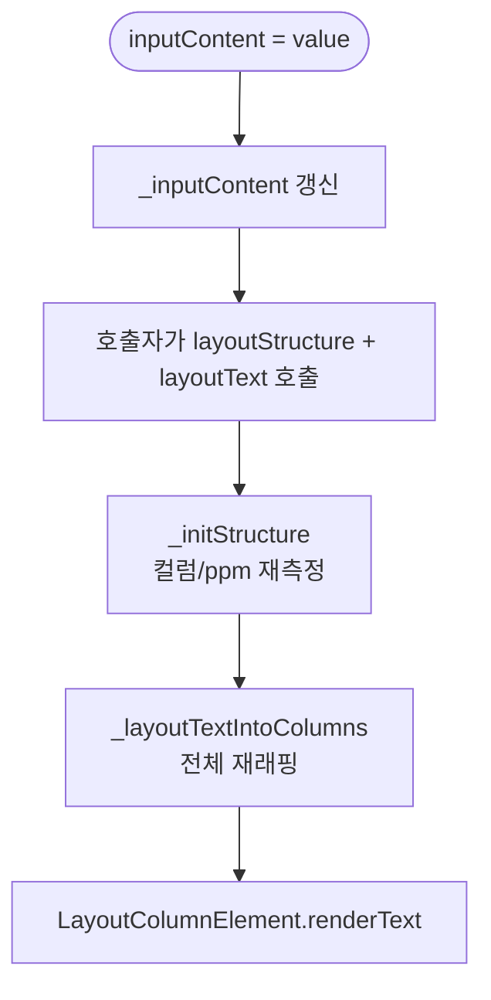

# TextLayoutEngine 상세 명세

> 작성 기준: `src/core/text-layout-engine.ts` 및 관련 타입, 컴포넌트, 유틸리티 소스 코드
>
> 본 문서는 `TextLayoutEngine`의 렌더링 파이프라인, 텍스트 측정, 오버랩 회피, 데이터 구조, DOM 계층, 스타일 생성, 공개 API를 상세히 기술한다.

---

## 1. 개요 (Overview)

`TextLayoutEngine`은 신문 레이아웃 엔진의 핵심 텍스트 래핑 모델이다.
입력된 텍스트를 다중 컬럼 구조에 맞게 줄바꿈하고, 이미지 등 다른 요소와의 겹침을 회피하며,
글자 단위로 DOM에 배치할 수 있는 `TextLineData[][]`를 생성한다.

인스턴스는 `TextLayoutEngine.create(options)` 팩토리 메서드로만 생성할 수 있다. 직접 `new` 사용은 금지되며,
생성자가 `private`이기 때문이다.

```ts
const model = TextLayoutEngine.create({
  content: "...",
  column: 2,
  gap: 3,
  paragraphStyle: { textAlign: 'justify', lineGap: 1.2 },
  textStyle: { widthRatio: 0.95 },
  inheritStyle: { ... },
  paragraphEl: paragraphElement,
  rootNode: shadowRoot,
});
```

핵심 특징:

- 모든 레이아웃 크기는 **mm**(밀리미터) 단위이다.
- `ppm`(pixels-per-mm)을 통해 화면 픽셀로 변환한다.
- 텍스트 래핑은 **Canvas `measureText().width` (advance width)** 기반으로 수행한다. DOM `scrollWidth > clientWidth` 방식은 사용하지 않는다.
- 오버랩 회피는 실제 렌더링된 요소의 `getBoundingClientRect()`를 기준으로 계산한다.
- 한 렌더링 사이클 내에서 오버랩 요소의 `DOMRect`와 Canvas 폰트 문자열을 캐싱하여 반복 측정을 줄인다.

---

## 2. 3단계 렌더링 파이프라인

`TextLayoutEngine`은 다음 3단계 파이프라인으로 동작한다.

```mermaid
flowchart TD
    A[입력 콘텐츠] -->|_parseContents| B[TextBlockData[]]
    B -->|_layoutTextIntoColumns| C[TextLineData[][]<br/>줄, 파트, 글자 배치 완료]
    C -->|columnContents| D[LayoutColumnElement.renderText]
```

### 2.1 Phase 1: 파싱 (`_parseContents`)

입력 콘텐츠를 `\n` 단위로 분리하여 `TextBlockData[]`로 변환한다.

- 단순 문자열: `{ content: "..." }`로 래핑 후 분리
- 배열: 각 원소가 `string`이면 `{ content: "..." }`로 변환, `TextBlockData`이면 그대로 사용 후 분리
- 분리된 각 블록은 독립적인 줄바꿈 단위가 된다.

결과는 `this._contents`에 저장된다.

### 2.2 Phase 2: 구조 측정 (`layoutStructure` / `_initStructure`)

`_initStructure()`에서 컬럼 폭, 간격, 줄 높이를 계산하고, 가상 컬럼을 생성해 컬럼별 `ppm`을 측정한 뒤 제거한다.

- `_columnWidths`, `_gaps`, `_lineHeight` 초기화
- 각 컬럼마다 `x-layout-vcolumn`을 임시로 생성해 `ppm` 측정
- 측정 후 가상 컬럼 제거

### 2.3 Phase 3: 텍스트 배치 (`layoutText` / `_layoutTextIntoColumns`)

`_layoutTextIntoColumns()`가 전체 래핑을 담당한다. 이 메서드 안에서 다음 작업이 한 번에 이루어진다.

1. `_parseContents()`로 최신 텍스트 반영
2. 컬럼별 가상 컬럼 생성
3. 라인 단위로 `_createLineWithParts()` 호출 (오버랩 감지 + 자유 영역 분할 + 파트 생성)
4. 글자를 `partWidths`와 `_charWidthPx()`로 비교해 배치
5. 블록 경계, 오버플로우, COVER 라인, 무한 루프 방지 처리
6. 결과를 `_columnContents`에 저장

---

## 3. `layoutText()` 흐름

`layoutText()`는 전체 텍스트 래핑을 수행하는 공개 메서드이다.

```mermaid
flowchart TD
    Start([layoutText]) --> Reset[_overlayRects = null<br/>_columnContents = []<br/>_overflow = 0]
    Reset --> Parse[_parseContents]
    Parse --> Count{columnCount >= 1?}
    Count -->|No| End1[return]
    Count -->|Yes| Loop{각 컬럼}
    Loop --> CreateVC[가상 컬럼 생성<br/>x-layout-vcolumn]
    CreateVC --> InitState[partWidths, cumulativeWidths<br/>currentPartIdx 초기화]
    InitState --> BlockLoop{각 TextBlockData}
    BlockLoop --> NeedLine{새 라인 필요?}
    NeedLine -->|Yes| CreateLine[_createLineWithParts]
    CreateLine --> Cover{cover?}
    Cover -->|Yes| PushCover[columnContent.push<br/>빈 파트 라인]
    PushCover --> Overflow1{isOverflow?}
    Overflow1 -->|Yes| ColumnBreak1[break]
    Overflow1 -->|No| NeedLine
    Cover -->|No| PushLine[columnContent.push<br/>lineEl, partEls, partWidths]
    PushLine --> CharLoop{각 문자}
    CharLoop --> Width[_charWidthPx + letterSpacing]
    Width --> TryPart[현재 파트에 적용]
    TryPart --> Fits{cumulative + charWidth <= partWidth?}
    Fits -->|Yes| PlaceChar[content.push char]
    Fits -->|No| NextPart[다음 파트 시도]
    NextPart --> Fits2{맞는 파트?}
    Fits2 -->|Yes| PlaceChar2[content.push char]
    Fits2 -->|No| NewLine[_createLineWithParts]
    NewLine --> Fits3{맞는 파트?}
    Fits3 -->|Yes| PlaceChar3[content.push char]
    Fits3 -->|No| InfiniteGuard{charWidth > maxPartWidth?}
    InfiniteGuard -->|Yes| ForcePlace[첫 번째 파트에 강제 배치]
    InfiniteGuard -->|No| RemoveEmpty[빈 마지막 줄 제거<br/>재시도]
    ForcePlace --> CharLoop
    RemoveEmpty --> NewLine
    PlaceChar --> CharLoop
    PlaceChar2 --> CharLoop
    PlaceChar3 --> CharLoop
    CharLoop -->|완료| BlockLoop
    BlockLoop -->|완료| EndOfText[endOfText 플래그 설정]
    EndOfText --> RemoveVC[가상 컬럼 제거]
    RemoveVC --> Cache[_columnContents.push]
    Cache --> Loop
    Loop -->|완료| End2([end])
    ColumnBreak1 --> EndOfText
```

각 컬럼 처리 상세:

1. `x-layout-vcolumn` 생성
2. `index`, `model`, `parentElement` 설정
3. `rootNode`에 삽입
4. `ppm = _columnPpm[curColumn]` (구조 측정 단계에서 미리 측정)
5. `_layoutTextIntoColumns()`가 라인 생성, 오버랩 감지, 글자 배치를 수행
6. `endOfText` 조건이면 마지막 라인에 `endOfText = true` 설정
7. 가상 컬럼 제거
8. `_columnContents.push(columnContent)`

---

## 4. 증분 상태와 재생성

`TextLayoutEngine`은 증분 렌더링을 지원하지 않는다. 텍스트 내용이 바뀌면 `layoutText()`를 다시 호출해 전체 래핑을 재계산한다.

### 4.1 상태 초기화 (`resetIncrementalState`)

구조 변경 후 전체 재생성을 보장하기 위해 `_previousLineCount`와 `_previousOverflow`를 `-1`로 되돌린다.

```ts
public resetIncrementalState() {
  this._previousLineCount = -1;
  this._previousOverflow = -1;
}
```

### 4.2 `inputContent` 변경 흐름



`inputContent` 세터는 값만 갱신하고, 실제 래핑은 호출자가 `layoutStructure()`와 `layoutText()`를 명시적으로 호출할 때 수행된다.

---

## 5. 오버랩 회피 메커니즘

### 5.1 개념

이미지 등 다른 요소가 텍스트 영역과 겹칠 때, `TextLayoutEngine`은 두 가지 상황을 구분한다.

- **COVER**: 라인 전체가 덮여 글자를 배치할 수 없음
- **PART**: 라인 일부가 덮임

### 5.2 `_applyOverlap()`

`overlayElements`(부모 박스의 오버랩 요소 + 더 높은 zIndex를 가진 형제 박스)를 순회하며 겹침을 계산한다.

```ts
private _applyOverlap(lineEl: HTMLElement): { cover: boolean; overlapParts: OverlapParts[] }
```

동작:

1. `_overlayRects`가 null이면 모든 오버랩 요소를 한 번만 `getBoundingClientRect()`로 측정해 `Map`에 저장
2. 각 오버랩 요소에 대해 `getOverlapSizePX(lineEl, el)` 호출
3. `COVERS`가 하나라도 있으면 `cover = true`
4. `PART`면 `overlapParts`에 병합
5. `cover`인 경우 `lineEl.style.width = '0'` 설정, `maxWidth`도 동일하게 설정

이미지 픽셀 탐색이 먼저 수행된다. `getOverlapSizePX`가 `COVERS`를 반환해야 기하학적 COVER 판정으로 이어진다. 투명 영역만 겹치면 COVER로 처리되지 않는다.

### 5.3 `_computeFreeRegions()`

오버랩 영역의 여집합으로부터 텍스트가 배치될 수 있는 자유 영역을 계산한다.

```ts
private _computeFreeRegions(lineWidth: number, overlapParts: OverlapParts[]): FreeRegion[]
```

```ts
type FreeRegion = { start: number; end: number }; // pixels
```

알고리즘:

1. 오버랩이 없으면 `[{ start: 0, end: lineWidth }]` 반환
2. 정렬된 overlapParts를 순회하며 `prevEnd`부터 `overlap.x1` 사이 구간을 자유 영역으로 추가
3. `prevEnd`를 `max(prevEnd, overlap.x2)`로 갱신
4. 마지막 오버랩 이후 남은 공간도 자유 영역으로 추가

### 5.4 `_createLineWithParts()`

라인 하나를 생성하고 오버랩을 감지해 파트를 구성한다.

```ts
private _createLineWithParts(
  vColumnEl: HTMLElement,
  textBlockStyle: TextBlockStyle | undefined,
  ppm: number,
  isFirstInColumn: boolean,
): {
  cover: boolean;
  overflow: boolean;
  lineEl: HTMLDivElement | null;
  partEls: HTMLDivElement[];
  partWidths: number[];
  lineData: TextLineData;
}
```

주요 작업:

1. `_createLineElement()`로 라인 요소 생성
2. `_applyOverlap()`으로 오버랩 감지
3. COVER면 빈 `TextLineData` 반환
4. OVERFLOW면 플래그만 반환 (lineEl은 DOM에 유지)
5. `_computeFreeRegions()`로 자유 영역 계산
6. 자유 영역별 `TextPartData`, `partEls`, `partWidths` 생성
7. 파트 사이 간격은 `marginLeft`로 설정

### 5.5 COVER vs PART 시각적 예시

```text
CASE A: COVER (라인 전체 덮임)

    ┌─────────────────────────────────────┐
    │           TEXT LINE                 │  ← 이미지가 라인 전체를 덮음
    └─────────────────────────────────────┘
              ↓
    lineEl.style.width = '0'
    parts: []
    lineEl: null

CASE B: PART (라인 일부 덮임)

    ┌─────┬───────────┬───────────────────┐
    │FREE │  OVERLAP  │       FREE        │
    │     │  (IMAGE)  │                   │
    └─────┴───────────┴───────────────────┘
      ↑        ↑            ↑
    Part0   covered      Part1
    left=0              left=overlap_end
    width=100           width=200

CASE C: FREE (오버랩 없음)

    ┌─────────────────────────────────────┐
    │           FREE SPACE                │
    └─────────────────────────────────────┘
              ↓
    parts: [{ left: 0, width: lineWidth }]
```

### 5.6 자유 영역 계산 예시

```text
lineWidth = 300px
overlapParts = [{ x1: 80, x2: 120 }, { x1: 200, x2: 240 }]

    0        80   120       200   240     300
    ├────────┤────┤─────────┤────┤───────┤
    │ FREE 1 │OL1 │  FREE 2 │OL2 │ FREE 3│
    └────────┘────┘─────────┘────┘───────┘

freeRegions = [
  { start: 0,   end: 80  },
  { start: 120, end: 200 },
  { start: 240, end: 300 }
]
```

---

## 6. 글자 폭 측정 (`_charWidthPx()`)

### 6.1 개요

`_charWidthPx()`는 Canvas 2D `measureText()`를 사용해 문자의 **advance width**를 측정한다.

```ts
private _charWidthPx(char: string, textBlockStyle?: TextBlockStyle, ppm?: number): number {
  const effectivePpm = ppm ?? (this._columnPpm[0] || GridCalculator.ppm);
  this._ctx.font = this._getCanvasFont(textBlockStyle, effectivePpm);
  const metrics = this._ctx.measureText(char);
  const rawWidth = metrics.width;  // advance width
  const scaledWidth = rawWidth * this.widthRatio;
  const fontSize = textBlockStyle?.fontSize || this._textStyle?.fontSize || this._inheritStyle?.fontSize || DEFAULT_FONT_SIZE;
  const fontSizePx = fontSize * effectivePpm;
  const isHalfWidth = char.length === 1 && char.charCodeAt(0) <= 255;
  const minWidthEm = (char === ' ' || !isHalfWidth) ? 0.15 : 0.35;
  const minWidthPx = minWidthEm * fontSizePx;
  return Math.round(Math.max(scaledWidth, minWidthPx));
}
```

### 6.2 핵심 포인트

- `metrics.width`(advance width)를 사용한다. `actualBoundingBoxLeft + actualBoundingBoxRight`는 사용하지 않는다.
- 측정값에 `widthRatio`(장평)를 곱해 CSS `scale: widthRatio 1` 렌더링과 일치시킨다.
- `minWidthPx` 바닥값을 두어 0 폭 문자가 되는 것을 방지한다.
  - 공백 또는 반각이 아닌 문자: `0.15em`
  - 반각 문자: `0.35em`
- 반각 판정은 `char.charCodeAt(0) <= 255`로 이루어진다. Latin-1 전각 문자(128-255)는 반각으로 오분류될 수 있다.

### 6.3 폰트 문자열 캐시

`_getCanvasFont()`는 단일 항목 폰트 문자열 캐시를 사용한다.

```ts
private _getCanvasFont(textBlockStyle?: TextBlockStyle, ppm?: number): string {
  const fontLoader = FontLoader.getInstance();
  const fontFamily = textBlockStyle?.fontFamily
    ? fontLoader.getFontFamily(textBlockStyle.fontFamily)
    : fontLoader.getFontFamily();
  const fontSize = textBlockStyle?.fontSize
    ? textBlockStyle.fontSize
    : this._textStyle?.fontSize || this._inheritStyle?.fontSize || DEFAULT_FONT_SIZE;
  const fontWeight = textBlockStyle?.fontWeight || this._textStyle?.fontWeight || this._inheritStyle?.fontWeight || 'normal';
  const effectivePpm = ppm ?? (this._columnPpm[0] || GridCalculator.ppm);
  const fontSizePx = fontSize * effectivePpm;

  const key = `${fontWeight}|${fontSizePx}|${fontFamily}`;
  if (key === this._lastFontKey) return this._lastFontString;

  const fontString = `${fontWeight} ${fontSizePx}px ${fontFamily}`;
  this._lastFontKey = key;
  this._lastFontString = fontString;
  return fontString;
}
```

- 키: `${fontWeight}|${fontSizePx}|${fontFamily}`
- 히트율: 약 99%. 한 번의 렌더링 사이클에서 대부분의 문자가 동일한 폰트를 사용하기 때문이다.

---

## 7. `_layoutTextIntoColumns()` 글자 배치 알고리즘

### 7.1 흐름

`_layoutTextIntoColumns()`는 다음 순서로 동작한다.

1. `_parseContents()`로 최신 `_contents` 생성
2. `_columnContents`, `_overflow`, `_overlayRects` 초기화
3. 각 컬럼마다 가상 컬럼 생성
4. 각 블록의 각 문자에 대해
   - 현재 파트에 배치 가능하면 배치
   - 안 되면 다음 파트 시도
   - 전 파트가 안 되면 새 라인 생성 후 재시도
   - 새 라인에서도 안 되면 무한 루프 방지 처리
5. 컬럼이 꽉 차면 다음 컬럼으로 이동. 마지막 컬럼이면 `_overflow` 증가
6. 마지막 컬럼 처리 후 `endOfText` 플래그 설정

### 7.2 블록 경계 처리

`\n`으로 분리된 각 블록은 새 라인에서 시작한다.

```ts
if (idxBlock !== beforeIdxBlock) idxContentOfBlock = 0;
```

블록이 바뀌면 `idxContentOfBlock`를 0으로 재설정하고, 새 라인을 생성한다.
블록의 마지막 문자가 배치되면 `endOfBlock = true`를 설정한다.

### 7.3 letterSpacing 처리

```ts
const letterSpacingEm = this._textStyle?.letterSpacing || this._inheritStyle?.letterSpacing || 0;
const letterSpacingFontSize = block.textBlockStyle?.fontSize || this._textStyle?.fontSize || this._inheritStyle?.fontSize || DEFAULT_FONT_SIZE;
const letterSpacingPx = letterSpacingEm * letterSpacingFontSize * ppm;
```

`letterSpacing`은 em 단위로 지정되며, 실제 픽셀 폭은 `letterSpacing * fontSize * ppm`으로 계산된다.
각 문자 폭에 `letterSpacingPx`를 더해 파트 가용 폭과 비교한다.

### 7.4 오버플로우 처리

- 마지막 컬럼이 아닌 경우: 비어 있지 않은 마지막 줄은 유지하고, 빈 줄은 제거한 뒤 다음 컬럼으로 이동
- 마지막 컬럼인 경우: `_overflow++`

```ts
if (vColumnEl.isOverflow) {
  if (curColumn < this._columnWidths.length - 1) {
    if (idxContentOfBlock < block.content.length - 1) {
      columnContent = this._removeEmptyLastLine(columnContent);
    }
    break;
  } else {
    this._overflow++;
  }
}
```

### 7.5 무한 루프 방지

문자가 모든 파트 폭보다 넓으면, 해당 문자를 새 라인의 첫 번째 파트에 강제로 배치하고 재시도 루프를 빠져나간다.

```ts
if (currentPartIdx >= partWidths.length) {
  const maxPartWidth = partWidths.length > 0 ? Math.max(...partWidths) : 0;
  if (charWidth > maxPartWidth + 1e-6) {
    columnContent[columnContent.length - 1].parts[0].content.push(char);
    break;
  }
  // ... 기존 재시도 로직
}
```

이 guard는 컬럼 폭보다 넓은 문자(드문 경우)가 있을 때 무한 루프를 방지한다.

### 7.6 빈 마지막 줄 제거

`_removeEmptyLastLine()`은 마지막 줄의 모든 파트가 비어 있으면 해당 줄을 제거한다.

```ts
private _removeEmptyLastLine(columnContent: TextLineData[]): TextLineData[] {
  if (columnContent.length > 0 && columnContent[columnContent.length - 1].parts.every(p => p.content.length === 0)) {
    return columnContent.slice(0, columnContent.length - 1);
  }
  return columnContent;
}
```

---

## 8. 오버랩 rect 캐시 (`_overlayRects`)

### 8.1 목적

한 번의 렌더링 사이클 내에서 동일한 오버랩 요소에 대해 `getBoundingClientRect()`를 반복 호출하지 않도록 캐싱한다.

### 8.2 생명 주기

```mermaid
flowchart LR
    A[_initStructure] -->|_overlayRects = null| B[_layoutTextIntoColumns]
    B -->|_overlayRects = null| C[_applyOverlap 첫 호출]
    C -->|Map 생성| D[이후 _applyOverlap 호출]
    D -->|Map.get(el)| E[재사용]
    E -->|다음 렌더링 사이클| A
```

### 8.3 동작

```ts
private _overlayRects: Map<LayoutBoxElement, DOMRect> | null = null;
```

```ts
if (this._overlayRects === null) {
  this._overlayRects = new Map();
  for (const el of overlapEls) {
    this._overlayRects.set(el, el.getBoundingClientRect());
  }
}
```

`_applyOverlap()`가 처음 호출될 때 모든 오버랩 요소를 한 번 측정해 `Map`에 저장한다. 이후 호출에서는 `this._overlayRects.get(el)`로 재사용한다.

---

## 9. 데이터 구조

### 9.1 `TextLayoutEngineOptions`

```ts
type TextLayoutEngineOptions = {
  content: string | (string | TextBlockData)[];
  column: number | number[];
  gap: number | number[];
  paragraphStyle: ParagraphStyle;
  textStyle: TextStyle;
  inheritStyle: InheritStyle;
  paragraphEl: LayoutParagraphElement;
  rootNode: Node;
};
```

### 9.2 `TextLineData`

```ts
export type TextLineData = {
  firstOfBlock?: boolean;
  firstOfText?: boolean;
  endOfBlock?: boolean;
  endOfText?: boolean;
  parts: TextPartData[];
  textBlockStyle?: TextBlockStyle;
};
```

플래그 조합:

| firstOfBlock | endOfBlock | firstOfText | endOfText | 의미 |
| :---: | :---: | :---: | :---: | ------ |
| ✓ | ✓ | ✓ | ✓ | 전체 텍스트가 한 줄 |
| ✓ | | ✓ | | 첫 블록의 첫 줄 |
| | ✓ | | | 어떤 블록의 마지막 줄 |
| ✓ | | | | 새 블록의 시작 줄 |
| | | | ✓ | 전체 텍스트의 마지막 줄 |

### 9.3 `TextPartData`

```ts
export type TextPartData = {
  content: string[]; // 글자 배열
  left: number;      // mm 단위 좌측 여백
  width: number;     // mm 단위 폭
};
```

### 9.4 `OverlapParts`

```ts
export type OverlapParts = { x1: number; x2: number; };
```

픽셀 단위의 겹침 구간이다.

### 9.5 `FreeRegion`

```ts
type FreeRegion = { start: number; end: number };
```

`_computeFreeRegions()`의 반환 타입. 픽셀 단위이다.

---

## 10. DOM 구조 계층

### 10.1 전체 트리

```text
<x-layout-document>
  └── <x-layout-box>
        └── <x-layout-paragraph>
              ├── #shadow-root
              │     ├── <style>
              │     ├── <slot>
              │     ├── <x-layout-vcolumn>    (임시, 측정 중에만 존재)
              │     │     ├── #shadow-root
              │     │     │     └── <style>
              │     │     └── <div>           (line)
              │     │           └── <div>     (part)
              │     │                 └── <span>  (char)
              │     └── <x-layout-column>
              │           ├── #shadow-root
              │           │     └── <style>
              │           └── <div>           (line)
              │                 └── <div>     (part)
              │                       └── <span>  (char)
              └── (slot을 통해 박스 자식 접근)
```

### 10.2 ASCII 다이어그램

```text
┌─────────────────────────────────────────┐
│      <x-layout-paragraph>               │
│  ┌─────────────────────────────────┐    │
│  │  #shadow-root                   │    │
│  │                                 │    │
│  │  ┌─────────────────────────┐    │    │
│  │  │ <x-layout-vcolumn>      │    │    │
│  │  │  (측정용, 임시)          │    │    │
│  │  │  ┌─────┐ ┌─────┐ ┌────┐ │    │    │
│  │  │  │line │ │line │ │line│ │    │    │
│  │  │  │ ┌─┐ │ │ ┌─┐ │ │ ┌┐ │ │    │    │
│  │  │  │ │p│ │ │ │p│ │ │ │p│ │ │    │    │
│  │  │  │ │┌┐│ │ │ │┌┐│ │ │ └┘ │ │    │    │
│  │  │  │ ││c││ │ │ ││c││ │ │    │ │    │    │
│  │  │  │ │└┘│ │ │ │└┘│ │ │    │ │    │    │
│  │  │  └─────┘ └─────┘ └────┘ │    │    │
│  │  └─────────────────────────┘    │    │
│  │            ↓ 측정 완료 후 제거    │    │
│  │  ┌─────────────────────────┐    │    │
│  │  │ <x-layout-column>       │    │    │
│  │  │  (실제 렌더링)           │    │    │
│  │  │  ┌─────┐ ┌─────┐ ┌────┐ │    │    │
│  │  │  │line │ │line │ │line│ │    │    │
│  │  │  │ ┌─┐ │ │ ┌─┐ │ │ ┌┐ │ │    │    │
│  │  │  │ │p│ │ │ │p│ │ │ │p│ │ │    │    │
│  │  │  │ │┌┐│ │ │ │┌┐│ │ │ └┘ │ │    │    │
│  │  │  │ ││c││ │ │ ││c││ │ │    │ │    │    │
│  │  │  │ │└┘│ │ │ │└┘│ │ │    │ │    │    │
│  │  │  └─────┘ └─────┘ └────┘ │    │    │
│  │  └─────────────────────────┘    │    │
│  └─────────────────────────────────┘    │
└─────────────────────────────────────────┘

legend:
  line = <div>  (flex row)
  p    = <div>  (part, inline-flex)
  c    = <span> (char, inline-block)
```

---

## 11. 스타일 생성

### 11.1 `genColumnStyle(idx)`

컬럼의 absolute positioning 스타일을 생성한다.

```ts
public genColumnStyle(idx: number): Partial<CSSStyleDeclaration>
```

주요 계산:

- `left`: 이전 컬럼들의 너비 + 간격 합
- `width`, `minWidth`, `maxWidth`, `flex`: `columnWidths[idx]`
- `height`, `minHeight`, `maxHeight`: `inheritStyle.parentHeight`
- `justifyContent`: `verticalAlign`에 따라 `center`, `flex-end`, `flex-start`

### 11.2 `genLineStyle(textBlockStyle?)`

줄(line) 요소의 스타일을 생성한다.

```ts
public genLineStyle(textBlockStyle?: TextBlockStyle): Partial<CSSStyleDeclaration>
```

- `display: 'flex'`, `flexDirection: 'row'`, `flexWrap: 'nowrap'`, `flexShrink: '0'`
- `height`: `_lineHeight` mm
- `fontSize` override가 줄 높이보다 크면 `alignItems: 'center'` 및 높이 조정

### 11.3 `genPartStyle(textBlockStyle?)`

파트(part) 요소의 스타일을 생성한다.

```ts
public genPartStyle(textBlockStyle?: TextBlockStyle): Partial<CSSStyleDeclaration>
```

- `display: 'inline-flex'`, `flexDirection: 'row'`, `alignItems: 'baseline'`
- `letterSpacing`: em 단위
- `textAlign` → `justify-content` 매핑
  - `'left'` → `flex-start`
  - `'right'` → `flex-end`
  - `'center'` → `center`
  - `'justify'` → `space-between`
- `textBlockStyle`이 있으면 폰트, 크기, 색상, 정렬 오버라이드

### 11.4 `genCharStyle(char)`

글자(char) 요소의 스타일을 생성한다.

```ts
public genCharStyle = (char: string): Partial<CSSStyleDeclaration>
```

- `display: 'inline-block'`
- `maxWidth`: `'1em'` (이전 `${widthRatio}em`에서 변경)
- `minWidth`: 공백 `0.15em`, 1바이트 문자 `0.35em`, 그 외 `0.15em`
- `scale`: `${widthRatio} 1` (장평)
- `textAlign`: `'center'`
- `transformOrigin`: `'0'`

`maxWidth`가 `'1em'`인 이유: CSS `scale: ${wr} 1`이 이미 장평 변환을 적용한다. 여기에 `maxWidth: ${wr}em`을 추가하면 `widthRatio ≠ 1`일 때 폭이 의도보다 좁아진다. 따라서 `maxWidth`는 변환 전 기준값인 `'1em'`을 사용한다.

---

## 12. 측정 단위

### 12.1 mm와 px의 관계

- 모든 레이아웃 크기는 **mm** 단위이다.
- DOM 요소의 `getBoundingClientRect()`는 **px** 단위이다.
- `ppm`(pixels-per-mm) = px / mm

### 12.2 ppm 측정

```ts
const ppm = vColumnEl.getBoundingClientRect().width / this._columnWidths[curColumn];
```

가상 컬럼의 실제 렌더링 너비(px)를 컬럼 너비(mm)로 나누어 구한다.

### 12.3 단위 변환 예시

| mm 값 | ppm | px 값 |
| ------- | ----- | ------- |
| 50 mm | 3.78 | 189 px |
| 30 mm | 3.78 | 113.4 px |
| 100 mm | 3.78 | 378 px |

### 12.4 데이터 단위

- `TextPartData.left`, `TextPartData.width`: **mm**
- `FreeRegion.start`, `FreeRegion.end`: **px**
- `OverlapParts.x1`, `OverlapParts.x2`: **px**
- DOM 파트 요소의 `width`, `marginLeft`: **px**

---

## 13. 공개 API 참조

### 13.1 정적 메서드

| 메서드 | 설명 |
|--------|------|
| `TextLayoutEngine.create(...)` | 팩토리 메서드. `new` 대신 사용 |

### 13.2 공개 메서드

| 메서드 | 반환 타입 | 설명 |
| -------- | ----------- | ------ |
| `layoutText()` | `void` | 전체 텍스트 래핑 수행. `_columnContents` 생성 |
| `layoutStructure()` | `void` | 컬럼 폭, 간격, ppm 등 구조 데이터 측정 및 캐싱 |
| `resetIncrementalState()` | `void` | 증분 렌더링 상태 초기화. `_previousLineCount`, `_previousOverflow`를 -1로 설정 |
| `genColumnStyle(idx)` | `Partial<CSSStyleDeclaration>` | 컬럼 absolute positioning 스타일 |
| `genLineStyle(...)` | `Partial<CSSStyleDeclaration>` | 줄(line) 스타일 |
| `genPartStyle(...)` | `Partial<CSSStyleDeclaration>` | 파트(part) 스타일 |
| `genCharStyle(char: string)` | `Partial<CSSStyleDeclaration>` | 글자(char) 스타일 |

### 13.3 세터

| 세터 | 타입 | 설명 |
| ------ | ------ | ------ |
| `data` | `TextLayoutEngineOptions` | 모델 전체 데이터 설정. 컬럼, 스타일, 콘텐츠 갱신. `_initLayout()` 호출 |
| `inheritStyle` | `InheritStyle` | 상속 스타일 설정. `_initLayout()` 호출 |
| `inputContent` | `string \| (string \| TextBlockData)[]` | 텍스트 콘텐츠 갱신. 래핑은 호출자가 직접 실행 |

### 13.4 게터

| 게터 | 반환 타입 | 설명 |
| ------ | ----------- | ------ |
| `contents` | `TextBlockData[]` | `\n`으로 분리된 텍스트 블록 배열 |
| `inheritStyle` | `InheritStyle` | 상속 스타일 |
| `textStyle` | `TextStyle` | 단락 수준 텍스트 스타일 |
| `paragraphStyle` | `ParagraphStyle` | 단락 레이아웃 스타일 |
| `columnCount` | `number` | 컬럼 수 |
| `columnContents` | `TextLineData[][]` | 컬럼별 줄 데이터. 컬럼 요소가 렌더링에 사용 |
| `gaps` | `number[]` | 컬럼 간 간격(mm) 배열 |
| `lineHeight` | `number` | 줄 높이(mm) |
| `overflow` | `number` | 오버플로우된 문자 수 |
| `widthRatio` | `number` | 장평 비율 |
| `columnWidths` | `number[]` | 컬럼별 너비(mm) 배열 |
| `inputContent` | `string \| (string \| TextBlockData)[]` | 현재 입력 콘텐츠 |
| `previousLineCount` | `number` | 이전 렌더링 사이클의 총 줄 수 |
| `previousOverflow` | `number` | 이전 렌더링 사이클의 오버플로우 문자 수 |

---

## 14. 비공개 메서드 참조

| 메서드 | 설명 |
| -------- | ------ |
| `_initLayout()` | 레이아웃 상태 초기화. `_lineHeight` 계산, `_columnContents`/`_overflow` 리셋 |
| `_initStructure()` | 컬럼 폭/간격/lineHeight 계산, 가상 컬럼 생성 후 ppm 측정 및 제거 |
| `_parseContents()` | 입력 콘텐츠를 `\n` 단위로 분리하여 `_contents` 생성 |
| `_layoutTextIntoColumns()` | 메인 래핑 메서드. 라인 생성, 오버랩 적용, 글자 배치를 한 번에 수행 |
| `_createLineWithParts(...)` | 라인 DOM 생성 + 오버랩 감지 + 파트/데이터 생성 |
| `_createLineElement(textBlockStyle?)` | 줄 DOM 요소 생성 |
| `_createPartElement(widthPx, marginLeftPx)` | 파트 DOM 요소 생성 |
| `_computeFreeRegions(lineWidth, overlapParts)` | 오버랩 영역의 여집합으로 자유 영역 계산 |
| `_applyOverlap(lineEl)` | 오버랩 요소와의 겹침 계산. COVER/PART 판정. `_overlayRects` 캐시 사용 |
| `_charWidthPx(char, textBlockStyle?, ppm?)` | Canvas `measureText()`로 문자 advance width 측정. `widthRatio` 및 minWidth 적용 |
| `_getCanvasFont(textBlockStyle?, ppm?)` | Canvas 폰트 문자열 생성. 단일 항목 캐시 사용 |
| `_removeEmptyLastLine(columnContent)` | 빈 파트만 있는 마지막 줄 제거 |

---

## 15. 상수 및 기본값

`src/constants/defaults.ts`에서 정의된 상수:

| 상수 | 값 | 설명 |
| ------ | ----- | ------ |
| `DEFAULT_FONT_SIZE` | `4` | 기본 글자 크기 (mm) |
| `DEFAULT_LINE_GAP` | `1` | 기본 행간 배율 |
| `DEFAULT_FONT_STYLE` | `'normal'` | 기본 폰트 스타일 |
| `DEFAULT_FONT_WEIGHT` | `400` | 기본 폰트 굵기 |
| `DEFAULT_PPM` | `96 / 25.4` | 기본 pixels-per-mm |
| `DEFAULT_IMAGE_DPI` | `72` | 기본 이미지 DPI |

`_lineHeight` 계산:

```ts
const fontSize = this.textStyle?.fontSize || this.inheritStyle?.fontSize || DEFAULT_FONT_SIZE;
const lineGap = this.paragraphStyle?.lineGap || this.inheritStyle?.lineGap || DEFAULT_LINE_GAP;
this._lineHeight = fontSize * lineGap;
```

---

## 16. 코드 예시

### 16.1 기본 사용

```ts
const model = TextLayoutEngine.create({
  content: "신문 본문 텍스트입니다.\n두 번째 단락입니다.",
  column: 2,
  gap: 3,
  paragraphStyle: { textAlign: 'justify', lineGap: 1.2 },
  textStyle: { widthRatio: 0.95 },
  inheritStyle: {
    parentWidth: 180,
    parentHeight: 260,
    fontSize: 4,
    fontFamily: 'Myoungjo',
  },
  paragraphEl,
  rootNode,
});

model.layoutStructure();
model.layoutText();
console.log(model.columnContents);
console.log(model.overflow);
```

### 16.2 텍스트 갱신

```ts
model.inputContent = "새로운 텍스트입니다.";
model.layoutStructure();
model.layoutText();
```

---

## 17. 오버랩 회피 상세 다이어그램

### 17.1 이미지와 라인의 수직/수평 관계

```text
컬럼 (가상 컬럼)
┌────────────────────────────────────────┐
│ line 0  ┌────────────────────────┐     │
│         │                        │     │
│ line 1  │      IMAGE BOX         │     │
│         │      (zIndex 높음)     │     │
│ line 2  │                        │     │
│         └────────────────────────┘     │
│ line 3                               │
│ line 4                               │
└────────────────────────────────────────┘

line 0: FREE → parts = [{ left:0, width:colWidth }]
line 1: COVER → parts = [], width=0
line 2: COVER → parts = [], width=0
line 3: PART  → parts = [{left:0, width:x1}, {left:x2, width:colWidth-x2}]
line 4: FREE  → parts = [{ left:0, width:colWidth }]
```

### 17.2 픽셀 단위 겹침 탐지 (`getOverlapSizePX`)

이미지 요소인 경우 캔버스 픽셀 데이터를 사용하여 불투명 픽셀이 있는 열을 탐지한다.

```text
baseElement (line)        targetElement (image box)
┌─────────────────┐       ┌─────────────────────┐
│                 │       │                     │
│    ┌────────────┼───────┼────┐                │
│    │            │       │    │                │
│    │  겹치는 영역│       │    │                │
│    │            │       │    │                │
│    └────────────┼───────┼────┘                │
│                 │       │                     │
└─────────────────┘       └─────────────────────┘
        ↑
   intersectionStart, intersectionEnd
        ↑
   relStart = intersectionStart - r1.left
   relEnd   = intersectionEnd - r1.left
```

불투명 픽셀이 있는 열을 연속 구간으로 그룹화하여 `OverlapParts[]`를 생성한다.

---

## 18. 연관 컴포넌트와의 관계

### 18.1 `LayoutParagraphElement`

- `layout()`에서 `TextLayoutEngine.create()` 또는 `model.data = ...` 호출
- `render()`에서 `model.layoutStructure()`와 `model.layoutText()` 호출
- `render()`에서 `columnContents` 길이만큼 `<x-layout-column>` 생성
- `overlayElements` 게터가 `_applyOverlap()`에 사용될 오버랩 요소 제공

### 18.2 `LayoutColumnElement`

- `connectedCallback()`에서 `renderText()` 호출
- `renderText()`에서 `model.columnContents[index]`로 줄 데이터 획득
- `genColumnStyle()`, `genLineStyle()`, `genPartStyle()`, `genCharStyle()` 사용
- 마지막 파트 + `endOfBlock`이면 `justify-content: flex-start`로 조정
- 양 끝 공백 제거

### 18.3 `LayoutVirtualColumnElement`

- `_initStructure()`와 `_layoutTextIntoColumns()`에서 임시로 생성
- `isOverflow`로 컬럼 높이 초과 여부 감지
- 측정 완료 후 제거됨

---

## 19. 주의사항 및 제약

- `TextLayoutEngine`은 `create()`로만 인스턴스화해야 한다.
- `layoutText()`는 `layoutStructure()`가 먼저 호출되어 `_columnWidths`, `_gaps`, `_columnPpm`, `_lineHeight`가 준비된 상태에서 실행해야 한다.
- 이미지 오버랩 탐지는 `LayoutImageElement.canvas`가 존재할 때만 픽셀 수준으로 수행한다.
- 텍스트 오버플로우는 마지막 컬럼에서 `_overflow`로 집계되며 `render-error` 이벤트로 통지된다.
- Canvas 폰트 측정은 실제 DOM 렌더링과 약간 다를 수 있으나, `widthRatio`와 `minWidth` 보정으로 대부분의 경우 일치한다.

---

## 20. 텍스트 정렬별 오버랩 회피 유효성

오버랩 회피와 텍스트 래핑은 `textAlign` 값(정렬 방식)과 무관하게 동일하게 동작한다.
이 섹션에서는 왜 모든 정렬(`left`, `right`, `center`, `justify`)에서 이미지 회피와 오버플로우 감지가 올바르게 작동하는지 설명한다.

### 20.1 오버랩 회피는 정렬과 무관하다

`_applyOverlap()`과 `_computeFreeRegions()`는 모두 **물리적 픽셀 좌표**를 기준으로 계산된다.

```ts
private _applyOverlap(lineEl: HTMLElement): { cover: boolean; overlapParts: OverlapParts[] }
private _computeFreeRegions(lineWidth: number, overlapParts: OverlapParts[]): FreeRegion[]
```

- `_applyOverlap()`은 `getBoundingClientRect()`로 라인과 이미지의 실제 렌더링 영역을 측정한다. `_overlayRects` 캐시를 사용한다.
- `_computeFreeRegions()`은 겹침 구간의 여집합을 기하학적으로 계산한다.
- 두 메서드 모두 `textAlign`, `justifyContent`와 같은 정렬 속성을 읽지 않는다.

따라서 동일한 이미지와 동일한 텍스트 내용이라면, `textAlign`이 `left`이든 `right`이든, `center`이든 `justify`이든 생성되는 `TextPartData`의 `left`과 `width` 값은 동일하다.

### 20.2 Canvas 기반 오버플로우 감지도 정렬과 무관하다

`_layoutTextIntoColumns()`에서 글자 하나를 추가하기 전, 다음 조건으로 초과 여부를 판단한다.

```ts
if (cumulativeWidths[currentPartIdx] + charWidth <= partWidths[currentPartIdx] + 1e-6) {
  // 현재 파트에 배치
}
```

`charWidth`는 Canvas `measureText()`로 계산한 고정값이다. `partWidths`는 `_createLineWithParts()`에서 자유 영역 픽셀 폭으로 결정된다. 둘 다 정렬에 영향을 받지 않는다.

즉, `space-between`이든 `center`이든 `flex-end`이든 같은 글자들이 들어 있으면 총 너비는 같고, 파트 폭도 같다. 따라서 래핑 결과는 모든 정렬에서 동일하다.

또한 글자 배치 순서는 항상 **왼쪽에서 오른쪽**이다. 정렬은 배치가 끝난 뒤 CSS로 시각적으로만 이동시키므로 래핑 결과에 영향을 주지 않는다.

### 20.3 정렬은 어디에서 적용되는가

정렬은 모델이 아니라 렌더링 단계에서 `genPartStyle()`과 `LayoutColumnElement.renderText()`가 생성하는 CSS에 반영된다.

#### `genPartStyle()`의 매핑

| textAlign | justifyContent |
| :-------- | :------------- |
| `left`    | `flex-start`   |
| `right`   | `flex-end`     |
| `center`  | `center`       |
| `justify` | `space-between` |

`textBlockStyle?.textAlign`이 명시되면 그 값으로 `justifyContent`가 재정의된다.

#### `LayoutColumnElement.renderText()`의 마지막 줄 처리

블록의 마지막 줄(`endOfBlock`)이면 일부 정렬에 대해 시각적 조정이 추가된다.

```ts
let partJustify = curPartStyle.justifyContent;
if (p === line.parts.length - 1 && endOfBlock && partJustify === 'space-between') {
  partJustify = 'flex-start';  // justify: 마지막 줄은 왼쪽 정렬
}
switch (textBlockStyle?.textAlign) {
  case 'center': partJustify = 'center'; break;  // center: 그대로 유지
  case 'right': partJustify = 'flex-end'; break; // right: 그대로 유지
  default: break;
}
```

| textAlign | 마지막 줄 처리 | 시각적 결과 |
| :-------- | :------------- | :---------- |
| `left`    | 재정의 없음 (`flex-start`) | 마지막 줄 왼쪽 정렬 |
| `right`   | `flex-end`로 명시 유지 | 마지막 줄 오른쪽 정렬 |
| `center`  | `center`로 명시 유지 | 마지막 줄 가운데 정렬 |
| `justify` | `space-between` → `flex-start` | 마지막 줄 왼쪽 정렬 |

이 조정은 모두 래핑이 완료된 뒤 **CSS 시각 정렬**만 바꾸는 것이다. `TextPartData.content`에 들어 있는 글자 배열과 파트의 `width` 값은 변하지 않는다.

### 20.4 정렬별 오버랩 예시

아래 예시는 동일한 이미지와 동일한 텍스트를 두고, 정렬만 바꿨을 때 렌더링이 어떻게 달라지는지 보여준다.
파트 경계(자유 영역)는 모두 동일하고, 글자 배치도 동일하다. 달라지는 것은 파트 내부에서 글자가 정렬되는 위치뿐이다.

```text
textAlign = 'left' (flex-start)

컬럼
┌────────────────────────────────────────┐
│ line 0  ┌──────────┐                   │
│         │  IMAGE   │ 텍스트 텍스트     │
│ line 1  │          │                   │
│ line 2  └──────────┘ 텍스트            │
│ line 3                               │
└────────────────────────────────────────┘

텍스트는 항상 자유 영역 안에서 왼쪽부터 배치된다.
```

```text
textAlign = 'right' (flex-end)

컬럼
┌────────────────────────────────────────┐
│ line 0  ┌──────────┐           텍스트 │
│         │  IMAGE   │ 텍스트           │
│ line 1  │          │                  │
│ line 2  └──────────┘      텍스트      │
│ line 3                               │
└────────────────────────────────────────┘

같은 자유 영역 안에서 글자가 오른쪽으로 밀린다.
```

```text
textAlign = 'center'

컬럼
┌────────────────────────────────────────┐
│ line 0  ┌──────────┐     텍스트       │
│         │  IMAGE   │   텍스트 텍스트  │
│ line 1  │          │                  │
│ line 2  └──────────┘    텍스트       │
│ line 3                               │
└────────────────────────────────────────┘

같은 자유 영역 안에서 글자가 가운데로 배치된다.
```

```text
textAlign = 'justify' (space-between)

컬럼
┌────────────────────────────────────────┐
│ line 0  ┌──────────┐ 텍스트    텍스트│
│         │  IMAGE   │                  │
│ line 1  │          │ 텍스트           │
│ line 2  └──────────┘ 텍스트    텍스트 │
│ line 3                               │
└────────────────────────────────────────┘

자유 영역의 양끝에 글자가 붙고, 중간 공백이 늘어진다.
```

모든 경우에 이미지와 겹치는 영역(COVER/PART)은 완전히 동일하게 계산되며, 텍스트는 그 영역을 피해서만 배치된다.

### 20.5 정렬 영향 요약

| 관심사 | 정렬에 영향받는가 | 이유 |
| :----- | :--------------- | :--- |
| 오버랩 영역 계산 | 아니오 | `_applyOverlap()`이 `_overlayRects`의 `DOMRect`로 물리 좌표만 사용 |
| 자유 영역 분할 | 아니오 | `_computeFreeRegions()`이 기하 여집합만 계산 |
| 글자 래핑 | 아니오 | `_charWidthPx()`와 `partWidths`는 정렬과 무관 |
| 글자 배치 순서 | 아니오 | 항상 왼쪽에서 오른쪽으로 추가 |
| 파트의 `left` / `width` | 아니오 | `_createLineWithParts()`의 geometry는 정렬과 무관 |
| 시각적 정렬 위치 | 예 | `genPartStyle()`의 `justifyContent` 매핑과 `renderText()`의 오버라이드 |
| 마지막 줄 처리 | 예 | `justify`일 때만 `flex-start`로 강제 |

결론적으로, TextLayoutEngine의 핵심 기능인 오버랩 회피와 텍스트 래핑은 어떤 `textAlign` 값이 오든 정확하게 동작한다. 정렬은 최종 렌더링 단계에서 시각적 위치만 바꾼다.
